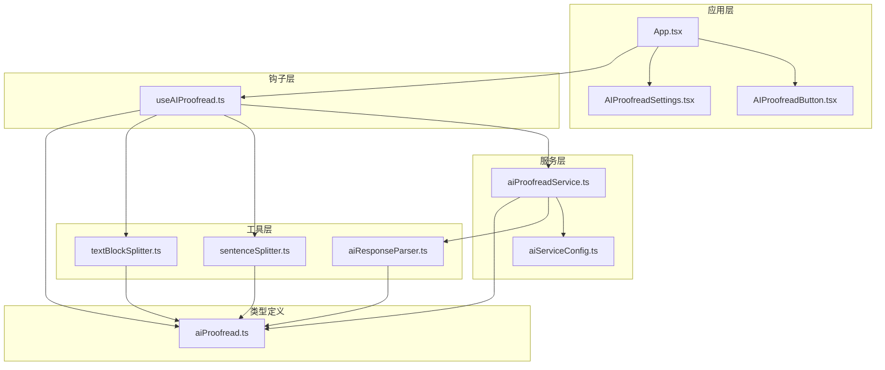
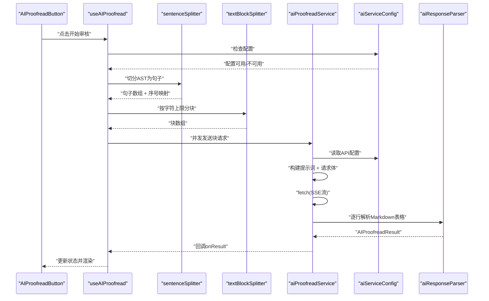
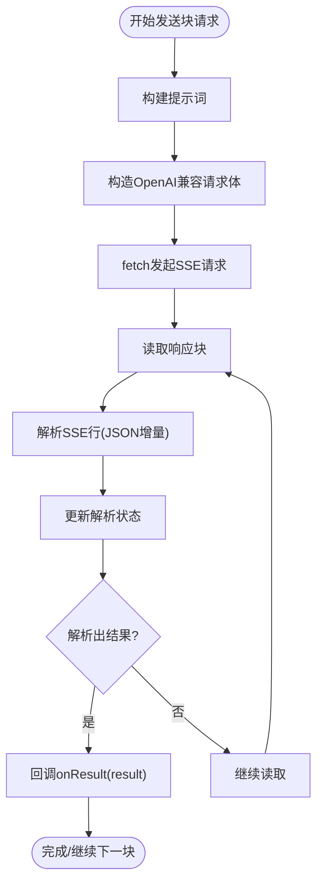
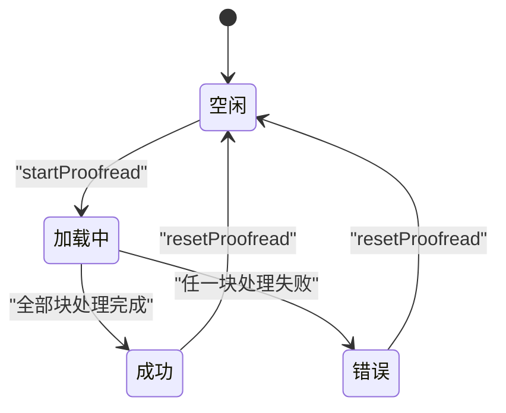
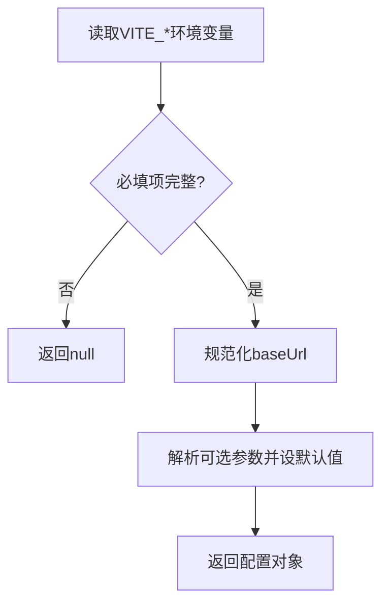
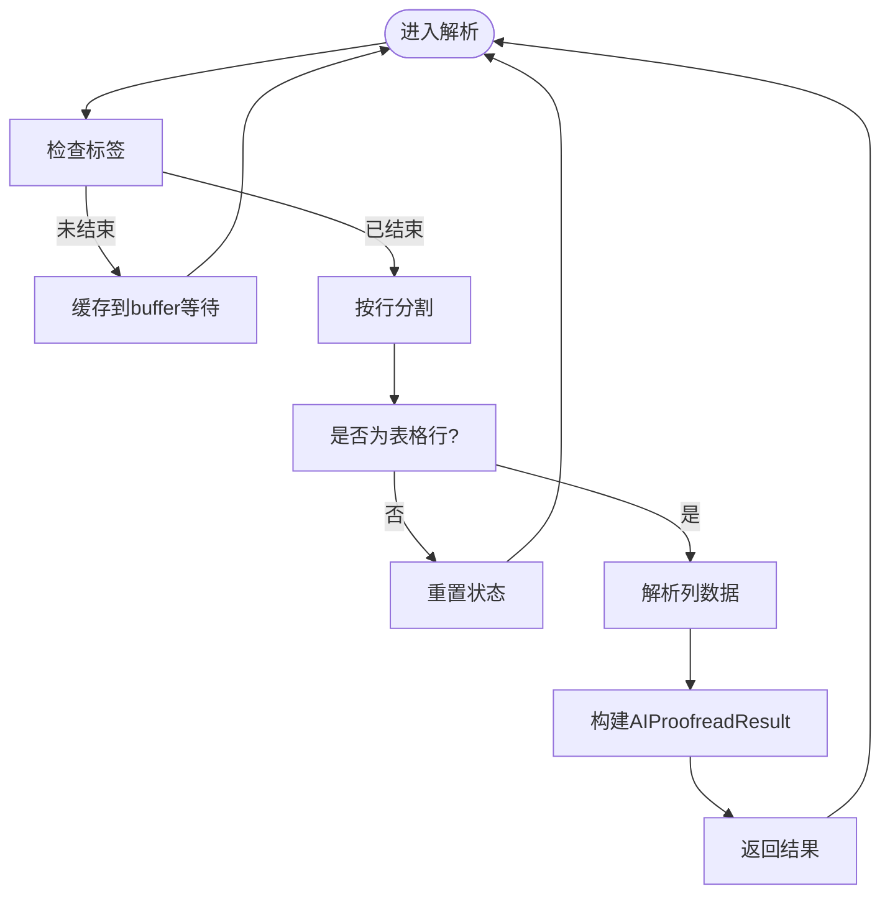
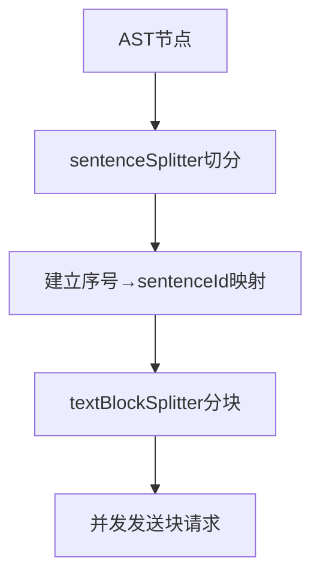
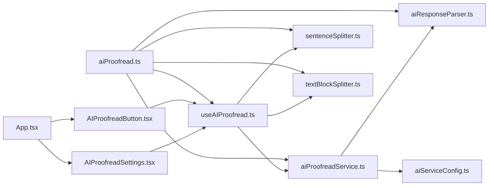

# AI审核API

<cite>
**本文档引用的文件**
- [aiProofreadService.ts](file://src/services/aiProofreadService.ts)
- [useAIProofread.ts](file://src/hooks/useAIProofread.ts)
- [aiServiceConfig.ts](file://src/services/aiServiceConfig.ts)
- [aiProofread.ts](file://src/types/aiProofread.ts)
- [aiResponseParser.ts](file://src/utils/aiResponseParser.ts)
- [sentenceSplitter.ts](file://src/utils/sentenceSplitter.ts)
- [textBlockSplitter.ts](file://src/utils/textBlockSplitter.ts)
- [AIProofreadButton.tsx](file://src/components/AIProofreadButton/AIProofreadButton.tsx)
- [AIProofreadSettings.tsx](file://src/components/AIProofreadSettings/AIProofreadSettings.tsx)
- [App.tsx](file://src/App.tsx)
- [main.tsx](file://src/main.tsx)
- [aiResponseParser.test.ts](file://src/utils/__tests__/aiResponseParser.test.ts)
- [package.json](file://package.json)
</cite>

## 目录
1. [简介](#简介)
2. [项目结构](#项目结构)
3. [核心组件](#核心组件)
4. [架构总览](#架构总览)
5. [详细组件分析](#详细组件分析)
6. [依赖关系分析](#依赖关系分析)
7. [性能考虑](#性能考虑)
8. [故障排除指南](#故障排除指南)
9. [结论](#结论)
10. [附录](#附录)

## 简介
本文件为前端AI审核服务的完整技术文档，涵盖以下主题：
- aiProofreadService的使用方法、请求参数与响应格式
- AI服务配置选项（API密钥管理、请求超时、并发控制等）
- AIProofreadState状态管理与useAIProofread钩子的使用方式
- 从文本分割到结果展示的完整审核流程
- 错误处理机制、重试策略与性能优化建议
- 具体的组件集成示例与最佳实践
- 服务限制、费用计算与配额管理说明

## 项目结构
该项目采用React + TypeScript前端架构，围绕“AI审核”功能形成清晰的分层：
- 类型定义层：统一的AI审核相关类型与配置
- 工具层：文本切分、分块、响应解析等工具函数
- 服务层：AI服务封装、配置读取与请求发送
- 钩子层：状态管理与业务流程编排
- 组件层：按钮、设置弹窗、检测面板等UI组件
- 应用入口：应用主组件与根挂载

**图表来源**
- [App.tsx:1-308](file://src/App.tsx#L1-L308)
- [useAIProofread.ts:1-221](file://src/hooks/useAIProofread.ts#L1-L221)
- [aiProofreadService.ts:1-516](file://src/services/aiProofreadService.ts#L1-L516)
- [aiServiceConfig.ts:1-154](file://src/services/aiServiceConfig.ts#L1-L154)
- [sentenceSplitter.ts:1-324](file://src/utils/sentenceSplitter.ts#L1-L324)
- [textBlockSplitter.ts:1-227](file://src/utils/textBlockSplitter.ts#L1-L227)
- [aiResponseParser.ts:1-378](file://src/utils/aiResponseParser.ts#L1-L378)
- [aiProofread.ts:1-201](file://src/types/aiProofread.ts#L1-L201)

**章节来源**
- [App.tsx:1-308](file://src/App.tsx#L1-L308)
- [main.tsx:1-14](file://src/main.tsx#L1-L14)

## 核心组件
本节概述AI审核API的关键模块及其职责。

- aiProofreadService：负责构建提示词、发送流式请求、解析SSE响应、并发控制与重试策略
- useAIProofread：封装状态管理与完整审核流程，协调切分、分块与请求发送
- aiServiceConfig：从环境变量读取并标准化AI服务配置，提供配置验证
- aiResponseParser：解析流式SSE响应中的Markdown表格，构建AIProofreadResult
- sentenceSplitter：将AST节点切分为句子，维护全局序号与映射
- textBlockSplitter：按字符数限制将句子均衡分块，避免截断
- AIProofreadButton：触发审核、展示状态与问题数量
- AIProofreadSettings：配置自定义检查项与示例行，预览最终提示词

**章节来源**
- [aiProofreadService.ts:1-516](file://src/services/aiProofreadService.ts#L1-L516)
- [useAIProofread.ts:1-221](file://src/hooks/useAIProofread.ts#L1-L221)
- [aiServiceConfig.ts:1-154](file://src/services/aiServiceConfig.ts#L1-L154)
- [aiResponseParser.ts:1-378](file://src/utils/aiResponseParser.ts#L1-L378)
- [sentenceSplitter.ts:1-324](file://src/utils/sentenceSplitter.ts#L1-L324)
- [textBlockSplitter.ts:1-227](file://src/utils/textBlockSplitter.ts#L1-L227)
- [AIProofreadButton.tsx:1-81](file://src/components/AIProofreadButton/AIProofreadButton.tsx#L1-L81)
- [AIProofreadSettings.tsx:1-275](file://src/components/AIProofreadSettings/AIProofreadSettings.tsx#L1-L275)

## 架构总览
AI审核的整体流程如下：
1. 应用层通过useAIProofread钩子启动审核
2. 钩子调用sentenceSplitter将AST切分为句子，建立序号映射
3. textBlockSplitter按字符上限分块，确保每块内句子不被截断
4. aiProofreadService并发发送块级请求，接收SSE流式响应
5. aiResponseParser解析Markdown表格，构建AIProofreadResult
6. 结果回传至useAIProofread，更新AIProofreadState
7. UI组件根据状态渲染按钮与检测面板

**图表来源**
- [useAIProofread.ts:67-205](file://src/hooks/useAIProofread.ts#L67-L205)
- [sentenceSplitter.ts:217-315](file://src/utils/sentenceSplitter.ts#L217-L315)
- [textBlockSplitter.ts:17-96](file://src/utils/textBlockSplitter.ts#L17-L96)
- [aiProofreadService.ts:147-319](file://src/services/aiProofreadService.ts#L147-L319)
- [aiServiceConfig.ts:47-143](file://src/services/aiServiceConfig.ts#L47-L143)
- [aiResponseParser.ts:127-294](file://src/utils/aiResponseParser.ts#L127-L294)

## 详细组件分析

### aiProofreadService：AI审核服务
- 功能要点
  - 构建提示词模板与完整提示词，支持内置检查项与示例
  - 发送单块流式请求，解析SSE响应，逐行产出AIProofreadResult
  - 并发控制与重试策略：默认最大并发3，每块最多重试3次
  - 错误处理：针对HTTP状态码与网络异常进行分类处理
- 关键API
  - buildPromptTemplate(customCheckItems, customExampleItems)：构建提示词模板
  - buildPrompt(block, customCheckItems, customExampleItems)：拼接句子块生成完整提示词
  - sendBlockStreaming(block, customCheckItems, customExampleItems, sentenceMap, onResult, onRawResponse?, blockIndex?)：发送单块流式请求
  - sendAllBlocksStreaming(blocks, customCheckItems, customExampleItems, sentenceMap, maxConcurrent, onResult, onProgress)：并发发送多块请求，带重试与进度回调
- 请求参数
  - 基于OpenAI兼容的聊天请求格式，包含model、messages、temperature、max_tokens、stream、top_p、top_k、min_p、presence_penalty、repetition_penalty等
- 响应格式
  - SSE流式响应，逐行以"data: "开头，JSON增量内容，以"[DONE]"结束
  - 解析器将Markdown表格转换为AIProofreadResult数组

**图表来源**
- [aiProofreadService.ts:147-319](file://src/services/aiProofreadService.ts#L147-L319)
- [aiResponseParser.ts:127-294](file://src/utils/aiResponseParser.ts#L127-L294)

**章节来源**
- [aiProofreadService.ts:46-135](file://src/services/aiProofreadService.ts#L46-L135)
- [aiProofreadService.ts:147-319](file://src/services/aiProofreadService.ts#L147-L319)
- [aiProofreadService.ts:332-515](file://src/services/aiProofreadService.ts#L332-L515)

### useAIProofread：状态管理与流程编排
- 功能要点
  - 管理AIProofreadState：状态、已处理/总数、结果Map、错误信息
  - 完整审核流程：配置检查 → 句子切分 → 文本分块 → 并发请求 → 结果聚合 → 状态更新
  - 提供startProofread(ast, config)与resetProofread()方法
- 关键配置
  - FullProofreadConfig：包含maxCharsPerRequest与maxConcurrentRequests等内部参数
- 状态流转
  - idle → loading → success/error
  - 进度通过processedSentences/totalSentences反映

**图表来源**
- [useAIProofread.ts:44-50](file://src/hooks/useAIProofread.ts#L44-L50)
- [useAIProofread.ts:67-205](file://src/hooks/useAIProofread.ts#L67-L205)

**章节来源**
- [useAIProofread.ts:22-40](file://src/hooks/useAIProofread.ts#L22-L40)
- [useAIProofread.ts:44-50](file://src/hooks/useAIProofread.ts#L44-L50)
- [useAIProofread.ts:67-205](file://src/hooks/useAIProofread.ts#L67-L205)

### aiServiceConfig：AI服务配置
- 功能要点
  - 从VITE_*环境变量读取配置，自动补全API路径
  - 验证必填项（baseUrl、model、apiKey），解析可选参数并提供默认值
  - 提供isAIServiceConfigured()用于运行时检查
- 配置项
  - baseUrl：API基础URL，自动补全/v1/chat/completions
  - model：模型名称
  - apiKey：API密钥
  - temperature、maxTokens、topP、topK、minP、presencePenalty、repetitionPenalty：推理参数

**图表来源**
- [aiServiceConfig.ts:47-143](file://src/services/aiServiceConfig.ts#L47-L143)

**章节来源**
- [aiServiceConfig.ts:47-143](file://src/services/aiServiceConfig.ts#L47-L143)
- [aiServiceConfig.ts:150-153](file://src/services/aiServiceConfig.ts#L150-L153)

### aiResponseParser：流式响应解析
- 功能要点
  - 解析SSE流中的增量内容，识别Markdown表格行
  - 支持<think>...</think>思考内容过滤，兼容不同模型输出
  - flushParser处理缓冲区，确保收尾数据也被解析
- 输出
  - AIProofreadResult：包含sentenceId、seqNum、originalText、suggestion、hasIssue

**图表来源**
- [aiResponseParser.ts:127-294](file://src/utils/aiResponseParser.ts#L127-L294)
- [aiResponseParser.ts:303-377](file://src/utils/aiResponseParser.ts#L303-L377)

**章节来源**
- [aiResponseParser.ts:13-38](file://src/utils/aiResponseParser.ts#L13-L38)
- [aiResponseParser.ts:127-294](file://src/utils/aiResponseParser.ts#L127-L294)
- [aiResponseParser.ts:303-377](file://src/utils/aiResponseParser.ts#L303-L377)

### sentenceSplitter与textBlockSplitter：文本切分与分块
- sentenceSplitter
  - 基于多种标点符号切分句子，排除引号、书名号、括号内的分隔符
  - 维护全局序号与sentenceId映射，标题节点特殊处理
- textBlockSplitter
  - 均衡分配算法，尽量使每块字符数接近阈值
  - 以句子为单位分块，避免截断

**图表来源**
- [sentenceSplitter.ts:217-315](file://src/utils/sentenceSplitter.ts#L217-L315)
- [textBlockSplitter.ts:17-96](file://src/utils/textBlockSplitter.ts#L17-L96)

**章节来源**
- [sentenceSplitter.ts:143-208](file://src/utils/sentenceSplitter.ts#L143-L208)
- [sentenceSplitter.ts:217-315](file://src/utils/sentenceSplitter.ts#L217-L315)
- [textBlockSplitter.ts:17-96](file://src/utils/textBlockSplitter.ts#L17-L96)

### 组件集成示例
- 在App.tsx中：
  - 通过useAIProofread获取state与startProofread
  - 通过AIProofreadButton展示状态与触发审核
  - 通过AIProofreadSettings配置自定义检查项与示例行
- 在组件中集成步骤
  1) 引入useAIProofread并解构state与startProofread
  2) 调用startProofread(ast, { customCheckItems, customExampleItems, maxCharsPerRequest, maxConcurrentRequests })
  3) 根据state.status与results渲染UI与检测面板

**章节来源**
- [App.tsx:64-220](file://src/App.tsx#L64-L220)
- [AIProofreadButton.tsx:13-81](file://src/components/AIProofreadButton/AIProofreadButton.tsx#L13-L81)
- [AIProofreadSettings.tsx:22-126](file://src/components/AIProofreadSettings/AIProofreadSettings.tsx#L22-L126)

## 依赖关系分析

**图表来源**
- [aiProofread.ts:1-201](file://src/types/aiProofread.ts#L1-L201)
- [aiProofreadService.ts:1-516](file://src/services/aiProofreadService.ts#L1-L516)
- [useAIProofread.ts:1-221](file://src/hooks/useAIProofread.ts#L1-L221)
- [aiServiceConfig.ts:1-154](file://src/services/aiServiceConfig.ts#L1-L154)
- [aiResponseParser.ts:1-378](file://src/utils/aiResponseParser.ts#L1-L378)
- [sentenceSplitter.ts:1-324](file://src/utils/sentenceSplitter.ts#L1-L324)
- [textBlockSplitter.ts:1-227](file://src/utils/textBlockSplitter.ts#L1-L227)
- [AIProofreadButton.tsx:1-81](file://src/components/AIProofreadButton/AIProofreadButton.tsx#L1-L81)
- [AIProofreadSettings.tsx:1-275](file://src/components/AIProofreadSettings/AIProofreadSettings.tsx#L1-L275)
- [App.tsx:1-308](file://src/App.tsx#L1-L308)

**章节来源**
- [package.json:13-38](file://package.json#L13-L38)

## 性能考虑
- 并发控制
  - 默认最大并发3，避免请求风暴导致服务端限流或超时
  - 可通过FullProofreadConfig.maxConcurrentRequests调整
- 分块策略
  - 均衡分配算法减少块间字符数差异，提升吞吐
  - 建议根据模型上下文长度与网络状况调整maxCharsPerRequest
- 流式解析
  - 增量解析降低内存占用，实时反馈结果
- 重试策略
  - 每块最多重试3次，指数退避延迟，缓解瞬时故障
- 建议
  - 在高并发场景下适当降低maxConcurrentRequests
  - 对长文档分批处理，避免单次请求过大
  - 合理设置temperature与topP，平衡准确性与稳定性

[本节为通用性能指导，不直接分析具体文件]

## 故障排除指南
- 配置问题
  - 现象：状态为error，提示“AI服务未配置”
  - 排查：确认VITE_AI_BASE_URL、VITE_AI_MODEL、VITE_AI_API_KEY已正确设置
  - 参考：[aiServiceConfig.ts:62-70](file://src/services/aiServiceConfig.ts#L62-L70)
- 请求失败
  - 现象：HTTP 401（认证失败）、429（请求频繁）、500（服务内部错误）
  - 排查：检查API密钥有效性、服务端限流策略、网络连通性
  - 参考：[aiProofreadService.ts:199-207](file://src/services/aiProofreadService.ts#L199-L207)
- 解析异常
  - 现象：表格解析失败或遗漏结果
  - 排查：检查AI输出是否符合Markdown表格格式；确认<think>标签是否正确闭合
  - 参考：[aiResponseParser.test.ts:48-246](file://src/utils/__tests__/aiResponseParser.test.ts#L48-L246)
- 重试与进度
  - 现象：部分块失败或进度卡住
  - 排查：查看控制台调试信息（发送的句子序号、解析数量、缺失序号）
  - 参考：[aiProofreadService.ts:418-434](file://src/services/aiProofreadService.ts#L418-L434)

**章节来源**
- [aiServiceConfig.ts:62-70](file://src/services/aiServiceConfig.ts#L62-L70)
- [aiProofreadService.ts:199-207](file://src/services/aiProofreadService.ts#L199-L207)
- [aiResponseParser.test.ts:48-246](file://src/utils/__tests__/aiResponseParser.test.ts#L48-L246)
- [aiProofreadService.ts:418-434](file://src/services/aiProofreadService.ts#L418-L434)

## 结论
本AI审核API通过清晰的分层设计与完善的错误处理机制，实现了从文本切分、分块、并发请求到流式解析与状态管理的完整闭环。开发者可通过useAIProofread钩子快速集成，配合AIProofreadSettings灵活定制提示词，满足多样化的公文审核需求。建议结合实际服务能力与文档规模，合理配置并发与分块参数，以获得最佳性能与稳定性。

[本节为总结性内容，不直接分析具体文件]

## 附录

### API定义与类型说明
- AIProofreadState：状态、进度、结果与错误信息
- AIProofreadResult：单句审核结果（sentenceId、seqNum、originalText、suggestion、hasIssue）
- AIServiceConfig：AI服务配置（baseUrl、model、apiKey及推理参数）
- OpenAIChatRequest/OpenAIStreamResponse：请求/响应格式

**章节来源**
- [aiProofread.ts:98-136](file://src/types/aiProofread.ts#L98-L136)
- [aiProofread.ts:142-192](file://src/types/aiProofread.ts#L142-L192)

### 集成步骤清单
- 在组件中引入useAIProofread，获取state与startProofread
- 准备GongwenAST与FullProofreadConfig（包含自定义检查项、示例行、分块与并发参数）
- 调用startProofread(ast, config)，监听state变化并渲染UI
- 使用AIProofreadSettings配置提示词模板

**章节来源**
- [App.tsx:64-220](file://src/App.tsx#L64-L220)
- [AIProofreadSettings.tsx:109-114](file://src/components/AIProofreadSettings/AIProofreadSettings.tsx#L109-L114)

### 服务限制、费用与配额
- 限制条件
  - 请求频率受服务端限流影响，建议合理设置maxConcurrentRequests
  - 单次请求字符数受模型上下文长度限制，建议通过textBlockSplitter控制
- 费用计算
  - 通常按tokens计费，可参考服务端提供的计费规则
- 使用配额管理
  - 建议在应用侧记录每日/每月调用量与费用，结合服务端配额进行告警与降级

[本节为通用指导，不直接分析具体文件]