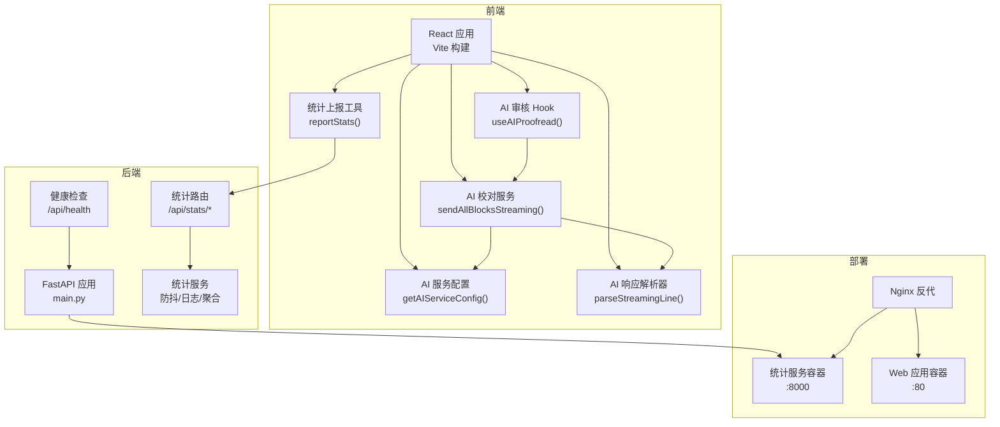
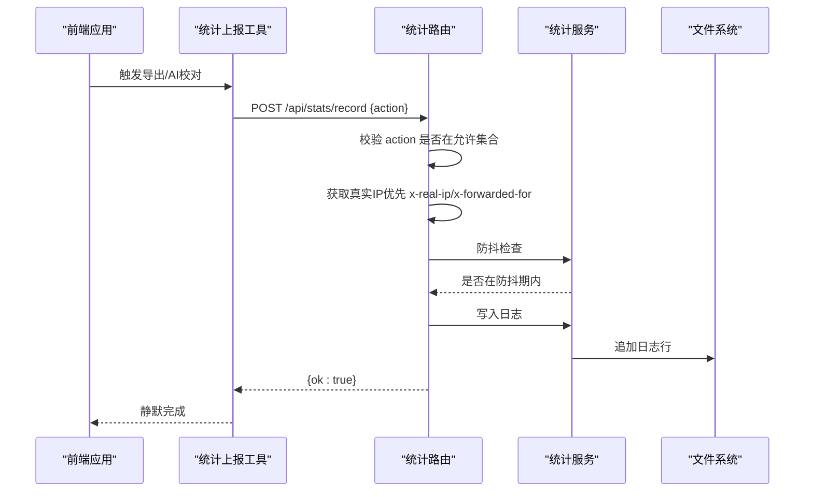
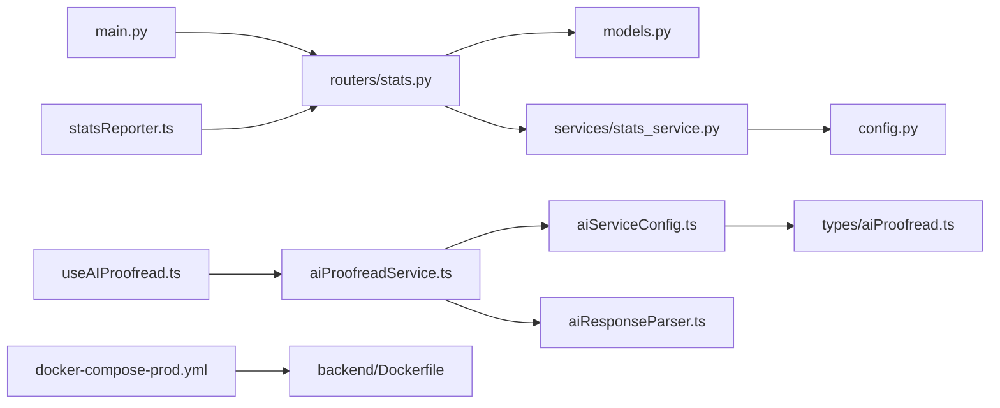

# API参考

<cite>
**本文引用的文件**
- [backend/main.py](file://backend/main.py)
- [backend/routers/stats.py](file://backend/routers/stats.py)
- [backend/services/stats_service.py](file://backend/services/stats_service.py)
- [backend/models.py](file://backend/models.py)
- [backend/config.py](file://backend/config.py)
- [backend/Dockerfile](file://backend/Dockerfile)
- [gongwen-docker/docker-compose-prod.yml](file://gongwen-docker/docker-compose-prod.yml)
- [src/utils/statsReporter.ts](file://src/utils/statsReporter.ts)
- [src/services/aiProofreadService.ts](file://src/services/aiProofreadService.ts)
- [src/services/aiServiceConfig.ts](file://src/services/aiServiceConfig.ts)
- [src/utils/aiResponseParser.ts](file://src/utils/aiResponseParser.ts)
- [src/hooks/useAIProofread.ts](file://src/hooks/useAIProofread.ts)
- [src/types/aiProofread.ts](file://src/types/aiProofread.ts)
- [package.json](file://package.json)
</cite>

## 目录
1. [简介](#简介)
2. [项目结构](#项目结构)
3. [核心组件](#核心组件)
4. [架构总览](#架构总览)
5. [详细组件分析](#详细组件分析)
6. [依赖分析](#依赖分析)
7. [性能考虑](#性能考虑)
8. [故障排查指南](#故障排查指南)
9. [结论](#结论)
10. [附录](#附录)

## 简介
本文件为“公文排版工具”的完整API参考文档，覆盖后端FastAPI统计服务REST API、前端服务接口调用方式、AI审核服务集成方式与认证机制、统计上报API使用方法与隐私保护措施，并提供请求/响应示例、SDK使用指南与客户端集成示例、API版本管理与兼容性说明、迁移指南、错误处理与重试机制以及性能优化建议。

## 项目结构
该仓库采用前后端分离架构：
- 后端：基于FastAPI的统计服务，提供统计上报与查询接口，支持健康检查与后台清理任务。
- 前端：React/Vite应用，负责编辑器、预览、AI校对、历史记录等交互；通过统计上报工具与AI服务模块与后端对接。
- 部署：Docker镜像与Compose编排，前端与统计服务分别容器化运行。

图表来源
- [backend/main.py:24-38](file://backend/main.py#L24-L38)
- [backend/routers/stats.py:9-40](file://backend/routers/stats.py#L9-L40)
- [src/utils/statsReporter.ts:16-28](file://src/utils/statsReporter.ts#L16-L28)
- [src/hooks/useAIProofread.ts:67-205](file://src/hooks/useAIProofread.ts#L67-L205)
- [src/services/aiServiceConfig.ts:47-143](file://src/services/aiServiceConfig.ts#L47-L143)
- [src/services/aiProofreadService.ts:147-319](file://src/services/aiProofreadService.ts#L147-L319)
- [src/utils/aiResponseParser.ts:127-294](file://src/utils/aiResponseParser.ts#L127-L294)
- [gongwen-docker/docker-compose-prod.yml:4-36](file://gongwen-docker/docker-compose-prod.yml#L4-L36)

章节来源
- [backend/main.py:1-38](file://backend/main.py#L1-L38)
- [gongwen-docker/docker-compose-prod.yml:1-36](file://gongwen-docker/docker-compose-prod.yml#L1-L36)

## 核心组件
- 后端统计服务：提供统计上报与查询接口，具备防抖缓存、日志落盘与周期清理、统计聚合能力。
- 前端统计上报工具：在用户执行导出或AI校对等动作时，静默上报，不影响主流程。
- AI审核服务：封装提示词构建、OpenAI兼容流式请求、SSE解析与结果聚合，支持并发控制与重试。
- 部署与反向代理：Nginx反代前端与后端，前端通过相对路径访问后端统计接口。

章节来源
- [backend/routers/stats.py:12-40](file://backend/routers/stats.py#L12-L40)
- [backend/services/stats_service.py:15-124](file://backend/services/stats_service.py#L15-L124)
- [src/utils/statsReporter.ts:16-28](file://src/utils/statsReporter.ts#L16-L28)
- [src/services/aiProofreadService.ts:147-515](file://src/services/aiProofreadService.ts#L147-L515)
- [src/utils/aiResponseParser.ts:127-378](file://src/utils/aiResponseParser.ts#L127-L378)

## 架构总览
后端统计服务通过FastAPI提供REST接口，前端通过fetch上报统计事件，AI服务通过OpenAI兼容接口进行流式推理，响应经解析器逐步产出结果。

图表来源
- [backend/routers/stats.py:12-32](file://backend/routers/stats.py#L12-L32)
- [backend/services/stats_service.py:15-55](file://backend/services/stats_service.py#L15-L55)
- [src/utils/statsReporter.ts:16-28](file://src/utils/statsReporter.ts#L16-L28)

## 详细组件分析

### 后端统计服务REST API

- 应用元信息
  - 标题：公文排版工具 - 统计服务
  - 版本：1.0.0
  - 生命周期：启动时创建后台清理任务，停止时取消任务

- 健康检查
  - 方法：GET
  - 路径：/api/health
  - 成功响应：{"status": "healthy"}

- 统计上报
  - 方法：POST
  - 路径：/api/stats/record
  - 请求体模型：RecordRequest
    - 字段：action (字符串)
  - 响应体模型：RecordResponse
    - 字段：ok (布尔，默认true)
  - 行为说明：
    - 校验 action 是否属于允许集合 {"export_docx", "ai_proofread"}
    - 从请求头获取真实IP：优先 x-real-ip，其次 x-forwarded-for，最后 fallback 到 request.client.host
    - 防抖检查：同一IP在指定秒数内重复相同action将被忽略
    - 防抖缓存：内存字典，键为(IP, action)，值为最近记录时间戳
    - 后台清理：定时清理过期防抖缓存（默认600秒清理一次）

- 统计查询
  - 方法：GET
  - 路径：/api/stats/summary
  - 查询参数：
    - days (整数，默认7，最小0)
  - 响应体模型：SummaryResponse
    - 字段：
      - period_days (整数)
      - unique_users (整数)
      - total_calls (整数)
      - export_docx_calls (整数)
      - ai_proofread_calls (整数)
  - 行为说明：
    - 读取日志文件并按天数范围聚合
    - 未找到日志文件时返回全零结果
    - 仅统计合法action，忽略非法行

- 配置与常量
  - 日志文件路径：STATS_LOG_PATH（默认 /data/stats.log）
  - 防抖秒数：DEBOUNCE_SECONDS（默认10）
  - 防抖缓存清理间隔：DEBOUNCE_CLEANUP_INTERVAL（默认600）
  - 有效action集合：{"export_docx", "ai_proofread"}

- 错误码
  - 400：action非法
  - 5xx：服务内部错误（由框架抛出）

章节来源
- [backend/main.py:24-38](file://backend/main.py#L24-L38)
- [backend/routers/stats.py:12-40](file://backend/routers/stats.py#L12-L40)
- [backend/models.py:6-23](file://backend/models.py#L6-L23)
- [backend/config.py:5-16](file://backend/config.py#L5-L16)
- [backend/services/stats_service.py:15-124](file://backend/services/stats_service.py#L15-L124)

### 前端统计上报API

- 上报触发时机
  - 导出为Word：STATS_ACTION_EXPORT
  - AI校对：STATS_ACTION_AI_PROOFREAD

- 接口调用方式
  - 方法：POST
  - 路径：/api/stats/record
  - 请求体：{"action": "<标识>"}
  - 行为：fire-and-forget，失败静默忽略

- SDK使用指南
  - 引入：import { reportStats } from '@/utils/statsReporter'
  - 调用：reportStats(STATS_ACTION_EXPORT) 或 reportStats(STATS_ACTION_AI_PROOFREAD)

- 隐私保护
  - 仅上报action标识与匿名IP（由反向代理注入），不包含具体内容
  - 日志文件位于容器内挂载目录，生产环境建议仅保留必要权限

章节来源
- [src/utils/statsReporter.ts:6-28](file://src/utils/statsReporter.ts#L6-L28)
- [src/utils/statsReporter.ts:16-28](file://src/utils/statsReporter.ts#L16-L28)

### AI审核服务API集成

- 集成方式
  - 前端通过Hook useAIProofread()管理校对流程
  - 服务层 sendAllBlocksStreaming() 发送流式请求，支持并发控制与重试
  - 解析器 aiResponseParser.ts 将SSE流解析为表格行，逐步产出AIProofreadResult

- 认证机制
  - 请求头：Authorization: Bearer <API密钥>
  - 配置来源：VITE_AI_API_KEY（环境变量）
  - 基础URL自动补全：normalizeBaseUrl() 自动补齐 /v1/chat/completions

- 请求限制与重试
  - 并发控制：默认最大并发3
  - 重试策略：单块最多重试3次，递增延迟
  - 错误分类：401（密钥无效）、429（频率过高）、500（服务内部错误）

- 请求/响应示例（示意）
  - 请求体（OpenAI兼容）：包含model、messages、temperature、max_tokens、stream等字段
  - 响应格式：SSE流，每行"data: {json}"，以"[DONE]"结束
  - 解析产物：AIProofreadResult（包含sentenceId、seqNum、originalText、suggestion、hasIssue）

- 类型定义
  - Sentence/SentenceBlock/AIProofreadResult/AIServiceConfig/OpenAIChatRequest等

章节来源
- [src/hooks/useAIProofread.ts:67-205](file://src/hooks/useAIProofread.ts#L67-L205)
- [src/services/aiProofreadService.ts:147-515](file://src/services/aiProofreadService.ts#L147-L515)
- [src/services/aiServiceConfig.ts:47-143](file://src/services/aiServiceConfig.ts#L47-L143)
- [src/utils/aiResponseParser.ts:127-378](file://src/utils/aiResponseParser.ts#L127-L378)
- [src/types/aiProofread.ts:10-201](file://src/types/aiProofread.ts#L10-L201)

### 统计上报API使用方法与隐私保护

- 使用方法
  - 在导出或AI校对完成后调用 reportStats(action)
  - 前端通过相对路径访问后端接口，由Nginx反代转发

- 数据格式
  - 请求：{"action": "export_docx"|"ai_proofread"}
  - 响应：{"ok": true}

- 隐私保护
  - 仅记录action与匿名IP，不记录文档内容
  - 日志文件持久化至容器挂载目录，生产环境建议限制访问权限

章节来源
- [src/utils/statsReporter.ts:16-28](file://src/utils/statsReporter.ts#L16-L28)
- [backend/routers/stats.py:19-32](file://backend/routers/stats.py#L19-L32)
- [backend/services/stats_service.py:44-55](file://backend/services/stats_service.py#L44-L55)

## 依赖分析

图表来源
- [backend/main.py:8-31](file://backend/main.py#L8-L31)
- [backend/routers/stats.py:5-7](file://backend/routers/stats.py#L5-L7)
- [backend/services/stats_service.py:8](file://backend/services/stats_service.py#L8)
- [backend/config.py:3-16](file://backend/config.py#L3-L16)
- [src/utils/statsReporter.ts:18-21](file://src/utils/statsReporter.ts#L18-L21)
- [src/hooks/useAIProofread.ts:14-17](file://src/hooks/useAIProofread.ts#L14-L17)
- [src/services/aiProofreadService.ts:14-15](file://src/services/aiProofreadService.ts#L14-L15)
- [src/services/aiServiceConfig.ts:14](file://src/services/aiServiceConfig.ts#L14)
- [src/utils/aiResponseParser.ts:7](file://src/utils/aiResponseParser.ts#L7)
- [gongwen-docker/docker-compose-prod.yml:23-35](file://gongwen-docker/docker-compose-prod.yml#L23-L35)
- [backend/Dockerfile:1-18](file://backend/Dockerfile#L1-L18)

## 性能考虑
- 防抖与限流
  - 防抖间隔默认10秒，避免重复上报造成压力
  - 后台定时清理缓存，防止内存膨胀
- 并发与重试
  - AI请求默认并发3，避免过度占用上游资源
  - 单块最多重试3次，递增延迟降低雪崩风险
- IO与磁盘
  - 日志追加写入，建议挂载高性能卷并定期轮转
- 健康检查
  - 前端与后端均提供健康检查端点，便于编排与监控

[本节为通用性能建议，不直接分析特定文件]

## 故障排查指南
- 后端统计服务
  - 400错误：确认action在允许集合内
  - 5xx错误：查看容器日志与健康检查状态
  - 防抖无效：检查反向代理是否正确注入x-real-ip或x-forwarded-for
- 前端统计上报
  - 上报失败：静默忽略，不影响主流程；可在开发环境下观察网络面板
- AI审核服务
  - 401：检查VITE_AI_API_KEY是否配置
  - 429：降低并发或增加重试间隔
  - 500：上游服务异常，稍后重试
  - 解析异常：检查SSE格式与表格结构

章节来源
- [backend/routers/stats.py:16-17](file://backend/routers/stats.py#L16-L17)
- [src/services/aiProofreadService.ts:197-208](file://src/services/aiProofreadService.ts#L197-L208)
- [src/services/aiServiceConfig.ts:62-70](file://src/services/aiServiceConfig.ts#L62-L70)

## 结论
本API参考文档覆盖了统计上报与查询、AI审核服务集成、隐私保护与性能优化等关键方面。建议在生产环境中：
- 正确配置反向代理头部以确保匿名IP准确性
- 为统计日志设置合适的权限与轮转策略
- 合理调整并发与重试参数以平衡吞吐与稳定性
- 通过健康检查与日志监控保障服务可用性

[本节为总结性内容，不直接分析特定文件]

## 附录

### API版本管理与兼容性
- 后端版本：1.0.0
- 前端包版本：0.0.0（随构建脚本生成）
- 兼容性建议：后端新增字段时建议保持向后兼容，前端通过类型定义与默认值保证兼容

章节来源
- [backend/main.py:26](file://backend/main.py#L26)
- [package.json:4](file://package.json#L4)

### 迁移指南
- 从旧版本升级
  - 检查环境变量VITE_AI_*配置项是否齐全
  - 确认反向代理正确注入x-real-ip或x-forwarded-for
  - 如需扩展action集合，更新后端VALID_ACTIONS并重启服务
- 部署迁移
  - 使用docker-compose-prod.yml编排，确保/data卷挂载与权限
  - 前端容器与后端容器通过Nginx反代互通

章节来源
- [backend/config.py:14-15](file://backend/config.py#L14-L15)
- [gongwen-docker/docker-compose-prod.yml:26-28](file://gongwen-docker/docker-compose-prod.yml#L26-L28)

### 请求/响应示例（示意）
- 统计上报
  - 请求：POST /api/stats/record
  - 请求体：{"action": "export_docx"}
  - 响应：{"ok": true}
- 统计查询
  - 请求：GET /api/stats/summary?days=7
  - 响应：{"period_days": 7,"unique_users": 120,"total_calls": 340,"export_docx_calls": 210,"ai_proofread_calls": 130}
- AI校对
  - 请求：POST /v1/chat/completions（由前端服务自动拼接）
  - 请求头：Authorization: Bearer <API密钥>
  - 响应：SSE流，逐行"data: {json}"，以"[DONE]"结束

章节来源
- [backend/routers/stats.py:12-40](file://backend/routers/stats.py#L12-L40)
- [src/services/aiServiceConfig.ts:16-40](file://src/services/aiServiceConfig.ts#L16-L40)
- [src/services/aiProofreadService.ts:187-194](file://src/services/aiProofreadService.ts#L187-L194)

### SDK使用指南（前端）
- 统计上报
  - import { reportStats } from '@/utils/statsReporter'
  - reportStats(STATS_ACTION_EXPORT) 或 reportStats(STATS_ACTION_AI_PROOFREAD)
- AI校对
  - import { useAIProofread } from '@/hooks/useAIProofread'
  - const { state, startProofread, resetProofread } = useAIProofread()
  - startProofread(ast, fullConfig)

章节来源
- [src/utils/statsReporter.ts:16-28](file://src/utils/statsReporter.ts#L16-L28)
- [src/hooks/useAIProofread.ts:56-220](file://src/hooks/useAIProofread.ts#L56-L220)