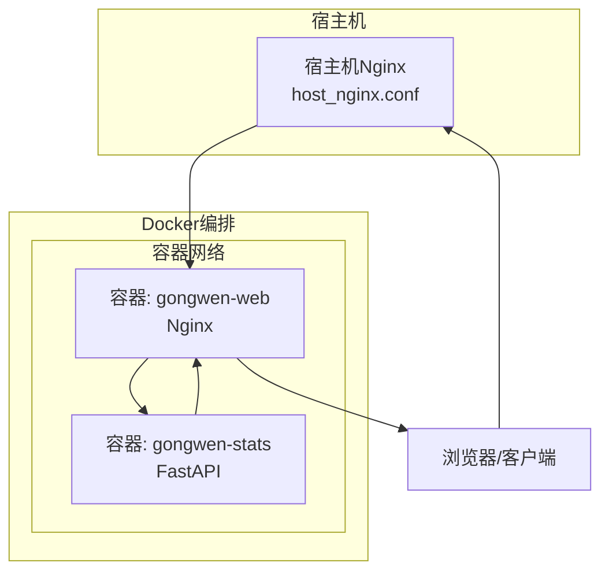
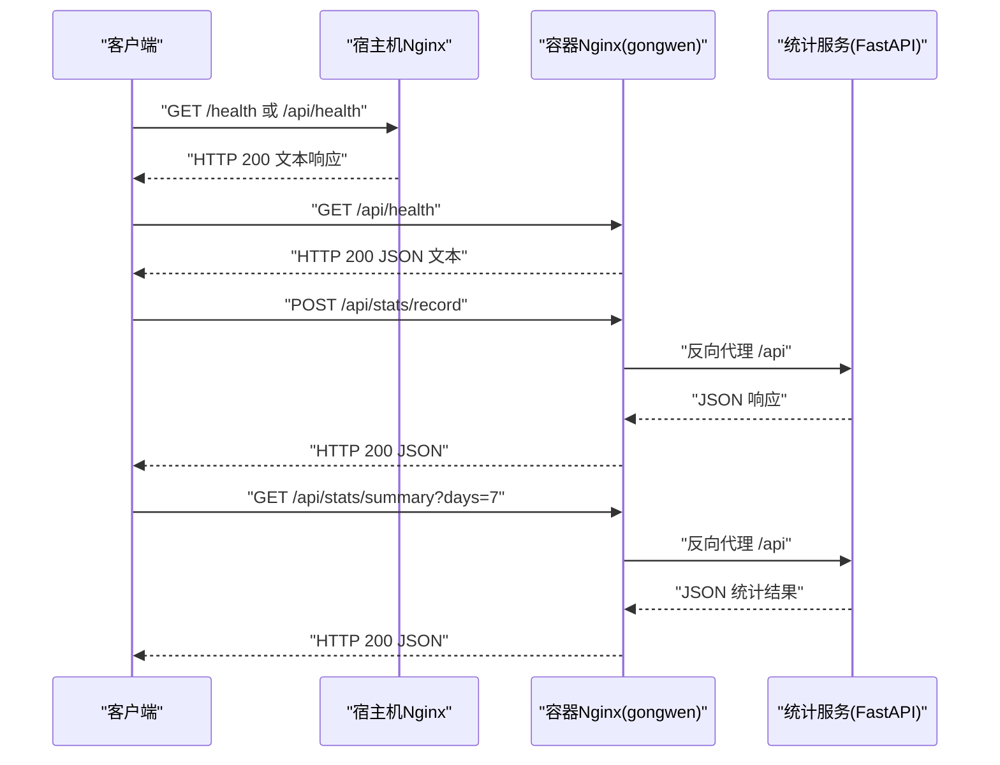
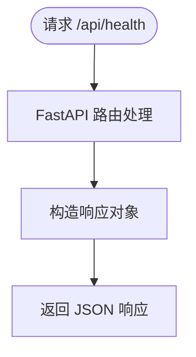
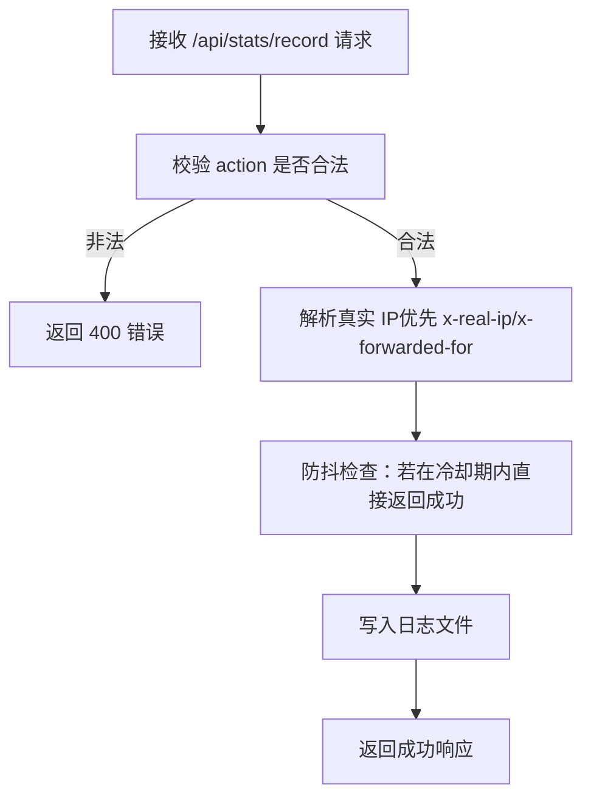
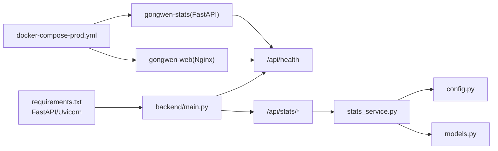

# 健康监控API

<cite>
**本文引用的文件**
- [backend/main.py](file://backend/main.py)
- [backend/routers/stats.py](file://backend/routers/stats.py)
- [backend/services/stats_service.py](file://backend/services/stats_service.py)
- [backend/config.py](file://backend/config.py)
- [backend/models.py](file://backend/models.py)
- [gongwen-docker/docker-compose-prod.yml](file://gongwen-docker/docker-compose-prod.yml)
- [gongwen-docker/docker-compose-dev.yml](file://gongwen-docker/docker-compose-dev.yml)
- [gongwen-docker/nginx-prod.conf](file://gongwen-docker/nginx-prod.conf)
- [gongwen-docker/nginx-dev.conf](file://gongwen-docker/nginx-dev.conf)
- [gongwen-docker/host_nginx.conf](file://gongwen-docker/host_nginx.conf)
- [gongwen-docker/Dockerfile](file://gongwen-docker/Dockerfile)
- [backend/requirements.txt](file://backend/requirements.txt)
</cite>

## 目录
1. [简介](#简介)
2. [项目结构](#项目结构)
3. [核心组件](#核心组件)
4. [架构总览](#架构总览)
5. [详细组件分析](#详细组件分析)
6. [依赖分析](#依赖分析)
7. [性能考虑](#性能考虑)
8. [故障排查指南](#故障排查指南)
9. [结论](#结论)
10. [附录](#附录)

## 简介
本文件面向运维与开发团队，系统化说明后端统计服务的健康检查端点与Nginx反向代理配置，记录/api/health端点的响应格式与检查逻辑；解释Docker容器健康检查与重启策略；提供监控指标采集方法（请求延迟、错误率、资源使用）；说明负载均衡与故障转移配置思路；并给出最佳实践与告警建议及常见问题诊断方法。

## 项目结构
该工程采用前后端分离与容器化部署方案：
- 前端静态资源通过Nginx提供，并作为反向代理统一入口。
- 后端统计服务为独立FastAPI应用，对外暴露/api/stats接口与/api/health健康检查端点。
- Docker Compose编排Web（Nginx）与统计服务（FastAPI），并配置健康检查与重启策略。
- Nginx配置支持SPA路由、静态资源缓存、API反向代理与健康检查端点。

图表来源
- [gongwen-docker/host_nginx.conf:1-16](file://gongwen-docker/host_nginx.conf#L1-L16)
- [gongwen-docker/docker-compose-prod.yml:4-36](file://gongwen-docker/docker-compose-prod.yml#L4-L36)
- [gongwen-docker/nginx-prod.conf:35-85](file://gongwen-docker/nginx-prod.conf#L35-L85)

章节来源
- [gongwen-docker/docker-compose-prod.yml:1-36](file://gongwen-docker/docker-compose-prod.yml#L1-L36)
- [gongwen-docker/nginx-prod.conf:1-86](file://gongwen-docker/nginx-prod.conf#L1-L86)
- [gongwen-docker/host_nginx.conf:1-16](file://gongwen-docker/host_nginx.conf#L1-L16)

## 核心组件
- 健康检查端点
  - 后端：/api/health，返回简单JSON对象，表示服务可用状态。
  - 前端/Nginx：/health，返回纯文本“healthy”，便于快速探测。
- API路由与业务逻辑
  - /api/stats/record：记录用户行为，带防抖与日志落盘。
  - /api/stats/summary：按天统计唯一用户数、调用次数与功能调用分布。
- 容器与编排
  - Web容器镜像基于Nginx，静态资源直接提供。
  - 统计服务容器基于FastAPI+Uvicorn，提供统计API与健康检查。
  - Docker Compose定义健康检查与重启策略。

章节来源
- [backend/main.py:33-38](file://backend/main.py#L33-L38)
- [gongwen-docker/nginx-prod.conf:72-77](file://gongwen-docker/nginx-prod.conf#L72-L77)
- [backend/routers/stats.py:12-39](file://backend/routers/stats.py#L12-L39)
- [backend/services/stats_service.py:44-124](file://backend/services/stats_service.py#L44-L124)
- [gongwen-docker/docker-compose-prod.yml:16-35](file://gongwen-docker/docker-compose-prod.yml#L16-L35)

## 架构总览
下图展示从客户端到后端统计服务的完整链路，包括健康检查与反向代理的关键节点。

图表来源
- [gongwen-docker/host_nginx.conf:1-16](file://gongwen-docker/host_nginx.conf#L1-L16)
- [gongwen-docker/nginx-prod.conf:56-77](file://gongwen-docker/nginx-prod.conf#L56-L77)
- [backend/main.py:33-38](file://backend/main.py#L33-L38)
- [backend/routers/stats.py:12-39](file://backend/routers/stats.py#L12-L39)

## 详细组件分析

### 健康检查端点与响应格式
- 后端健康检查
  - 路径：/api/health
  - 方法：GET
  - 响应：JSON对象，包含状态字段，表示服务可用。
  - 实现位置：应用根路由，返回固定结构。
- 前端/Nginx健康检查
  - 路径：/health
  - 方法：GET
  - 响应：纯文本“healthy”，状态码200，无访问日志。
  - 实现位置：Nginx配置中location块，直接返回文本。

图表来源
- [backend/main.py:33-38](file://backend/main.py#L33-L38)

章节来源
- [backend/main.py:33-38](file://backend/main.py#L33-L38)
- [gongwen-docker/nginx-prod.conf:72-77](file://gongwen-docker/nginx-prod.conf#L72-L77)

### API路由与处理逻辑
- /api/stats/record
  - 功能：记录用户行为，校验动作合法性，提取真实IP，执行防抖，写入日志。
  - 关键点：支持通过反代头透传真实IP；防抖避免重复上报；日志落盘到持久化目录。
- /api/stats/summary
  - 功能：按天统计唯一用户数、总调用次数与功能调用分布。
  - 关键点：可选时间窗口；对非法行进行容错；合法动作集合受控。

图表来源
- [backend/routers/stats.py:12-32](file://backend/routers/stats.py#L12-L32)
- [backend/services/stats_service.py:15-55](file://backend/services/stats_service.py#L15-L55)

章节来源
- [backend/routers/stats.py:12-39](file://backend/routers/stats.py#L12-L39)
- [backend/services/stats_service.py:44-124](file://backend/services/stats_service.py#L44-L124)
- [backend/config.py:5-16](file://backend/config.py#L5-L16)
- [backend/models.py:6-23](file://backend/models.py#L6-L23)

### 数据模型与配置
- 数据模型
  - RecordRequest：请求体包含动作字段。
  - RecordResponse：响应体包含布尔字段ok。
  - SummaryResponse：响应体包含统计周期、唯一用户数、总调用次数、各功能调用次数。
- 配置项
  - 日志文件路径：从环境变量读取，默认挂载目录。
  - 防抖间隔与清理间隔：控制重复上报与内存缓存清理。
  - 合法动作集合：限定统计维度。

章节来源
- [backend/models.py:6-23](file://backend/models.py#L6-L23)
- [backend/config.py:5-16](file://backend/config.py#L5-L16)

### Docker容器健康检查与重启策略
- Web容器（Nginx）
  - 健康检查：探测/health，成功条件为HTTP 200且内容为“healthy”。
  - 重启策略：unless-stopped。
- 统计服务容器（FastAPI）
  - 健康检查：探测/api/health，成功条件为返回JSON且包含可用状态。
  - 重启策略：unless-stopped。
- 编排文件
  - 开发与生产均通过Compose定义健康检查与重启参数，确保容器异常时自动恢复。

章节来源
- [gongwen-docker/docker-compose-prod.yml:16-35](file://gongwen-docker/docker-compose-prod.yml#L16-L35)
- [gongwen-docker/docker-compose-dev.yml:21-43](file://gongwen-docker/docker-compose-dev.yml#L21-L43)

### Nginx反向代理与静态资源
- 反向代理
  - 将/api前缀转发至统计服务容器的8000端口。
  - 透传Host、X-Real-IP、X-Forwarded-For、X-Forwarded-Proto等头部。
  - 设置连接与读取超时，保障稳定性。
- 静态资源与PWA
  - 对JS/CSS/字体/图标等设置长缓存；PWA相关文件禁用缓存。
- 健康检查
  - /health返回纯文本“healthy”，关闭访问日志，便于快速探测。

章节来源
- [gongwen-docker/nginx-prod.conf:56-77](file://gongwen-docker/nginx-prod.conf#L56-L77)
- [gongwen-docker/nginx-dev.conf:55-76](file://gongwen-docker/nginx-dev.conf#L55-L76)

### 外层宿主机Nginx（可选）
- 将宿主机端口映射到容器Nginx，透传真实客户端IP，便于上游网关或负载均衡器识别源地址。
- 适合多实例或外部LB场景前置一层Nginx。

章节来源
- [gongwen-docker/host_nginx.conf:1-16](file://gongwen-docker/host_nginx.conf#L1-L16)

## 依赖分析
- 应用依赖
  - FastAPI与Uvicorn用于提供API与健康检查端点。
  - Pydantic模型用于请求/响应数据验证。
- 运行时依赖
  - Nginx镜像提供静态资源与反向代理。
  - Docker卷挂载用于日志持久化。
- 编排依赖
  - Compose定义服务间依赖与健康检查触发顺序。

图表来源
- [backend/requirements.txt:1-3](file://backend/requirements.txt#L1-L3)
- [backend/main.py:33-38](file://backend/main.py#L33-L38)
- [backend/routers/stats.py:9](file://backend/routers/stats.py#L9)
- [backend/services/stats_service.py:8](file://backend/services/stats_service.py#L8)
- [backend/config.py:5-16](file://backend/config.py#L5-L16)
- [backend/models.py:3-23](file://backend/models.py#L3-L23)
- [gongwen-docker/docker-compose-prod.yml:4-36](file://gongwen-docker/docker-compose-prod.yml#L4-L36)

章节来源
- [backend/requirements.txt:1-3](file://backend/requirements.txt#L1-L3)
- [gongwen-docker/docker-compose-prod.yml:4-36](file://gongwen-docker/docker-compose-prod.yml#L4-L36)

## 性能考虑
- 健康检查
  - 前端/Nginx健康检查返回纯文本，开销极低，适合高频探测。
  - 后端健康检查返回轻量JSON，便于集成平台识别。
- 反向代理
  - 为API设置合理的连接与读取超时，避免慢请求拖垮上游。
  - 静态资源长缓存减少带宽与CPU消耗。
- 统计服务
  - 防抖机制降低重复上报带来的IO压力。
  - 定期清理防抖缓存，避免内存膨胀。
- 日志与存储
  - 日志落盘到持久化卷，避免容器重建导致数据丢失。
  - 按天统计时可限制时间窗口，避免全量扫描过大文件。

章节来源
- [gongwen-docker/nginx-prod.conf:63-64](file://gongwen-docker/nginx-prod.conf#L63-L64)
- [backend/services/stats_service.py:26-42](file://backend/services/stats_service.py#L26-L42)
- [backend/config.py:5-16](file://backend/config.py#L5-L16)

## 故障排查指南
- 健康检查失败
  - Web容器：确认/health返回200且内容为“healthy”。检查Nginx配置与端口映射。
  - 统计服务：确认/api/health返回可用状态。检查容器日志与依赖服务连通性。
- API不可用
  - 检查Nginx反向代理是否正确转发到gongwen-stats:8000。
  - 核实容器网络与端口映射，确保8000端口可达。
- 日志未生成
  - 确认日志路径已挂载到/data目录，容器具备写权限。
  - 检查动作是否在合法集合内，非法动作会被忽略。
- 防抖导致未记录
  - 检查防抖间隔与客户端上报频率，必要时调整配置。
- 常用命令
  - 查看容器健康状态与日志：docker inspect、docker logs。
  - 进入容器调试：docker exec -it。
  - 重新加载Nginx配置：docker exec gongwen-web nginx -s reload。
  - 观察容器资源：docker stats。

章节来源
- [gongwen-docker/docker-compose-prod.yml:16-35](file://gongwen-docker/docker-compose-prod.yml#L16-L35)
- [gongwen-docker/nginx-prod.conf:56-77](file://gongwen-docker/nginx-prod.conf#L56-L77)
- [backend/config.py:5-16](file://backend/config.py#L5-L16)

## 结论
本方案通过前后端分离与容器化部署，结合Nginx反向代理与健康检查，提供了简洁可靠的健康监控能力。/api/health与/health分别服务于后端与前端/Nginx，配合Docker健康检查与重启策略，可实现自动化运维与快速自愈。建议在生产环境中结合日志与指标系统，持续优化超时与缓存策略，并建立完善的告警与演练流程。

## 附录

### 监控指标采集建议
- 请求延迟
  - Nginx访问日志中的请求耗时字段可用于统计P95/P99延迟。
  - 后端可通过中间件或装饰器埋点记录处理耗时。
- 错误率
  - 统计HTTP 4xx/5xx比例，区分API与静态资源错误。
  - 关注/api/stats/record的400错误（非法动作）与5xx错误。
- 资源使用
  - CPU/内存/IO：通过容器监控工具采集Web与统计服务容器。
  - 磁盘：关注日志卷增长趋势，设置保留策略与告警阈值。

### 负载均衡与故障转移
- 多实例部署
  - 使用反向代理或负载均衡器（如Nginx、HAProxy、云LB）分发流量至多个Web容器实例。
  - 统一以/health与/api/health作为探活端点。
- 故障转移
  - 当某实例健康检查失败时，将流量切换至健康实例。
  - 建议启用权重与预热机制，避免瞬时流量冲击。

### 运维最佳实践与告警
- 最佳实践
  - 明确健康检查探测路径与成功条件，保持一致性。
  - 为日志卷设置容量与保留策略，定期归档与清理。
  - 控制防抖与统计窗口，平衡实时性与性能。
- 告警建议
  - 健康检查连续失败触发告警。
  - 错误率、延迟、资源使用超过阈值触发预警。
  - 日志写入失败或磁盘空间不足及时通知。