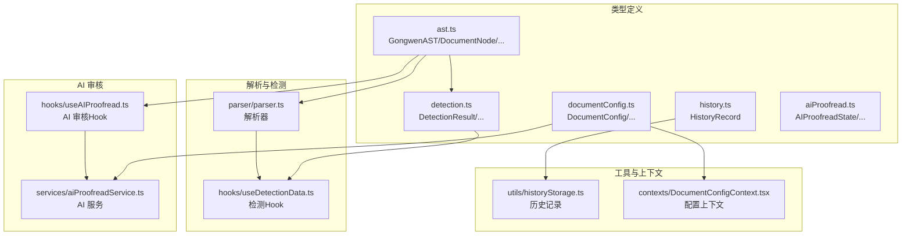
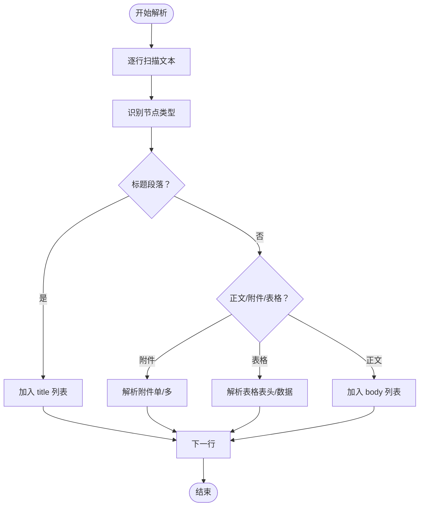
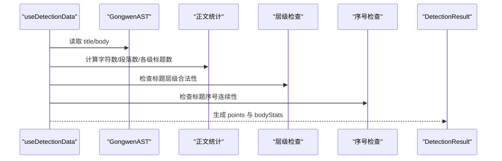
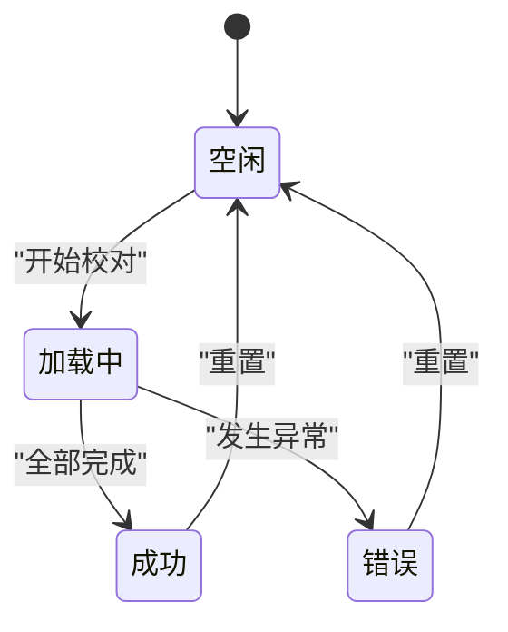
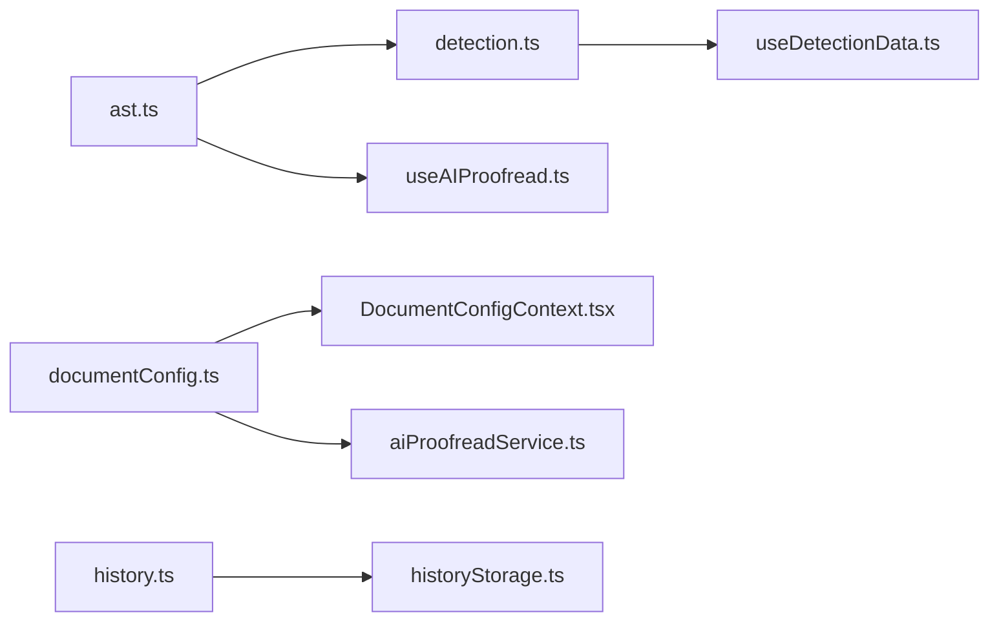

# 前端数据类型

<cite>
**本文引用的文件**
- [src/types/ast.ts](file://src/types/ast.ts)
- [src/types/detection.ts](file://src/types/detection.ts)
- [src/types/history.ts](file://src/types/history.ts)
- [src/types/documentConfig.ts](file://src/types/documentConfig.ts)
- [src/types/aiProofread.ts](file://src/types/aiProofread.ts)
- [src/hooks/useDetectionData.ts](file://src/hooks/useDetectionData.ts)
- [src/hooks/useAIProofread.ts](file://src/hooks/useAIProofread.ts)
- [src/parser/parser.ts](file://src/parser/parser.ts)
- [src/services/aiProofreadService.ts](file://src/services/aiProofreadService.ts)
- [src/utils/historyStorage.ts](file://src/utils/historyStorage.ts)
- [src/contexts/DocumentConfigContext.tsx](file://src/contexts/DocumentConfigContext.tsx)
</cite>

## 目录
1. [简介](#简介)
2. [项目结构](#项目结构)
3. [核心组件](#核心组件)
4. [架构总览](#架构总览)
5. [详细组件分析](#详细组件分析)
6. [依赖分析](#依赖分析)
7. [性能考虑](#性能考虑)
8. [故障排查指南](#故障排查指南)
9. [结论](#结论)
10. [附录](#附录)

## 简介
本文件面向前端应用的核心数据类型，系统性梳理并解释以下关键类型及其关系：
- GongwenAST 抽象语法树结构
- DocumentNode 文档节点类型
- DetectionResult 检测结果类型
- HistoryItem 历史记录类型
- DocumentConfig 文档配置类型
- AIProofreadState AI 审核状态类型

文档将阐明各类型的设计目的、字段含义、复杂度与约束、运行时验证策略、类型间转换规则与最佳实践，并给出基于源码路径的参考位置，帮助开发者在不直接阅读代码的情况下快速定位实现细节。

## 项目结构
本项目采用“类型定义 + 业务逻辑 Hook/Service/Parser”的分层组织方式：
- 类型定义集中于 src/types，涵盖 AST、检测、历史、配置、AI 审核等核心数据模型
- 业务逻辑通过 Hooks（如 useDetectionData、useAIProofread）与 Service（如 aiProofreadService）实现
- Parser 负责将原始文本解析为 AST
- Utils 提供历史记录持久化与 AI 响应解析等辅助能力
- Contexts 提供配置上下文与状态持久化



图表来源
- [src/types/ast.ts:1-81](file://src/types/ast.ts#L1-L81)
- [src/types/detection.ts:1-151](file://src/types/detection.ts#L1-L151)
- [src/types/history.ts:1-12](file://src/types/history.ts#L1-L12)
- [src/types/documentConfig.ts:1-267](file://src/types/documentConfig.ts#L1-L267)
- [src/types/aiProofread.ts:1-201](file://src/types/aiProofread.ts#L1-L201)
- [src/parser/parser.ts:1-200](file://src/parser/parser.ts#L1-L200)
- [src/hooks/useDetectionData.ts:1-482](file://src/hooks/useDetectionData.ts#L1-L482)
- [src/hooks/useAIProofread.ts:1-221](file://src/hooks/useAIProofread.ts#L1-L221)
- [src/services/aiProofreadService.ts:1-200](file://src/services/aiProofreadService.ts#L1-L200)
- [src/utils/historyStorage.ts:1-116](file://src/utils/historyStorage.ts#L1-L116)
- [src/contexts/DocumentConfigContext.tsx:1-297](file://src/contexts/DocumentConfigContext.tsx#L1-L297)

章节来源
- [src/types/ast.ts:1-81](file://src/types/ast.ts#L1-L81)
- [src/types/detection.ts:1-151](file://src/types/detection.ts#L1-L151)
- [src/types/history.ts:1-12](file://src/types/history.ts#L1-L12)
- [src/types/documentConfig.ts:1-267](file://src/types/documentConfig.ts#L1-L267)
- [src/types/aiProofread.ts:1-201](file://src/types/aiProofread.ts#L1-L201)

## 核心组件
本节对六大核心类型进行深入剖析，包括设计目标、字段语义、复杂度与约束、安全保证与运行时验证策略。

- GongwenAST 抽象语法树
  - 设计目标：统一表示公文的标题与正文结构，便于渲染、导出与检测
  - 关键字段：title（DocumentNode[]）、body（DocumentNode[]）
  - 复杂度：遍历 O(N)（N 为节点总数）
  - 约束：title 支持多段标题，body 由多种 NodeType 组成
  - 安全性：通过枚举 NodeType 限制节点类型，避免非法值
  - 参考路径：[GongwenAST 定义:75-81](file://src/types/ast.ts#L75-L81)

- DocumentNode 文档节点
  - 设计目标：承载单个节点的类型、内容与元信息
  - 关键字段：type（NodeType）、content（string）、lineNumber（number）
  - 复杂度：O(1) 访问
  - 约束：lineNumber 从 1 开始，确保与源文本行号对应
  - 安全性：通过 DocumentNode 接口约束字段集合
  - 参考路径：[DocumentNode 定义:29-35](file://src/types/ast.ts#L29-L35)

- DetectionResult 检测结果
  - 设计目标：汇总各检测点的状态、内容与统计信息
  - 关键字段：points（DetectionPoint[]）、bodyStats（BodyStats）
  - 复杂度：O(B)（B 为 body 节点数）
  - 约束：points 由 useDetectionData 动态生成，包含标题、主送机关、正文、署名、日期等检测点
  - 安全性：通过 DetectionStatus/DetectionPointType 枚举限定状态与类型
  - 参考路径：[DetectionResult 定义:128-134](file://src/types/detection.ts#L128-L134)

- HistoryItem 历史记录
  - 设计目标：记录用户编辑历史，支持本地持久化与检索
  - 关键字段：id（string）、title（string）、content（string）、savedAt（string）
  - 复杂度：读写 O(1)，去重 O(n)
  - 约束：localStorage 存储，最大条目数限制
  - 安全性：JSON 解析与异常捕获，避免崩溃
  - 参考路径：[HistoryRecord 定义:1-12](file://src/types/history.ts#L1-L12)

- DocumentConfig 文档配置
  - 设计目标：封装公文排版参数、默认值、选项常量与单位转换
  - 关键字段：margins、title、headings、body、table、specialOptions、advanced、header、footerNote
  - 复杂度：配置读取 O(1)，深合并 O(C)（C 为配置层级数）
  - 约束：DEFAULT_CONFIG 提供标准 GB/T 9704 参数；DeepPartial 支持增量更新
  - 安全性：类型系统约束字段类型；单位转换函数提供数学边界
  - 参考路径：[DocumentConfig 定义:95-105](file://src/types/documentConfig.ts#L95-L105)

- AIProofreadState AI 审核状态
  - 设计目标：跟踪 AI 校对的进度、结果与错误
  - 关键字段：status（'idle' | 'loading' | 'success' | 'error'）、processedSentences、totalSentences、results（Map）、error
  - 复杂度：Map 查找 O(1)，更新 O(1)
  - 约束：状态机约束合法状态迁移
  - 安全性：状态机约束与错误兜底
  - 参考路径：[AIProofreadState 定义:98-109](file://src/types/aiProofread.ts#L98-L109)

章节来源
- [src/types/ast.ts:29-81](file://src/types/ast.ts#L29-L81)
- [src/types/detection.ts:128-151](file://src/types/detection.ts#L128-L151)
- [src/types/history.ts:1-12](file://src/types/history.ts#L1-L12)
- [src/types/documentConfig.ts:95-183](file://src/types/documentConfig.ts#L95-L183)
- [src/types/aiProofread.ts:98-109](file://src/types/aiProofread.ts#L98-L109)

## 架构总览
下图展示 GongwenAST 与各类型之间的关系及转换路径。

```mermaid
classDiagram
class NodeType {
+枚举值
}
class DocumentNode {
+type : NodeType
+content : string
+lineNumber : number
}
class AttachmentNode {
+type : NodeType.ATTACHMENT
+isMultiple : boolean
+items : AttachmentItem[]
}
class TableNode {
+type : NodeType.TABLE
+header : TableRowData
+rows : TableRowData[]
+columnCount : number
}
class GongwenAST {
+title : DocumentNode[]
+body : DocumentNode[]
}
class DetectionStatus {
+枚举值
}
class DetectionPointType {
+枚举值
}
class DetectionPoint {
+type : DetectionPointType
+status : DetectionStatus
+label : string
+content : string|null
+meta : DetectionPointMeta
}
class DetectionResult {
+points : DetectionPoint[]
+bodyStats : BodyStats
}
class HistoryRecord {
+id : string
+title : string
+content : string
+savedAt : string
}
class DocumentConfig {
+margins
+title
+headings
+body
+table
+specialOptions
+advanced
+header
+footerNote
}
class AIProofreadState {
+status
+processedSentences
+totalSentences
+results : Map
+error
}
GongwenAST --> DocumentNode : "包含"
DocumentNode <|-- AttachmentNode : "扩展"
DocumentNode <|-- TableNode : "扩展"
DetectionResult --> DetectionPoint : "包含"
AIProofreadState --> "使用" : "追踪校对进度"
DocumentConfig --> "影响" : "渲染/导出"
HistoryRecord --> "持久化" : "编辑历史"
```

图表来源
- [src/types/ast.ts:2-81](file://src/types/ast.ts#L2-L81)
- [src/types/detection.ts:1-151](file://src/types/detection.ts#L1-L151)
- [src/types/history.ts:1-12](file://src/types/history.ts#L1-L12)
- [src/types/documentConfig.ts:95-105](file://src/types/documentConfig.ts#L95-L105)
- [src/types/aiProofread.ts:98-109](file://src/types/aiProofread.ts#L98-L109)

## 详细组件分析

### GongwenAST 抽象语法树结构
- 设计要点
  - 以标题与正文两大板块组织，支持多段标题
  - 通过 DocumentNode 的扩展类型（AttachmentNode、TableNode）覆盖附件与表格
- 关键算法与复杂度
  - 解析阶段：线性扫描文本，按规则识别节点类型，时间复杂度 O(L)（L 为行数）
  - 附件解析：支持单附件与多附件模式，多附件时需跨行聚合，最坏 O(L)
  - 表格解析：识别表头与分隔行，逐行解析单元格，时间复杂度 O(R*C)（R 为行数，C 为列数）
- 安全性与运行时验证
  - 通过 NodeType 枚举限制节点类型
  - 附件解析中对首项序号进行校验，异常时回退为单附件
  - 表格解析中对分隔行进行严格匹配，避免误判
- 使用场景
  - 渲染预览、导出 DOCX、检测与 AI 审核
- 参考路径
  - [GongwenAST 定义:75-81](file://src/types/ast.ts#L75-L81)
  - [附件解析实现:72-182](file://src/parser/parser.ts#L72-L182)
  - [表格解析实现:192-200](file://src/parser/parser.ts#L192-L200)



图表来源
- [src/parser/parser.ts:1-200](file://src/parser/parser.ts#L1-L200)

章节来源
- [src/types/ast.ts:29-81](file://src/types/ast.ts#L29-L81)
- [src/parser/parser.ts:1-200](file://src/parser/parser.ts#L1-L200)

### DetectionResult 检测结果类型
- 设计要点
  - DetectionResult 聚合多个 DetectionPoint，每个点包含类型、状态、标签、内容与元数据
  - 元数据支持正文统计、日期警告、标题层级/序号警告等
- 关键算法与复杂度
  - 正文统计：遍历 body，累计字符数、段落数与各级标题数量，O(B)
  - 日期警告：解析日期并比较与当前日期差值，O(B)
  - 标题层级/序号：维护期望序号，O(B)
- 安全性与运行时验证
  - 使用 DetectionStatus/DetectionPointType 枚举，避免非法状态
  - 标题序号解析支持中文数字与阿拉伯数字，异常时返回 null 并记录问题
- 使用场景
  - 检测面板展示、导出报告、AI 审核输入准备
- 参考路径
  - [DetectionResult 定义:128-134](file://src/types/detection.ts#L128-L134)
  - [useDetectionData 实现:343-481](file://src/hooks/useDetectionData.ts#L343-L481)



图表来源
- [src/hooks/useDetectionData.ts:343-481](file://src/hooks/useDetectionData.ts#L343-L481)
- [src/types/detection.ts:128-151](file://src/types/detection.ts#L128-L151)

章节来源
- [src/types/detection.ts:1-151](file://src/types/detection.ts#L1-L151)
- [src/hooks/useDetectionData.ts:1-482](file://src/hooks/useDetectionData.ts#L1-L482)

### HistoryItem 历史记录类型
- 设计要点
  - HistoryRecord 用于记录用户编辑历史，包含标题提取、内容与时间戳
- 关键算法与复杂度
  - 标题提取：线性扫描前缀行，遇到空行或以冒号结尾的行停止，O(L)
  - 持久化：localStorage JSON 序列化，读写 O(1)，上限截断 O(n)
- 安全性与运行时验证
  - JSON 解析异常捕获，避免抛出错误
  - 内容去重与最大条目限制
- 使用场景
  - 历史弹窗、自动保存、恢复编辑
- 参考路径
  - [HistoryRecord 定义:1-12](file://src/types/history.ts#L1-L12)
  - [历史记录工具实现:38-116](file://src/utils/historyStorage.ts#L38-L116)

章节来源
- [src/types/history.ts:1-12](file://src/types/history.ts#L1-L12)
- [src/utils/historyStorage.ts:1-116](file://src/utils/historyStorage.ts#L1-L116)

### DocumentConfig 文档配置类型
- 设计要点
  - DocumentConfig 将页面边距、标题、各级标题、正文、表格、特殊选项、高级设置、版头版记等参数统一建模
  - DEFAULT_CONFIG 提供符合 GB/T 9704 的默认值
  - DeepPartial 支持增量更新，配合 useReducer 深合并
- 关键算法与复杂度
  - 深合并：递归合并对象，时间复杂度 O(C)
  - 单位转换：cm/pt/twip 互转，O(1)
- 安全性与运行时验证
  - 类型系统约束字段类型与默认值
  - 常量选项提供下拉菜单数据，减少非法输入
- 使用场景
  - 设置面板、渲染预览、导出样式
- 参考路径
  - [DocumentConfig 定义:95-105](file://src/types/documentConfig.ts#L95-L105)
  - [默认配置:132-183](file://src/types/documentConfig.ts#L132-L183)
  - [深合并与上下文:24-48](file://src/contexts/DocumentConfigContext.tsx#L24-L48)

章节来源
- [src/types/documentConfig.ts:1-267](file://src/types/documentConfig.ts#L1-L267)
- [src/contexts/DocumentConfigContext.tsx:1-297](file://src/contexts/DocumentConfigContext.tsx#L1-L297)

### AIProofreadState AI 审核状态类型
- 设计要点
  - AIProofreadState 作为状态机，跟踪校对进度与结果
  - 支持 Map 存储结果，便于按 sentenceId 快速访问
- 关键算法与复杂度
  - 流式处理：逐块发送请求，增量更新 Map，O(S)（S 为句子数）
  - 并发控制：内部配置最大并发数，避免超载
- 安全性与运行时验证
  - 状态机约束：仅允许合法状态迁移
  - 错误兜底：网络异常、配置缺失时设置 error 并终止
- 使用场景
  - AI 校对按钮、进度条、结果展示
- 参考路径
  - [AIProofreadState 定义:98-109](file://src/types/aiProofread.ts#L98-L109)
  - [AI 审核 Hook:56-221](file://src/hooks/useAIProofread.ts#L56-L221)
  - [AI 服务实现:147-200](file://src/services/aiProofreadService.ts#L147-L200)



图表来源
- [src/types/aiProofread.ts:98-109](file://src/types/aiProofread.ts#L98-L109)
- [src/hooks/useAIProofread.ts:67-205](file://src/hooks/useAIProofread.ts#L67-L205)

章节来源
- [src/types/aiProofread.ts:1-201](file://src/types/aiProofread.ts#L1-L201)
- [src/hooks/useAIProofread.ts:1-221](file://src/hooks/useAIProofread.ts#L1-L221)
- [src/services/aiProofreadService.ts:1-200](file://src/services/aiProofreadService.ts#L1-L200)

## 依赖分析
- 类型间依赖
  - GongwenAST 依赖 DocumentNode 及其扩展（AttachmentNode、TableNode）
  - DetectionResult 依赖 DetectionPoint 与其元数据类型
  - AIProofreadState 依赖 AIProofreadResult 与 AIProofreadConfig
  - DocumentConfig 与 AIProofreadConfig 在上下文中共享
- 运行时依赖
  - useDetectionData 依赖 AST 与检测规则
  - useAIProofread 依赖解析器与 AI 服务
  - DocumentConfigContext 依赖 localStorage 进行持久化
- 循环依赖
  - 未发现循环依赖；类型定义相互独立，业务逻辑通过 Hook/Service 解耦



图表来源
- [src/types/ast.ts:1-81](file://src/types/ast.ts#L1-L81)
- [src/types/detection.ts:1-151](file://src/types/detection.ts#L1-L151)
- [src/types/history.ts:1-12](file://src/types/history.ts#L1-L12)
- [src/types/documentConfig.ts:1-267](file://src/types/documentConfig.ts#L1-L267)
- [src/types/aiProofread.ts:1-201](file://src/types/aiProofread.ts#L1-L201)
- [src/hooks/useDetectionData.ts:1-482](file://src/hooks/useDetectionData.ts#L1-L482)
- [src/hooks/useAIProofread.ts:1-221](file://src/hooks/useAIProofread.ts#L1-L221)
- [src/services/aiProofreadService.ts:1-200](file://src/services/aiProofreadService.ts#L1-L200)
- [src/utils/historyStorage.ts:1-116](file://src/utils/historyStorage.ts#L1-L116)
- [src/contexts/DocumentConfigContext.tsx:1-297](file://src/contexts/DocumentConfigContext.tsx#L1-L297)

章节来源
- [src/types/ast.ts:1-81](file://src/types/ast.ts#L1-L81)
- [src/types/detection.ts:1-151](file://src/types/detection.ts#L1-L151)
- [src/types/history.ts:1-12](file://src/types/history.ts#L1-L12)
- [src/types/documentConfig.ts:1-267](file://src/types/documentConfig.ts#L1-L267)
- [src/types/aiProofread.ts:1-201](file://src/types/aiProofread.ts#L1-L201)
- [src/hooks/useDetectionData.ts:1-482](file://src/hooks/useDetectionData.ts#L1-L482)
- [src/hooks/useAIProofread.ts:1-221](file://src/hooks/useAIProofread.ts#L1-L221)
- [src/services/aiProofreadService.ts:1-200](file://src/services/aiProofreadService.ts#L1-L200)
- [src/utils/historyStorage.ts:1-116](file://src/utils/historyStorage.ts#L1-L116)
- [src/contexts/DocumentConfigContext.tsx:1-297](file://src/contexts/DocumentConfigContext.tsx#L1-L297)

## 性能考虑
- 解析与检测
  - 解析器线性扫描，时间复杂度 O(L)，适合大文档
  - 检测函数按节点类型分支，整体 O(B)
- AI 审核
  - 流式处理与并发控制，避免一次性提交过多请求
  - Map 存储结果，查询与更新均为 O(1)
- 配置与历史
  - 深合并与 localStorage 读写为 O(C) 与 O(1)，合理控制配置层级与历史条目上限
- 建议
  - 对超长正文分块处理，避免 UI 卡顿
  - 使用 useMemo/useCallback 缓存检测与配置变更

## 故障排查指南
- AI 服务未配置
  - 现象：状态变为 error，提示“AI服务未配置”
  - 处理：检查环境变量与配置项
  - 参考路径：[AI 审核 Hook 错误处理:72-83](file://src/hooks/useAIProofread.ts#L72-L83)
- 公文内容为空
  - 现象：状态变为 error，提示“公文内容为空”
  - 处理：确保 AST 有效
  - 参考路径：[AI 审核 Hook 输入校验:85-96](file://src/hooks/useAIProofread.ts#L85-L96)
- 未提取到可审核的句子
  - 现象：状态变为 error，提示“未提取到可审核的句子”
  - 处理：检查解析器与分句逻辑
  - 参考路径：[AI 审核 Hook 句子检查:103-114](file://src/hooks/useAIProofread.ts#L103-L114)
- 历史记录读取失败
  - 现象：历史为空或异常
  - 处理：捕获 JSON 解析异常，回退为空列表
  - 参考路径：[历史记录读取:38-47](file://src/utils/historyStorage.ts#L38-L47)
- 配置持久化失败
  - 现象：刷新后配置丢失
  - 处理：捕获 localStorage 异常，静默忽略
  - 参考路径：[配置持久化:258-265](file://src/contexts/DocumentConfigContext.tsx#L258-L265)

章节来源
- [src/hooks/useAIProofread.ts:72-114](file://src/hooks/useAIProofread.ts#L72-L114)
- [src/utils/historyStorage.ts:38-47](file://src/utils/historyStorage.ts#L38-L47)
- [src/contexts/DocumentConfigContext.tsx:258-265](file://src/contexts/DocumentConfigContext.tsx#L258-L265)

## 结论
本文系统梳理了 GongwenAST、DocumentNode、DetectionResult、HistoryItem、DocumentConfig、AIProofreadState 六类核心数据类型，明确了它们的设计目标、字段语义、复杂度与约束、安全性保证与运行时验证策略，并给出了类型间的关系与转换规则。通过合理的类型系统与运行时校验，项目在前端实现了强约束与高可靠的数据流转，为渲染、导出、检测与 AI 审核提供了坚实基础。

## 附录
- 类型扩展与自定义最佳实践
  - 新增节点类型：在 NodeType 中新增枚举值，在 AST 与解析器中补充识别逻辑
  - 新增检测点：在 DetectionPointType 中新增类型，在 useDetectionData 中补充检测逻辑与元数据
  - 新增配置项：在 DocumentConfig 中新增字段，提供默认值与单位转换函数
  - 新增 AI 校对规则：在 AIProofreadConfig 中扩展自定义检查项与示例
- TypeScript 类型系统应用模式
  - 使用枚举限定取值范围，避免魔法字符串
  - 使用接口与只读属性约束结构，提升可维护性
  - 使用泛型与条件类型（如 DeepPartial）支持增量更新
  - 使用联合类型与字面量类型表达状态机与精确值域