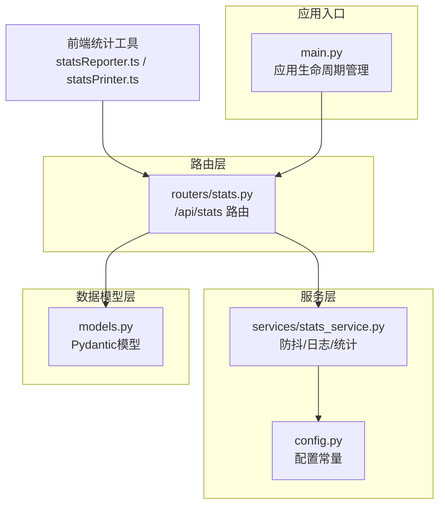
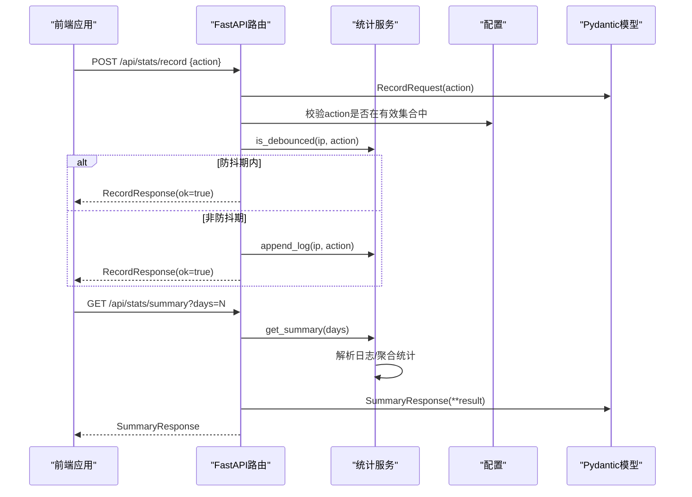
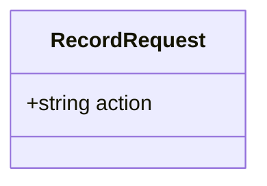
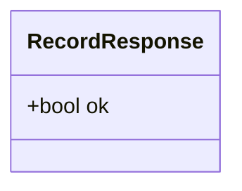
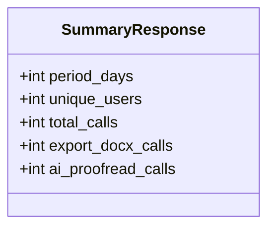
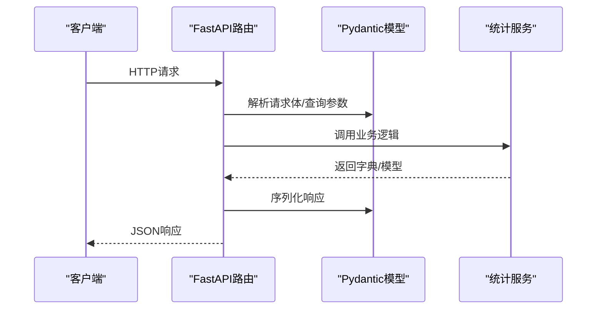
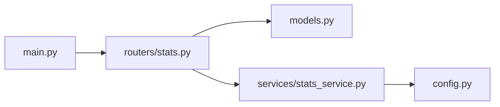

# 后端数据模型

<cite>
**本文档引用的文件**
- [models.py](file://backend/models.py)
- [stats.py](file://backend/routers/stats.py)
- [stats_service.py](file://backend/services/stats_service.py)
- [config.py](file://backend/config.py)
- [main.py](file://backend/main.py)
- [statsReporter.ts](file://src/utils/statsReporter.ts)
- [statsPrinter.ts](file://src/utils/statsPrinter.ts)
</cite>

## 目录
1. [简介](#简介)
2. [项目结构](#项目结构)
3. [核心组件](#核心组件)
4. [架构总览](#架构总览)
5. [详细组件分析](#详细组件分析)
6. [依赖分析](#依赖分析)
7. [性能考虑](#性能考虑)
8. [故障排除指南](#故障排除指南)
9. [结论](#结论)

## 简介
本文件专注于后端统计服务的数据模型设计与实现，详细解析三个Pydantic模型：RecordRequest（记录请求模型）、RecordResponse（记录响应模型）和SummaryResponse（统计查询响应模型）。文档涵盖字段定义、数据类型、验证规则、默认值设置、模型用途与使用场景、请求/响应示例、模型继承关系与字段约束、错误处理与最佳实践，以及在FastAPI路由中的使用方式和序列化机制。

## 项目结构
后端统计服务采用分层架构：
- 路由层：负责HTTP端点定义与请求参数解析
- 服务层：实现业务逻辑（防抖、日志写入、统计聚合）
- 数据模型层：定义Pydantic模型进行输入输出验证
- 配置层：集中管理环境变量与常量
- 应用入口：注册路由与生命周期管理

**图表来源**
- [main.py:12-38](file://backend/main.py#L12-L38)
- [stats.py:1-40](file://backend/routers/stats.py#L1-L40)
- [stats_service.py:1-124](file://backend/services/stats_service.py#L1-L124)
- [config.py:1-16](file://backend/config.py#L1-L16)
- [models.py:1-23](file://backend/models.py#L1-L23)

**章节来源**
- [main.py:12-38](file://backend/main.py#L12-L38)
- [stats.py:1-40](file://backend/routers/stats.py#L1-L40)
- [stats_service.py:1-124](file://backend/services/stats_service.py#L1-L124)
- [config.py:1-16](file://backend/config.py#L1-L16)
- [models.py:1-23](file://backend/models.py#L1-L23)

## 核心组件
本节概述三个核心Pydantic模型及其职责：
- RecordRequest：用于接收前端上报的功能使用记录请求，包含action字段
- RecordResponse：用于响应记录请求，包含ok布尔字段，默认为True
- SummaryResponse：用于响应统计查询请求，包含统计周期、唯一用户数、总调用次数、导出Word次数、AI校对次数等字段

每个模型均基于Pydantic BaseModel，自动提供数据验证、类型检查与序列化能力。

**章节来源**
- [models.py:6-23](file://backend/models.py#L6-L23)

## 架构总览
下图展示了统计服务的端到端工作流：前端通过fetch调用后端API，FastAPI路由层接收请求并进行参数验证，服务层执行业务逻辑（防抖、日志写入、统计聚合），最终返回Pydantic模型序列化的响应。

**图表来源**
- [stats.py:12-39](file://backend/routers/stats.py#L12-L39)
- [stats_service.py:15-123](file://backend/services/stats_service.py#L15-L123)
- [config.py:14-15](file://backend/config.py#L14-L15)
- [models.py:6-23](file://backend/models.py#L6-L23)

## 详细组件分析

### RecordRequest 记录请求模型
- 字段定义
  - action: 字符串类型，表示功能动作标识
- 数据类型与验证规则
  - 类型：字符串
  - 必填：是
  - 验证：在路由层进一步校验是否属于有效动作集合
- 默认值
  - 无默认值，必须显式提供
- 使用场景
  - 前端在用户触发功能操作时上报，如导出Word或AI校对
- 请求示例
  - POST /api/stats/record
  - 请求体：{"action":"export_docx"}
  - 请求体：{"action":"ai_proofread"}
- 错误处理
  - 若action不在有效集合中，路由抛出HTTP 400错误
- 最佳实践
  - 前端应严格限制action枚举，避免非法值
  - 上报采用fire-and-forget模式，不影响主流程

**图表来源**
- [models.py:6-8](file://backend/models.py#L6-L8)
- [stats.py:15-17](file://backend/routers/stats.py#L15-L17)

**章节来源**
- [models.py:6-8](file://backend/models.py#L6-L8)
- [stats.py:12-32](file://backend/routers/stats.py#L12-L32)
- [config.py:14-15](file://backend/config.py#L14-L15)

### RecordResponse 记录响应模型
- 字段定义
  - ok: 布尔类型，表示记录是否成功
- 数据类型与验证规则
  - 类型：布尔
  - 必填：是
  - 默认值：True
- 使用场景
  - 响应记录请求，无论是否真正写入日志，均返回统一结构
- 响应示例
  - 成功响应：{"ok":true}
- 错误处理
  - 该模型本身不产生验证错误；若发生异常，路由层会返回HTTP 4xx/5xx
- 最佳实践
  - 前端可忽略ok字段，因为成功路径与失败路径都返回相同结构

**图表来源**
- [models.py:11-13](file://backend/models.py#L11-L13)

**章节来源**
- [models.py:11-13](file://backend/models.py#L11-L13)
- [stats.py:12-32](file://backend/routers/stats.py#L12-L32)

### SummaryResponse 统计查询响应模型
- 字段定义
  - period_days: 整数类型，统计周期（天），0表示全部记录
  - unique_users: 整数类型，唯一用户数
  - total_calls: 整数类型，总调用次数
  - export_docx_calls: 整数类型，导出Word调用次数
  - ai_proofread_calls: 整数类型，AI校对调用次数
- 数据类型与验证规则
  - 类型：整数
  - 必填：是
  - 默认值：无
- 使用场景
  - 查询指定周期内的统计数据，支持7天、30天、365天、全部记录等
- 响应示例
  - GET /api/stats/summary?days=7
  - 响应体：{"period_days":7,"unique_users":120,"total_calls":345,"export_docx_calls":180,"ai_proofread_calls":165}
- 错误处理
  - 该模型本身不产生验证错误；若发生异常，路由层会返回HTTP 4xx/5xx
- 最佳实践
  - 前端可按需请求多个周期，聚合展示统计概览

**图表来源**
- [models.py:16-22](file://backend/models.py#L16-L22)

**章节来源**
- [models.py:16-22](file://backend/models.py#L16-L22)
- [stats.py:35-39](file://backend/routers/stats.py#L35-L39)
- [stats_service.py:57-123](file://backend/services/stats_service.py#L57-L123)

### 模型继承关系与字段约束
- 继承关系
  - 三个模型均直接继承自BaseModel，无多层继承
- 字段约束
  - RecordRequest.action：必填，需在有效集合中
  - RecordResponse.ok：必填，默认True
  - SummaryResponse：所有字段均为必填整数
- 验证顺序
  - FastAPI路由层先进行参数解析与基础校验
  - Pydantic模型负责结构化验证与序列化

**章节来源**
- [models.py:6-23](file://backend/models.py#L6-L23)
- [stats.py:15-17](file://backend/routers/stats.py#L15-L17)

### 在FastAPI路由中的使用方式与序列化机制
- 使用方式
  - 路由装饰器通过response_model参数绑定Pydantic模型
  - 请求体通过类型注解自动解析为Pydantic模型实例
  - 响应体通过模型实例自动序列化为JSON
- 序列化机制
  - Pydantic自动将模型字段转换为JSON对象
  - 支持嵌套模型与复杂类型（本项目仅使用基本类型）
- 生命周期集成
  - 应用启动时注册路由与后台任务，确保统计服务正常运行

**图表来源**
- [stats.py:12-39](file://backend/routers/stats.py#L12-L39)
- [models.py:6-23](file://backend/models.py#L6-L23)
- [main.py:12-38](file://backend/main.py#L12-L38)

**章节来源**
- [stats.py:12-39](file://backend/routers/stats.py#L12-L39)
- [models.py:6-23](file://backend/models.py#L6-L23)
- [main.py:12-38](file://backend/main.py#L12-L38)

## 依赖分析
- 模块耦合
  - 路由层依赖数据模型层与服务层
  - 服务层依赖配置层与文件系统
  - 应用入口依赖路由层与服务层
- 外部依赖
  - FastAPI：路由与请求/响应模型绑定
  - Pydantic：数据验证与序列化
  - Python标准库：文件IO、时间、异步任务

**图表来源**
- [main.py:8-31](file://backend/main.py#L8-L31)
- [stats.py:5-7](file://backend/routers/stats.py#L5-L7)
- [stats_service.py:8](file://backend/services/stats_service.py#L8)
- [config.py:6-15](file://backend/config.py#L6-L15)

**章节来源**
- [main.py:8-31](file://backend/main.py#L8-L31)
- [stats.py:5-7](file://backend/routers/stats.py#L5-L7)
- [stats_service.py:8](file://backend/services/stats_service.py#L8)
- [config.py:6-15](file://backend/config.py#L6-L15)

## 性能考虑
- 防抖机制
  - 缓存最近一次记录的时间戳，避免重复上报同一动作
  - 定期清理过期缓存，防止内存泄漏
- 日志写入
  - 追加写入，避免频繁打开/关闭文件
  - 异步清理任务降低主线程压力
- 统计聚合
  - 单次扫描日志文件，时间复杂度O(N)
  - 按时间范围过滤，减少无效计算

**章节来源**
- [stats_service.py:15-42](file://backend/services/stats_service.py#L15-L42)
- [stats_service.py:44-55](file://backend/services/stats_service.py#L44-L55)
- [stats_service.py:57-123](file://backend/services/stats_service.py#L57-L123)

## 故障排除指南
- 常见错误与处理
  - action非法：路由层返回HTTP 400，错误详情为"invalid action"
  - 日志文件不可写：append_log会创建目录并追加日志，若仍失败需检查权限
  - 统计文件不存在：get_summary返回全零结果，属预期行为
- 前端调用建议
  - 上报采用fire-and-forget模式，避免阻塞主流程
  - 统计查询失败时静默处理，不影响用户体验

**章节来源**
- [stats.py:16-17](file://backend/routers/stats.py#L16-L17)
- [stats_service.py:44-55](file://backend/services/stats_service.py#L44-L55)
- [stats_service.py:77-84](file://backend/services/stats_service.py#L77-L84)

## 结论
本统计服务通过简洁的Pydantic模型实现了清晰的请求/响应契约，结合FastAPI的自动验证与序列化能力，提供了可靠的统计上报与查询功能。防抖机制与异步清理任务确保了系统的高性能与稳定性。前端通过简单的fetch调用即可完成统计上报与查询，无需关心底层实现细节。