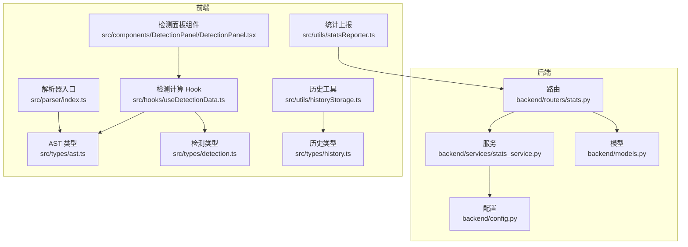
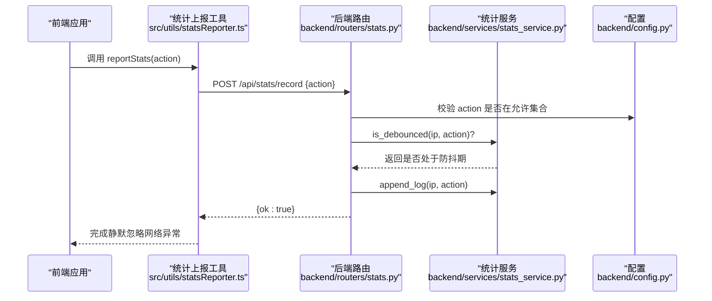
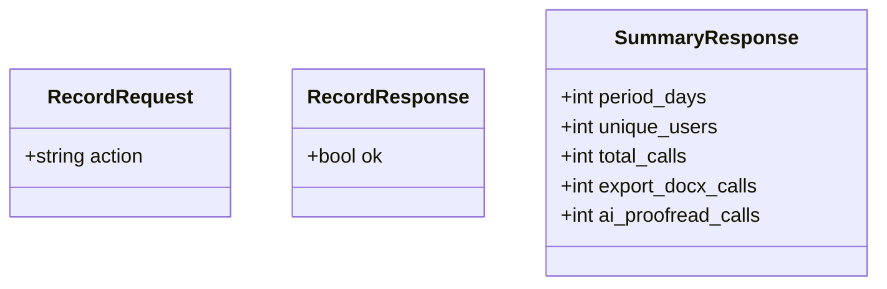
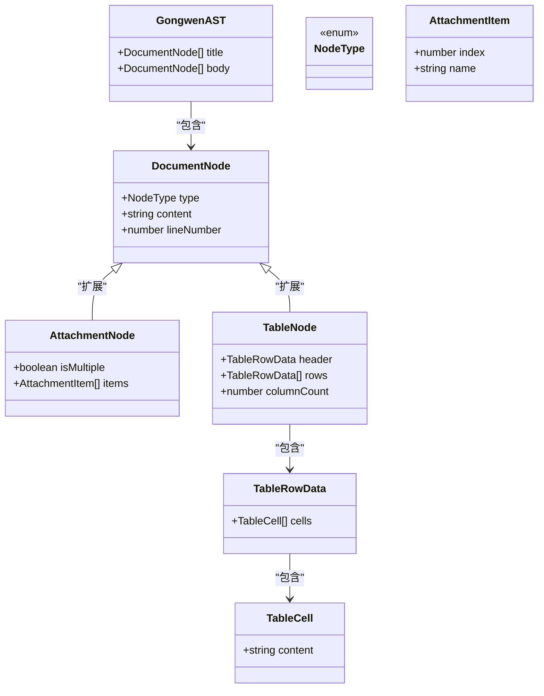
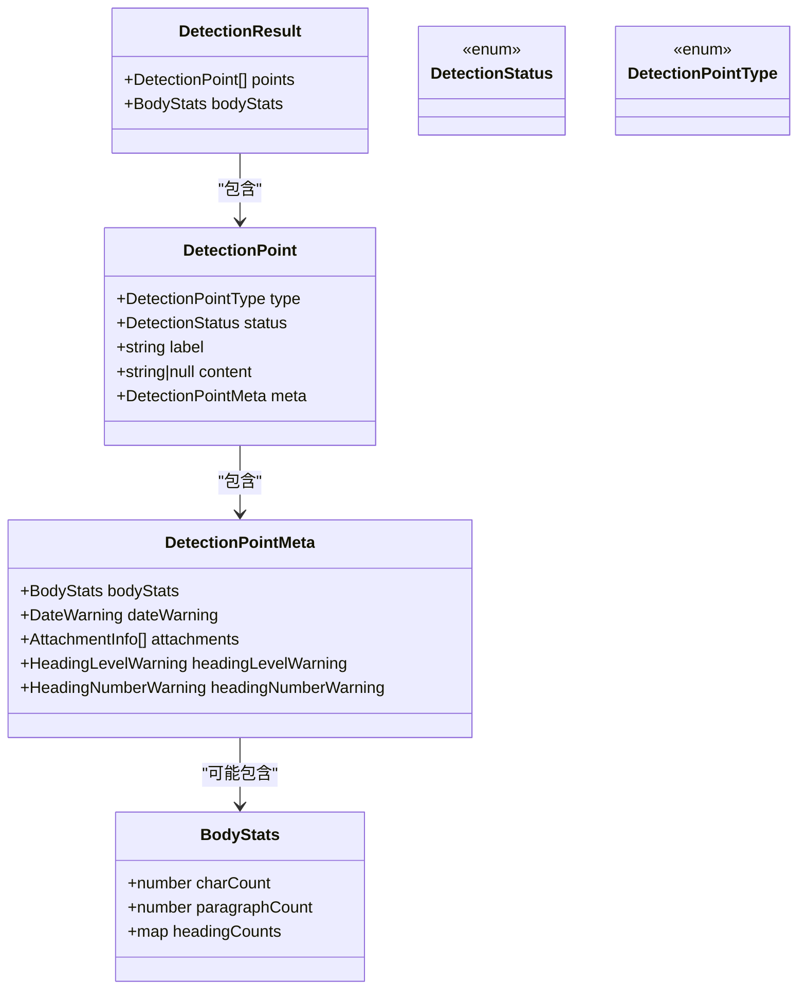
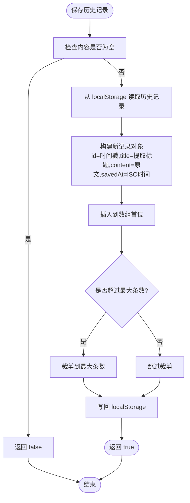
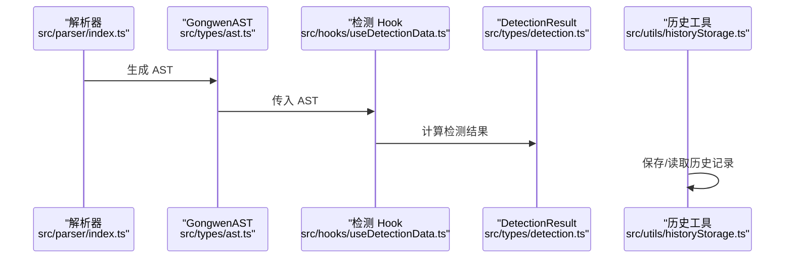
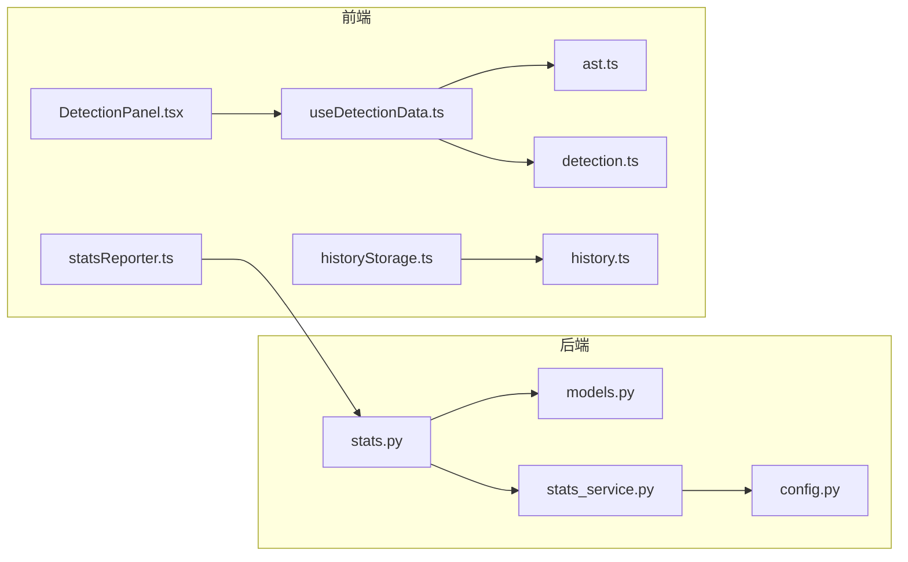

# 数据模型

<cite>
**本文引用的文件**
- [backend/models.py](file://backend/models.py)
- [backend/routers/stats.py](file://backend/routers/stats.py)
- [backend/services/stats_service.py](file://backend/services/stats_service.py)
- [backend/config.py](file://backend/config.py)
- [src/types/ast.ts](file://src/types/ast.ts)
- [src/types/detection.ts](file://src/types/detection.ts)
- [src/types/history.ts](file://src/types/history.ts)
- [src/utils/historyStorage.ts](file://src/utils/historyStorage.ts)
- [src/utils/statsReporter.ts](file://src/utils/statsReporter.ts)
- [src/constants/gongwen.ts](file://src/constants/gongwen.ts)
- [src/tabs/useDetectionData.ts](file://src/hooks/useDetectionData.ts)
- [src/components/DetectionPanel/DetectionPanel.tsx](file://src/components/DetectionPanel/DetectionPanel.tsx)
- [src/parser/index.ts](file://src/parser/index.ts)
</cite>

## 目录
1. [简介](#简介)
2. [项目结构](#项目结构)
3. [核心组件](#核心组件)
4. [架构总览](#架构总览)
5. [详细组件分析](#详细组件分析)
6. [依赖分析](#依赖分析)
7. [性能考虑](#性能考虑)
8. [故障排除指南](#故障排除指南)
9. [结论](#结论)
10. [附录](#附录)

## 简介
本文件为“公文写作与智能校对”系统的数据模型参考文档，覆盖后端统计服务与前端应用的核心数据类型与关系。重点包括：
- 后端统计服务的数据模型：RecordRequest、RecordResponse、SummaryResponse 的字段、类型与验证规则
- 前端应用的核心数据类型：GongwenAST 抽象语法树、DocumentNode 文档节点、DetectionResult 检测结果、HistoryItem 历史记录
- 数据模型之间的关系与转换规则
- 使用示例与序列化/反序列化方法
- 数据验证规则、默认值与错误处理机制
- 版本兼容性与迁移策略

## 项目结构
本项目采用前后端分离架构，数据模型主要分布在：
- 后端 Python（FastAPI + Pydantic）：统计服务的请求/响应模型与路由
- 前端 TypeScript：公文 AST、检测结果、历史记录等类型定义与工具函数

图表来源
- [backend/routers/stats.py:1-40](file://backend/routers/stats.py#L1-L40)
- [backend/services/stats_service.py:1-124](file://backend/services/stats_service.py#L1-L124)
- [backend/models.py:1-23](file://backend/models.py#L1-L23)
- [backend/config.py:1-16](file://backend/config.py#L1-L16)
- [src/types/ast.ts:1-81](file://src/types/ast.ts#L1-L81)
- [src/types/detection.ts:1-151](file://src/types/detection.ts#L1-L151)
- [src/types/history.ts:1-12](file://src/types/history.ts#L1-L12)
- [src/utils/historyStorage.ts:1-116](file://src/utils/historyStorage.ts#L1-L116)
- [src/utils/statsReporter.ts:1-29](file://src/utils/statsReporter.ts#L1-L29)
- [src/hooks/useDetectionData.ts:1-389](file://src/hooks/useDetectionData.ts#L1-L389)
- [src/components/DetectionPanel/DetectionPanel.tsx:437-463](file://src/components/DetectionPanel/DetectionPanel.tsx#L437-L463)
- [src/parser/index.ts:1-2](file://src/parser/index.ts#L1-L2)

章节来源
- [backend/routers/stats.py:1-40](file://backend/routers/stats.py#L1-L40)
- [backend/services/stats_service.py:1-124](file://backend/services/stats_service.py#L1-L124)
- [backend/models.py:1-23](file://backend/models.py#L1-L23)
- [backend/config.py:1-16](file://backend/config.py#L1-L16)
- [src/types/ast.ts:1-81](file://src/types/ast.ts#L1-L81)
- [src/types/detection.ts:1-151](file://src/types/detection.ts#L1-L151)
- [src/types/history.ts:1-12](file://src/types/history.ts#L1-L12)
- [src/utils/historyStorage.ts:1-116](file://src/utils/historyStorage.ts#L1-L116)
- [src/utils/statsReporter.ts:1-29](file://src/utils/statsReporter.ts#L1-L29)
- [src/hooks/useDetectionData.ts:1-389](file://src/hooks/useDetectionData.ts#L1-L389)
- [src/components/DetectionPanel/DetectionPanel.tsx:437-463](file://src/components/DetectionPanel/DetectionPanel.tsx#L437-L463)
- [src/parser/index.ts:1-2](file://src/parser/index.ts#L1-L2)

## 核心组件
本节聚焦两类核心数据模型：后端统计服务模型与前端应用模型。

- 后端统计服务模型
  - RecordRequest：请求体，包含 action 字段（字符串）
  - RecordResponse：响应体，包含 ok 字段（布尔，默认为 true）
  - SummaryResponse：统计查询响应，包含 period_days、unique_users、total_calls、export_docx_calls、ai_proofread_calls

- 前端应用模型
  - GongwenAST：公文 AST，包含 title（DocumentNode[]）、body（DocumentNode[]）
  - DocumentNode：文档节点，包含 type（枚举 NodeType）、content（字符串）、lineNumber（数字）
  - DetectionResult：检测结果，包含 points（DetectionPoint[]）、bodyStats（BodyStats）
  - HistoryRecord：历史记录，包含 id（字符串）、title（字符串）、content（字符串）、savedAt（ISO 字符串）

章节来源
- [backend/models.py:6-23](file://backend/models.py#L6-L23)
- [src/types/ast.ts:29-81](file://src/types/ast.ts#L29-L81)
- [src/types/detection.ts:128-134](file://src/types/detection.ts#L128-L134)
- [src/types/history.ts:1-12](file://src/types/history.ts#L1-L12)

## 架构总览
后端统计服务通过 FastAPI 路由接收前端上报的使用行为，进行防抖与日志写入，并提供统计汇总接口；前端通过工具函数上报动作，同时维护本地历史记录。

图表来源
- [src/utils/statsReporter.ts:16-28](file://src/utils/statsReporter.ts#L16-L28)
- [backend/routers/stats.py:12-32](file://backend/routers/stats.py#L12-L32)
- [backend/services/stats_service.py:15-54](file://backend/services/stats_service.py#L15-L54)
- [backend/config.py:14-15](file://backend/config.py#L14-L15)

## 详细组件分析

### 后端统计服务数据模型
- RecordRequest
  - 字段：action（字符串）
  - 验证规则：action 必须属于有效集合（由配置提供）
  - 序列化/反序列化：由 FastAPI 自动基于 Pydantic 模型完成
- RecordResponse
  - 字段：ok（布尔，默认 true）
  - 语义：表示记录是否成功
- SummaryResponse
  - 字段：period_days（整数）、unique_users（整数）、total_calls（整数）、export_docx_calls（整数）、ai_proofread_calls（整数）
  - 用途：返回指定天数范围内的统计结果

图表来源
- [backend/models.py:6-23](file://backend/models.py#L6-L23)

章节来源
- [backend/models.py:6-23](file://backend/models.py#L6-L23)
- [backend/routers/stats.py:12-39](file://backend/routers/stats.py#L12-L39)
- [backend/services/stats_service.py:57-123](file://backend/services/stats_service.py#L57-L123)
- [backend/config.py:14-15](file://backend/config.py#L14-L15)

### 前端应用数据模型

#### GongwenAST 与 DocumentNode
- GongwenAST
  - 字段：title（DocumentNode[]）、body（DocumentNode[]）
  - 语义：完整公文的 AST 结构
- DocumentNode
  - 字段：type（枚举 NodeType）、content（字符串）、lineNumber（数字）
  - 语义：单个文档节点，lineNumber 用于定位原始文本行号
- NodeType 枚举
  - 支持标题（一级至四级）、正文段落、主送机关、附件说明、发文机关署名、成文日期、备注、表格等

图表来源
- [src/types/ast.ts:29-81](file://src/types/ast.ts#L29-L81)

章节来源
- [src/types/ast.ts:1-81](file://src/types/ast.ts#L1-L81)

#### DetectionResult 与 DetectionPoint
- DetectionResult
  - 字段：points（DetectionPoint[]）、bodyStats（BodyStats）
  - 语义：检测结果集合，包含各检测点状态与正文统计
- DetectionPoint
  - 字段：type（DetectionPointType）、status（DetectionStatus）、label（字符串）、content（字符串或 null）、meta（DetectionPointMeta）
- DetectionPointType 与 DetectionStatus 枚举
  - 支持标题、主送机关、正文、署名、日期、附件等检测点类型；状态包括已检测到、缺失、警告
- DetectionPointMeta
  - 字段：bodyStats（正文统计）、dateWarning（日期警告）、attachments（附件信息，预留）、headingLevelWarning（标题层级警告）、headingNumberWarning（标题序号警告）
- BodyStats
  - 字段：charCount（字符数）、paragraphCount（段落数）、headingCounts（各级标题数量）

图表来源
- [src/types/detection.ts:114-134](file://src/types/detection.ts#L114-L134)

章节来源
- [src/types/detection.ts:1-151](file://src/types/detection.ts#L1-L151)

#### HistoryRecord 与历史工具
- HistoryRecord
  - 字段：id（字符串，时间戳）、title（字符串，标题）、content（字符串，完整内容）、savedAt（ISO 字符串，保存时间）
- 历史工具函数
  - getHistory：从 localStorage 读取历史记录数组
  - saveToHistory：保存内容到历史记录，限制最大条数
  - deleteHistoryItem：删除指定历史记录
  - clearHistory：清空所有历史记录
  - isContentExists：检查内容是否已存在
  - extractTitle：从内容中提取标题（多行标题合并为一行，截断至 30 字符）

图表来源
- [src/utils/historyStorage.ts:54-77](file://src/utils/historyStorage.ts#L54-L77)

章节来源
- [src/types/history.ts:1-12](file://src/types/history.ts#L1-L12)
- [src/utils/historyStorage.ts:1-116](file://src/utils/historyStorage.ts#L1-L116)

### 数据模型关系与转换规则
- 公文解析到 AST
  - 解析器根据匹配规则将输入文本转换为 GongwenAST，其中 DocumentNode 的 lineNumber 保留原始行号，便于后续定位与高亮
- AST 到检测结果
  - 检测 Hook 基于 AST 计算各检测点的状态与内容，生成 DetectionResult；正文统计信息由 BodyStats 提供
- 历史记录
  - 前端将编辑器内容保存为 HistoryRecord，标题通过 extractTitle 规则提取，避免重复内容
- 统计上报
  - 前端通过 reportStats 上报动作（导出 DOCX 或 AI 校对），后端进行防抖与日志写入，最终由服务聚合为 SummaryResponse

图表来源
- [src/parser/index.ts:1-2](file://src/parser/index.ts#L1-L2)
- [src/types/ast.ts:75-81](file://src/types/ast.ts#L75-L81)
- [src/hooks/useDetectionData.ts:343-389](file://src/hooks/useDetectionData.ts#L343-L389)
- [src/types/detection.ts:128-134](file://src/types/detection.ts#L128-L134)
- [src/utils/historyStorage.ts:38-77](file://src/utils/historyStorage.ts#L38-L77)

章节来源
- [src/parser/index.ts:1-2](file://src/parser/index.ts#L1-L2)
- [src/types/ast.ts:75-81](file://src/types/ast.ts#L75-L81)
- [src/hooks/useDetectionData.ts:343-389](file://src/hooks/useDetectionData.ts#L343-L389)
- [src/types/detection.ts:128-134](file://src/types/detection.ts#L128-L134)
- [src/utils/historyStorage.ts:38-77](file://src/utils/historyStorage.ts#L38-L77)

## 依赖分析
- 后端
  - 路由依赖模型与服务；服务依赖配置常量（日志路径、防抖间隔、有效动作集合）
- 前端
  - 检测 Hook 依赖 AST 与检测类型；检测面板组件消费检测结果；历史工具依赖历史类型；统计上报工具依赖后端路由

图表来源
- [backend/routers/stats.py:3-7](file://backend/routers/stats.py#L3-L7)
- [backend/services/stats_service.py:8](file://backend/services/stats_service.py#L8)
- [backend/config.py:6-15](file://backend/config.py#L6-L15)
- [src/hooks/useDetectionData.ts:2-14](file://src/hooks/useDetectionData.ts#L2-L14)
- [src/components/DetectionPanel/DetectionPanel.tsx:440](file://src/components/DetectionPanel/DetectionPanel.tsx#L440)
- [src/utils/historyStorage.ts:1](file://src/utils/historyStorage.ts#L1)
- [src/utils/statsReporter.ts:16-28](file://src/utils/statsReporter.ts#L16-L28)

章节来源
- [backend/routers/stats.py:3-7](file://backend/routers/stats.py#L3-L7)
- [backend/services/stats_service.py:8](file://backend/services/stats_service.py#L8)
- [backend/config.py:6-15](file://backend/config.py#L6-L15)
- [src/hooks/useDetectionData.ts:2-14](file://src/hooks/useDetectionData.ts#L2-L14)
- [src/components/DetectionPanel/DetectionPanel.tsx:440](file://src/components/DetectionPanel/DetectionPanel.tsx#L440)
- [src/utils/historyStorage.ts:1](file://src/utils/historyStorage.ts#L1)
- [src/utils/statsReporter.ts:16-28](file://src/utils/statsReporter.ts#L16-L28)

## 性能考虑
- 后端防抖
  - 使用内存缓存记录 IP 与 action 的最近时间戳，避免短时间内的重复上报；定期清理过期缓存键，降低内存占用
- 日志写入
  - 异步写入日志文件，避免阻塞请求；按天/周统计时，按需过滤时间范围，减少 IO
- 前端历史记录
  - 限制最大条数，避免 localStorage 过大；标题提取与字数统计为轻量操作
- 检测计算
  - 基于 AST 的线性扫描与简单规则判断，复杂度与节点数量线性相关；可通过分块与增量更新优化

## 故障排除指南
- 后端统计上报无效
  - 检查 action 是否在有效集合内；确认请求头中是否包含真实 IP（x-real-ip 或 x-forwarded-for）
  - 查看日志文件路径与权限，确保可写
- 统计结果为 0
  - 检查 days 参数与日志文件是否存在；确认日志格式与时间戳格式正确
- 前端历史记录异常
  - 检查 localStorage 是否可用；确认内容非空且未超过最大条数
- 检测结果不符合预期
  - 检查 AST 解析是否正确；确认节点类型映射与检测规则是否匹配

章节来源
- [backend/routers/stats.py:15-24](file://backend/routers/stats.py#L15-L24)
- [backend/services/stats_service.py:76-84](file://backend/services/stats_service.py#L76-L84)
- [src/utils/historyStorage.ts:38-47](file://src/utils/historyStorage.ts#L38-L47)
- [src/hooks/useDetectionData.ts:343-389](file://src/hooks/useDetectionData.ts#L343-L389)

## 结论
本文档梳理了后端统计服务与前端应用的核心数据模型及其关系，明确了字段定义、类型约束、验证规则与错误处理机制。通过合理的防抖、日志与历史管理策略，系统在保证性能的同时提供了可靠的统计与使用追踪能力。后续可在检测规则扩展、AST 解析优化与历史记录持久化方面继续演进。

## 附录

### 使用示例与序列化/反序列化
- 后端统计上报（前端）
  - 调用上报工具函数，传入动作标识（如导出 DOCX 或 AI 校对），内部通过 fetch POST 到后端路由
  - 示例路径：[src/utils/statsReporter.ts:16-28](file://src/utils/statsReporter.ts#L16-L28)
- 后端路由与模型
  - POST /api/stats/record 接收 RecordRequest，返回 RecordResponse
  - GET /api/stats/summary 查询统计，返回 SummaryResponse
  - 示例路径：
    - [backend/routers/stats.py:12-39](file://backend/routers/stats.py#L12-L39)
    - [backend/models.py:6-23](file://backend/models.py#L6-L23)
- 前端历史记录
  - 保存历史：调用保存函数，内部序列化为 JSON 并写入 localStorage
  - 读取历史：从 localStorage 读取并反序列化为数组
  - 示例路径：
    - [src/utils/historyStorage.ts:54-77](file://src/utils/historyStorage.ts#L54-L77)
    - [src/utils/historyStorage.ts:38-47](file://src/utils/historyStorage.ts#L38-L47)

### 数据验证规则与默认值
- 后端
  - action 必须在有效集合内；RecordResponse.ok 默认为 true
  - 示例路径：
    - [backend/routers/stats.py:15-17](file://backend/routers/stats.py#L15-L17)
    - [backend/models.py:13](file://backend/models.py#L13)
- 前端
  - GongwenAST 与 DocumentNode 由类型系统约束；HistoryRecord 字段均为必填或有明确默认行为
  - 示例路径：
    - [src/types/ast.ts:75-81](file://src/types/ast.ts#L75-L81)
    - [src/types/history.ts:2-11](file://src/types/history.ts#L2-L11)

### 版本兼容性与迁移策略
- 前端类型
  - 通过 TypeScript 接口与枚举定义强类型约束，新增字段建议采用可选属性或默认值，避免破坏既有逻辑
  - 历史记录结构稳定，localStorage 存储无需版本号，但未来扩展时可引入版本字段并提供迁移函数
- 后端模型
  - Pydantic 模型支持字段可选与默认值，新增字段建议提供默认值并保持向后兼容
  - 统计字段扩展时，建议在服务层聚合函数中提供默认值，保证旧日志也能被正确统计
- 建议
  - 在关键变更前增加版本号字段与迁移脚本，逐步推进升级
  - 对外暴露的 API 响应模型保持稳定，新增字段放在末尾并标记为可选