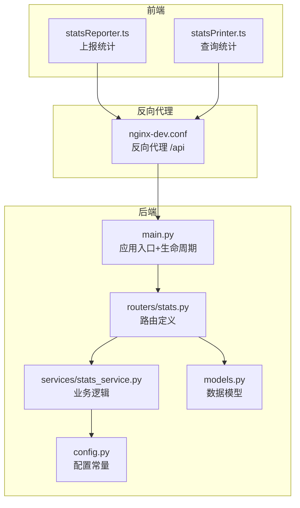
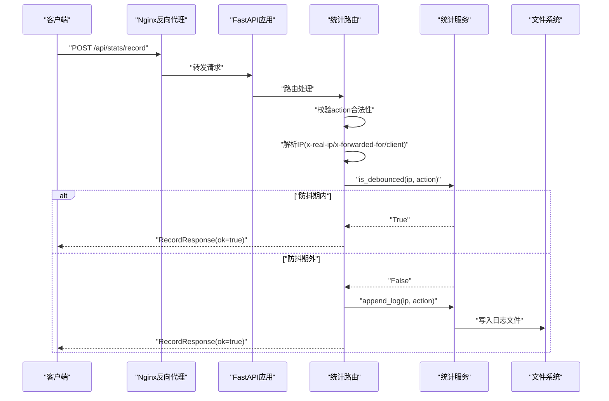
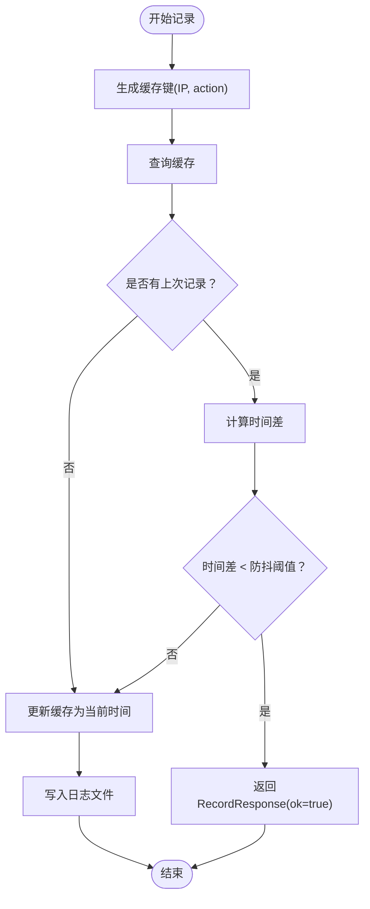
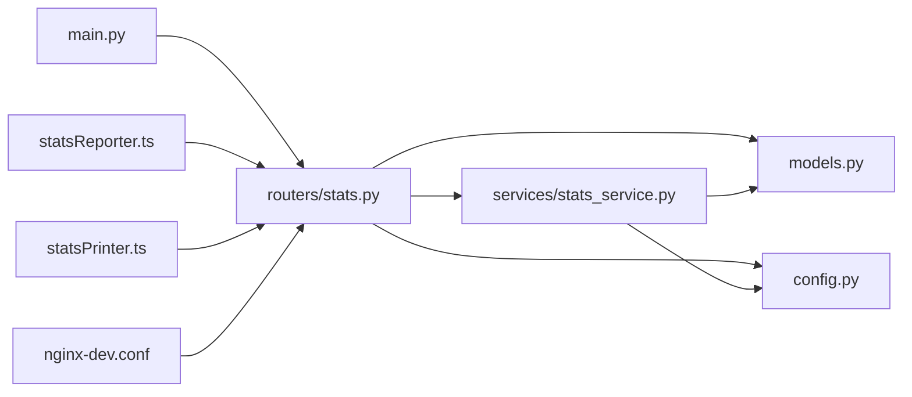

# 统计API

<cite>
**本文档引用的文件**
- [backend/main.py](file://backend/main.py)
- [backend/routers/stats.py](file://backend/routers/stats.py)
- [backend/services/stats_service.py](file://backend/services/stats_service.py)
- [backend/models.py](file://backend/models.py)
- [backend/config.py](file://backend/config.py)
- [src/utils/statsReporter.ts](file://src/utils/statsReporter.ts)
- [src/utils/statsPrinter.ts](file://src/utils/statsPrinter.ts)
- [gongwen-docker/docker-compose-dev.yml](file://gongwen-docker/docker-compose-dev.yml)
- [gongwen-docker/nginx-dev.conf](file://gongwen-docker/nginx-dev.conf)
- [backend/Dockerfile](file://backend/Dockerfile)
</cite>

## 目录
1. [简介](#简介)
2. [项目结构](#项目结构)
3. [核心组件](#核心组件)
4. [架构总览](#架构总览)
5. [详细组件分析](#详细组件分析)
6. [依赖关系分析](#依赖关系分析)
7. [性能考虑](#性能考虑)
8. [故障排除指南](#故障排除指南)
9. [结论](#结论)
10. [附录](#附录)

## 简介
本文件为统计API的完整技术文档，涵盖后端FastAPI统计服务的所有REST API端点，包括：
- POST /api/stats/record：记录用户行为
- GET /api/stats/summary：查询统计数据

文档详细说明每个端点的HTTP方法、URL模式、请求参数、响应格式和错误码；解释RecordRequest和SummaryResponse的数据模型结构；说明防抖机制的工作原理和IP地址获取逻辑；提供完整的请求/响应示例；包含API使用示例、客户端集成指南和最佳实践建议。

## 项目结构
后端采用FastAPI框架，按功能模块组织：
- 应用入口与生命周期管理：backend/main.py
- 路由定义：backend/routers/stats.py
- 业务逻辑：backend/services/stats_service.py
- 数据模型：backend/models.py
- 配置常量：backend/config.py
- 前端统计上报与查询：src/utils/statsReporter.ts、src/utils/statsPrinter.ts
- 部署配置：gongwen-docker/nginx-dev.conf、gongwen-docker/docker-compose-dev.yml、backend/Dockerfile

**图表来源**
- [backend/main.py:1-38](file://backend/main.py#L1-L38)
- [backend/routers/stats.py:1-40](file://backend/routers/stats.py#L1-L40)
- [backend/services/stats_service.py:1-124](file://backend/services/stats_service.py#L1-L124)
- [backend/models.py:1-23](file://backend/models.py#L1-L23)
- [backend/config.py:1-16](file://backend/config.py#L1-L16)
- [gongwen-docker/nginx-dev.conf:55-64](file://gongwen-docker/nginx-dev.conf#L55-L64)

**章节来源**
- [backend/main.py:1-38](file://backend/main.py#L1-L38)
- [backend/routers/stats.py:1-40](file://backend/routers/stats.py#L1-L40)
- [backend/services/stats_service.py:1-124](file://backend/services/stats_service.py#L1-L124)
- [backend/models.py:1-23](file://backend/models.py#L1-L23)
- [backend/config.py:1-16](file://backend/config.py#L1-L16)
- [gongwen-docker/nginx-dev.conf:55-64](file://gongwen-docker/nginx-dev.conf#L55-L64)

## 核心组件
- 应用入口与生命周期：注册路由、启动后台清理任务、健康检查端点
- 路由层：定义统计API的两个端点，负责参数校验、IP解析和调用服务层
- 服务层：实现防抖缓存、日志写入、统计聚合等核心逻辑
- 数据模型：定义请求/响应的数据结构与默认值
- 配置层：集中管理日志路径、防抖间隔、清理周期、有效动作集合

**章节来源**
- [backend/main.py:12-38](file://backend/main.py#L12-L38)
- [backend/routers/stats.py:12-40](file://backend/routers/stats.py#L12-L40)
- [backend/services/stats_service.py:15-124](file://backend/services/stats_service.py#L15-L124)
- [backend/models.py:6-23](file://backend/models.py#L6-L23)
- [backend/config.py:5-16](file://backend/config.py#L5-L16)

## 架构总览
系统通过Nginx反向代理将前端对/api/stats/*的请求转发至统计服务。统计服务内部维护防抖缓存，避免重复记录同一IP在短时间内触发相同动作。统计数据基于文本日志文件进行聚合，支持按天数范围过滤。

**图表来源**
- [backend/routers/stats.py:12-32](file://backend/routers/stats.py#L12-L32)
- [backend/services/stats_service.py:15-55](file://backend/services/stats_service.py#L15-L55)
- [gongwen-docker/nginx-dev.conf:59-61](file://gongwen-docker/nginx-dev.conf#L59-L61)

## 详细组件分析

### API端点定义与行为

#### POST /api/stats/record
- HTTP方法：POST
- URL模式：/api/stats/record
- 请求体：RecordRequest
- 响应体：RecordResponse
- 功能：记录用户行为，支持防抖去重

请求参数与验证：
- action: 字符串，必须为"export_docx"或"ai_proofread"之一，否则返回400错误
- IP地址获取顺序：优先使用x-real-ip，其次使用x-forwarded-for首段，最后回退到client.host，若均不可得则为"unknown"

防抖机制：
- 缓存键：(IP, action)
- 防抖窗口：10秒
- 超时清理：每600秒执行一次缓存清理，移除超过60秒未访问的条目

响应格式：
- ok: 布尔值，默认true

错误码：
- 400：action非法
- 5xx：服务异常（由FastAPI默认处理）

**章节来源**
- [backend/routers/stats.py:12-32](file://backend/routers/stats.py#L12-L32)
- [backend/services/stats_service.py:15-42](file://backend/services/stats_service.py#L15-L42)
- [backend/config.py:8-15](file://backend/config.py#L8-L15)

#### GET /api/stats/summary
- HTTP方法：GET
- URL模式：/api/stats/summary
- 查询参数：days（整数，>=0，默认7）
- 响应体：SummaryResponse
- 功能：按天数范围聚合统计数据

统计维度：
- period_days：查询的天数范围
- unique_users：独立用户数（按IP去重）
- total_calls：总调用次数
- export_docx_calls：导出Word调用次数
- ai_proofread_calls：AI校对调用次数

过滤逻辑：
- 当days>0时，仅统计距离当前时间不超过days的记录
- 忽略格式不正确的日志行
- 仅统计合法action的记录

响应格式：
- 包含上述五个字段的JSON对象

**章节来源**
- [backend/routers/stats.py:35-39](file://backend/routers/stats.py#L35-L39)
- [backend/services/stats_service.py:57-124](file://backend/services/stats_service.py#L57-L124)
- [backend/models.py:16-23](file://backend/models.py#L16-L23)

### 数据模型定义

#### RecordRequest
- 字段：action（字符串）
- 验证规则：必须属于配置中的有效动作集合
- 默认值：无

#### RecordResponse
- 字段：ok（布尔值，默认true）
- 用途：确认记录已处理

#### SummaryResponse
- 字段：
  - period_days（整数）
  - unique_users（整数）
  - total_calls（整数）
  - export_docx_calls（整数）
  - ai_proofread_calls（整数）

**章节来源**
- [backend/models.py:6-23](file://backend/models.py#L6-L23)
- [backend/config.py:14-15](file://backend/config.py#L14-L15)

### 防抖机制工作原理
防抖缓存采用内存字典存储，键为(IP, action)元组，值为最近一次记录的时间戳。每次记录前先检查当前时间与上次记录时间差是否小于防抖阈值（默认10秒），若是则直接返回成功响应而不写入日志；否则更新缓存并写入日志。

后台清理任务每10分钟运行一次，移除超过60秒未访问的缓存项，防止内存泄漏。

**图表来源**
- [backend/services/stats_service.py:15-55](file://backend/services/stats_service.py#L15-L55)

**章节来源**
- [backend/services/stats_service.py:15-55](file://backend/services/stats_service.py#L15-L55)

### IP地址获取逻辑
Nginx在反向代理时设置以下头部：
- X-Real-IP：真实客户端IP
- X-Forwarded-For：代理链路IP列表，取第一个作为客户端IP
- Host、X-Forwarded-Proto：标准代理头部

后端优先级解析：
1. 读取x-real-ip
2. 若不存在，读取x-forwarded-for并取第一个IP
3. 若仍不存在，使用request.client.host
4. 若仍不可得，标记为"unknown"

该策略确保在多层代理环境下正确识别用户真实IP。

**章节来源**
- [gongwen-docker/nginx-dev.conf:59-61](file://gongwen-docker/nginx-dev.conf#L59-L61)
- [backend/routers/stats.py:19-24](file://backend/routers/stats.py#L19-L24)

### 客户端集成指南

#### 前端上报统计
- 使用reportStats(action)函数上报，支持两种动作："export_docx"和"ai_proofread"
- 采用fire-and-forget模式，不等待响应，失败静默忽略
- 在功能触发处调用，不影响主流程

#### 前端查询统计
- 使用printStatsOverview()函数打印多时间段统计概览
- 自动查询最近7天、30天、365天和全部记录
- 输出格式化到浏览器控制台，便于调试和监控

**章节来源**
- [src/utils/statsReporter.ts:16-28](file://src/utils/statsReporter.ts#L16-L28)
- [src/utils/statsPrinter.ts:18-53](file://src/utils/statsPrinter.ts#L18-L53)

## 依赖关系分析

**图表来源**
- [backend/main.py:8-31](file://backend/main.py#L8-L31)
- [backend/routers/stats.py:5-7](file://backend/routers/stats.py#L5-L7)
- [backend/services/stats_service.py:8](file://backend/services/stats_service.py#L8)
- [src/utils/statsReporter.ts:18-21](file://src/utils/statsReporter.ts#L18-L21)
- [src/utils/statsPrinter.ts:32](file://src/utils/statsPrinter.ts#L32)
- [gongwen-docker/nginx-dev.conf:55-64](file://gongwen-docker/nginx-dev.conf#L55-L64)

**章节来源**
- [backend/main.py:8-31](file://backend/main.py#L8-L31)
- [backend/routers/stats.py:5-7](file://backend/routers/stats.py#L5-L7)
- [backend/services/stats_service.py:8](file://backend/services/stats_service.py#L8)
- [src/utils/statsReporter.ts:18-21](file://src/utils/statsReporter.ts#L18-L21)
- [src/utils/statsPrinter.ts:32](file://src/utils/statsPrinter.ts#L32)
- [gongwen-docker/nginx-dev.conf:55-64](file://gongwen-docker/nginx-dev.conf#L55-L64)

## 性能考虑
- 防抖缓存：内存中O(1)查询，降低重复记录的IO开销
- 后台清理：定期清理过期缓存，避免内存无限增长
- 日志聚合：按需读取文件并逐行解析，适合中小规模数据
- 反向代理：Nginx提供连接超时控制，保障上游稳定性

优化建议：
- 对于高并发场景，可考虑将日志写入改为异步队列或数据库
- 统计查询可引入索引或预聚合表，减少大文件扫描成本
- 防抖阈值可根据业务需求调整，平衡去重效果与实时性

[本节为通用性能讨论，无需特定文件来源]

## 故障排除指南
常见问题与解决方案：
- 400错误：action非法
  - 确认action为"export_docx"或"ai_proofread"
  - 检查客户端上报逻辑是否正确
- IP显示为"unknown"
  - 检查Nginx反向代理是否正确设置X-Real-IP和X-Forwarded-For
  - 确认客户端直连或代理链路是否传递必要头部
- 统计为0
  - 检查日志文件是否存在且可读
  - 确认days参数是否过小导致过滤掉所有记录
- 防抖无效
  - 检查防抖阈值配置（默认10秒）
  - 确认同一IP在短时间内重复触发相同动作

**章节来源**
- [backend/routers/stats.py:16-17](file://backend/routers/stats.py#L16-L17)
- [gongwen-docker/nginx-dev.conf:59-61](file://gongwen-docker/nginx-dev.conf#L59-L61)
- [backend/services/stats_service.py:77-84](file://backend/services/stats_service.py#L77-L84)

## 结论
统计API提供了简洁高效的用户行为记录与查询能力。通过防抖机制避免重复统计，通过Nginx反向代理确保IP准确性，并以文本日志形式实现简单可靠的统计聚合。前端工具函数提供了无缝的集成体验。建议在生产环境中结合实际流量规模评估是否需要引入更高级的存储与查询方案。

[本节为总结性内容，无需特定文件来源]

## 附录

### API使用示例

#### 成功示例
- POST /api/stats/record
  - 请求体：{"action":"export_docx"}
  - 响应体：{"ok":true}

- GET /api/stats/summary?days=7
  - 响应体：{"period_days":7,"unique_users":120,"total_calls":345,"export_docx_calls":210,"ai_proofread_calls":135}

#### 错误示例
- POST /api/stats/record（action非法）
  - 请求体：{"action":"invalid_action"}
  - 响应：HTTP 400，详情："invalid action"

- GET /api/stats/summary（days参数非法）
  - 请求：GET /api/stats/summary?days=-1
  - 响应：HTTP 422（由FastAPI参数校验产生）

**章节来源**
- [backend/routers/stats.py:16-17](file://backend/routers/stats.py#L16-L17)
- [backend/routers/stats.py:36](file://backend/routers/stats.py#L36)

### 部署与配置要点
- Nginx反向代理：将/api/stats/*转发至统计服务容器
- 环境变量：STATS_LOG_PATH（默认/data/stats.log）
- 数据卷：挂载/data目录实现日志持久化
- 健康检查：/api/health用于容器健康状态检测

**章节来源**
- [gongwen-docker/nginx-dev.conf:55-64](file://gongwen-docker/nginx-dev.conf#L55-L64)
- [backend/config.py:6](file://backend/config.py#L6)
- [gongwen-docker/docker-compose-dev.yml:34-36](file://gongwen-docker/docker-compose-dev.yml#L34-L36)
- [backend/main.py:34-37](file://backend/main.py#L34-L37)