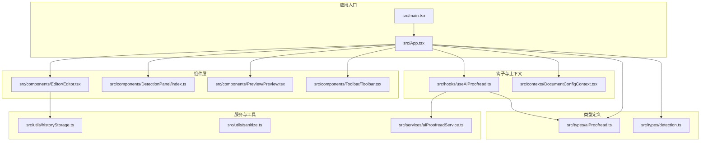
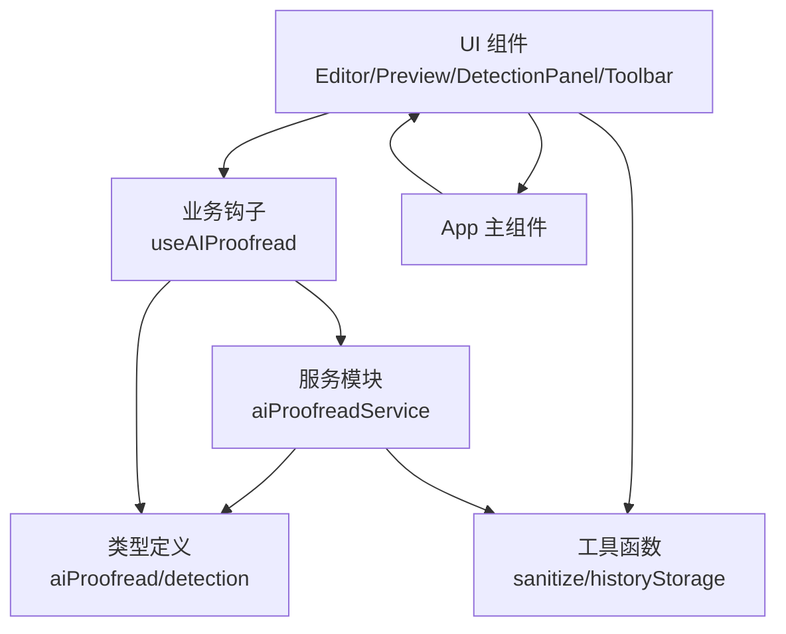
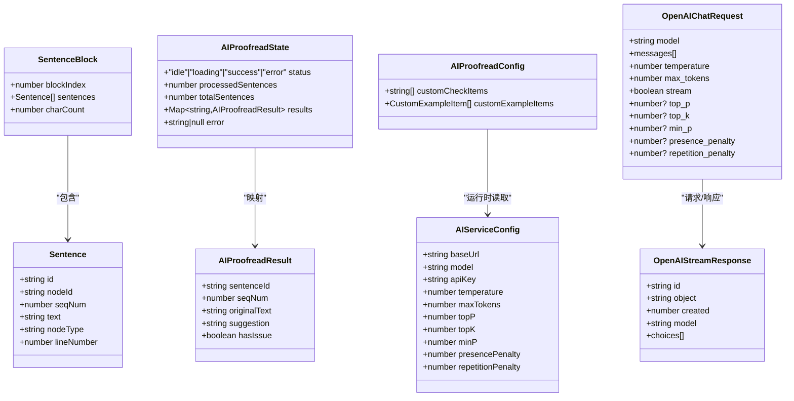
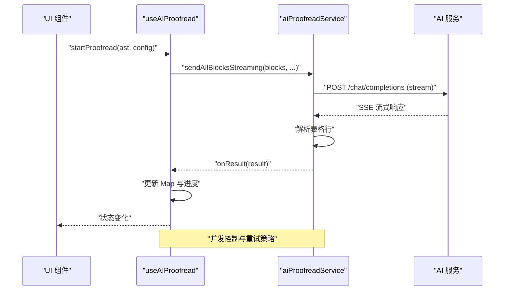
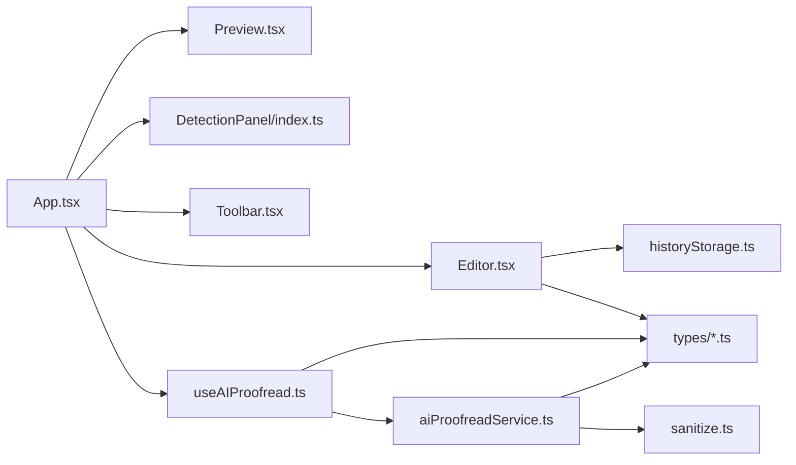

# 代码规范

<cite>
**本文档引用的文件**
- [eslint.config.js](file://eslint.config.js)
- [package.json](file://package.json)
- [tsconfig.json](file://tsconfig.json)
- [tsconfig.app.json](file://tsconfig.app.json)
- [vite.config.ts](file://vite.config.ts)
- [src/main.tsx](file://src/main.tsx)
- [src/App.tsx](file://src/App.tsx)
- [src/components/Editor/Editor.tsx](file://src/components/Editor/Editor.tsx)
- [src/hooks/useAIProofread.ts](file://src/hooks/useAIProofread.ts)
- [src/services/aiProofreadService.ts](file://src/services/aiProofreadService.ts)
- [src/utils/sanitize.ts](file://src/utils/sanitize.ts)
- [src/utils/historyStorage.ts](file://src/utils/historyStorage.ts)
- [src/types/aiProofread.ts](file://src/types/aiProofread.ts)
- [src/types/detection.ts](file://src/types/detection.ts)
</cite>

## 目录
1. [简介](#简介)
2. [项目结构](#项目结构)
3. [核心组件](#核心组件)
4. [架构总览](#架构总览)
5. [详细组件分析](#详细组件分析)
6. [依赖关系分析](#依赖关系分析)
7. [性能考虑](#性能考虑)
8. [故障排查指南](#故障排查指南)
9. [结论](#结论)
10. [附录](#附录)

## 简介
本文件旨在为本项目建立一套系统化、可落地的 TypeScript/React 代码规范，涵盖类型定义与接口设计、ESLint 规则配置、组件编写规范、文件命名与目录组织、模块导入导出、注释与 JSDoc、错误处理与异步编程、内存管理、代码审查清单、重构指导与性能优化建议等。规范以现有仓库实现为依据，结合最佳实践，帮助团队统一风格、提升质量与可维护性。

## 项目结构
项目采用前端 Vite + React + TypeScript 技术栈，源代码位于 src 目录，按功能域划分组件、类型、工具、服务与钩子等模块。构建目标兼容 Chrome 78 内核，严格启用 TypeScript 严格模式与 ESLint 推荐规则。

图表来源
- [src/main.tsx:1-14](file://src/main.tsx#L1-L14)
- [src/App.tsx:1-308](file://src/App.tsx#L1-L308)
- [src/components/Editor/Editor.tsx:1-253](file://src/components/Editor/Editor.tsx#L1-L253)
- [src/hooks/useAIProofread.ts:1-221](file://src/hooks/useAIProofread.ts#L1-L221)
- [src/services/aiProofreadService.ts:1-516](file://src/services/aiProofreadService.ts#L1-L516)
- [src/utils/sanitize.ts:1-180](file://src/utils/sanitize.ts#L1-L180)
- [src/utils/historyStorage.ts:1-116](file://src/utils/historyStorage.ts#L1-L116)
- [src/types/aiProofread.ts:1-201](file://src/types/aiProofread.ts#L1-L201)
- [src/types/detection.ts:1-151](file://src/types/detection.ts#L1-L151)

章节来源
- [src/main.tsx:1-14](file://src/main.tsx#L1-L14)
- [src/App.tsx:1-308](file://src/App.tsx#L1-L308)
- [vite.config.ts:1-78](file://vite.config.ts#L1-L78)

## 核心组件
- 应用入口与渲染：通过 StrictMode 包裹，注入 DocumentConfigProvider，挂载 App。
- 应用主组件：集中管理文本、历史记录、AI 配置与状态，协调 Editor、Preview、DetectionPanel、Toolbar 等子组件。
- 编辑器组件：负责文本输入、文件拖拽导入、快捷键、历史记录交互与保存提示。
- AI 校对 Hook：封装状态机、分句分块、并发流式请求与结果聚合。
- AI 校对服务：构建提示词、发送流式请求、解析 SSE、并发调度与重试。
- 工具函数：文本净化、历史记录存取、统计与报告等。

章节来源
- [src/main.tsx:1-14](file://src/main.tsx#L1-L14)
- [src/App.tsx:1-308](file://src/App.tsx#L1-L308)
- [src/components/Editor/Editor.tsx:1-253](file://src/components/Editor/Editor.tsx#L1-L253)
- [src/hooks/useAIProofread.ts:1-221](file://src/hooks/useAIProofread.ts#L1-L221)
- [src/services/aiProofreadService.ts:1-516](file://src/services/aiProofreadService.ts#L1-L516)
- [src/utils/sanitize.ts:1-180](file://src/utils/sanitize.ts#L1-L180)
- [src/utils/historyStorage.ts:1-116](file://src/utils/historyStorage.ts#L1-L116)

## 架构总览
整体采用“组件驱动 + 钩子状态 + 服务层”的分层架构。UI 层通过 Props 与回调传递数据；业务逻辑集中在 Hook 与 Service 中；类型定义贯穿各层，保证编译期安全。

图表来源
- [src/App.tsx:1-308](file://src/App.tsx#L1-L308)
- [src/hooks/useAIProofread.ts:1-221](file://src/hooks/useAIProofread.ts#L1-L221)
- [src/services/aiProofreadService.ts:1-516](file://src/services/aiProofreadService.ts#L1-L516)
- [src/utils/sanitize.ts:1-180](file://src/utils/sanitize.ts#L1-L180)
- [src/utils/historyStorage.ts:1-116](file://src/utils/historyStorage.ts#L1-L116)
- [src/types/aiProofread.ts:1-201](file://src/types/aiProofread.ts#L1-L201)
- [src/types/detection.ts:1-151](file://src/types/detection.ts#L1-L151)

## 详细组件分析

### 类型定义与接口设计
- 设计原则
  - 使用明确的接口与枚举表达领域概念，避免字符串魔法值。
  - 优先使用只读结构与 Map/Array 等集合类型，减少可变状态。
  - 将对外可见配置与内部配置分离，通过组合或扩展接口体现。
- 关键类型
  - AI 校对：Sentence、SentenceBlock、AIProofreadResult、AIProofreadState、AIProofreadConfig、AIServiceConfig、OpenAIChatRequest、OpenAIStreamResponse。
  - 检测：DetectionStatus、DetectionPointType、DateWarning、HeadingLevelIssue、DetectionPoint、DetectionResult。
- 泛型与工具
  - 通过接口扩展实现“完整配置”与“基础配置”的差异，避免污染外部 API。
  - 使用 Map 作为结果容器，确保 O(1) 查找与去重。

图表来源
- [src/types/aiProofread.ts:1-201](file://src/types/aiProofread.ts#L1-L201)

章节来源
- [src/types/aiProofread.ts:1-201](file://src/types/aiProofread.ts#L1-L201)
- [src/types/detection.ts:1-151](file://src/types/detection.ts#L1-L151)

### ESLint 规则配置与自定义规则
- 配置现状
  - 使用推荐规则集：@eslint/js、typescript-eslint、react-hooks、react-refresh。
  - 作用范围：仅对 ts/tsx 文件生效。
  - 语言选项：ECMAScript 2020，浏览器全局。
- 建议
  - 在现有基础上增加自定义规则：禁用隐式 any、禁止未使用的局部变量与参数、禁止 switch 穿透、限制副作用导入等。
  - 为测试文件单独配置规则集，允许必要的断言与模拟。
  - 通过 overrides 为不同目录设置差异化规则。

章节来源
- [eslint.config.js:1-24](file://eslint.config.js#L1-L24)
- [package.json:1-39](file://package.json#L1-L39)

### React 组件编写规范
- 函数组件设计
  - 优先使用函数组件与 Hooks，避免类组件。
  - Props 使用接口显式声明，必要时提供默认值或受控/非受控切换。
  - 将复杂逻辑下沉至 Hook，保持组件职责单一。
- Hook 使用最佳实践
  - 将依赖数组与 useCallback/useMemo 的使用规范化，避免闭包陷阱与重复渲染。
  - 在 Hook 内部进行错误边界与降级处理，向上抛出可读错误。
- Props 类型定义
  - 所有回调函数使用类型签名，避免 any。
  - 可选属性与必填属性明确区分，避免可选链与空值合并（兼容 Chrome 78）。

章节来源
- [src/components/Editor/Editor.tsx:1-253](file://src/components/Editor/Editor.tsx#L1-L253)
- [src/hooks/useAIProofread.ts:1-221](file://src/hooks/useAIProofread.ts#L1-L221)
- [src/App.tsx:1-308](file://src/App.tsx#L1-L308)

### 文件命名约定、目录结构与模块导入导出
- 命名约定
  - 组件文件：PascalCase.tsx（如 Editor.tsx）。
  - 工具函数：camelCase.ts（如 sanitize.ts、historyStorage.ts）。
  - 类型文件：camelCase.ts（如 aiProofread.ts、detection.ts）。
- 目录结构
  - 按功能域组织：components、hooks、services、utils、types、contexts。
  - 组件目录内包含样式文件与 index.ts（如 DetectionPanel/index.ts）。
- 导入导出
  - 优先使用绝对路径与明确的相对路径。
  - 避免循环依赖，必要时拆分共享逻辑至独立模块。
  - 为常用模块提供 index.ts 作为聚合出口，简化上层导入。

章节来源
- [src/components/Editor/Editor.tsx:1-253](file://src/components/Editor/Editor.tsx#L1-L253)
- [src/hooks/useAIProofread.ts:1-221](file://src/hooks/useAIProofread.ts#L1-L221)
- [src/utils/sanitize.ts:1-180](file://src/utils/sanitize.ts#L1-L180)
- [src/utils/historyStorage.ts:1-116](file://src/utils/historyStorage.ts#L1-L116)
- [src/types/aiProofread.ts:1-201](file://src/types/aiProofread.ts#L1-L201)
- [src/types/detection.ts:1-151](file://src/types/detection.ts#L1-L151)

### 代码注释标准与 JSDoc 要求
- 注释规范
  - 公共 API 与复杂逻辑必须提供注释，说明意图、参数、返回值与副作用。
  - 使用 JSDoc 标准注解：@param、@returns、@throws、@example。
  - 对跨浏览器兼容性（如不使用可选链）进行说明。
- 示例
  - 组件 Props、Hook 返回值、服务函数的输入输出与约束。

章节来源
- [src/hooks/useAIProofread.ts:1-221](file://src/hooks/useAIProofread.ts#L1-L221)
- [src/services/aiProofreadService.ts:1-516](file://src/services/aiProofreadService.ts#L1-L516)
- [src/utils/sanitize.ts:1-180](file://src/utils/sanitize.ts#L1-L180)

### 错误处理模式、异步编程与内存管理
- 错误处理
  - 对外暴露统一的错误消息，避免泄露内部细节。
  - 在 Hook 与 Service 中捕获异常并更新状态，必要时提供重试机制。
- 异步编程
  - 使用 Promise/async-await，避免深层回调。
  - 流式处理使用 ReadableStream 与 TextDecoder，及时刷新解析器状态。
- 内存管理
  - 及时清理定时器、事件监听器与订阅。
  - 使用 useRef 存储跨渲染引用，避免不必要的重渲染。
  - 控制并发请求数量，防止内存峰值过高。

图表来源
- [src/hooks/useAIProofread.ts:1-221](file://src/hooks/useAIProofread.ts#L1-L221)
- [src/services/aiProofreadService.ts:1-516](file://src/services/aiProofreadService.ts#L1-L516)

章节来源
- [src/hooks/useAIProofread.ts:1-221](file://src/hooks/useAIProofread.ts#L1-L221)
- [src/services/aiProofreadService.ts:1-516](file://src/services/aiProofreadService.ts#L1-L516)
- [src/App.tsx:1-308](file://src/App.tsx#L1-L308)

### 变量命名规范
- 常量：UPPER_SNAKE_CASE（如 STORAGE_KEY）。
- 变量与函数：camelCase。
- 类型与接口：PascalCase。
- 枚举成员：UPPER_SNAKE_CASE。
- 避免缩写，除非是广泛接受的缩写（如 id、ref）。

章节来源
- [src/utils/historyStorage.ts:1-116](file://src/utils/historyStorage.ts#L1-L116)
- [src/utils/sanitize.ts:1-180](file://src/utils/sanitize.ts#L1-L180)
- [src/types/aiProofread.ts:1-201](file://src/types/aiProofread.ts#L1-L201)
- [src/types/detection.ts:1-151](file://src/types/detection.ts#L1-L151)

## 依赖关系分析
- 依赖方向
  - 组件依赖于上下文与钩子；钩子依赖于服务与类型；服务依赖于工具与类型。
- 耦合与内聚
  - 通过接口与抽象降低耦合；将可复用逻辑抽取为独立工具函数。
- 循环依赖
  - 避免组件与服务互相依赖；通过类型与回调解耦。

图表来源
- [src/App.tsx:1-308](file://src/App.tsx#L1-L308)
- [src/components/Editor/Editor.tsx:1-253](file://src/components/Editor/Editor.tsx#L1-L253)
- [src/hooks/useAIProofread.ts:1-221](file://src/hooks/useAIProofread.ts#L1-L221)
- [src/services/aiProofreadService.ts:1-516](file://src/services/aiProofreadService.ts#L1-L516)
- [src/utils/sanitize.ts:1-180](file://src/utils/sanitize.ts#L1-L180)
- [src/utils/historyStorage.ts:1-116](file://src/utils/historyStorage.ts#L1-L116)
- [src/types/aiProofread.ts:1-201](file://src/types/aiProofread.ts#L1-L201)
- [src/types/detection.ts:1-151](file://src/types/detection.ts#L1-L151)

章节来源
- [src/App.tsx:1-308](file://src/App.tsx#L1-L308)
- [src/components/Editor/Editor.tsx:1-253](file://src/components/Editor/Editor.tsx#L1-L253)
- [src/hooks/useAIProofread.ts:1-221](file://src/hooks/useAIProofread.ts#L1-L221)
- [src/services/aiProofreadService.ts:1-516](file://src/services/aiProofreadService.ts#L1-L516)
- [src/utils/sanitize.ts:1-180](file://src/utils/sanitize.ts#L1-L180)
- [src/utils/historyStorage.ts:1-116](file://src/utils/historyStorage.ts#L1-L116)
- [src/types/aiProofread.ts:1-201](file://src/types/aiProofread.ts#L1-L201)
- [src/types/detection.ts:1-151](file://src/types/detection.ts#L1-L151)

## 性能考虑
- 渲染优化
  - 使用 useCallback/useMemo 缓存回调与计算结果，减少子组件重渲染。
  - 将大型列表虚拟化，避免一次性渲染大量节点。
- 网络与并发
  - 控制并发请求数量，合理设置重试与超时。
  - 流式解析避免一次性解析大块文本，及时刷新状态。
- 存储与缓存
  - localStorage 写入采用防抖策略，避免频繁 IO。
  - 历史记录数量上限控制，定期清理冗余数据。
- 构建与兼容
  - 目标浏览器为 Chrome 78，避免使用新特性导致回退成本。
  - 使用 Vite 的单文件打包模式便于离线使用。

章节来源
- [src/App.tsx:1-308](file://src/App.tsx#L1-L308)
- [src/services/aiProofreadService.ts:1-516](file://src/services/aiProofreadService.ts#L1-L516)
- [src/utils/historyStorage.ts:1-116](file://src/utils/historyStorage.ts#L1-L116)
- [vite.config.ts:1-78](file://vite.config.ts#L1-L78)

## 故障排查指南
- 常见问题定位
  - AI 服务未配置：检查环境变量与配置读取逻辑。
  - 导入失败：确认文件类型与解析流程，捕获并提示错误。
  - 本地存储异常：对写入失败进行静默降级，不影响主流程。
- 调试技巧
  - 在 Hook 中打印调试信息，对比发送与解析的序号一致性。
  - 使用 onRawResponse 收集完整响应，辅助定位解析问题。
- 修复建议
  - 对外统一错误消息，避免泄露敏感信息。
  - 在组件卸载时清理定时器与事件监听器，防止内存泄漏。

章节来源
- [src/hooks/useAIProofread.ts:1-221](file://src/hooks/useAIProofread.ts#L1-L221)
- [src/services/aiProofreadService.ts:1-516](file://src/services/aiProofreadService.ts#L1-L516)
- [src/App.tsx:1-308](file://src/App.tsx#L1-L308)

## 结论
本规范以现有代码实现为基础，结合 TypeScript 严格模式与 ESLint 推荐规则，明确了类型设计、组件编写、文件组织、注释与错误处理等方面的最佳实践。建议在团队内推广并持续演进，配合自动化检查与代码审查流程，持续提升代码质量与可维护性。

## 附录

### TypeScript 编译与构建配置要点
- 严格模式与未使用项检查：开启严格模式、未使用局部变量与参数检查。
- JSX 与模块解析：使用 react-jsx 与 bundler 模式，避免 emit。
- 目标浏览器：构建目标与 CSS 目标均为 chrome78，确保兼容性。

章节来源
- [tsconfig.json:1-8](file://tsconfig.json#L1-L8)
- [tsconfig.app.json:1-28](file://tsconfig.app.json#L1-L28)
- [vite.config.ts:1-78](file://vite.config.ts#L1-L78)