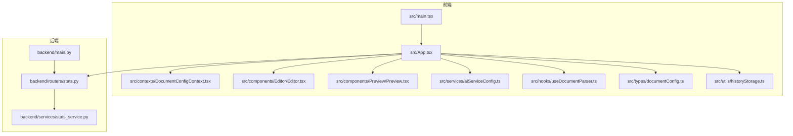
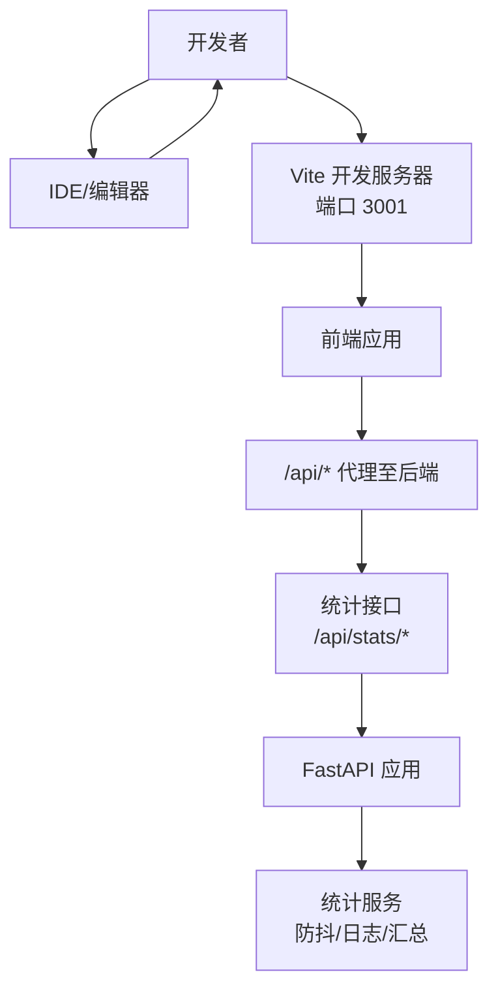
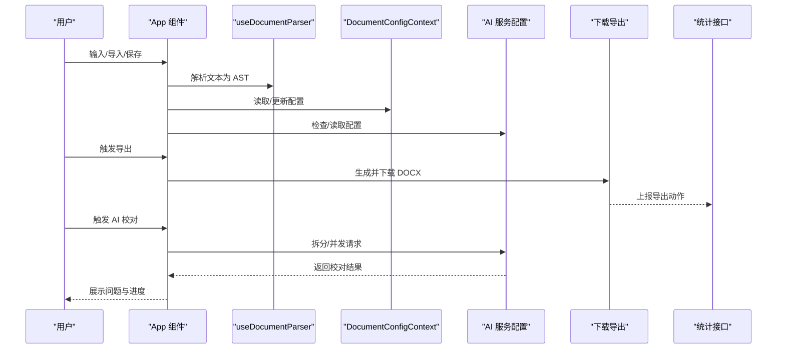
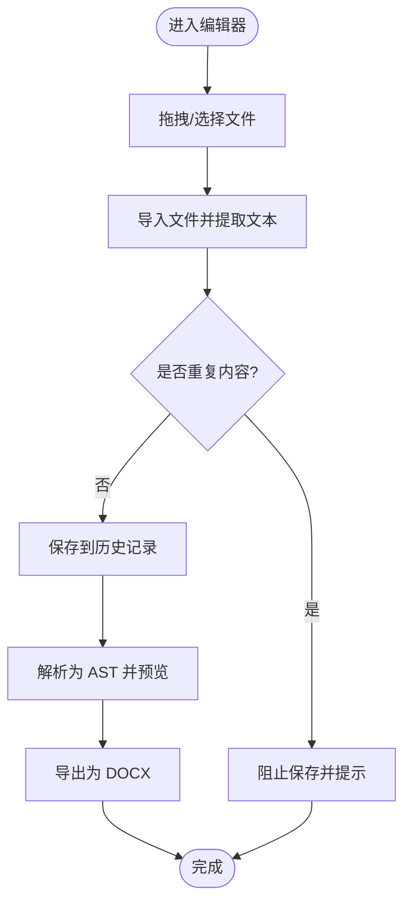
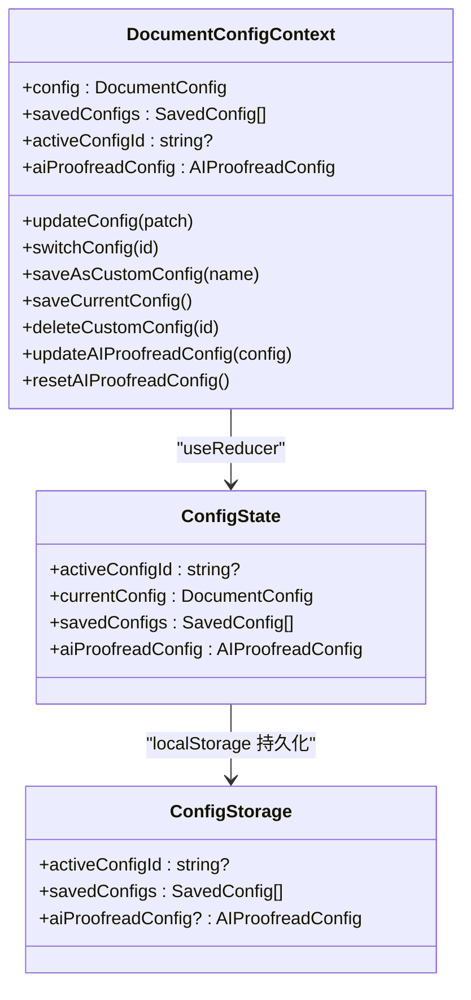
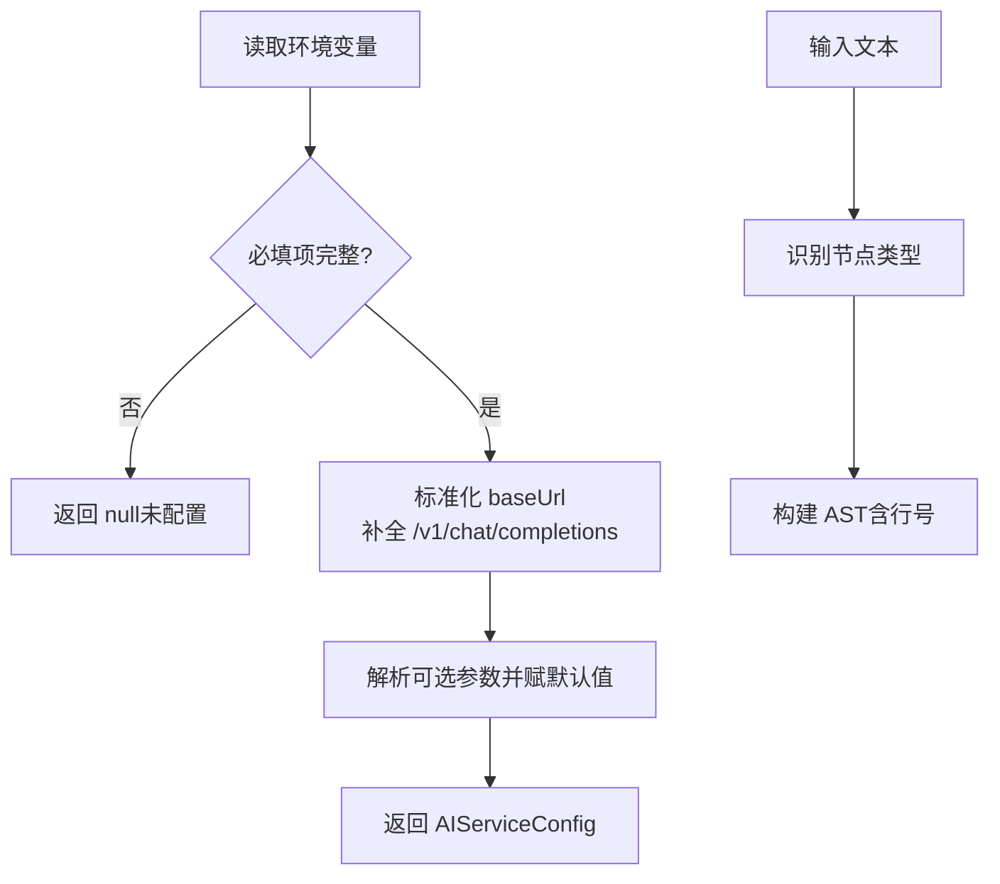
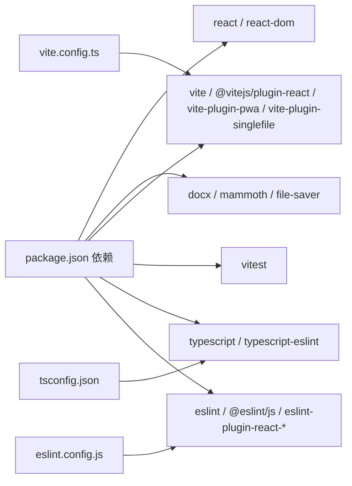

# 开发指南

<cite>
**本文引用的文件**
- [package.json](file://package.json)
- [vite.config.ts](file://vite.config.ts)
- [eslint.config.js](file://eslint.config.js)
- [tsconfig.json](file://tsconfig.json)
- [src/main.tsx](file://src/main.tsx)
- [src/App.tsx](file://src/App.tsx)
- [src/contexts/DocumentConfigContext.tsx](file://src/contexts/DocumentConfigContext.tsx)
- [src/hooks/useDocumentParser.ts](file://src/hooks/useDocumentParser.ts)
- [src/services/aiServiceConfig.ts](file://src/services/aiServiceConfig.ts)
- [src/components/Editor/Editor.tsx](file://src/components/Editor/Editor.tsx)
- [src/components/Preview/Preview.tsx](file://src/components/Preview/Preview.tsx)
- [src/types/documentConfig.ts](file://src/types/documentConfig.ts)
- [src/utils/historyStorage.ts](file://src/utils/historyStorage.ts)
- [src/parser/__tests__/parser.test.ts](file://src/parser/__tests__/parser.test.ts)
- [backend/main.py](file://backend/main.py)
- [backend/routers/stats.py](file://backend/routers/stats.py)
- [backend/services/stats_service.py](file://backend/services/stats_service.py)
</cite>

## 目录
1. [简介](#简介)
2. [项目结构](#项目结构)
3. [核心组件](#核心组件)
4. [架构总览](#架构总览)
5. [详细组件分析](#详细组件分析)
6. [依赖关系分析](#依赖关系分析)
7. [性能考虑](#性能考虑)
8. [故障排查指南](#故障排查指南)
9. [结论](#结论)
10. [附录](#附录)

## 简介
本指南面向开发者，系统阐述“公文排版工具”的整体架构、技术栈与开发约定，涵盖开发环境搭建、IDE 配置、调试设置、代码规范、TypeScript 与 ESLint/Vite 配置、代码组织结构、组件与状态管理、数据流设计、测试策略、新增与修改功能流程、性能优化建议以及贡献与代码审查流程。

## 项目结构
项目采用前后端分离架构：
- 前端基于 React 19 + TypeScript，使用 Vite 7 构建，支持 PWA 与单文件打包两种模式；核心逻辑集中在 src 目录。
- 后端基于 Python FastAPI，提供统计服务接口，包含健康检查、防抖记录与统计汇总。
- Docker 化部署与 Nginx 配置位于 gongwen-docker 目录，便于本地开发与生产部署。

图表来源
- [src/main.tsx:1-14](file://src/main.tsx#L1-L14)
- [src/App.tsx:1-308](file://src/App.tsx#L1-L308)
- [src/contexts/DocumentConfigContext.tsx:1-297](file://src/contexts/DocumentConfigContext.tsx#L1-L297)
- [src/components/Editor/Editor.tsx:1-253](file://src/components/Editor/Editor.tsx#L1-L253)
- [src/components/Preview/Preview.tsx:1-202](file://src/components/Preview/Preview.tsx#L1-L202)
- [src/services/aiServiceConfig.ts:1-154](file://src/services/aiServiceConfig.ts#L1-L154)
- [src/hooks/useDocumentParser.ts:1-9](file://src/hooks/useDocumentParser.ts#L1-L9)
- [src/types/documentConfig.ts:1-267](file://src/types/documentConfig.ts#L1-L267)
- [src/utils/historyStorage.ts:1-116](file://src/utils/historyStorage.ts#L1-L116)
- [backend/main.py:1-38](file://backend/main.py#L1-L38)
- [backend/routers/stats.py:1-40](file://backend/routers/stats.py#L1-L40)
- [backend/services/stats_service.py:1-124](file://backend/services/stats_service.py#L1-L124)

章节来源
- [src/main.tsx:1-14](file://src/main.tsx#L1-L14)
- [src/App.tsx:1-308](file://src/App.tsx#L1-L308)
- [backend/main.py:1-38](file://backend/main.py#L1-L38)

## 核心组件
- 应用入口与上下文
  - 入口文件负责挂载 React 根节点，并包裹全局配置提供者，确保各组件共享文档配置与 AI 服务配置。
  - 文档配置上下文提供深合并更新、持久化存储、默认配置与 AI 校对配置管理。
- 编辑器与预览
  - 编辑器组件支持拖拽/文件导入、清空、保存到历史、快捷键等交互；与历史弹窗联动。
  - 预览组件根据 AST 与配置生成 A4 页面分页渲染，支持动态样式注入与 AI 校对结果高亮。
- 解析与配置
  - 文本解析为公文 AST 的 Hook，保证响应式与性能。
  - AI 服务配置读取模块，从环境变量解析并标准化 API 路径，提供可用性检测。
- 类型与工具
  - 文档配置类型定义与默认值，提供字体、字号、行距、边距、页眉页脚等完整参数。
  - 历史记录工具封装 localStorage 操作，限制最大条目并去重。

章节来源
- [src/main.tsx:1-14](file://src/main.tsx#L1-L14)
- [src/contexts/DocumentConfigContext.tsx:1-297](file://src/contexts/DocumentConfigContext.tsx#L1-L297)
- [src/components/Editor/Editor.tsx:1-253](file://src/components/Editor/Editor.tsx#L1-L253)
- [src/components/Preview/Preview.tsx:1-202](file://src/components/Preview/Preview.tsx#L1-L202)
- [src/hooks/useDocumentParser.ts:1-9](file://src/hooks/useDocumentParser.ts#L1-L9)
- [src/services/aiServiceConfig.ts:1-154](file://src/services/aiServiceConfig.ts#L1-L154)
- [src/types/documentConfig.ts:1-267](file://src/types/documentConfig.ts#L1-L267)
- [src/utils/historyStorage.ts:1-116](file://src/utils/historyStorage.ts#L1-L116)

## 架构总览
前端通过 Vite 构建，开发服务器代理后端统计接口；生产模式下可启用 PWA 或单文件模式。应用状态通过 React Context 管理，解析与导出逻辑解耦于组件之外。后端提供健康检查、防抖记录与统计汇总接口，配合定时清理任务维持内存缓存稳定。

图表来源
- [vite.config.ts:63-72](file://vite.config.ts#L63-L72)
- [backend/main.py:24-37](file://backend/main.py#L24-L37)
- [backend/routers/stats.py:12-39](file://backend/routers/stats.py#L12-L39)
- [backend/services/stats_service.py:37-42](file://backend/services/stats_service.py#L37-L42)

## 详细组件分析

### 组件 A：应用主流程与状态管理
- 数据流
  - 文本输入经净化与解析为 AST，结合文档配置与 AI 结果驱动预览渲染。
  - 历史记录与 AI 配置持久化到 localStorage，支持导入/导出、清空、保存等操作。
- 关键交互
  - 导出：调用导出器并上报统计。
  - AI 校对：读取配置，拆分句子并发请求，聚合结果并展示问题计数。
  - 历史：保存/恢复/删除/清空，去重与上限控制。

图表来源
- [src/App.tsx:54-305](file://src/App.tsx#L54-L305)
- [src/hooks/useDocumentParser.ts:1-9](file://src/hooks/useDocumentParser.ts#L1-L9)
- [src/contexts/DocumentConfigContext.tsx:218-286](file://src/contexts/DocumentConfigContext.tsx#L218-L286)
- [src/services/aiServiceConfig.ts:47-153](file://src/services/aiServiceConfig.ts#L47-L153)
- [backend/routers/stats.py:12-32](file://backend/routers/stats.py#L12-L32)

章节来源
- [src/App.tsx:1-308](file://src/App.tsx#L1-L308)
- [src/contexts/DocumentConfigContext.tsx:1-297](file://src/contexts/DocumentConfigContext.tsx#L1-L297)

### 组件 B：编辑器与预览
- 编辑器
  - 支持拖拽上传、文件导入、清空、保存到历史、全局快捷键 Ctrl+S。
  - 与历史弹窗联动，防止重复保存。
- 预览
  - 基于 CSS 自定义属性与度量容器实现精确分页，支持标题、正文、附件、日期、备注等节点渲染。
  - 动态样式计算字符间距与首行缩进，适配 GB/T 9704 标准。

图表来源
- [src/components/Editor/Editor.tsx:54-144](file://src/components/Editor/Editor.tsx#L54-L144)
- [src/utils/historyStorage.ts:54-77](file://src/utils/historyStorage.ts#L54-L77)
- [src/components/Preview/Preview.tsx:43-201](file://src/components/Preview/Preview.tsx#L43-L201)

章节来源
- [src/components/Editor/Editor.tsx:1-253](file://src/components/Editor/Editor.tsx#L1-L253)
- [src/components/Preview/Preview.tsx:1-202](file://src/components/Preview/Preview.tsx#L1-L202)
- [src/utils/historyStorage.ts:1-116](file://src/utils/historyStorage.ts#L1-L116)

### 组件 C：文档配置上下文
- 设计要点
  - 使用 useReducer 管理配置状态，支持深合并更新、切换、保存、删除与 AI 配置独立维护。
  - 通过 localStorage 持久化，初始化时从存储恢复，变更时写回。
- 性能与健壮性
  - 深拷贝与深合并避免意外共享引用；默认配置与 AI 配置分离，向后兼容。

图表来源
- [src/contexts/DocumentConfigContext.tsx:55-156](file://src/contexts/DocumentConfigContext.tsx#L55-L156)
- [src/contexts/DocumentConfigContext.tsx:158-196](file://src/contexts/DocumentConfigContext.tsx#L158-L196)
- [src/contexts/DocumentConfigContext.tsx:218-286](file://src/contexts/DocumentConfigContext.tsx#L218-L286)

章节来源
- [src/contexts/DocumentConfigContext.tsx:1-297](file://src/contexts/DocumentConfigContext.tsx#L1-L297)

### 组件 D：AI 服务配置与解析
- AI 配置
  - 从 import.meta.env 读取并验证必填项，自动补全 API 路径，解析可选参数并提供可用性检测。
- 文本解析
  - 将输入文本解析为 AST，识别标题、正文、附件、日期、备注等节点，保留行号便于定位与高亮。

图表来源
- [src/services/aiServiceConfig.ts:47-153](file://src/services/aiServiceConfig.ts#L47-L153)
- [src/hooks/useDocumentParser.ts:6-8](file://src/hooks/useDocumentParser.ts#L6-L8)

章节来源
- [src/services/aiServiceConfig.ts:1-154](file://src/services/aiServiceConfig.ts#L1-L154)
- [src/hooks/useDocumentParser.ts:1-9](file://src/hooks/useDocumentParser.ts#L1-L9)

## 依赖关系分析
- 前端依赖
  - React 19、React DOM、docx、mammoth、file-saver、@vitejs/plugin-react、vite-plugin-pwa、vite-plugin-singlefile、vitest 等。
- 构建与工具
  - Vite 7 提供开发服务器与构建能力；ESLint 与 TypeScript ESLint 提供静态检查；TypeScript 5.9 管理类型。
- 后端依赖
  - FastAPI、Python 运行时、异步任务与文件 IO。

图表来源
- [package.json:13-37](file://package.json#L13-L37)
- [vite.config.ts:15-53](file://vite.config.ts#L15-L53)
- [eslint.config.js:8-23](file://eslint.config.js#L8-L23)
- [tsconfig.json:1-8](file://tsconfig.json#L1-L8)

章节来源
- [package.json:1-39](file://package.json#L1-L39)
- [vite.config.ts:1-78](file://vite.config.ts#L1-L78)
- [eslint.config.js:1-24](file://eslint.config.js#L1-L24)
- [tsconfig.json:1-8](file://tsconfig.json#L1-L8)

## 性能考虑
- 前端
  - 使用 useMemo 缓存解析结果与样式计算，避免重复渲染。
  - 防抖写入 localStorage，降低频繁 I/O。
  - 预览使用度量容器与 CSS 自定义属性，减少 DOM 查询与重排。
- 后端
  - 防抖缓存与定期清理，避免内存膨胀。
  - 日志追加与按天统计聚合，IO 与 CPU 成本可控。

章节来源
- [src/App.tsx:95-113](file://src/App.tsx#L95-L113)
- [src/components/Preview/Preview.tsx:49-89](file://src/components/Preview/Preview.tsx#L49-L89)
- [backend/services/stats_service.py:15-42](file://backend/services/stats_service.py#L15-L42)

## 故障排查指南
- 开发服务器无法访问后端接口
  - 检查代理配置与目标端口，确认后端已启动。
- AI 服务未生效
  - 检查环境变量是否完整，确认配置标准化与可用性检测返回 true。
- 预览样式异常
  - 检查 CSS 自定义属性注入与字符间距计算，确认配置项未越界。
- 导出失败
  - 查看控制台错误信息，确认 AST 与配置有效，网络请求可达后端统计接口。
- 历史记录异常
  - 检查 localStorage 权限与容量，确认保存/删除/清空逻辑未抛错。

章节来源
- [vite.config.ts:66-71](file://vite.config.ts#L66-L71)
- [src/services/aiServiceConfig.ts:150-153](file://src/services/aiServiceConfig.ts#L150-L153)
- [src/App.tsx:123-131](file://src/App.tsx#L123-L131)
- [src/utils/historyStorage.ts:54-104](file://src/utils/historyStorage.ts#L54-L104)

## 结论
本项目以 React + TypeScript 为核心，结合 Vite 与 PWA/单文件模式，提供高性能、可扩展的公文排版与导出体验；后端统计服务通过防抖与定时清理保障稳定性。遵循本文档的开发约定与最佳实践，可高效地新增功能、修改现有逻辑并持续优化性能。

## 附录

### 开发环境搭建与 IDE 配置
- 安装 Node.js 与包管理器，克隆仓库后安装依赖。
- 推荐 VS Code 插件：ESLint、TypeScript TSServer、Prettier、EditorConfig。
- 设置 ESLint 与 TypeScript 校验在保存时运行，确保提交前无明显错误。
- 在终端执行开发命令启动前端与后端服务，必要时配置环境变量文件。

章节来源
- [package.json:6-11](file://package.json#L6-L11)

### 调试设置
- 前端
  - Vite 开发服务器端口 3001，支持热更新与源码映射。
  - 代理 /api 到后端，便于联调。
- 后端
  - FastAPI 应用提供健康检查接口，可在开发阶段快速验证服务可用性。

章节来源
- [vite.config.ts:63-72](file://vite.config.ts#L63-L72)
- [backend/main.py:34-37](file://backend/main.py#L34-L37)

### 代码规范与 ESLint
- 使用 flat 配置，启用 TypeScript、React Hooks、React Refresh 规则集。
- 语言环境为浏览器，ECMAScript 2020。
- 建议在提交前运行 lint 与单元测试，修复告警与失败用例。

章节来源
- [eslint.config.js:8-23](file://eslint.config.js#L8-L23)
- [package.json:10](file://package.json#L10)

### TypeScript 配置
- 顶层 tsconfig 引用 app 与 node 两个子配置，分别约束应用与工具链类型。
- 建议保持严格模式，逐步开启 noImplicitAny 等规则以提升类型安全。

章节来源
- [tsconfig.json:1-8](file://tsconfig.json#L1-L8)

### Vite 构建配置
- 单文件模式通过环境变量切换，支持离线单文件部署。
- PWA 模式提供图标、主题色与缓存策略；生产基座路径根据部署平台自动调整。
- 目标浏览器内核为 Chrome 78，CSS 与 JS 目标版本均设为 chrome78，确保兼容性。

章节来源
- [vite.config.ts:7-12](file://vite.config.ts#L7-L12)
- [vite.config.ts:54-59](file://vite.config.ts#L54-L59)
- [vite.config.ts:17-53](file://vite.config.ts#L17-L53)

### 代码组织结构与开发约定
- 组件设计原则
  - 单一职责：编辑器、预览、面板等组件边界清晰。
  - 可组合：通过 props 传递状态与回调，避免过度耦合。
- 状态管理
  - 全局配置使用 Context，局部状态在组件内部维护。
  - 深合并更新，避免浅拷贝导致的副作用。
- 数据流
  - 输入净化 → 文本解析 → AST → 预览渲染 → 导出/统计上报。
- 类型与默认值
  - 文档配置类型完整覆盖 GB/T 9704 要求，提供默认值与选项常量。
- 工具函数
  - 历史记录、AI 配置、文本净化等工具函数职责单一，便于测试与复用。

章节来源
- [src/App.tsx:1-308](file://src/App.tsx#L1-L308)
- [src/contexts/DocumentConfigContext.tsx:24-48](file://src/contexts/DocumentConfigContext.tsx#L24-L48)
- [src/types/documentConfig.ts:130-183](file://src/types/documentConfig.ts#L130-L183)

### 测试策略与工具
- 单元测试
  - 使用 Vitest，覆盖解析器、AI 配置、历史记录等模块。
  - 解析器测试包含节点识别、附件解析、日期与备注识别等场景。
- 覆盖建议
  - 新增功能需配套单元测试；复杂逻辑优先拆分为纯函数并单独测试。
  - 对边界条件（空输入、异常行、重复内容）重点验证。

章节来源
- [src/parser/__tests__/parser.test.ts:1-500](file://src/parser/__tests__/parser.test.ts#L1-L500)
- [package.json:36](file://package.json#L36)

### 新增/修改功能流程
- 新增功能
  - 明确需求与边界，拆分组件与工具函数。
  - 编写单元测试，覆盖主要分支与异常路径。
  - 在 App 中集成，确保状态更新与持久化正确。
- 修改现有功能
  - 保持对外 API 稳定，必要时提供迁移指南。
  - 先写测试，再实现修改，最后回归验证。
- 性能优化
  - 使用 useMemo/useCallback 缓存昂贵计算与回调。
  - 控制重渲染范围，避免不必要的 props 传递。
  - 后端定时清理与防抖策略保持稳定。

章节来源
- [src/App.tsx:123-131](file://src/App.tsx#L123-L131)
- [src/utils/historyStorage.ts:54-77](file://src/utils/historyStorage.ts#L54-L77)

### 后端统计服务
- 接口
  - POST /api/stats/record：记录用户行为，带防抖。
  - GET /api/stats/summary：按天统计唯一用户、总调用次数与导出/AI 调用次数。
- 逻辑
  - 防抖缓存与定期清理，日志文件按行存储，聚合时按时间范围过滤。
- 生命周期
  - 应用启动时创建后台任务，清理缓存；应用退出时取消任务。

章节来源
- [backend/routers/stats.py:12-39](file://backend/routers/stats.py#L12-L39)
- [backend/services/stats_service.py:15-124](file://backend/services/stats_service.py#L15-L124)
- [backend/main.py:12-21](file://backend/main.py#L12-L21)

### 贡献指南与代码审查流程
- 提交前
  - 运行 lint 与测试，修复失败用例与告警。
  - 确保新增/修改逻辑具备单元测试覆盖。
- 提交流程
  - 创建分支，提交 PR，关联 Issue。
  - 至少一名维护者审查，通过 CI 与本地验证后合并。
- 代码风格
  - 遵循 ESLint 规则，保持一致的命名与缩进。
  - 组件与工具函数保持单一职责，注释清晰。

章节来源
- [eslint.config.js:8-23](file://eslint.config.js#L8-L23)
- [package.json:10](file://package.json#L10)