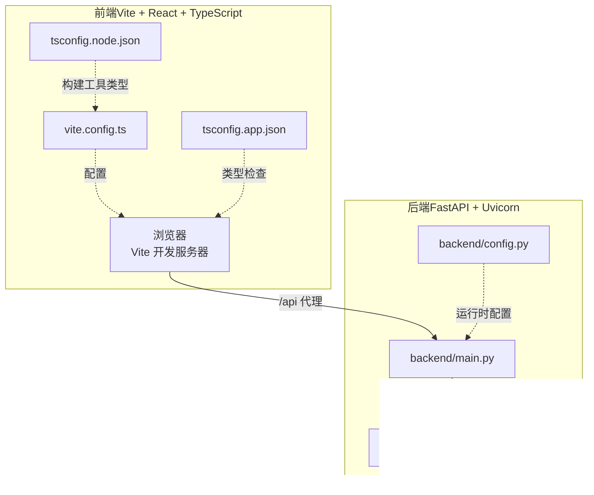
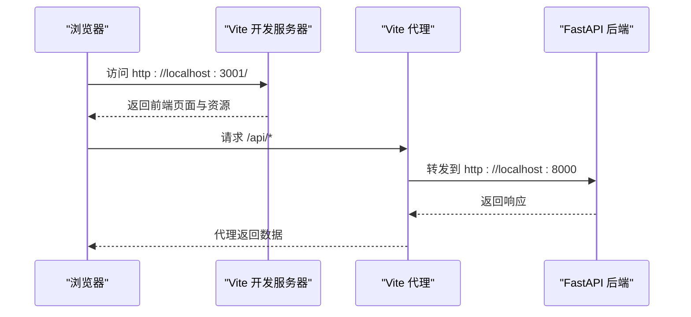
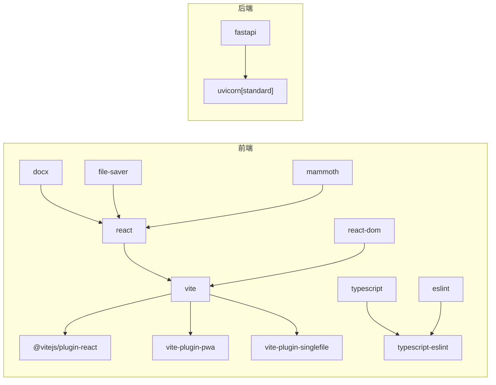

# 开发环境搭建

<cite>
**本文引用的文件**
- [package.json](file://package.json)
- [vite.config.ts](file://vite.config.ts)
- [eslint.config.js](file://eslint.config.js)
- [tsconfig.json](file://tsconfig.json)
- [tsconfig.app.json](file://tsconfig.app.json)
- [tsconfig.node.json](file://tsconfig.node.json)
- [backend/main.py](file://backend/main.py)
- [backend/config.py](file://backend/config.py)
- [backend/requirements.txt](file://backend/requirements.txt)
- [.gitignore](file://.gitignore)
</cite>

## 目录
1. [简介](#简介)
2. [项目结构](#项目结构)
3. [核心组件](#核心组件)
4. [架构总览](#架构总览)
5. [详细组件分析](#详细组件分析)
6. [依赖分析](#依赖分析)
7. [性能考虑](#性能考虑)
8. [故障排查指南](#故障排查指南)
9. [结论](#结论)
10. [附录](#附录)

## 简介
本指南面向首次参与“公文排版工具”项目的开发者，帮助你从零完成本地开发环境搭建与配置。内容覆盖：
- Node.js 版本要求与包管理器选择
- 依赖安装流程与后端服务准备
- IDE 配置建议（VS Code 插件、TypeScript、ESLint）
- Vite 开发服务器配置、热重载与代理
- 开发命令与脚本说明
- 调试配置（浏览器、React DevTools、断点）
- Git 钩子、pre-commit 检查与代码格式化
- 常见问题排查与解决方案

## 项目结构
该项目采用前后端分离架构：
- 前端为基于 React 与 TypeScript 的单页应用，使用 Vite 作为构建与开发服务器
- 后端为 Python FastAPI 应用，提供统计与健康检查接口
- 通过 Vite 代理将前端对 /api 的请求转发至后端服务

图表来源
- [vite.config.ts:15-77](file://vite.config.ts#L15-L77)
- [tsconfig.app.json:1-28](file://tsconfig.app.json#L1-L28)
- [tsconfig.node.json:1-27](file://tsconfig.node.json#L1-L27)
- [backend/main.py:12-38](file://backend/main.py#L12-L38)
- [backend/config.py:1-16](file://backend/config.py#L1-L16)
- [backend/requirements.txt:1-3](file://backend/requirements.txt#L1-L3)

章节来源
- [package.json:6-12](file://package.json#L6-L12)
- [vite.config.ts:15-77](file://vite.config.ts#L15-L77)
- [backend/main.py:24-38](file://backend/main.py#L24-L38)

## 核心组件
- 包管理与脚本
  - 使用 npm 作为包管理器，脚本包括 dev、build、build:single、lint、preview
- 构建与开发服务器
  - Vite 提供开发服务器、热重载与构建打包；支持 PWA 或单文件模式
- 类型系统
  - TypeScript 双配置文件分别针对应用与 Node 工具链
- 代码质量
  - ESLint 集成 TypeScript、React Hooks、React Refresh 规则
- 后端服务
  - FastAPI 应用，提供健康检查与统计相关接口

章节来源
- [package.json:6-12](file://package.json#L6-L12)
- [vite.config.ts:15-77](file://vite.config.ts#L15-L77)
- [tsconfig.app.json:1-28](file://tsconfig.app.json#L1-L28)
- [tsconfig.node.json:1-27](file://tsconfig.node.json#L1-L27)
- [eslint.config.js:8-23](file://eslint.config.js#L8-L23)
- [backend/main.py:24-38](file://backend/main.py#L24-L38)

## 架构总览
下图展示开发阶段的请求流与组件交互：

图表来源
- [vite.config.ts:63-72](file://vite.config.ts#L63-L72)
- [backend/main.py:34-37](file://backend/main.py#L34-L37)

## 详细组件分析

### Node.js 与包管理器
- Node.js 版本要求
  - TypeScript 目标为 ES2022/ES2023，建议使用较新的 LTS 版本（如 18.x 或 20.x），确保与构建工具兼容
- 包管理器选择
  - 推荐使用 npm（与 package.json 脚本一致）
  - 若团队偏好 pnpm/yarn，需自行验证与 Vite/TypeScript 的兼容性
- 依赖安装流程
  - 安装前端依赖：npm install
  - 安装后端依赖：进入 backend 目录执行 pip install -r requirements.txt
  - 如需使用 Docker Compose 进行后端服务编排，请参考 gongwen-docker 目录下的 compose 文件

章节来源
- [package.json:20-37](file://package.json#L20-L37)
- [backend/requirements.txt:1-3](file://backend/requirements.txt#L1-L3)

### IDE 配置建议（VS Code）
- 推荐插件
  - ESLint：启用规则检查与自动修复
  - TypeScript Importer：辅助导入与类型推断
  - Prettier：统一代码风格（配合 .prettierrc 或 VS Code 设置）
  - Bracket Pair Colorizer：提升可读性
  - Live Server：预览静态页面（非必需）
- TypeScript 配置
  - 使用工作区根目录的 tsconfig.json，内部引用 app 与 node 两套配置
  - 应用侧启用 bundler 模式与 JSX 支持；Node 工具侧启用 bundler 模式与 Node 类型
- ESLint 规则
  - 已集成 TypeScript、React Hooks、React Refresh 与浏览器全局变量
  - 建议在 VS Code 中启用保存时自动 lint，并结合 Prettier 保持一致性

章节来源
- [tsconfig.json:1-8](file://tsconfig.json#L1-L8)
- [tsconfig.app.json:11-24](file://tsconfig.app.json#L11-L24)
- [tsconfig.node.json:10-23](file://tsconfig.node.json#L10-L23)
- [eslint.config.js:8-23](file://eslint.config.js#L8-L23)

### Vite 开发服务器配置
- 基础与模式
  - base：根据部署场景自动选择根路径或子路径；单文件模式强制使用相对路径
  - 插件：React 插件、PWA 插件或单文件插件二选一
- 构建目标
  - 目标浏览器兼容至 Chrome 78，CSS 目标同样限制
- 开发服务器
  - 端口：3001；host：0.0.0.0（允许外部访问）
  - 代理：将 /api 前缀转发至 http://localhost:8000
- 测试配置
  - Vitest 全局启用与 Node 环境

章节来源
- [vite.config.ts:7-12](file://vite.config.ts#L7-L12)
- [vite.config.ts:15-53](file://vite.config.ts#L15-L53)
- [vite.config.ts:54-62](file://vite.config.ts#L54-L62)
- [vite.config.ts:63-72](file://vite.config.ts#L63-L72)
- [vite.config.ts:73-77](file://vite.config.ts#L73-L77)

### 开发命令与脚本
- dev：启动 Vite 开发服务器
- build：先执行 TypeScript 构建，再进行生产打包
- build:single：单文件模式打包（用于离线双击打开）
- lint：运行 ESLint 检查
- preview：预览生产构建产物

章节来源
- [package.json:6-12](file://package.json#L6-L12)

### 调试配置
- 浏览器调试
  - 在 Vite 开发服务器中打开页面，使用浏览器开发者工具查看网络、控制台与源码映射
- React DevTools
  - 安装 React DevTools 扩展，查看组件树与状态变化
- 断点设置
  - 在 TypeScript/JSX 源码中设置断点，利用 sourcemap 进行调试
- 后端调试
  - 启动后端服务后，访问 /api/health 进行健康检查确认

章节来源
- [vite.config.ts:63-72](file://vite.config.ts#L63-L72)
- [backend/main.py:34-37](file://backend/main.py#L34-L37)

### Git 钩子、pre-commit 与代码格式化
- 忽略项
  - .gitignore 已包含 node_modules、dist、日志、编辑器目录与敏感配置文件
- pre-commit 建议
  - 使用 husky + lint-staged，在提交前自动执行 ESLint 与格式化
  - 可加入 TypeScript 编译检查（tsc --noEmit）以减少错误进入主分支
- 代码格式化
  - 结合 Prettier 与 ESLint，统一风格与规则

章节来源
- [.gitignore:1-41](file://.gitignore#L1-L41)

## 依赖分析
- 前端依赖
  - React 19、React DOM 19、docx、file-saver、mammoth
- 开发依赖
  - Vite、@vitejs/plugin-react、TypeScript、ESLint、React Hooks/Refresh 插件、PWA 插件、单文件插件、Vitest
- 后端依赖
  - FastAPI 0.115.0、Uvicorn[standard] 0.30.0

图表来源
- [package.json:13-37](file://package.json#L13-L37)
- [backend/requirements.txt:1-3](file://backend/requirements.txt#L1-L3)

章节来源
- [package.json:13-37](file://package.json#L13-L37)
- [backend/requirements.txt:1-3](file://backend/requirements.txt#L1-L3)

## 性能考虑
- 构建目标
  - 为保证兼容性，CSS 与 JS 目标均限制至 Chrome 78，避免使用新特性导致回退
- 开发体验
  - 启用 CSS 开发 sourcemap，便于样式调试
  - 使用 React 插件与 React Refresh，提升热更新效率
- 生产优化
  - PWA 插件用于缓存与离线能力；单文件模式适合便携分发

章节来源
- [vite.config.ts:54-62](file://vite.config.ts#L54-L62)
- [vite.config.ts:17-52](file://vite.config.ts#L17-L52)

## 故障排查指南
- 端口冲突
  - 症状：无法启动 Vite 开发服务器
  - 处理：修改 vite.config.ts 中的 server.port 或关闭占用端口的进程
- 代理失败
  - 症状：前端 /api 请求 404 或跨域
  - 处理：确认后端服务已启动并监听 8000 端口；检查代理配置与后端路由
- 后端健康检查
  - 症状：/api/health 不可用
  - 处理：检查 backend/main.py 是否正确注册路由与 lifespan 生命周期
- 类型错误
  - 症状：tsc 报错或 IDE 类型提示异常
  - 处理：核对 tsconfig.app.json 与 tsconfig.node.json 的模块解析与 JSX 配置
- ESLint 报错
  - 症状：保存或 lint 命令报错
  - 处理：根据 ESLint 输出修复；必要时在 VS Code 中启用自动修复
- 依赖安装失败
  - 症状：npm/pip 安装报错
  - 处理：更换镜像源或升级 Node/npm；后端使用 Python 3.10+ 并确保 requirements 正确

章节来源
- [vite.config.ts:63-72](file://vite.config.ts#L63-L72)
- [backend/main.py:24-38](file://backend/main.py#L24-L38)
- [tsconfig.app.json:11-24](file://tsconfig.app.json#L11-L24)
- [tsconfig.node.json:10-23](file://tsconfig.node.json#L10-L23)
- [eslint.config.js:8-23](file://eslint.config.js#L8-L23)
- [backend/requirements.txt:1-3](file://backend/requirements.txt#L1-L3)

## 结论
按照本指南完成 Node.js、包管理器、前端与后端依赖安装后，即可通过 npm run dev 启动开发服务器。借助 Vite 的热重载与代理机制、ESLint 与 TypeScript 的类型保障，以及 VS Code 的调试工具链，你可以高效地进行功能开发与问题定位。建议在团队内统一 pre-commit 流程与代码风格，持续提升协作效率与代码质量。

## 附录
- 后端服务启动步骤
  - 进入 backend 目录，安装依赖后启动服务，访问 /api/health 确认健康状态
- 部署相关
  - 生产构建使用 npm run build；单文件模式使用 npm run build:single
  - PWA 插件会生成清单与 Workbox 缓存策略，适配现代浏览器离线场景

章节来源
- [package.json:6-12](file://package.json#L6-L12)
- [vite.config.ts:17-52](file://vite.config.ts#L17-L52)
- [backend/main.py:34-37](file://backend/main.py#L34-L37)