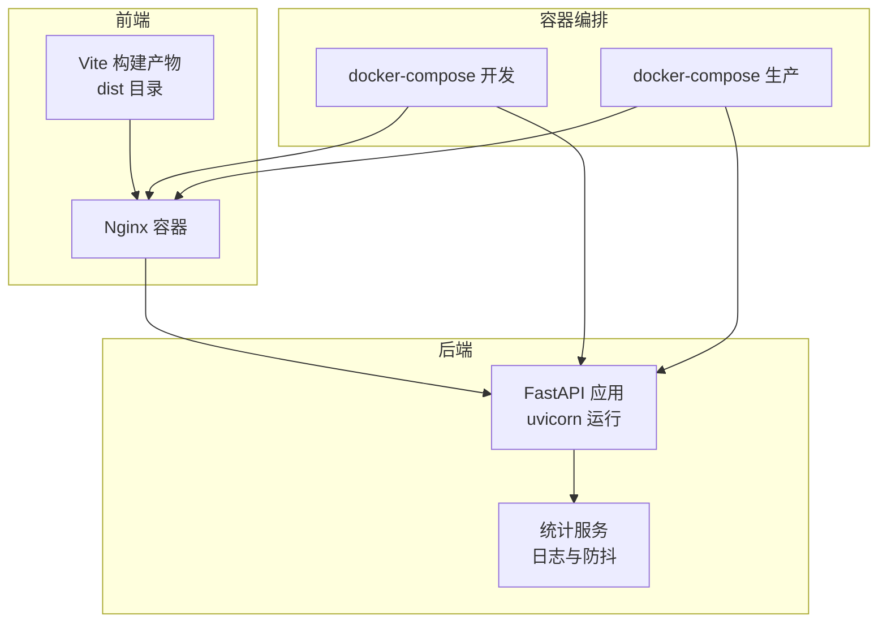
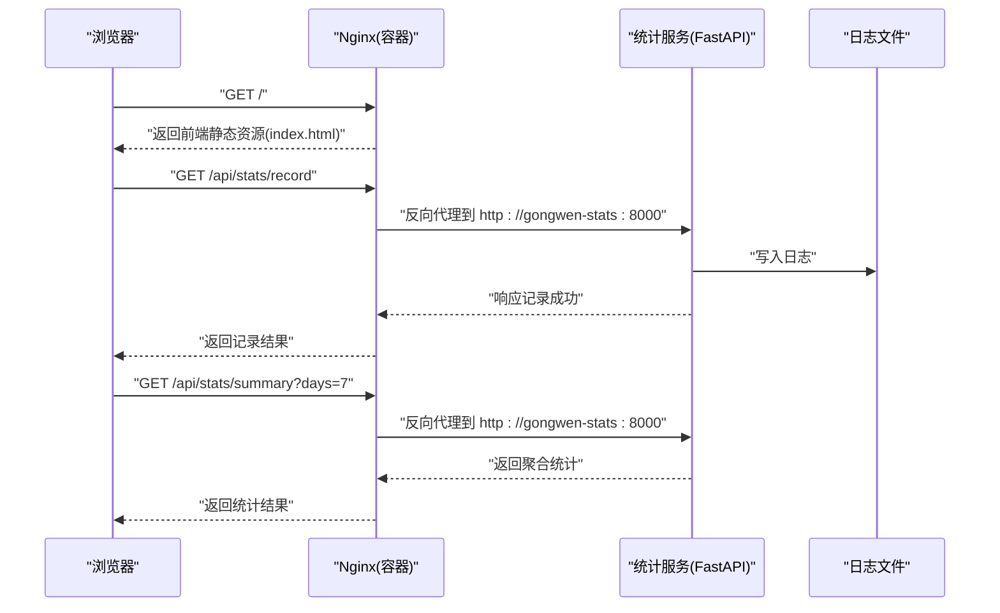
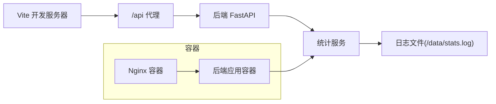

# 构建与部署

<cite>
**本文引用的文件**
- [vite.config.ts](file://vite.config.ts)
- [package.json](file://package.json)
- [backend/Dockerfile](file://backend/Dockerfile)
- [gongwen-docker/Dockerfile](file://gongwen-docker/Dockerfile)
- [gongwen-docker/docker-compose-dev.yml](file://gongwen-docker/docker-compose-dev.yml)
- [gongwen-docker/docker-compose-prod.yml](file://gongwen-docker/docker-compose-prod.yml)
- [gongwen-docker/nginx-dev.conf](file://gongwen-docker/nginx-dev.conf)
- [gongwen-docker/nginx-prod.conf](file://gongwen-docker/nginx-prod.conf)
- [.github/workflows/deploy.yml](file://.github/workflows/deploy.yml)
- [.github/workflows/release.yml](file://.github/workflows/release.yml)
- [backend/main.py](file://backend/main.py)
- [backend/config.py](file://backend/config.py)
- [backend/routers/stats.py](file://backend/routers/stats.py)
- [backend/services/stats_service.py](file://backend/services/stats_service.py)
- [gongwen-docker/host_nginx.conf](file://gongwen-docker/host_nginx.conf)
</cite>

## 目录
1. [简介](#简介)
2. [项目结构](#项目结构)
3. [核心组件](#核心组件)
4. [架构总览](#架构总览)
5. [详细组件分析](#详细组件分析)
6. [依赖关系分析](#依赖关系分析)
7. [性能考虑](#性能考虑)
8. [故障排查指南](#故障排查指南)
9. [结论](#结论)
10. [附录](#附录)

## 简介
本指南面向前端与后端工程师及运维人员，系统阐述本项目的构建与部署策略，涵盖以下主题：
- Vite 构建配置：开发构建、生产构建与单文件部署
- Docker 容器化：镜像构建、容器编排与环境变量
- Nginx 反向代理：配置要点、静态资源缓存与健康检查
- CI/CD 流水线：GitHub Actions 工作流、自动化测试与发布
- 性能优化：代码分割、资源压缩与缓存策略
- 监控与日志：健康检查、日志落盘与统计接口
- 多环境部署与灰度回滚：分环境配置与回退策略

## 项目结构
本项目采用前后端分离架构，前端通过 Vite 构建，后端为 Python FastAPI 应用，二者通过 Nginx 反向代理协同工作，并以 Docker 进行容器化部署。

图表来源
- [gongwen-docker/docker-compose-dev.yml:1-44](file://gongwen-docker/docker-compose-dev.yml#L1-L44)
- [gongwen-docker/docker-compose-prod.yml:1-36](file://gongwen-docker/docker-compose-prod.yml#L1-L36)
- [gongwen-docker/nginx-dev.conf:1-85](file://gongwen-docker/nginx-dev.conf#L1-L85)
- [gongwen-docker/nginx-prod.conf:1-86](file://gongwen-docker/nginx-prod.conf#L1-L86)
- [backend/main.py:1-38](file://backend/main.py#L1-L38)

章节来源
- [gongwen-docker/docker-compose-dev.yml:1-44](file://gongwen-docker/docker-compose-dev.yml#L1-L44)
- [gongwen-docker/docker-compose-prod.yml:1-36](file://gongwen-docker/docker-compose-prod.yml#L1-L36)

## 核心组件
- 前端构建与 PWA
  - Vite 配置启用 React 插件与 PWA 插件；在非单文件模式下生成 PWA 清单与 Workbox 缓存规则；目标浏览器兼容至 Chrome 78。
  - 开发服务器代理后端 /api 请求至本地 8000 端口，便于联调。
- 单文件部署
  - 通过环境变量控制单文件打包，适配离线双击打开场景。
- 后端服务
  - FastAPI 应用，注册统计路由，提供健康检查端点；启动时开启周期性防抖缓存清理任务。
- 统计服务
  - 防抖缓存、日志写入、按天统计聚合；支持查询近 N 天的唯一用户数与功能调用次数。
- Nginx 反向代理
  - 静态资源缓存、Gzip 压缩、SPA 路由回退、API 反代、健康检查端点与错误页。
- Docker 化
  - 前端镜像直接复制本地构建产物；后端镜像基于 Python slim，安装依赖并暴露 8000 端口。
  - docker-compose 提供开发与生产两套编排，分别挂载不同 Nginx 配置与数据卷。

章节来源
- [vite.config.ts:1-78](file://vite.config.ts#L1-L78)
- [package.json:1-39](file://package.json#L1-L39)
- [backend/main.py:1-38](file://backend/main.py#L1-L38)
- [backend/services/stats_service.py:1-124](file://backend/services/stats_service.py#L1-L124)
- [gongwen-docker/nginx-dev.conf:1-85](file://gongwen-docker/nginx-dev.conf#L1-L85)
- [gongwen-docker/nginx-prod.conf:1-86](file://gongwen-docker/nginx-prod.conf#L1-L86)
- [backend/Dockerfile:1-18](file://backend/Dockerfile#L1-L18)
- [gongwen-docker/Dockerfile:1-19](file://gongwen-docker/Dockerfile#L1-L19)

## 架构总览
下图展示从浏览器到后端 API 的完整链路，以及容器间的依赖关系与健康检查。

图表来源
- [gongwen-docker/nginx-dev.conf:55-64](file://gongwen-docker/nginx-dev.conf#L55-L64)
- [backend/routers/stats.py:12-39](file://backend/routers/stats.py#L12-L39)
- [backend/services/stats_service.py:44-123](file://backend/services/stats_service.py#L44-L123)

章节来源
- [gongwen-docker/nginx-dev.conf:1-85](file://gongwen-docker/nginx-dev.conf#L1-L85)
- [backend/routers/stats.py:1-40](file://backend/routers/stats.py#L1-L40)
- [backend/services/stats_service.py:1-124](file://backend/services/stats_service.py#L1-L124)

## 详细组件分析

### Vite 构建配置与脚本
- 构建目标与兼容性
  - 目标浏览器与 CSS 目标均设为 Chrome 78，确保旧浏览器兼容。
- 插件与模式
  - React 插件用于开发与热更新；PWA 插件在非单文件模式下启用，生成清单与缓存规则；单文件模式通过环境变量切换，移除模块加载器以适配单文件。
- 开发服务器与代理
  - 开发服务器监听 3001 端口，host 绑定 0.0.0.0；/api 前缀代理到本地 8000 端口，便于联调后端。
- 资源基础路径
  - 在单文件模式下使用相对路径；在 GitHub Actions 场景下使用子路径前缀；其他情况使用根路径。
- 构建脚本
  - dev：启动开发服务器
  - build：先类型检查再构建
  - build:single：单文件构建
  - lint：ESLint 检查
  - preview：预览构建产物

章节来源
- [vite.config.ts:1-78](file://vite.config.ts#L1-L78)
- [package.json:1-39](file://package.json#L1-L39)

### 单文件部署（离线 HTML）
- 触发方式
  - 通过环境变量控制单文件打包，生成可离线使用的单 HTML 文件。
- 发布流程
  - GitHub Actions 工作流在主分支推送或手动触发时，执行单文件构建并上传为 Release 资产，命名统一为 gongwen.html，便于下载与双击使用。

章节来源
- [vite.config.ts:7-8](file://vite.config.ts#L7-L8)
- [.github/workflows/release.yml:1-48](file://.github/workflows/release.yml#L1-L48)

### Docker 容器化与编排
- 前端镜像
  - 基于 nginx:stable-alpine3.21-perl，删除默认配置，复制本地 dist 目录到 /usr/share/nginx/html，暴露 80 端口。
- 后端镜像
  - 基于 python:3.12-slim，安装 requirements.txt，创建工作目录 /data，暴露 8000 端口，使用 uvicorn 启动。
- 开发与生产编排
  - docker-compose-dev：映射宿主机 88:80，挂载开发 Nginx 配置；后端容器挂载 ./data 到 /data 实现日志持久化；健康检查通过 /health。
  - docker-compose-prod：映射宿主机 50088:80，挂载生产 Nginx 配置；后端容器同样挂载数据卷；健康检查同理。
- 宿主机反向代理
  - host_nginx.conf 将宿主机 88 端口请求转发至 Docker 内部 50088 端口，透传真实客户端 IP。

章节来源
- [gongwen-docker/Dockerfile:1-19](file://gongwen-docker/Dockerfile#L1-L19)
- [backend/Dockerfile:1-18](file://backend/Dockerfile#L1-L18)
- [gongwen-docker/docker-compose-dev.yml:1-44](file://gongwen-docker/docker-compose-dev.yml#L1-L44)
- [gongwen-docker/docker-compose-prod.yml:1-36](file://gongwen-docker/docker-compose-prod.yml#L1-L36)
- [gongwen-docker/host_nginx.conf:1-16](file://gongwen-docker/host_nginx.conf#L1-L16)

### Nginx 反向代理与缓存策略
- 基础配置
  - worker 进程自适应；Gzip 压缩开启，压缩级别 6；静态资源缓存 30 天且 immutable；PWA 相关文件禁用缓存。
- 反向代理
  - /api 前缀代理到 gongwen-stats:8000；透传 Host、X-Real-IP、X-Forwarded-For、X-Forwarded-Proto；设置连接与读取超时。
- SPA 支持
  - 所有未匹配路径回退到 index.html，保证前端路由正常工作。
- 健康检查
  - /health 返回 200 healthy，关闭访问日志，便于容器健康检查。
- 错误页
  - 50x 错误页指向容器内静态页。

章节来源
- [gongwen-docker/nginx-dev.conf:1-85](file://gongwen-docker/nginx-dev.conf#L1-L85)
- [gongwen-docker/nginx-prod.conf:1-86](file://gongwen-docker/nginx-prod.conf#L1-L86)

### 后端统计服务与健康检查
- 应用生命周期
  - 启动时创建周期性清理任务，定期清理防抖缓存；应用退出时取消任务。
- 路由
  - /api/stats/record：记录用户行为，校验 action 合法性，获取真实 IP，进行防抖判断并写入日志。
  - /api/stats/summary：按天数范围聚合统计，返回唯一用户数与功能调用次数。
- 配置
  - 日志路径可通过环境变量覆盖，默认 /data/stats.log；防抖间隔与清理间隔可配置；有效 action 集合限定。

章节来源
- [backend/main.py:1-38](file://backend/main.py#L1-L38)
- [backend/routers/stats.py:1-40](file://backend/routers/stats.py#L1-L40)
- [backend/services/stats_service.py:1-124](file://backend/services/stats_service.py#L1-L124)
- [backend/config.py:1-16](file://backend/config.py#L1-L16)

### CI/CD 流水线
- GitHub Pages 部署
  - 在主分支推送或手动触发时，安装 Node.js 22，执行 npm ci 与构建，上传 dist 作为 Pages 资产，最终部署到 GitHub Pages。
- 单文件发布
  - 在主分支推送或手动触发时，执行单文件构建，生成版本标签（年.月.日-提交短 SHA），重命名产物为 gongwen.html 并创建 Release，附带简要说明。

章节来源
- [.github/workflows/deploy.yml:1-41](file://.github/workflows/deploy.yml#L1-L41)
- [.github/workflows/release.yml:1-48](file://.github/workflows/release.yml#L1-L48)

## 依赖关系分析
- 前端对后端的依赖
  - 前端通过 /api 前缀调用后端统计接口；开发模式下由 Vite 代理到本地 8000 端口。
- 容器间耦合
  - Nginx 依赖 gongwen-stats 提供 /api 后端能力；gongwen-stats 依赖持久化数据卷 /data。
- 健康检查
  - Nginx 与 gongwen-stats 均提供 /health 端点，便于 docker-compose 健康检查。

图表来源
- [vite.config.ts:66-71](file://vite.config.ts#L66-L71)
- [gongwen-docker/nginx-dev.conf:55-64](file://gongwen-docker/nginx-dev.conf#L55-L64)
- [backend/main.py:34-37](file://backend/main.py#L34-L37)
- [backend/services/stats_service.py:44-54](file://backend/services/stats_service.py#L44-L54)

章节来源
- [vite.config.ts:66-71](file://vite.config.ts#L66-L71)
- [gongwen-docker/nginx-dev.conf:55-64](file://gongwen-docker/nginx-dev.conf#L55-L64)
- [backend/main.py:34-37](file://backend/main.py#L34-L37)

## 性能考虑
- 代码分割与懒加载
  - 建议在前端路由与大组件上使用动态导入实现按需加载，减少首屏体积。
- 资源压缩与缓存
  - Nginx 已启用 Gzip 压缩与静态资源长期缓存；建议在生产构建中开启最小化与资源指纹，以进一步降低传输体积。
- 目标浏览器兼容
  - Vite 目标浏览器为 Chrome 78，避免使用较新的 CSS/JS 特性导致回退成本。
- 反向代理超时
  - 已设置合理的 proxy_connect_timeout 与 proxy_read_timeout，避免慢请求阻塞。

章节来源
- [vite.config.ts:54-59](file://vite.config.ts#L54-L59)
- [gongwen-docker/nginx-dev.conf:28-33](file://gongwen-docker/nginx-dev.conf#L28-L33)
- [gongwen-docker/nginx-prod.conf:28-33](file://gongwen-docker/nginx-prod.conf#L28-L33)

## 故障排查指南
- 健康检查失败
  - 检查 Nginx 与后端容器的 /health 端点是否可达；确认 docker-compose 中健康检查配置正确。
- API 404 或 502
  - 确认 Nginx /api 反代地址指向 gongwen-stats:8000；检查后端容器是否正常运行。
- 日志未写入
  - 确认后端容器已挂载 /data 目录；检查 STATS_LOG_PATH 环境变量是否覆盖为有效路径。
- 静态资源无法缓存
  - 检查 Nginx 配置中的缓存规则与 MIME 类型；确认资源扩展名匹配正则。
- 开发代理无效
  - 确认 Vite 代理配置与后端监听地址一致；检查防火墙与端口占用。

章节来源
- [gongwen-docker/docker-compose-dev.yml:21-26](file://gongwen-docker/docker-compose-dev.yml#L21-L26)
- [gongwen-docker/docker-compose-prod.yml:16-21](file://gongwen-docker/docker-compose-prod.yml#L16-L21)
- [gongwen-docker/nginx-dev.conf:55-64](file://gongwen-docker/nginx-dev.conf#L55-L64)
- [backend/config.py](file://backend/config.py#L6)

## 结论
本项目提供了完整的前端构建、容器化与反向代理方案，并通过 GitHub Actions 实现了自动化部署与单文件发布。结合健康检查与日志持久化，可在多环境中稳定运行。建议在生产环境进一步完善 SSL、负载均衡与监控告警体系，以满足更高可用性与可观测性的需求。

## 附录

### 多环境部署与灰度回滚步骤
- 开发环境
  - 使用 docker-compose-dev 启动，映射宿主机 88:80，挂载开发 Nginx 配置；后端数据卷持久化至 ./data。
- 生产环境
  - 使用 docker-compose-prod 启动，映射宿主机 50088:80，挂载生产 Nginx 配置；后端数据卷持久化至 ./data。
- 灰度发布
  - 新版本镜像构建后，先以副本形式运行新容器，逐步将流量切分至新实例；观察健康检查与日志指标。
- 回滚操作
  - 若新版本异常，停止新容器并重启旧版本容器；如需恢复数据，从 /data 数据卷回滚至最近一次有效状态。

章节来源
- [gongwen-docker/docker-compose-dev.yml:1-44](file://gongwen-docker/docker-compose-dev.yml#L1-L44)
- [gongwen-docker/docker-compose-prod.yml:1-36](file://gongwen-docker/docker-compose-prod.yml#L1-L36)