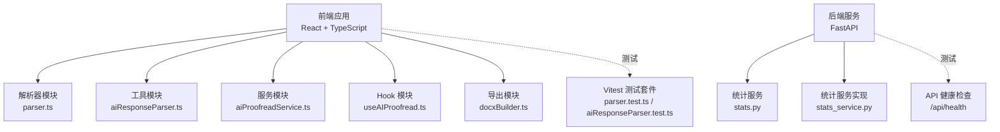
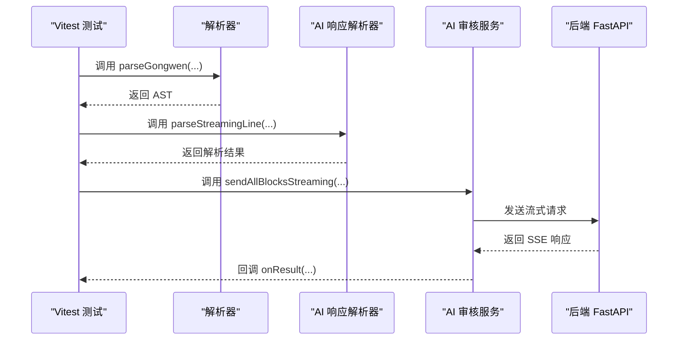
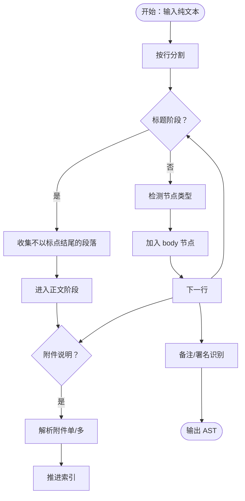
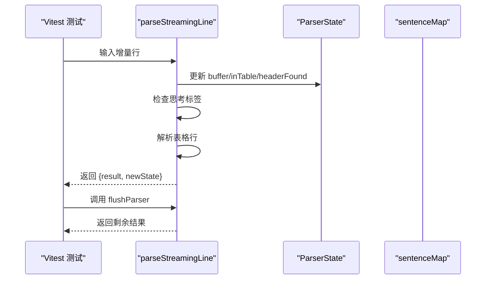
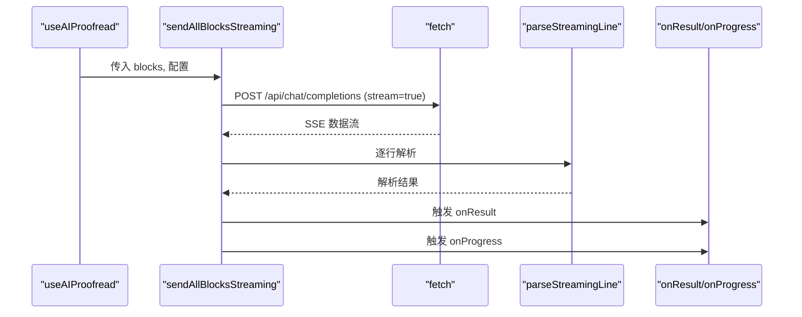
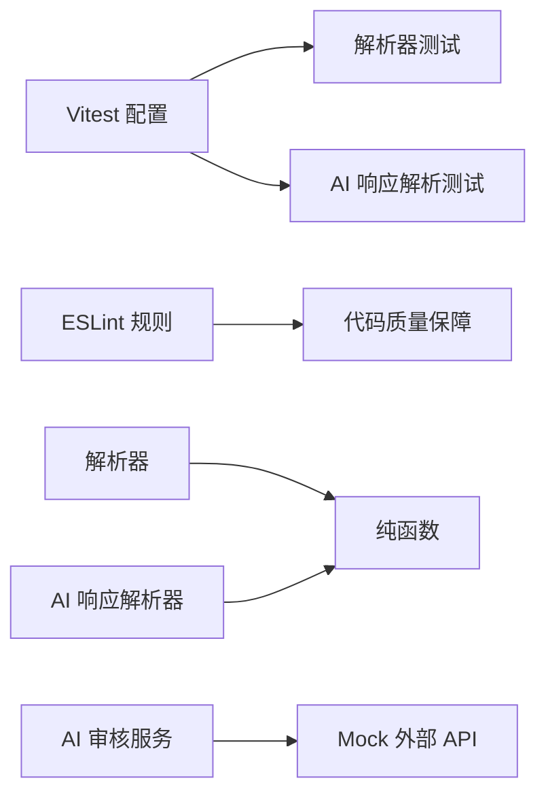

# 测试策略

<cite>
**本文引用的文件**
- [package.json](file://package.json)
- [vite.config.ts](file://vite.config.ts)
- [eslint.config.js](file://eslint.config.js)
- [src/parser/__tests__/parser.test.ts](file://src/parser/__tests__/parser.test.ts)
- [src/utils/__tests__/aiResponseParser.test.ts](file://src/utils/__tests__/aiResponseParser.test.ts)
- [src/parser/parser.ts](file://src/parser/parser.ts)
- [src/utils/aiResponseParser.ts](file://src/utils/aiResponseParser.ts)
- [src/services/aiProofreadService.ts](file://src/services/aiProofreadService.ts)
- [src/hooks/useAIProofread.ts](file://src/hooks/useAIProofread.ts)
- [src/exporter/docxBuilder.ts](file://src/exporter/docxBuilder.ts)
- [src/exporter/index.ts](file://src/exporter/index.ts)
- [backend/main.py](file://backend/main.py)
- [.github/workflows/deploy.yml](file://.github/workflows/deploy.yml)
- [.github/workflows/release.yml](file://.github/workflows/release.yml)
</cite>

## 目录
1. [简介](#简介)
2. [项目结构](#项目结构)
3. [核心组件](#核心组件)
4. [架构总览](#架构总览)
5. [详细组件分析](#详细组件分析)
6. [依赖分析](#依赖分析)
7. [性能考虑](#性能考虑)
8. [故障排查指南](#故障排查指南)
9. [结论](#结论)
10. [附录](#附录)

## 简介
本测试策略文档面向“公文排版工具”项目，系统化阐述前端与后端的测试体系与方法，覆盖单元测试、集成测试与端到端测试的实施要点，并给出覆盖率要求、测试数据准备、测试环境配置、自动化流程与报告生成的实践建议。文档同时提供解析器、AI服务与导出功能的具体测试用例编写思路与参考路径，以及性能、安全与兼容性测试的实施指南。

## 项目结构
项目采用前后端分离架构，前端基于 Vite + React + TypeScript，后端基于 Python FastAPI。测试体系以 Vitest 为核心，结合 ESLint 规范与 GitHub Actions 实现自动化构建与发布。

图表来源
- [vite.config.ts:73-77](file://vite.config.ts#L73-L77)
- [src/parser/parser.ts:1-331](file://src/parser/parser.ts#L1-L331)
- [src/utils/aiResponseParser.ts:1-378](file://src/utils/aiResponseParser.ts#L1-L378)
- [src/services/aiProofreadService.ts:1-516](file://src/services/aiProofreadService.ts#L1-L516)
- [src/hooks/useAIProofread.ts:1-221](file://src/hooks/useAIProofread.ts#L1-L221)
- [src/exporter/docxBuilder.ts:1-806](file://src/exporter/docxBuilder.ts#L1-L806)
- [backend/main.py:1-38](file://backend/main.py#L1-L38)

章节来源
- [vite.config.ts:1-78](file://vite.config.ts#L1-L78)
- [package.json:1-39](file://package.json#L1-L39)
- [eslint.config.js:1-24](file://eslint.config.js#L1-L24)

## 核心组件
- 解析器（parser）：负责将纯文本解析为公文 AST，涵盖标题、主送机关、附件、日期、备注、署名等节点类型的识别与解析。
- AI 响应解析器（aiResponseParser）：解析流式返回的 Markdown 表格，过滤思考内容，构建标准化结果。
- AI 审核服务（aiProofreadService）：构建提示词、发送流式请求、并发调度与重试、进度回调。
- Hook（useAIProofread）：封装 AI 校对流程，管理状态、进度与错误。
- 导出模块（docxBuilder）：将 AST 渲染为符合 GB/T 9704 标准的 DOCX 文档。
- 后端（FastAPI）：提供健康检查与统计服务。

章节来源
- [src/parser/parser.ts:236-331](file://src/parser/parser.ts#L236-L331)
- [src/utils/aiResponseParser.ts:127-294](file://src/utils/aiResponseParser.ts#L127-L294)
- [src/services/aiProofreadService.ts:147-319](file://src/services/aiProofreadService.ts#L147-L319)
- [src/hooks/useAIProofread.ts:67-205](file://src/hooks/useAIProofread.ts#L67-L205)
- [src/exporter/docxBuilder.ts:423-806](file://src/exporter/docxBuilder.ts#L423-L806)
- [backend/main.py:34-37](file://backend/main.py#L34-L37)

## 架构总览
测试架构围绕 Vitest 单元测试与前端组件逻辑展开，辅以后端健康检查验证。前端通过代理访问后端 API，测试环境与生产环境隔离。

图表来源
- [src/parser/parser.ts:236-331](file://src/parser/parser.ts#L236-L331)
- [src/utils/aiResponseParser.ts:127-294](file://src/utils/aiResponseParser.ts#L127-L294)
- [src/services/aiProofreadService.ts:147-319](file://src/services/aiProofreadService.ts#L147-L319)
- [backend/main.py:34-37](file://backend/main.py#L34-L37)

## 详细组件分析

### 解析器测试策略
- 目标：验证 parseGongwen 对标题、主送机关、附件、日期、备注、署名等节点的识别与解析准确性。
- 测试维度：
  - 基本解析：空文本、仅空行、首个非空行标题、行号记录。
  - 标题层级：一至四级标题识别与容错（全角/半角括号、点号）。
  - 主送机关：冒号结尾首行识别与仅触发一次。
  - 附件解析：单附件与多附件模式、同行/分行、序号连续性、异常回退。
  - 备注与署名：日期后括号内容识别、署名关键词与长度约束。
- Mock 策略：无需外部依赖，直接调用解析函数，断言 AST 结构与字段。
- 参考路径：
  - [src/parser/__tests__/parser.test.ts](file://src/parser/__tests__/parser.test.ts)
  - [src/parser/parser.ts](file://src/parser/parser.ts)

图表来源
- [src/parser/parser.ts:236-331](file://src/parser/parser.ts#L236-L331)

章节来源
- [src/parser/__tests__/parser.test.ts:1-500](file://src/parser/__tests__/parser.test.ts#L1-L500)
- [src/parser/parser.ts:236-331](file://src/parser/parser.ts#L236-L331)

### AI 响应解析测试策略
- 目标：验证流式响应解析器对表格行的提取、思考内容过滤、缓冲区刷新与边界情况的处理。
- 测试维度：
  - 表格行解析：带/不带空格、不完整行、分隔行识别。
  - 思考内容过滤：开始/结束标签、跨 chunk、大小写敏感。
  - 边界情况：空输入、多个思考块、序号解析失败。
- Mock 策略：构造 ParserState 与 sentenceMap，模拟增量流式输入，断言结果数组与状态变化。
- 参考路径：
  - [src/utils/__tests__/aiResponseParser.test.ts](file://src/utils/__tests__/aiResponseParser.test.ts)
  - [src/utils/aiResponseParser.ts](file://src/utils/aiResponseParser.ts)

图表来源
- [src/utils/aiResponseParser.ts:127-294](file://src/utils/aiResponseParser.ts#L127-L294)
- [src/utils/aiResponseParser.ts:303-377](file://src/utils/aiResponseParser.ts#L303-L377)

章节来源
- [src/utils/__tests__/aiResponseParser.test.ts:1-319](file://src/utils/__tests__/aiResponseParser.test.ts#L1-L319)
- [src/utils/aiResponseParser.ts:127-294](file://src/utils/aiResponseParser.ts#L127-L294)

### AI 审核服务测试策略
- 目标：验证提示词构建、流式请求发送、并发调度、重试机制与进度回调。
- 测试维度：
  - 提示词模板：内置检查项与示例、用户自定义项拼接。
  - 请求体：消息结构、温度、最大 token、流式开关与采样参数。
  - 流式解析：SSE 数据行、结束标记、JSON 解析与错误处理。
  - 并发与重试：最大并发、块级重试、进度回调。
- Mock 策略：使用 msw 或 vitest 的 fetch mock，拦截 /api 调用，注入响应片段与错误场景。
- 参考路径：
  - [src/services/aiProofreadService.ts](file://src/services/aiProofreadService.ts)
  - [src/hooks/useAIProofread.ts](file://src/hooks/useAIProofread.ts)

图表来源
- [src/hooks/useAIProofread.ts:67-205](file://src/hooks/useAIProofread.ts#L67-L205)
- [src/services/aiProofreadService.ts:147-319](file://src/services/aiProofreadService.ts#L147-L319)
- [src/services/aiProofreadService.ts:332-515](file://src/services/aiProofreadService.ts#L332-L515)

章节来源
- [src/services/aiProofreadService.ts:147-319](file://src/services/aiProofreadService.ts#L147-L319)
- [src/services/aiProofreadService.ts:332-515](file://src/services/aiProofreadService.ts#L332-L515)
- [src/hooks/useAIProofread.ts:67-205](file://src/hooks/useAIProofread.ts#L67-L205)

### 导出功能测试策略
- 目标：验证 docxBuilder 将 AST 渲染为符合 GB/T 9704 标准的 DOCX 文档，包括版头、标题、正文、附件、表格、备注、署名与页码等。
- 测试维度：
  - 版头渲染：发文机关标志、发文字号/签发人、红线、空行间距。
  - 标题渲染：首句样式拆分、三级标题英文句号样式、时间冒号样式。
  - 附件渲染：单/多附件段落样式与缩进。
  - 表格渲染：表头/数据行、边框、字体与行距。
  - 版记与页码：抄送、印发单位/日期、奇偶页页码布局。
- Mock 策略：构造最小 AST 与配置，断言生成的 docx 结构与样式属性。
- 参考路径：
  - [src/exporter/docxBuilder.ts](file://src/exporter/docxBuilder.ts)
  - [src/exporter/index.ts](file://src/exporter/index.ts)

章节来源
- [src/exporter/docxBuilder.ts:423-806](file://src/exporter/docxBuilder.ts#L423-L806)
- [src/exporter/index.ts:1-4](file://src/exporter/index.ts#L1-L4)

### 后端 API 测试策略
- 目标：验证后端健康检查与统计服务可用性。
- 测试维度：
  - 健康检查：GET /api/health 返回健康状态。
  - 生命周期：应用启动时启动后台清理任务，关闭时取消任务。
- Mock 策略：直接调用 FastAPI 应用或使用测试客户端发起请求。
- 参考路径：
  - [backend/main.py](file://backend/main.py)

章节来源
- [backend/main.py:34-37](file://backend/main.py#L34-L37)

## 依赖分析
- 测试运行时：Vitest 配置启用全局测试 API 与 Node 环境，便于纯函数与工具函数测试。
- 代码质量：ESLint 配置 TypeScript 推荐规则与 React Hooks 推荐规则，保证测试代码风格一致。
- 依赖耦合：解析器与工具函数均为纯函数，低耦合、易测试；服务层依赖外部 API，需通过 Mock 控制输入输出。

图表来源
- [vite.config.ts:73-77](file://vite.config.ts#L73-L77)
- [eslint.config.js:8-23](file://eslint.config.js#L8-L23)

章节来源
- [vite.config.ts:73-77](file://vite.config.ts#L73-L77)
- [eslint.config.js:8-23](file://eslint.config.js#L8-L23)

## 性能考虑
- 单元测试性能：优先使用纯函数与内存数据，避免 IO 与网络调用；对大型数据集进行分片测试。
- 并发与重试：AI 服务默认并发与重试策略需在测试中覆盖边界条件（空 blocks、超时、部分失败）。
- 导出性能：docxBuilder 构建复杂文档时，关注段落数与表格数对内存与 CPU 的影响，必要时拆分测试用例。
- 前端渲染：对长文本切分与分块处理进行压力测试，确保 UI 不阻塞。

## 故障排查指南
- 解析器异常：检查标题阶段终止条件、附件解析的序号连续性与异常回退逻辑。
- AI 响应解析：确认思考标签大小写、跨 chunk 结束标签处理与 flushParser 的缓冲区清理。
- 导出样式：核对版头/版记样式、字体与字号映射、页码定位与奇偶页布局。
- 后端健康：确认 /api/health 路由与生命周期钩子，排查后台任务启动与取消。

章节来源
- [src/parser/parser.ts:236-331](file://src/parser/parser.ts#L236-L331)
- [src/utils/aiResponseParser.ts:303-377](file://src/utils/aiResponseParser.ts#L303-L377)
- [src/exporter/docxBuilder.ts:423-806](file://src/exporter/docxBuilder.ts#L423-L806)
- [backend/main.py:12-21](file://backend/main.py#L12-L21)

## 结论
本测试策略以 Vitest 为核心，结合纯函数解析器与工具函数的单元测试、服务层的 Mock 测试与后端健康检查，形成覆盖前端逻辑与后端可用性的测试体系。建议在 CI 中执行单元测试与覆盖率检查，并在发布流程中包含自动化构建与产物校验，确保质量与稳定性。

## 附录

### 单元测试编写规范
- 文件命名：模块目录下的 __tests__ 子目录，测试文件以 .test.ts 结尾。
- 断言风格：使用 expect 与 describe/it 组织测试用例，覆盖正常路径与边界条件。
- Mock 策略：对纯函数直接调用；对外部 API 使用 vitest 的 fetch mock 或 msw。
- 覆盖率要求：建议关键模块（解析器、AI 响应解析器、服务层）行覆盖率不低于 80%，分支覆盖率不低于 60%。

章节来源
- [src/parser/__tests__/parser.test.ts:1-500](file://src/parser/__tests__/parser.test.ts#L1-L500)
- [src/utils/__tests__/aiResponseParser.test.ts:1-319](file://src/utils/__tests__/aiResponseParser.test.ts#L1-L319)

### 集成测试与端到端测试
- 组件测试：对 React 组件进行快照与交互测试，验证状态流转与副作用（如 AI 校对 Hook）。
- API 测试：对后端 /api/health 与统计接口进行请求/响应验证。
- 端到端测试：使用 Playwright 或 Cypress，模拟用户从导入文本到导出 DOCX 的完整流程。

### 测试数据准备
- 解析器：准备包含标题、附件、日期、备注、署名等典型场景的文本样本。
- AI 响应：准备带/不带思考标签、跨 chunk 结束标签、不完整表格等流式响应样本。
- 导出：准备包含版头、表格、附件、版记等元素的 AST 样本。

### 测试环境配置
- Vitest：全局 API 与 Node 环境已在配置中启用。
- ESLint：统一 TypeScript 与 React Hooks 规则，保证测试代码风格一致。
- 代理：前端开发服务器通过代理访问后端 API，测试时可替换为 Mock 服务。

章节来源
- [vite.config.ts:73-77](file://vite.config.ts#L73-L77)
- [eslint.config.js:8-23](file://eslint.config.js#L8-L23)

### 测试自动化与持续集成
- 构建与发布：GitHub Actions 工作流负责构建前端与生成离线单文件 HTML。
- 测试执行：可在 CI 中新增 job 执行 npm run test（若添加），并生成报告。
- 报告生成：建议使用 Vitest 的 JUnit 或 HTML 报告插件，上传到 CI 资源。

章节来源
- [.github/workflows/deploy.yml:18-40](file://.github/workflows/deploy.yml#L18-L40)
- [.github/workflows/release.yml:11-47](file://.github/workflows/release.yml#L11-L47)

### 性能测试、安全测试与兼容性测试
- 性能测试：针对解析器与导出模块进行大数据量压测，监控内存与耗时。
- 安全测试：对用户输入进行 XSS 与注入风险评估，确保导出文档不包含恶意内容。
- 兼容性测试：在目标浏览器（Chrome 78）上验证功能与样式一致性，确保 polyfill 与 CSS 特性降级策略生效。