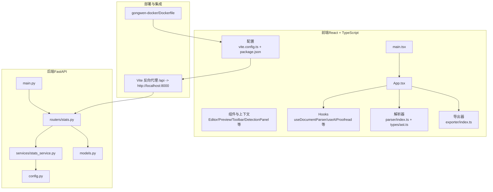
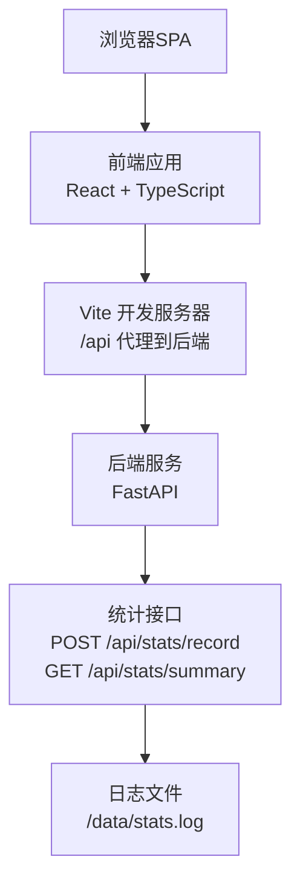
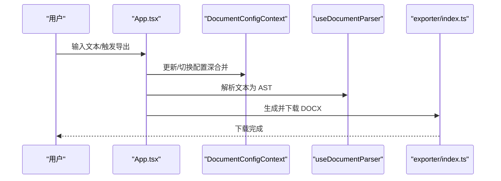
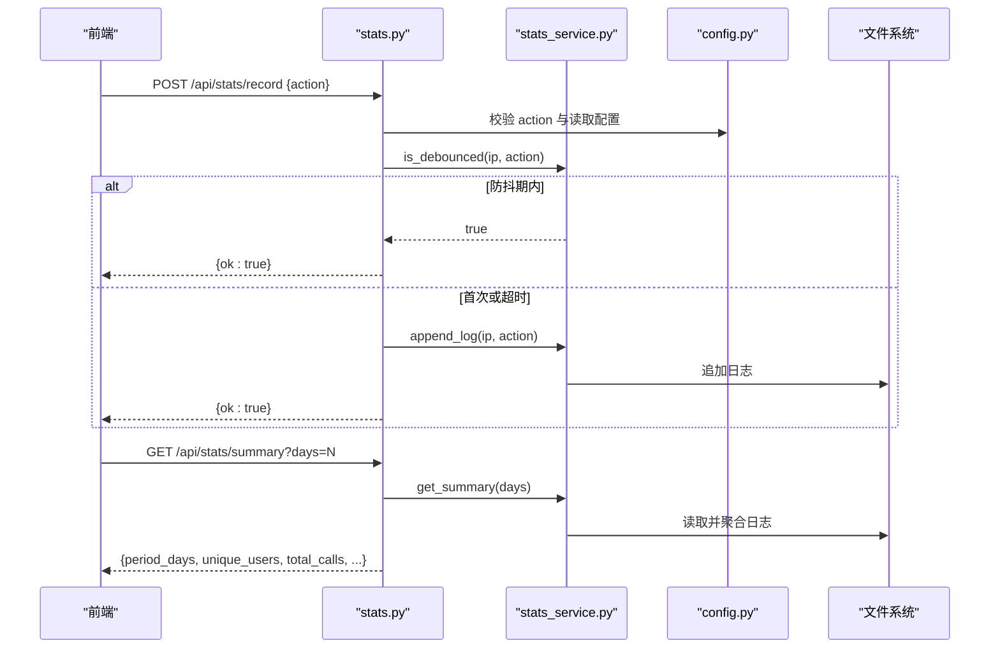
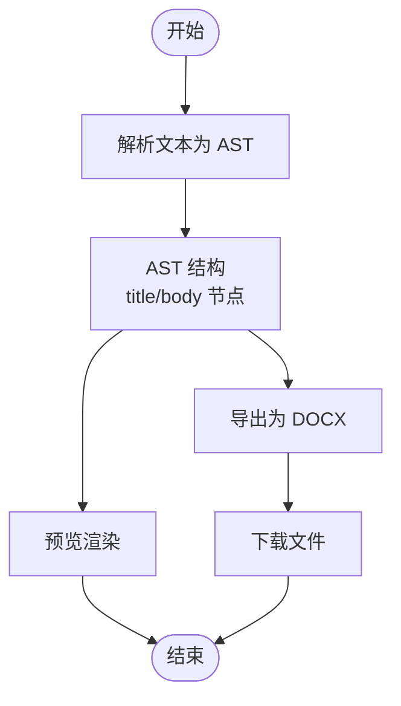
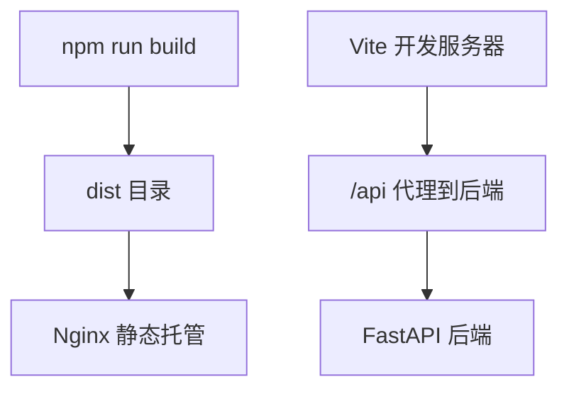
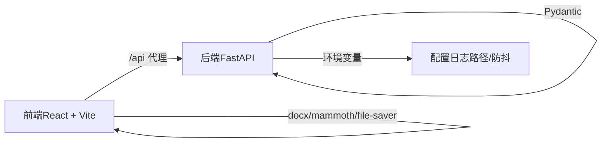

# 项目架构

<cite>
**本文引用的文件**
- [backend/main.py](file://backend/main.py)
- [backend/routers/stats.py](file://backend/routers/stats.py)
- [backend/services/stats_service.py](file://backend/services/stats_service.py)
- [backend/models.py](file://backend/models.py)
- [backend/config.py](file://backend/config.py)
- [src/App.tsx](file://src/App.tsx)
- [src/main.tsx](file://src/main.tsx)
- [src/hooks/useDocumentParser.ts](file://src/hooks/useDocumentParser.ts)
- [src/contexts/DocumentConfigContext.tsx](file://src/contexts/DocumentConfigContext.tsx)
- [src/parser/index.ts](file://src/parser/index.ts)
- [src/types/ast.ts](file://src/types/ast.ts)
- [src/exporter/index.ts](file://src/exporter/index.ts)
- [vite.config.ts](file://vite.config.ts)
- [package.json](file://package.json)
- [gongwen-docker/Dockerfile](file://gongwen-docker/Dockerfile)
</cite>

## 目录
1. [引言](#引言)
2. [项目结构](#项目结构)
3. [核心组件](#核心组件)
4. [架构总览](#架构总览)
5. [详细组件分析](#详细组件分析)
6. [依赖分析](#依赖分析)
7. [性能考量](#性能考量)
8. [故障排查指南](#故障排查指南)
9. [结论](#结论)
10. [附录](#附录)

## 引言
本项目“公文排版工具”旨在提供一个符合 GB/T 9704 标准的在线公文编辑与导出平台。前端采用 React + TypeScript 实现单页应用（SPA），后端基于 FastAPI 提供统计与行为记录接口。系统通过明确的分层与模块化设计，实现表示层、业务逻辑层与数据访问层的职责分离，并通过反向代理与容器化部署实现前后端协同与可扩展部署。

## 项目结构
项目采用前后端分离的目录组织方式：
- 前端位于 src 目录，包含组件、上下文、钩子、解析器、导出器、类型定义与工具模块。
- 后端位于 backend 目录，包含主程序、路由、服务、模型与配置。
- 构建与部署相关配置位于根目录与 gongwen-docker 目录，包含 Vite、Dockerfile 与 Nginx 配置。

图表来源
- [src/App.tsx:1-308](file://src/App.tsx#L1-L308)
- [src/main.tsx:1-14](file://src/main.tsx#L1-L14)
- [src/hooks/useDocumentParser.ts:1-9](file://src/hooks/useDocumentParser.ts#L1-L9)
- [src/parser/index.ts:1-3](file://src/parser/index.ts#L1-L3)
- [src/types/ast.ts:1-81](file://src/types/ast.ts#L1-L81)
- [src/exporter/index.ts:1-4](file://src/exporter/index.ts#L1-L4)
- [vite.config.ts:1-78](file://vite.config.ts#L1-L78)
- [backend/main.py:1-38](file://backend/main.py#L1-L38)
- [backend/routers/stats.py:1-40](file://backend/routers/stats.py#L1-L40)
- [backend/services/stats_service.py:1-124](file://backend/services/stats_service.py#L1-L124)
- [backend/models.py:1-23](file://backend/models.py#L1-L23)
- [backend/config.py:1-16](file://backend/config.py#L1-L16)
- [gongwen-docker/Dockerfile:1-19](file://gongwen-docker/Dockerfile#L1-L19)

章节来源
- [src/App.tsx:1-308](file://src/App.tsx#L1-L308)
- [src/main.tsx:1-14](file://src/main.tsx#L1-L14)
- [vite.config.ts:1-78](file://vite.config.ts#L1-L78)
- [backend/main.py:1-38](file://backend/main.py#L1-L38)
- [gongwen-docker/Dockerfile:1-19](file://gongwen-docker/Dockerfile#L1-L19)

## 核心组件
- 前端应用入口与上下文
  - 应用入口负责提供全局配置上下文与渲染根组件。
  - 文档配置上下文提供深合并与持久化能力，支撑多配置与 AI 校对配置。
- 前端解析与导出
  - 解析器将文本转换为公文 AST，供编辑器与预览使用。
  - 导出器负责生成并下载 DOCX 文档。
- 后端统计服务
  - 提供行为记录与统计摘要接口，具备防抖与日志聚合能力。
- 构建与部署
  - Vite 提供开发服务器与 PWA 支持；Dockerfile 使用 Nginx 静态托管前端产物。

章节来源
- [src/main.tsx:1-14](file://src/main.tsx#L1-L14)
- [src/contexts/DocumentConfigContext.tsx:1-297](file://src/contexts/DocumentConfigContext.tsx#L1-L297)
- [src/hooks/useDocumentParser.ts:1-9](file://src/hooks/useDocumentParser.ts#L1-L9)
- [src/parser/index.ts:1-3](file://src/parser/index.ts#L1-L3)
- [src/types/ast.ts:1-81](file://src/types/ast.ts#L1-L81)
- [src/exporter/index.ts:1-4](file://src/exporter/index.ts#L1-L4)
- [backend/routers/stats.py:1-40](file://backend/routers/stats.py#L1-L40)
- [backend/services/stats_service.py:1-124](file://backend/services/stats_service.py#L1-L124)
- [vite.config.ts:1-78](file://vite.config.ts#L1-L78)
- [gongwen-docker/Dockerfile:1-19](file://gongwen-docker/Dockerfile#L1-L19)

## 架构总览
系统采用前后端分离架构：
- 前端 SPA 通过 Vite 开发服务器运行，开发时通过反向代理将 /api 请求转发至后端。
- 后端 FastAPI 提供统计接口，使用 Pydantic 定义请求/响应模型，服务层实现防抖与日志聚合。
- 部署阶段，前端构建产物由 Nginx 静态托管，后端通过容器化运行并在同一网络内被前端访问。

图表来源
- [vite.config.ts:63-72](file://vite.config.ts#L63-L72)
- [backend/main.py:24-38](file://backend/main.py#L24-L38)
- [backend/routers/stats.py:12-39](file://backend/routers/stats.py#L12-L39)
- [backend/services/stats_service.py:44-55](file://backend/services/stats_service.py#L44-L55)
- [backend/config.py:6-16](file://backend/config.py#L6-L16)

## 详细组件分析

### 前端应用与上下文
- 应用入口负责注入文档配置上下文，确保各组件共享统一的配置状态与持久化策略。
- 文档配置上下文提供深合并、切换、保存与删除等操作，并将状态持久化到 localStorage。
- 解析钩子将文本转换为 AST，供编辑器与预览使用；导出器负责生成并下载 DOCX。

图表来源
- [src/App.tsx:54-305](file://src/App.tsx#L54-L305)
- [src/contexts/DocumentConfigContext.tsx:90-156](file://src/contexts/DocumentConfigContext.tsx#L90-L156)
- [src/hooks/useDocumentParser.ts:6-8](file://src/hooks/useDocumentParser.ts#L6-L8)
- [src/exporter/index.ts:1-4](file://src/exporter/index.ts#L1-L4)

章节来源
- [src/main.tsx:1-14](file://src/main.tsx#L1-L14)
- [src/App.tsx:1-308](file://src/App.tsx#L1-L308)
- [src/contexts/DocumentConfigContext.tsx:1-297](file://src/contexts/DocumentConfigContext.tsx#L1-L297)
- [src/hooks/useDocumentParser.ts:1-9](file://src/hooks/useDocumentParser.ts#L1-L9)
- [src/exporter/index.ts:1-4](file://src/exporter/index.ts#L1-L4)

### 后端统计服务
- 应用生命周期管理：启动后台任务定期清理防抖缓存。
- 路由层：校验 action 合法性，提取真实 IP，执行防抖检查并写入日志；提供统计摘要查询。
- 服务层：实现防抖缓存、日志追加与按天统计聚合。
- 模型层：使用 Pydantic 定义请求/响应结构。

图表来源
- [backend/main.py:12-21](file://backend/main.py#L12-L21)
- [backend/routers/stats.py:12-39](file://backend/routers/stats.py#L12-L39)
- [backend/services/stats_service.py:15-55](file://backend/services/stats_service.py#L15-L55)
- [backend/config.py:5-16](file://backend/config.py#L5-L16)
- [backend/models.py:6-23](file://backend/models.py#L6-L23)

章节来源
- [backend/main.py:1-38](file://backend/main.py#L1-L38)
- [backend/routers/stats.py:1-40](file://backend/routers/stats.py#L1-L40)
- [backend/services/stats_service.py:1-124](file://backend/services/stats_service.py#L1-L124)
- [backend/models.py:1-23](file://backend/models.py#L1-L23)
- [backend/config.py:1-16](file://backend/config.py#L1-L16)

### 数据模型与解析流程
- AST 类型定义涵盖标题、正文、附件、表格等节点类型，支持多段标题与表格行列结构。
- 解析器将输入文本转换为 AST，供编辑器与预览使用；导出器根据 AST 生成 DOCX 并下载。

图表来源
- [src/types/ast.ts:1-81](file://src/types/ast.ts#L1-L81)
- [src/parser/index.ts:1-3](file://src/parser/index.ts#L1-L3)
- [src/exporter/index.ts:1-4](file://src/exporter/index.ts#L1-L4)

章节来源
- [src/types/ast.ts:1-81](file://src/types/ast.ts#L1-L81)
- [src/parser/index.ts:1-3](file://src/parser/index.ts#L1-L3)
- [src/exporter/index.ts:1-4](file://src/exporter/index.ts#L1-L4)

### 构建与部署
- Vite 配置支持 PWA 与单文件打包模式，开发服务器通过代理将 /api 请求转发至后端。
- Dockerfile 使用 Nginx 静态托管前端构建产物，暴露 80 端口。

图表来源
- [vite.config.ts:1-78](file://vite.config.ts#L1-L78)
- [gongwen-docker/Dockerfile:1-19](file://gongwen-docker/Dockerfile#L1-L19)

章节来源
- [vite.config.ts:1-78](file://vite.config.ts#L1-L78)
- [gongwen-docker/Dockerfile:1-19](file://gongwen-docker/Dockerfile#L1-L19)

## 依赖分析
- 前端依赖
  - React 与 React DOM：构建用户界面。
  - docx、file-saver、mammoth：文档处理与导出。
  - Vite、React 插件与 PWA 插件：构建与离线能力。
- 后端依赖
  - FastAPI：Web 框架。
  - Pydantic：请求/响应模型验证。
- 配置耦合
  - 前端通过 Vite 代理访问后端接口。
  - 后端通过环境变量配置日志路径与防抖参数。

图表来源
- [vite.config.ts:63-72](file://vite.config.ts#L63-L72)
- [backend/config.py:6-16](file://backend/config.py#L6-L16)
- [package.json:13-38](file://package.json#L13-L38)

章节来源
- [package.json:1-39](file://package.json#L1-L39)
- [vite.config.ts:1-78](file://vite.config.ts#L1-L78)
- [backend/config.py:1-16](file://backend/config.py#L1-L16)

## 性能考量
- 前端
  - 使用 useMemo 与防抖自动保存，降低重渲染与本地存储压力。
  - 解析与导出过程建议在后台线程或分块处理，避免阻塞主线程。
- 后端
  - 防抖缓存与周期清理减少重复记录与内存占用。
  - 日志聚合按天过滤，避免全量扫描带来的 IO 压力。
- 部署
  - Nginx 静态托管前端，减少服务器资源消耗。
  - 单文件打包模式便于离线分发与快速部署。

## 故障排查指南
- 健康检查
  - 后端提供健康检查接口，用于确认服务可用性。
- 统计接口
  - 若记录失败，检查 action 是否在允许集合内，以及代理配置是否正确。
  - 若统计为空，确认日志文件是否存在且格式正确。
- 前端代理
  - 开发时若 /api 无法访问，检查 Vite 代理目标与端口是否匹配后端监听地址。

章节来源
- [backend/main.py:34-37](file://backend/main.py#L34-L37)
- [backend/routers/stats.py:12-39](file://backend/routers/stats.py#L12-L39)
- [backend/services/stats_service.py:77-84](file://backend/services/stats_service.py#L77-L84)
- [vite.config.ts:63-72](file://vite.config.ts#L63-L72)

## 结论
本项目通过清晰的前后端分层与模块化组织，实现了公文编辑与导出的核心功能。前端以组件化与上下文驱动状态管理，后端以路由与服务分离实现统计能力。结合 Vite 的开发体验与 Nginx 的静态托管，系统具备良好的可维护性与可扩展性。后续可在解析与导出性能、日志存储与查询优化等方面进一步增强。

## 附录
- 技术栈选择理由
  - 前端：React + TypeScript 提供强类型与组件化能力；Vite/PWA 提升开发效率与用户体验。
  - 后端：FastAPI 提供高性能与自动生成 OpenAPI 文档的能力；Pydantic 确保数据一致性。
- 架构决策权衡
  - 分层架构：前后端分离提升团队协作与部署灵活性；MVC 思想体现在前端组件与上下文、后端路由与服务的职责划分。
  - SPA 与静态托管：简化后端负载，提高首屏加载速度；通过代理实现开发期联调。
  - 防抖与日志：平衡用户体验与数据准确性，避免重复统计与资源浪费。