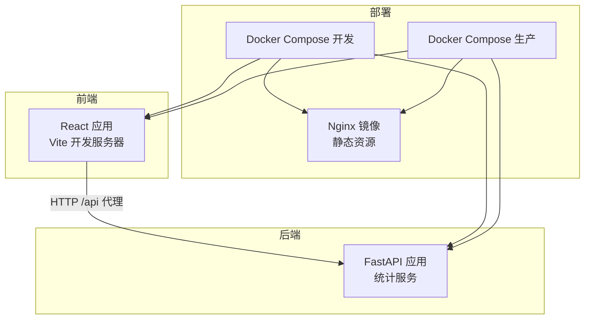
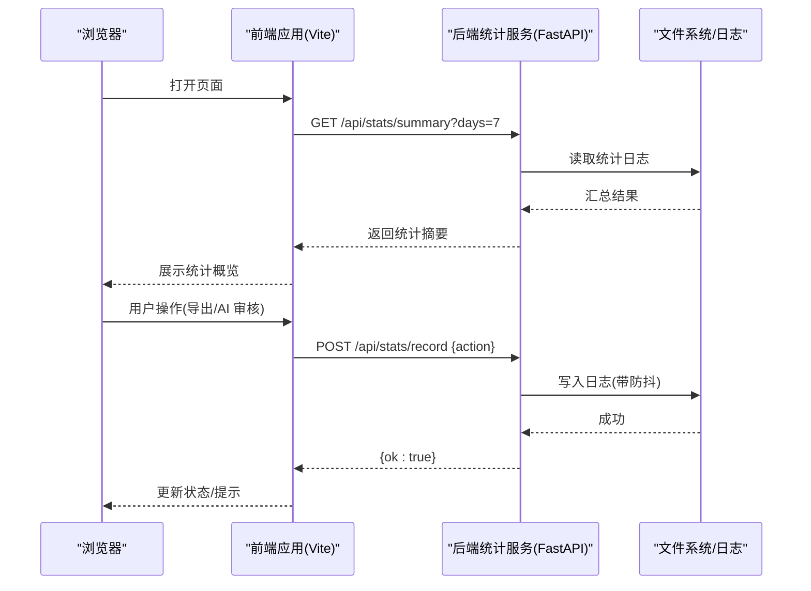
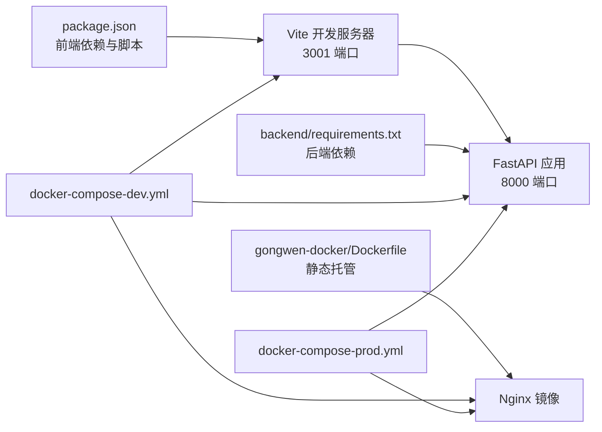

# 快速开始

<cite>
**本文引用的文件**
- [package.json](file://package.json)
- [vite.config.ts](file://vite.config.ts)
- [index.html](file://index.html)
- [src/main.tsx](file://src/main.tsx)
- [src/App.tsx](file://src/App.tsx)
- [backend/main.py](file://backend/main.py)
- [backend/requirements.txt](file://backend/requirements.txt)
- [backend/Dockerfile](file://backend/Dockerfile)
- [backend/config.py](file://backend/config.py)
- [backend/models.py](file://backend/models.py)
- [backend/routers/stats.py](file://backend/routers/stats.py)
- [backend/services/stats_service.py](file://backend/services/stats_service.py)
- [gongwen-docker/Dockerfile](file://gongwen-docker/Dockerfile)
- [gongwen-docker/docker-compose-dev.yml](file://gongwen-docker/docker-compose-dev.yml)
- [gongwen-docker/docker-compose-prod.yml](file://gongwen-docker/docker-compose-prod.yml)
- [gongwen-docker/README.md](file://gongwen-docker/README.md)
</cite>

## 目录
1. [简介](#简介)
2. [项目结构](#项目结构)
3. [核心组件](#核心组件)
4. [架构总览](#架构总览)
5. [详细组件分析](#详细组件分析)
6. [依赖分析](#依赖分析)
7. [性能考虑](#性能考虑)
8. [故障排除指南](#故障排除指南)
9. [结论](#结论)
10. [附录](#附录)

## 简介
本指南面向首次接触“公文排版工具”的用户，帮助您在本地快速完成环境准备、安装与启动，并掌握基本使用方法。该工具由前端 React 应用与后端 Python FastAPI 统计服务组成，支持单文件打包部署与 Docker 容器化部署两种方式。

## 项目结构
该项目采用前后端分离架构：
- 前端：基于 React + TypeScript，通过 Vite 构建与开发；支持 PWA 与单文件打包。
- 后端：基于 Python FastAPI，提供统计记录与查询接口，内置防抖与周期清理机制。
- 部署：提供 Dockerfile 与 docker-compose 配置，支持开发与生产环境一键启动。

图表来源
- [vite.config.ts:63-72](file://vite.config.ts#L63-L72)
- [backend/main.py:24-37](file://backend/main.py#L24-L37)
- [gongwen-docker/docker-compose-dev.yml:6-26](file://gongwen-docker/docker-compose-dev.yml#L6-L26)
- [gongwen-docker/docker-compose-prod.yml:4-21](file://gongwen-docker/docker-compose-prod.yml#L4-L21)

章节来源
- [package.json:6-12](file://package.json#L6-L12)
- [vite.config.ts:15-77](file://vite.config.ts#L15-L77)
- [backend/main.py:12-37](file://backend/main.py#L12-L37)

## 核心组件
- 前端应用入口与上下文
  - 应用入口负责初始化 React 根节点与全局配置上下文。
  - 关键路径：[src/main.tsx:1-14](file://src/main.tsx#L1-L14)
- 主界面与功能
  - 主界面负责编辑、预览、检测面板、工具栏、AI 审核等功能编排。
  - 关键路径：[src/App.tsx:1-308](file://src/App.tsx#L1-L308)
- 健康检查与路由注册
  - FastAPI 应用定义健康检查端点与统计路由。
  - 关键路径：[backend/main.py:24-37](file://backend/main.py#L24-L37)
- 统计服务
  - 提供记录与汇总接口，内置防抖、日志写入与周期清理。
  - 关键路径：[backend/routers/stats.py:1-40](file://backend/routers/stats.py#L1-L40), [backend/services/stats_service.py:1-124](file://backend/services/stats_service.py#L1-L124)

章节来源
- [src/main.tsx:1-14](file://src/main.tsx#L1-L14)
- [src/App.tsx:54-305](file://src/App.tsx#L54-L305)
- [backend/main.py:24-37](file://backend/main.py#L24-L37)
- [backend/routers/stats.py:1-40](file://backend/routers/stats.py#L1-L40)
- [backend/services/stats_service.py:1-124](file://backend/services/stats_service.py#L1-L124)

## 架构总览
下图展示了从浏览器到后端统计服务的典型交互流程，以及开发与生产环境的部署差异。

图表来源
- [backend/routers/stats.py:35-40](file://backend/routers/stats.py#L35-L40)
- [backend/services/stats_service.py:44-55](file://backend/services/stats_service.py#L44-L55)
- [backend/services/stats_service.py:57-124](file://backend/services/stats_service.py#L57-L124)

## 详细组件分析

### 前端开发与构建
- 开发服务器
  - Vite 在本地启动开发服务器，默认端口为 3001，并配置了对后端 /api 的反向代理。
  - 关键路径：[vite.config.ts:63-72](file://vite.config.ts#L63-L72)
- 构建与单文件打包
  - 支持标准构建与单文件打包两种模式，后者适合离线场景。
  - 关键路径：[package.json:6-12](file://package.json#L6-L12), [vite.config.ts:7-8](file://vite.config.ts#L7-L8)
- 应用入口与 HTML 结构
  - 应用通过 index.html 加载根节点，入口脚本初始化 React 根节点与全局上下文。
  - 关键路径：[index.html:1-17](file://index.html#L1-L17), [src/main.tsx:1-14](file://src/main.tsx#L1-L14)

章节来源
- [vite.config.ts:15-77](file://vite.config.ts#L15-L77)
- [package.json:6-12](file://package.json#L6-L12)
- [index.html:1-17](file://index.html#L1-L17)
- [src/main.tsx:1-14](file://src/main.tsx#L1-L14)

### 后端统计服务
- 应用生命周期与健康检查
  - 应用启动时创建后台任务进行防抖缓存清理；提供 /api/health 健康检查端点。
  - 关键路径：[backend/main.py:12-21](file://backend/main.py#L12-L21), [backend/main.py:34-37](file://backend/main.py#L34-L37)
- 路由与模型
  - 提供 /api/stats/record 记录接口与 /api/stats/summary 汇总接口；定义请求/响应模型。
  - 关键路径：[backend/routers/stats.py:1-40](file://backend/routers/stats.py#L1-L40), [backend/models.py:1-23](file://backend/models.py#L1-L23)
- 统计核心逻辑
  - 防抖缓存、日志写入、周期清理、按天数过滤统计。
  - 关键路径：[backend/services/stats_service.py:15-24](file://backend/services/stats_service.py#L15-L24), [backend/services/stats_service.py:37-42](file://backend/services/stats_service.py#L37-L42), [backend/services/stats_service.py:44-55](file://backend/services/stats_service.py#L44-L55), [backend/services/stats_service.py:57-124](file://backend/services/stats_service.py#L57-L124)

章节来源
- [backend/main.py:12-37](file://backend/main.py#L12-L37)
- [backend/routers/stats.py:1-40](file://backend/routers/stats.py#L1-L40)
- [backend/models.py:1-23](file://backend/models.py#L1-L23)
- [backend/services/stats_service.py:1-124](file://backend/services/stats_service.py#L1-L124)

### 部署与运行
- 单文件部署（静态）
  - 使用 Nginx 镜像直接托管前端构建产物，适合单文件打包后的离线部署。
  - 关键路径：[gongwen-docker/Dockerfile:1-19](file://gongwen-docker/Dockerfile#L1-L19)
- Docker Compose 开发/生产
  - 提供开发与生产两套 compose 配置，分别映射不同端口与 Nginx 配置。
  - 关键路径：[gongwen-docker/docker-compose-dev.yml:1-44](file://gongwen-docker/docker-compose-dev.yml#L1-L44), [gongwen-docker/docker-compose-prod.yml:1-36](file://gongwen-docker/docker-compose-prod.yml#L1-L36)
- 后端镜像
  - 基于 Python slim 镜像，安装依赖并暴露 8000 端口。
  - 关键路径：[backend/Dockerfile:1-18](file://backend/Dockerfile#L1-L18), [backend/requirements.txt:1-3](file://backend/requirements.txt#L1-L3)

章节来源
- [gongwen-docker/Dockerfile:1-19](file://gongwen-docker/Dockerfile#L1-L19)
- [gongwen-docker/docker-compose-dev.yml:1-44](file://gongwen-docker/docker-compose-dev.yml#L1-L44)
- [gongwen-docker/docker-compose-prod.yml:1-36](file://gongwen-docker/docker-compose-prod.yml#L1-L36)
- [backend/Dockerfile:1-18](file://backend/Dockerfile#L1-L18)
- [backend/requirements.txt:1-3](file://backend/requirements.txt#L1-L3)

## 依赖分析
- 前端依赖与脚本
  - 包含 React、docx、mammoth 等依赖；提供 dev/build/preview/lint 等脚本。
  - 关键路径：[package.json:1-39](file://package.json#L1-L39)
- 后端依赖与镜像
  - FastAPI 与 Uvicorn；Python 3.12 slim 镜像。
  - 关键路径：[backend/requirements.txt:1-3](file://backend/requirements.txt#L1-L3), [backend/Dockerfile:1-18](file://backend/Dockerfile#L1-L18)
- 代理与端口
  - 前端开发服务器默认端口 3001，反向代理至后端 8000；Compose 中映射端口视环境而定。
  - 关键路径：[vite.config.ts:63-72](file://vite.config.ts#L63-L72), [gongwen-docker/docker-compose-dev.yml:13-14](file://gongwen-docker/docker-compose-dev.yml#L13-L14), [gongwen-docker/docker-compose-prod.yml:8-9](file://gongwen-docker/docker-compose-prod.yml#L8-L9)

图表来源
- [package.json:1-39](file://package.json#L1-L39)
- [vite.config.ts:63-72](file://vite.config.ts#L63-L72)
- [backend/requirements.txt:1-3](file://backend/requirements.txt#L1-L3)
- [backend/Dockerfile:1-18](file://backend/Dockerfile#L1-L18)
- [gongwen-docker/Dockerfile:1-19](file://gongwen-docker/Dockerfile#L1-L19)
- [gongwen-docker/docker-compose-dev.yml:1-44](file://gongwen-docker/docker-compose-dev.yml#L1-L44)
- [gongwen-docker/docker-compose-prod.yml:1-36](file://gongwen-docker/docker-compose-prod.yml#L1-L36)

章节来源
- [package.json:1-39](file://package.json#L1-L39)
- [backend/requirements.txt:1-3](file://backend/requirements.txt#L1-L3)
- [vite.config.ts:63-72](file://vite.config.ts#L63-L72)
- [gongwen-docker/docker-compose-dev.yml:1-44](file://gongwen-docker/docker-compose-dev.yml#L1-L44)
- [gongwen-docker/docker-compose-prod.yml:1-36](file://gongwen-docker/docker-compose-prod.yml#L1-L36)

## 性能考虑
- 防抖与缓存
  - 后端对同一 IP 的相同动作进行防抖，降低重复记录频率；周期性清理防抖缓存，避免内存膨胀。
  - 关键路径：[backend/services/stats_service.py:15-24](file://backend/services/stats_service.py#L15-L24), [backend/services/stats_service.py:37-42](file://backend/services/stats_service.py#L37-L42)
- 构建目标与兼容性
  - 前端构建目标与 CSS 目标均设置为 chrome78，确保在较老浏览器中稳定运行。
  - 关键路径：[vite.config.ts:54-59](file://vite.config.ts#L54-L59)
- 单文件打包
  - 单文件模式可减少资源加载次数，适合离线或单页应用场景。
  - 关键路径：[vite.config.ts:7-8](file://vite.config.ts#L7-L8), [package.json:9](file://package.json#L9)

章节来源
- [backend/services/stats_service.py:15-42](file://backend/services/stats_service.py#L15-L42)
- [vite.config.ts:54-59](file://vite.config.ts#L54-L59)
- [package.json:9](file://package.json#L9)

## 故障排除指南
- 健康检查失败
  - 前端无法访问 /api 时，检查 Vite 代理配置与后端端口是否正确。
  - 关键路径：[vite.config.ts:63-72](file://vite.config.ts#L63-L72)
- 统计接口异常
  - 确认后端日志路径与权限、防抖与清理任务是否正常运行。
  - 关键路径：[backend/config.py:6](file://backend/config.py#L6), [backend/services/stats_service.py:37-42](file://backend/services/stats_service.py#L37-L42)
- Docker 端口冲突
  - 开发与生产环境映射不同端口，确认宿主机端口未被占用。
  - 关键路径：[gongwen-docker/docker-compose-dev.yml:13-14](file://gongwen-docker/docker-compose-dev.yml#L13-L14), [gongwen-docker/docker-compose-prod.yml:8-9](file://gongwen-docker/docker-compose-prod.yml#L8-L9)
- 静态资源无法加载
  - 单文件部署需先执行构建，再由 Nginx 镜像托管。
  - 关键路径：[gongwen-docker/Dockerfile:10-12](file://gongwen-docker/Dockerfile#L10-L12)

章节来源
- [vite.config.ts:63-72](file://vite.config.ts#L63-L72)
- [backend/config.py:6](file://backend/config.py#L6)
- [backend/services/stats_service.py:37-42](file://backend/services/stats_service.py#L37-L42)
- [gongwen-docker/docker-compose-dev.yml:13-14](file://gongwen-docker/docker-compose-dev.yml#L13-L14)
- [gongwen-docker/docker-compose-prod.yml:8-9](file://gongwen-docker/docker-compose-prod.yml#L8-L9)
- [gongwen-docker/Dockerfile:10-12](file://gongwen-docker/Dockerfile#L10-L12)

## 结论
通过本快速开始指南，您已经完成了环境准备、安装与启动，并了解了核心功能与部署选项。建议在本地开发完成后，参考部署章节选择单文件或 Docker 方案进行上线。

## 附录

### 环境要求与版本说明
- Node.js
  - 用于前端开发与构建，推荐使用长期支持版本（LTS）。
  - 关键路径：[package.json:1-39](file://package.json#L1-L39)
- Python
  - 后端运行时与依赖安装，使用 Python 3.12 slim 镜像。
  - 关键路径：[backend/Dockerfile:1](file://backend/Dockerfile#L1), [backend/requirements.txt:1-3](file://backend/requirements.txt#L1-L3)
- Docker
  - 用于容器化部署，包含前端静态镜像与后端 API 镜像。
  - 关键路径：[gongwen-docker/Dockerfile:1-19](file://gongwen-docker/Dockerfile#L1-L19), [backend/Dockerfile:1-18](file://backend/Dockerfile#L1-L18)

章节来源
- [package.json:1-39](file://package.json#L1-L39)
- [backend/Dockerfile:1-18](file://backend/Dockerfile#L1-L18)
- [backend/requirements.txt:1-3](file://backend/requirements.txt#L1-L3)
- [gongwen-docker/Dockerfile:1-19](file://gongwen-docker/Dockerfile#L1-L19)

### 安装与启动步骤
- 克隆仓库与安装依赖
  - 前端依赖安装与脚本定义见 package.json。
  - 关键路径：[package.json:1-39](file://package.json#L1-L39)
- 启动前端开发服务器
  - 使用 Vite 启动开发服务器，默认端口 3001，并配置 /api 代理。
  - 关键路径：[vite.config.ts:63-72](file://vite.config.ts#L63-L72)
- 启动后端统计服务
  - 使用 uvicorn 运行 FastAPI 应用，监听 8000 端口。
  - 关键路径：[backend/Dockerfile:15-18](file://backend/Dockerfile#L15-L18), [backend/main.py:24-37](file://backend/main.py#L24-L37)
- 数据库与日志
  - 后端通过文件系统写入日志，路径可通过环境变量配置。
  - 关键路径：[backend/config.py:6](file://backend/config.py#L6), [backend/services/stats_service.py:44-55](file://backend/services/stats_service.py#L44-L55)

章节来源
- [package.json:1-39](file://package.json#L1-L39)
- [vite.config.ts:63-72](file://vite.config.ts#L63-L72)
- [backend/Dockerfile:15-18](file://backend/Dockerfile#L15-L18)
- [backend/main.py:24-37](file://backend/main.py#L24-L37)
- [backend/config.py:6](file://backend/config.py#L6)
- [backend/services/stats_service.py:44-55](file://backend/services/stats_service.py#L44-L55)

### 构建与部署选项
- 单文件部署
  - 先执行构建，再使用 Nginx 镜像托管静态资源。
  - 关键路径：[package.json:9](file://package.json#L9), [gongwen-docker/Dockerfile:10-12](file://gongwen-docker/Dockerfile#L10-L12)
- Docker 容器化部署
  - 开发与生产环境分别使用不同的 compose 配置与端口映射。
  - 关键路径：[gongwen-docker/docker-compose-dev.yml:1-44](file://gongwen-docker/docker-compose-dev.yml#L1-L44), [gongwen-docker/docker-compose-prod.yml:1-36](file://gongwen-docker/docker-compose-prod.yml#L1-L36)

章节来源
- [package.json:9](file://package.json#L9)
- [gongwen-docker/Dockerfile:10-12](file://gongwen-docker/Dockerfile#L10-L12)
- [gongwen-docker/docker-compose-dev.yml:1-44](file://gongwen-docker/docker-compose-dev.yml#L1-L44)
- [gongwen-docker/docker-compose-prod.yml:1-36](file://gongwen-docker/docker-compose-prod.yml#L1-L36)

### 基本使用示例
- 导出为 Word
  - 在主界面点击导出按钮，触发下载流程并上报统计。
  - 关键路径：[src/App.tsx:123-131](file://src/App.tsx#L123-L131)
- AI 审核
  - 配置 AI 服务后，启动审核流程并查看检测面板结果。
  - 关键路径：[src/App.tsx:199-207](file://src/App.tsx#L199-L207)

章节来源
- [src/App.tsx:123-131](file://src/App.tsx#L123-L131)
- [src/App.tsx:199-207](file://src/App.tsx#L199-L207)