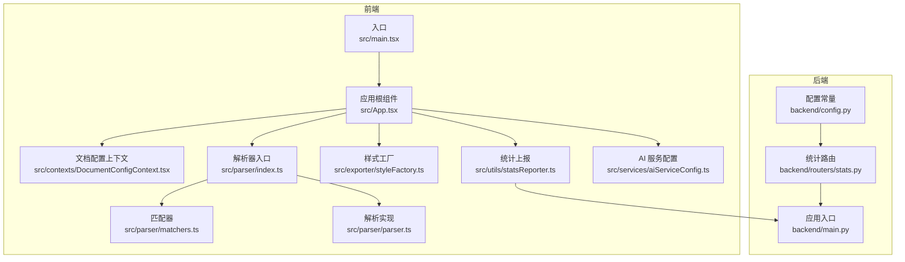
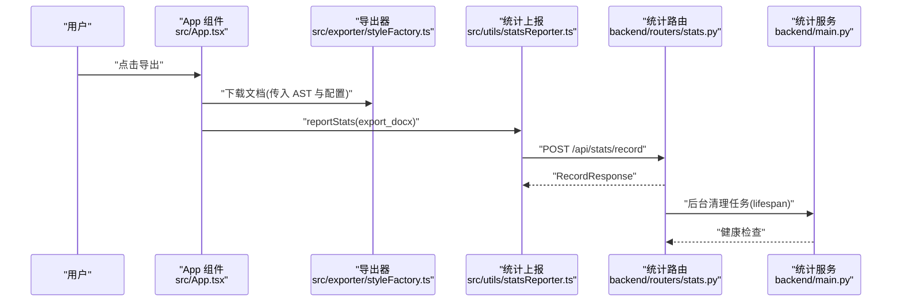
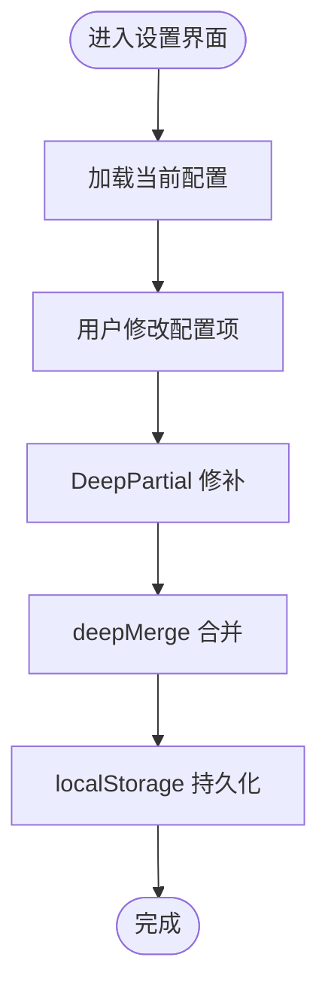
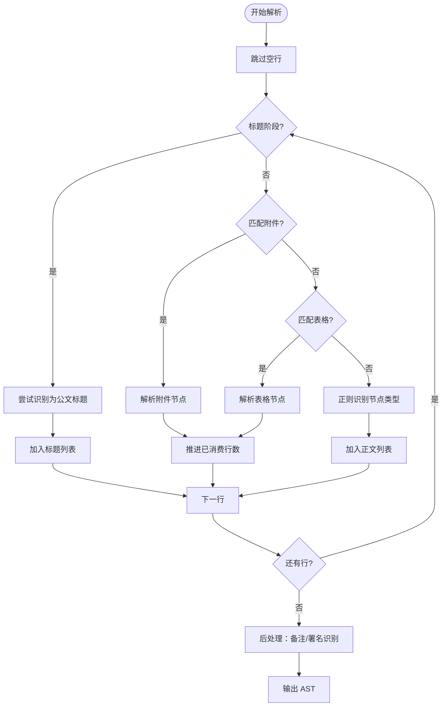
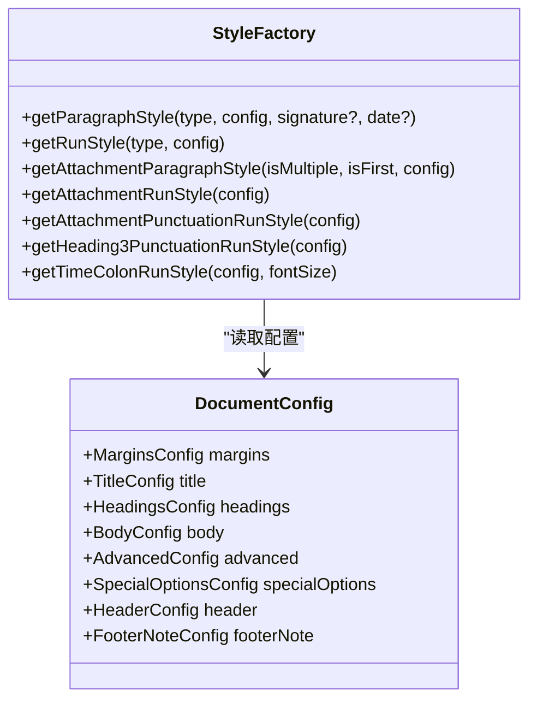
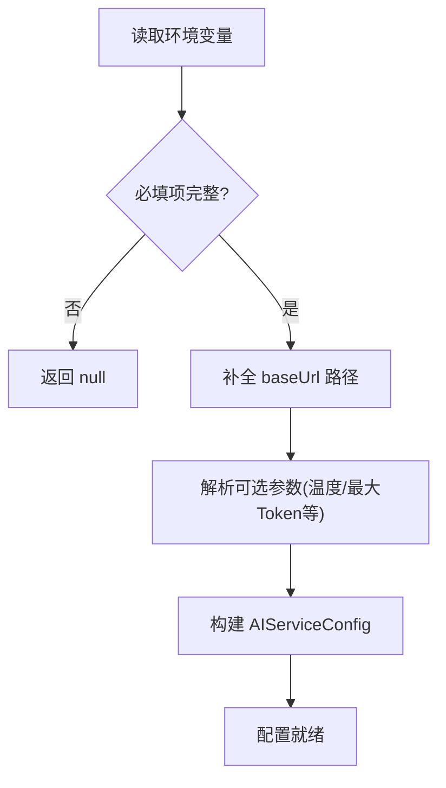
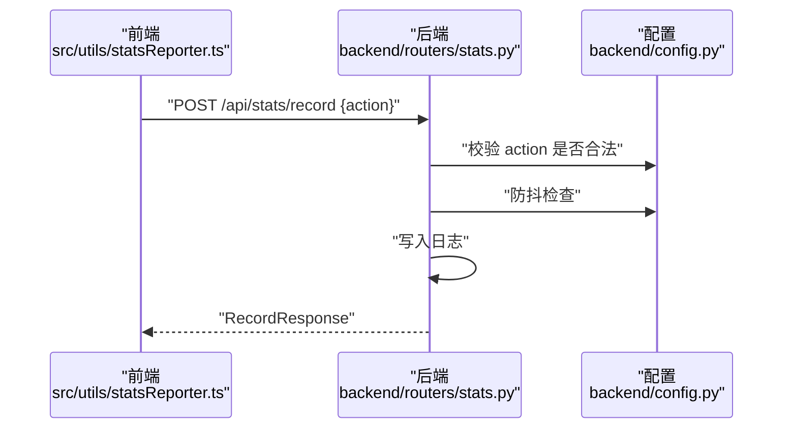
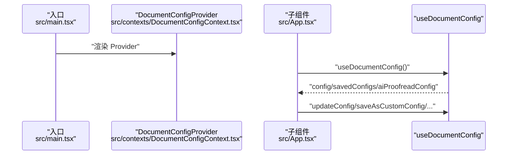
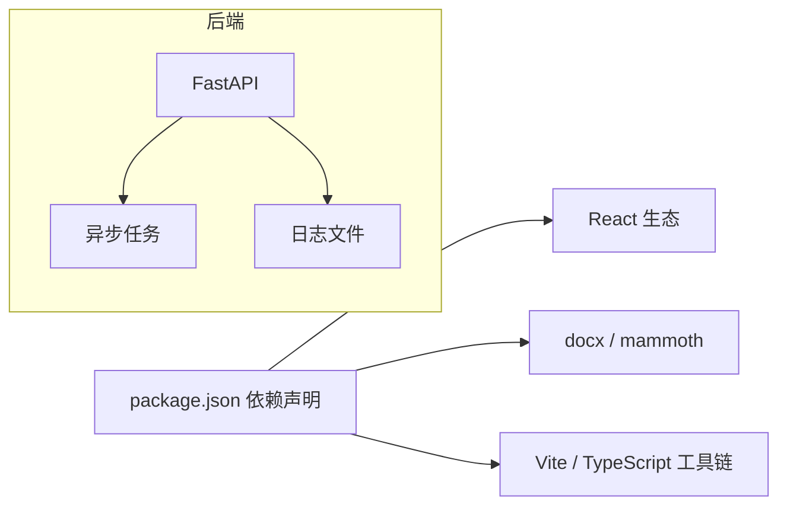

# 扩展开发

<cite>
**本文引用的文件**
- [package.json](file://package.json)
- [src/main.tsx](file://src/main.tsx)
- [src/App.tsx](file://src/App.tsx)
- [src/contexts/DocumentConfigContext.tsx](file://src/contexts/DocumentConfigContext.tsx)
- [src/hooks/useDocumentParser.ts](file://src/hooks/useDocumentParser.ts)
- [src/parser/index.ts](file://src/parser/index.ts)
- [src/parser/matchers.ts](file://src/parser/matchers.ts)
- [src/parser/parser.ts](file://src/parser/parser.ts)
- [src/services/aiServiceConfig.ts](file://src/services/aiServiceConfig.ts)
- [src/tabs/documentConfig.ts](file://src/types/documentConfig.ts)
- [src/exporter/styleFactory.ts](file://src/exporter/styleFactory.ts)
- [src/utils/statsReporter.ts](file://src/utils/statsReporter.ts)
- [backend/main.py](file://backend/main.py)
- [backend/routers/stats.py](file://backend/routers/stats.py)
- [backend/config.py](file://backend/config.py)
</cite>

## 目录
1. [简介](#简介)
2. [项目结构](#项目结构)
3. [核心组件](#核心组件)
4. [架构总览](#架构总览)
5. [详细组件分析](#详细组件分析)
6. [依赖分析](#依赖分析)
7. [性能考虑](#性能考虑)
8. [故障排查指南](#故障排查指南)
9. [结论](#结论)
10. [附录](#附录)

## 简介
本指南面向希望为公文排版工具进行扩展开发的工程师，涵盖以下主题：
- 如何开发自定义插件与扩展现有功能
- 如何集成第三方服务（尤其是 AI 审校服务）
- 配置系统的扩展方法（文档配置、AI 服务配置、样式定制）
- 上下文系统的使用与扩展点
- 自定义样式的开发（CSS 变量、主题定制、响应式设计）
- 新增公文要素识别规则与解析器扩展
- 统计模块的扩展与数据分析能力
- 完整开发示例、最佳实践与测试方法
- 插件发布与分发指导

## 项目结构
前端采用 React + TypeScript，后端采用 FastAPI。核心模块包括：
- 应用入口与上下文：入口渲染、文档配置上下文
- 解析器：基于正则与规则的公文要素识别与 AST 构建
- 导出器：将 AST 转换为 Word（docx）
- 统计模块：前端上报、后端记录与汇总
- AI 服务配置：从环境变量读取并标准化 AI 服务参数

**图表来源**
- [src/main.tsx:1-14](file://src/main.tsx#L1-L14)
- [src/App.tsx:1-308](file://src/App.tsx#L1-L308)
- [src/contexts/DocumentConfigContext.tsx:1-297](file://src/contexts/DocumentConfigContext.tsx#L1-L297)
- [src/parser/index.ts:1-3](file://src/parser/index.ts#L1-L3)
- [src/parser/matchers.ts:1-148](file://src/parser/matchers.ts#L1-L148)
- [src/parser/parser.ts:1-331](file://src/parser/parser.ts#L1-L331)
- [src/exporter/styleFactory.ts:1-364](file://src/exporter/styleFactory.ts#L1-L364)
- [src/utils/statsReporter.ts:1-29](file://src/utils/statsReporter.ts#L1-L29)
- [src/services/aiServiceConfig.ts:1-154](file://src/services/aiServiceConfig.ts#L1-L154)
- [backend/main.py:1-38](file://backend/main.py#L1-L38)
- [backend/routers/stats.py:1-40](file://backend/routers/stats.py#L1-L40)
- [backend/config.py:1-16](file://backend/config.py#L1-L16)

**章节来源**
- [src/main.tsx:1-14](file://src/main.tsx#L1-L14)
- [src/App.tsx:1-308](file://src/App.tsx#L1-L308)
- [package.json:1-39](file://package.json#L1-L39)

## 核心组件
- 应用根组件与上下文
  - 应用根组件负责状态编排、导出、导入、历史记录、AI 审校触发与统计上报
  - 文档配置上下文提供深合并更新、保存/切换/删除自定义配置的能力
- 解析器
  - 基于正则与规则的要素识别（标题、附件、日期、备注、各级标题、正文）
  - 输出统一 AST，供导出器与预览使用
- 导出器
  - 样式工厂按配置生成段落与文本样式，计算缩进、字符宽度、居中对齐等
- 统计模块
  - 前端上报动作标识，后端防抖写日志与汇总查询
- AI 服务配置
  - 从环境变量读取并标准化 AI 服务参数，提供可用性检查

**章节来源**
- [src/App.tsx:54-305](file://src/App.tsx#L54-L305)
- [src/contexts/DocumentConfigContext.tsx:55-156](file://src/contexts/DocumentConfigContext.tsx#L55-L156)
- [src/parser/parser.ts:226-331](file://src/parser/parser.ts#L226-L331)
- [src/exporter/styleFactory.ts:89-173](file://src/exporter/styleFactory.ts#L89-L173)
- [src/utils/statsReporter.ts:12-28](file://src/utils/statsReporter.ts#L12-L28)
- [src/services/aiServiceConfig.ts:47-154](file://src/services/aiServiceConfig.ts#L47-L154)

## 架构总览
前端与后端通过 HTTP 接口通信，前端负责 UI 与业务编排，后端负责统计记录与汇总。

**图表来源**
- [src/App.tsx:120-131](file://src/App.tsx#L120-L131)
- [src/exporter/styleFactory.ts:1-364](file://src/exporter/styleFactory.ts#L1-L364)
- [src/utils/statsReporter.ts:12-28](file://src/utils/statsReporter.ts#L12-L28)
- [backend/routers/stats.py:12-32](file://backend/routers/stats.py#L12-L32)
- [backend/main.py:12-37](file://backend/main.py#L12-L37)

## 详细组件分析

### 文档配置系统（扩展点）
- 设计要点
  - 使用 useReducer 实现状态机，支持深合并 patch 更新
  - 支持保存/切换/删除自定义配置，持久化至 localStorage
  - 对 AI 校对配置提供独立更新与重置
- 扩展建议
  - 新增配置字段：在类型定义中扩展 DocumentConfig 接口，并在 DEFAULT_CONFIG 中提供默认值
  - 新增配置面板：在设置模态框中新增对应控件，通过 updateConfig 进行深合并
  - 新增配置存储：若需跨会话共享，可在后端增加配置中心接口

**图表来源**
- [src/contexts/DocumentConfigContext.tsx:24-48](file://src/contexts/DocumentConfigContext.tsx#L24-L48)
- [src/contexts/DocumentConfigContext.tsx:90-156](file://src/contexts/DocumentConfigContext.tsx#L90-L156)

**章节来源**
- [src/contexts/DocumentConfigContext.tsx:198-297](file://src/contexts/DocumentConfigContext.tsx#L198-L297)
- [src/tabs/documentConfig.ts:94-183](file://src/types/documentConfig.ts#L94-L183)

### 解析器与要素识别（扩展点）
- 现状
  - 基于正则识别各级标题、附件、日期、备注、表格等
  - 标题阶段与正文阶段的顺序与优先级明确
- 扩展建议
  - 新增要素：在 matchers 中新增正则与类型，在 detectNodeType 中注册优先级
  - 新增解析规则：在 parser 中增加条件分支与节点构造
  - 附件解析：支持更复杂的附件列表格式与跨行拼接
  - 表格解析：增强表格行与分隔行的容错与列数推断

**图表来源**
- [src/parser/parser.ts:226-331](file://src/parser/parser.ts#L226-L331)
- [src/parser/matchers.ts:136-147](file://src/parser/matchers.ts#L136-L147)

**章节来源**
- [src/parser/index.ts:1-3](file://src/parser/index.ts#L1-L3)
- [src/parser/matchers.ts:1-148](file://src/parser/matchers.ts#L1-L148)
- [src/parser/parser.ts:1-331](file://src/parser/parser.ts#L1-L331)

### 导出器与样式定制（扩展点）
- 现状
  - 样式工厂按节点类型生成段落与文本样式，计算字符宽度、首行缩进、右缩进等
  - 支持中英文字体分离与字符间距微调
- 扩展建议
  - 新增节点类型样式：在 getParagraphStyle 与 getRunStyle 中新增分支
  - 新增样式变量：通过 CSS 变量或主题变量抽象颜色、字号、间距
  - 响应式设计：结合页面尺寸与边距动态调整缩进与行距
  - 表格样式：扩展表格表头、单元格对齐与边框样式

**图表来源**
- [src/exporter/styleFactory.ts:89-173](file://src/exporter/styleFactory.ts#L89-L173)
- [src/exporter/styleFactory.ts:175-235](file://src/exporter/styleFactory.ts#L175-L235)
- [src/tabs/documentConfig.ts:94-105](file://src/types/documentConfig.ts#L94-L105)

**章节来源**
- [src/exporter/styleFactory.ts:1-364](file://src/exporter/styleFactory.ts#L1-L364)
- [src/tabs/documentConfig.ts:1-267](file://src/types/documentConfig.ts#L1-L267)

### AI 服务配置与集成（扩展点）
- 现状
  - 从环境变量读取 AI 服务配置，自动补全 API 路径，提供可用性检查
- 扩展建议
  - 新增参数：在类型定义中扩展 AIServiceConfig，并在配置读取函数中解析
  - 新增服务提供商：在配置读取函数中增加对不同提供商的路径补全策略
  - 新增鉴权方式：支持多种鉴权方案（Bearer、API Key、签名等）

**图表来源**
- [src/services/aiServiceConfig.ts:47-143](file://src/services/aiServiceConfig.ts#L47-L143)

**章节来源**
- [src/services/aiServiceConfig.ts:1-154](file://src/services/aiServiceConfig.ts#L1-L154)

### 统计模块与数据分析（扩展点）
- 现状
  - 前端上报动作标识，后端防抖写日志与汇总查询
- 扩展建议
  - 新增动作：在前端定义动作常量并在上报处使用
  - 新增维度：在后端服务中增加维度字段（如浏览器、版本、地区）
  - 新增报表：在后端路由中新增聚合查询接口

**图表来源**
- [src/utils/statsReporter.ts:16-28](file://src/utils/statsReporter.ts#L16-L28)
- [backend/routers/stats.py:12-32](file://backend/routers/stats.py#L12-L32)
- [backend/config.py:14-15](file://backend/config.py#L14-L15)

**章节来源**
- [src/utils/statsReporter.ts:1-29](file://src/utils/statsReporter.ts#L1-L29)
- [backend/routers/stats.py:1-40](file://backend/routers/stats.py#L1-L40)
- [backend/config.py:1-16](file://backend/config.py#L1-L16)

### 上下文系统使用与扩展
- 使用方式
  - 在入口处包裹 DocumentConfigProvider，全局提供配置上下文
  - 在组件中通过 useDocumentConfig 获取配置与操作方法
- 扩展方式
  - 新增上下文：创建新的 Context 并提供 Provider
  - 新增 reducer：在现有 reducer 基础上扩展 Action 与分支

**图表来源**
- [src/main.tsx:7-13](file://src/main.tsx#L7-L13)
- [src/contexts/DocumentConfigContext.tsx:218-286](file://src/contexts/DocumentConfigContext.tsx#L218-L286)
- [src/App.tsx:8-21](file://src/App.tsx#L8-L21)

**章节来源**
- [src/main.tsx:1-14](file://src/main.tsx#L1-L14)
- [src/contexts/DocumentConfigContext.tsx:198-297](file://src/contexts/DocumentConfigContext.tsx#L198-L297)

## 依赖分析
- 前端依赖
  - React 生态与 docx、mammoth 等文档处理库
- 后端依赖
  - FastAPI、异步任务与文件 IO

**图表来源**
- [package.json:13-36](file://package.json#L13-L36)
- [backend/main.py:6-37](file://backend/main.py#L6-L37)

**章节来源**
- [package.json:1-39](file://package.json#L1-L39)
- [backend/main.py:1-38](file://backend/main.py#L1-L38)

## 性能考虑
- 解析性能
  - 解析器为纯函数，复杂度 O(n)，可通过缓存 AST 减少重复解析
- 导出性能
  - 样式计算涉及多次遍历与宽度估算，建议在配置稳定时复用计算结果
- 统计性能
  - 后端防抖与定期清理任务降低写盘频率，建议合理设置防抖间隔

[本节为通用建议，无需具体文件引用]

## 故障排查指南
- AI 服务未配置
  - 现象：控制台提示未配置或配置不完整
  - 排查：检查环境变量是否正确设置，确认 baseUrl/model/apiKey
- 导出失败
  - 现象：导出异常并弹出错误提示
  - 排查：查看控制台错误堆栈，确认 AST 与配置是否有效
- 统计不上报
  - 现象：前端调用上报但后端无记录
  - 排查：确认后端路由可用、动作标识合法、防抖未拦截

**章节来源**
- [src/App.tsx:69-92](file://src/App.tsx#L69-L92)
- [src/App.tsx:120-131](file://src/App.tsx#L120-L131)
- [src/utils/statsReporter.ts:16-28](file://src/utils/statsReporter.ts#L16-L28)
- [backend/routers/stats.py:12-32](file://backend/routers/stats.py#L12-L32)

## 结论
本指南提供了从配置系统、解析器、导出器到统计模块的完整扩展路径。开发者可按需在各模块中添加新要素、样式与服务，同时遵循深合并更新、纯函数解析与防抖上报等最佳实践，确保扩展的稳定性与一致性。

[本节为总结，无需具体文件引用]

## 附录

### 开发示例与最佳实践
- 新增公文要素识别
  - 在 matchers 中新增正则与类型，注册优先级
  - 在 parser 中增加识别分支与节点构造
  - 在导出器中为新类型提供样式
- 新增样式变量
  - 在样式工厂中新增样式映射，或引入 CSS 变量
  - 在配置中暴露对应字段，通过深合并更新
- 新增统计动作
  - 在前端定义动作常量并调用上报
  - 在后端路由中校验动作并写入日志
- 测试方法
  - 单元测试：针对解析器与样式工厂的关键函数编写测试
  - 集成测试：模拟导入、解析、导出与统计上报的完整流程
  - 端到端测试：验证 UI 交互与导出结果符合预期

[本节为通用指导，无需具体文件引用]

### 插件发布与分发
- 前端打包
  - 使用 Vite 构建，支持单文件打包与 PWA 插件
- 后端部署
  - 使用 Dockerfile 与 Nginx 配置进行容器化部署
- 发布流程
  - GitHub Actions 工作流支持自动化构建与发布

**章节来源**
- [package.json:6-12](file://package.json#L6-L12)
- [backend/main.py:1-38](file://backend/main.py#L1-L38)