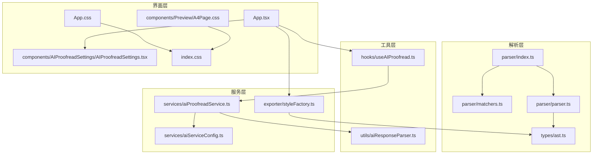
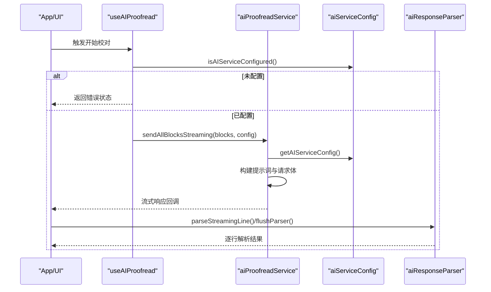
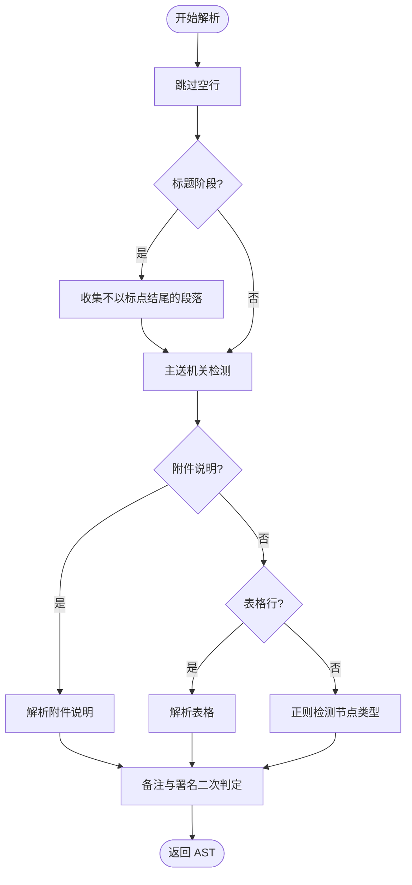
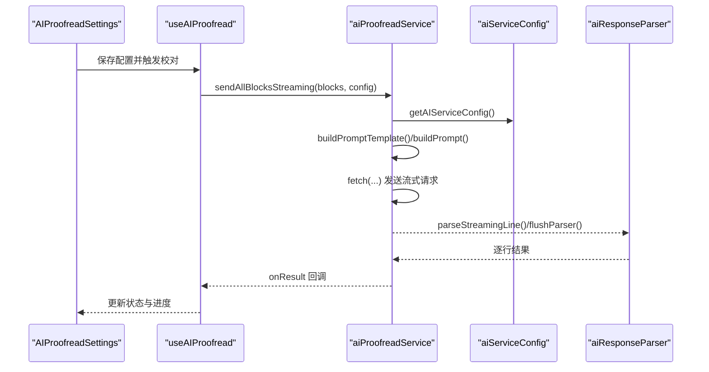
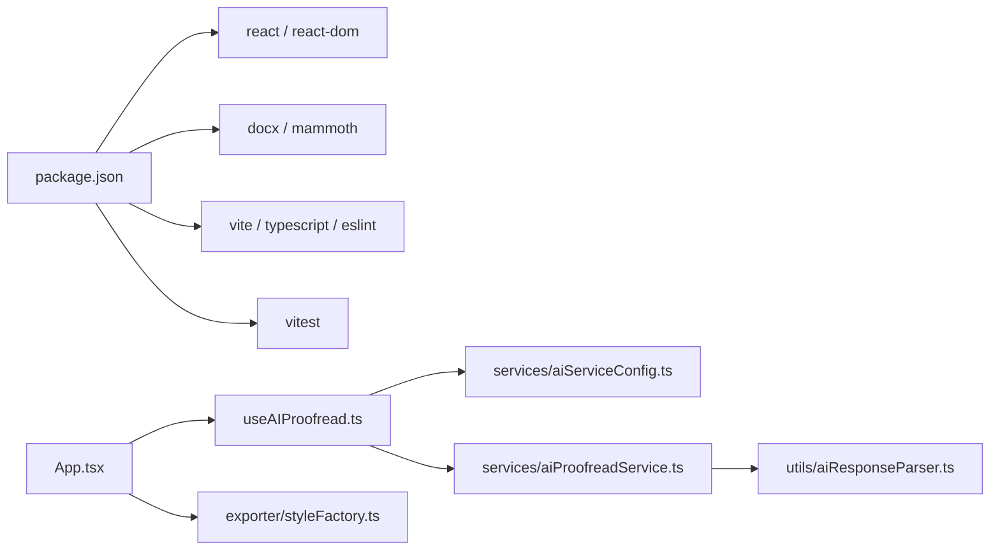

# 插件开发

<cite>
**本文引用的文件**
- [src/parser/index.ts](file://src/parser/index.ts)
- [src/parser/matchers.ts](file://src/parser/matchers.ts)
- [src/parser/parser.ts](file://src/parser/parser.ts)
- [src/types/ast.ts](file://src/types/ast.ts)
- [src/services/aiServiceConfig.ts](file://src/services/aiServiceConfig.ts)
- [src/services/aiProofreadService.ts](file://src/services/aiProofreadService.ts)
- [src/hooks/useAIProofread.ts](file://src/hooks/useAIProofread.ts)
- [src/utils/aiResponseParser.ts](file://src/utils/aiResponseParser.ts)
- [src/components/AIProofreadSettings/AIProofreadSettings.tsx](file://src/components/AIProofreadSettings/AIProofreadSettings.tsx)
- [src/App.tsx](file://src/App.tsx)
- [src/exporter/styleFactory.ts](file://src/exporter/styleFactory.ts)
- [src/components/Preview/A4Page.css](file://src/components/Preview/A4Page.css)
- [src/index.css](file://src/index.css)
- [src/App.css](file://src/App.css)
- [package.json](file://package.json)
</cite>

## 目录
1. [简介](#简介)
2. [项目结构](#项目结构)
3. [核心组件](#核心组件)
4. [架构总览](#架构总览)
5. [详细组件分析](#详细组件分析)
6. [依赖分析](#依赖分析)
7. [性能考量](#性能考量)
8. [故障排查指南](#故障排查指南)
9. [结论](#结论)
10. [附录](#附录)

## 简介
本指南面向希望为公文排版工具扩展“插件能力”的开发者，目标包括：
- 扩展公文识别功能：新增或替换要素识别规则（正则匹配器、AST 节点类型扩展）
- 集成新的 AI 服务：适配不同 API 接口、请求参数与响应解析
- 实现自定义样式模板：通过 CSS 变量注入、主题定制与响应式适配

文档将从架构视角出发，解释插件化扩展点、生命周期与事件模型，并提供开发模板、调试方法与发布流程。

## 项目结构
该项目采用前端 React + TypeScript + Vite 的单页应用，核心模块围绕“解析（parser）—服务（service）—UI（React 组件）—导出（exporter）”展开。关键目录与职责如下：
- src/parser：公文文本解析与 AST 构建，包含正则匹配器与解析器
- src/types：类型定义（AST 节点、AI 类型、文档配置等）
- src/services：AI 配置读取、AI 校对服务、导出样式工厂
- src/hooks：业务 Hook（如 AI 校对状态管理）
- src/utils：AI 响应解析、文本切分等工具
- src/components：React UI 组件（编辑器、预览、设置等）
- src/exporter：样式工厂与导出逻辑
- src/index.css、src/components/Preview/A4Page.css：样式与主题变量
- package.json：构建与依赖

图表来源
- [src/parser/index.ts:1-3](file://src/parser/index.ts#L1-L3)
- [src/parser/matchers.ts:1-148](file://src/parser/matchers.ts#L1-L148)
- [src/parser/parser.ts:1-331](file://src/parser/parser.ts#L1-L331)
- [src/types/ast.ts:1-81](file://src/types/ast.ts#L1-L81)
- [src/services/aiServiceConfig.ts:1-154](file://src/services/aiServiceConfig.ts#L1-L154)
- [src/services/aiProofreadService.ts:1-516](file://src/services/aiProofreadService.ts#L1-L516)
- [src/utils/aiResponseParser.ts:1-378](file://src/utils/aiResponseParser.ts#L1-L378)
- [src/hooks/useAIProofread.ts:1-221](file://src/hooks/useAIProofread.ts#L1-L221)
- [src/App.tsx:1-308](file://src/App.tsx#L1-L308)
- [src/exporter/styleFactory.ts:1-364](file://src/exporter/styleFactory.ts#L1-L364)
- [src/components/Preview/A4Page.css:1-543](file://src/components/Preview/A4Page.css#L1-L543)
- [src/index.css:1-112](file://src/index.css#L1-L112)
- [src/App.css:1-143](file://src/App.css#L1-L143)

章节来源
- [src/parser/index.ts:1-3](file://src/parser/index.ts#L1-L3)
- [src/parser/matchers.ts:1-148](file://src/parser/matchers.ts#L1-L148)
- [src/parser/parser.ts:1-331](file://src/parser/parser.ts#L1-L331)
- [src/types/ast.ts:1-81](file://src/types/ast.ts#L1-L81)
- [src/services/aiServiceConfig.ts:1-154](file://src/services/aiServiceConfig.ts#L1-L154)
- [src/services/aiProofreadService.ts:1-516](file://src/services/aiProofreadService.ts#L1-L516)
- [src/utils/aiResponseParser.ts:1-378](file://src/utils/aiResponseParser.ts#L1-L378)
- [src/hooks/useAIProofread.ts:1-221](file://src/hooks/useAIProofread.ts#L1-L221)
- [src/App.tsx:1-308](file://src/App.tsx#L1-L308)
- [src/exporter/styleFactory.ts:1-364](file://src/exporter/styleFactory.ts#L1-L364)
- [src/components/Preview/A4Page.css:1-543](file://src/components/Preview/A4Page.css#L1-L543)
- [src/index.css:1-112](file://src/index.css#L1-L112)
- [src/App.css:1-143](file://src/App.css#L1-L143)

## 核心组件
- 公文解析器（parser）：负责将纯文本解析为 AST，识别标题、正文、附件、日期、备注、表格等节点类型，并进行署名与备注的二次判定。
- AI 服务配置（aiServiceConfig）：从环境变量读取并标准化 AI 服务配置，提供可用性检查。
- AI 校对服务（aiProofreadService）：构建提示词、发送流式请求、解析 SSE 响应、并发调度与重试。
- AI 响应解析（aiResponseParser）：将流式增量内容解析为表格行，提取序号、原句与建议，构建结果。
- React Hook（useAIProofread）：封装状态、分句、分块、并发与进度回调。
- 样式工厂（styleFactory）：依据 AST 节点类型与文档配置生成段落与文本样式，支持中英文字体分离与字符间距微调。
- UI 组件（App、AIProofreadSettings）：承载入口、工具栏、预览与设置面板，连接解析与导出。

章节来源
- [src/parser/parser.ts:226-331](file://src/parser/parser.ts#L226-L331)
- [src/services/aiServiceConfig.ts:47-154](file://src/services/aiServiceConfig.ts#L47-L154)
- [src/services/aiProofreadService.ts:46-319](file://src/services/aiProofreadService.ts#L46-L319)
- [src/utils/aiResponseParser.ts:127-294](file://src/utils/aiResponseParser.ts#L127-L294)
- [src/hooks/useAIProofread.ts:56-221](file://src/hooks/useAIProofread.ts#L56-L221)
- [src/exporter/styleFactory.ts:89-364](file://src/exporter/styleFactory.ts#L89-L364)
- [src/App.tsx:54-308](file://src/App.tsx#L54-L308)
- [src/components/AIProofreadSettings/AIProofreadSettings.tsx:22-275](file://src/components/AIProofreadSettings/AIProofreadSettings.tsx#L22-L275)

## 架构总览
整体架构遵循“解析—服务—UI—导出”的分层设计，插件扩展点主要集中在以下位置：
- 公文识别扩展：在匹配器与解析器中增加新的节点类型与识别规则
- AI 服务扩展：通过配置读取与请求构建模块接入新服务
- 样式扩展：通过样式工厂与 CSS 变量注入实现主题与模板

图表来源
- [src/App.tsx:199-221](file://src/App.tsx#L199-L221)
- [src/hooks/useAIProofread.ts:67-205](file://src/hooks/useAIProofread.ts#L67-L205)
- [src/services/aiProofreadService.ts:147-319](file://src/services/aiProofreadService.ts#L147-L319)
- [src/services/aiServiceConfig.ts:150-154](file://src/services/aiServiceConfig.ts#L150-L154)
- [src/utils/aiResponseParser.ts:127-378](file://src/utils/aiResponseParser.ts#L127-L378)

## 详细组件分析

### 公文识别扩展（匹配器与解析器）
- 扩展点
  - 新增正则匹配器：在匹配器模块中定义新的正则表达式与辅助函数
  - 新增 AST 节点类型：在类型定义中扩展 NodeType，并在解析器中处理新类型
  - 新增识别逻辑：在解析器中插入新类型的检测与转换
- 关键接口
  - 匹配器导出：detectNodeType、isTableRow、isTableSeparator、parseTableRow 等
  - 解析器导出：parseGongwen、parseAttachment、parseTable 等
- 设计要点
  - 匹配器为纯函数，便于测试与复用
  - 解析器遵循“标题阶段—正文阶段”的两阶段策略，避免误判
  - 备注与署名的二次判定确保符合 GB/T 9704 规范

图表来源
- [src/parser/parser.ts:236-331](file://src/parser/parser.ts#L236-L331)
- [src/parser/matchers.ts:136-148](file://src/parser/matchers.ts#L136-L148)

章节来源
- [src/parser/matchers.ts:1-148](file://src/parser/matchers.ts#L1-L148)
- [src/parser/parser.ts:1-331](file://src/parser/parser.ts#L1-L331)
- [src/types/ast.ts:1-81](file://src/types/ast.ts#L1-L81)

### AI 服务插件开发（API 适配与响应解析）
- 扩展点
  - 配置读取：通过环境变量标准化 API 基础地址、模型、密钥与采样参数
  - 请求构建：在提示词构建与请求体构造处接入新服务
  - 响应解析：在流式解析模块中适配新服务的 SSE/JSON 格式
- 关键接口
  - 配置：getAIServiceConfig、isAIServiceConfigured
  - 请求：sendBlockStreaming、sendAllBlocksStreaming
  - 解析：parseStreamingLine、flushParser
- 设计要点
  - 兼容旧版浏览器（不使用可选链与空值合并）
  - 并发控制与重试策略
  - 提示词模板可扩展，内置示例与用户自定义示例可叠加

图表来源
- [src/components/AIProofreadSettings/AIProofreadSettings.tsx:22-275](file://src/components/AIProofreadSettings/AIProofreadSettings.tsx#L22-L275)
- [src/hooks/useAIProofread.ts:67-205](file://src/hooks/useAIProofread.ts#L67-L205)
- [src/services/aiProofreadService.ts:147-516](file://src/services/aiProofreadService.ts#L147-L516)
- [src/services/aiServiceConfig.ts:47-154](file://src/services/aiServiceConfig.ts#L47-L154)
- [src/utils/aiResponseParser.ts:127-378](file://src/utils/aiResponseParser.ts#L127-L378)

章节来源
- [src/services/aiServiceConfig.ts:1-154](file://src/services/aiServiceConfig.ts#L1-L154)
- [src/services/aiProofreadService.ts:1-516](file://src/services/aiProofreadService.ts#L1-L516)
- [src/utils/aiResponseParser.ts:1-378](file://src/utils/aiResponseParser.ts#L1-L378)
- [src/hooks/useAIProofread.ts:1-221](file://src/hooks/useAIProofread.ts#L1-L221)
- [src/components/AIProofreadSettings/AIProofreadSettings.tsx:1-275](file://src/components/AIProofreadSettings/AIProofreadSettings.tsx#L1-L275)

### 样式插件开发（CSS 变量注入与主题定制）
- 扩展点
  - CSS 变量：通过根级变量与 A4 页面变量控制字体、字号、行距、缩进、页边距等
  - 字体注入：在全局样式中引入字体文件，确保中英文字体分离与标点正确渲染
  - 主题定制：在组件样式中使用 CSS 变量，实现浅色/深色主题切换
  - 响应式适配：基于视口与容器尺寸，结合 JS 计算与 CSS 百分比定位
- 关键接口
  - 样式工厂：getParagraphStyle、getRunStyle、getAttachmentParagraphStyle 等
  - CSS 变量：A4Page.css 中的 var(--...) 变量
  - 字体与主题：index.css、App.css、A4Page.css
- 设计要点
  - 字符间距与行距微调，确保每行 28 字
  - 中英文字体分离（ascii/eastAsia/hAnsi/cs）与标点处理
  - 附件说明、日期、署名等节点的专用样式类

```mermaid
classDiagram
class StyleFactory {
+getParagraphStyle(type, config, signature?, date?)
+getRunStyle(type, config)
+getAttachmentParagraphStyle(isMultiple, isFirst, config)
+getAttachmentRunStyle(config)
+getAttachmentPunctuationRunStyle(config)
+getHeading3PunctuationRunStyle(config)
+getTimeColonRunStyle(config, fontSize)
}
class A4PageCSS {
+a4-title
+a4-h1
+a4-h2
+a4-h3
+a4-h4
+a4-paragraph
+a4-addressee
+a4-attachment
+a4-date
+a4-signature
+a4-remark
+a4-table
+a4-tooltip
}
class IndexCSS {
+@font-face
+ : root 变量
}
StyleFactory --> A4PageCSS : "生成样式类"
IndexCSS --> A4PageCSS : "提供变量与字体"
```

图表来源
- [src/exporter/styleFactory.ts:89-364](file://src/exporter/styleFactory.ts#L89-L364)
- [src/components/Preview/A4Page.css:1-543](file://src/components/Preview/A4Page.css#L1-L543)
- [src/index.css:1-112](file://src/index.css#L1-L112)

章节来源
- [src/exporter/styleFactory.ts:1-364](file://src/exporter/styleFactory.ts#L1-L364)
- [src/components/Preview/A4Page.css:1-543](file://src/components/Preview/A4Page.css#L1-L543)
- [src/index.css:1-112](file://src/index.css#L1-L112)
- [src/App.css:1-143](file://src/App.css#L1-L143)

## 依赖分析
- 构建与运行时依赖
  - React 生态：react、react-dom
  - 文档处理：docx、mammoth
  - 开发工具：vite、typescript、eslint、vitest
- 关键依赖关系
  - App 依赖 useAIProofread 与导出模块
  - useAIProofread 依赖 aiServiceConfig 与 aiProofreadService
  - aiProofreadService 依赖 aiResponseParser 与 aiServiceConfig
  - 样式工厂依赖 AST 类型与文档配置

图表来源
- [package.json:1-39](file://package.json#L1-L39)
- [src/App.tsx:1-308](file://src/App.tsx#L1-L308)
- [src/hooks/useAIProofread.ts:1-221](file://src/hooks/useAIProofread.ts#L1-L221)
- [src/services/aiProofreadService.ts:1-516](file://src/services/aiProofreadService.ts#L1-L516)
- [src/utils/aiResponseParser.ts:1-378](file://src/utils/aiResponseParser.ts#L1-L378)
- [src/exporter/styleFactory.ts:1-364](file://src/exporter/styleFactory.ts#L1-L364)

章节来源
- [package.json:1-39](file://package.json#L1-L39)

## 性能考量
- 解析性能
  - 匹配器为纯函数，复杂度与行数线性相关；建议缓存常用正则与中间结果
  - 解析器按行扫描，避免不必要的回溯
- AI 校对性能
  - 分块与并发控制：合理设置最大字符数与并发数，避免超限与拥塞
  - 流式解析：边收边解，减少内存占用
- 样式性能
  - 字符间距与行距计算在配置变更时进行，避免频繁重排
  - CSS 变量减少样式切换成本

## 故障排查指南
- AI 服务未配置
  - 现象：启动校对时报错“AI服务未配置”
  - 排查：检查环境变量是否完整（基础地址、模型、密钥等）
  - 参考：配置读取与可用性检查
- 请求失败与错误码
  - 现象：401、429、500 等错误
  - 排查：核对密钥、频率限制、服务端状态
- 流式解析异常
  - 现象：解析不到结果或序号缺失
  - 排查：确认提示词格式、SSE 数据行、结束标记；查看调试输出
- 样式不生效
  - 现象：字体未加载、变量未生效、行距异常
  - 排查：检查字体文件路径、CSS 变量定义、A4 容器尺寸

章节来源
- [src/services/aiServiceConfig.ts:47-154](file://src/services/aiServiceConfig.ts#L47-L154)
- [src/services/aiProofreadService.ts:195-319](file://src/services/aiProofreadService.ts#L195-L319)
- [src/utils/aiResponseParser.ts:127-378](file://src/utils/aiResponseParser.ts#L127-L378)
- [src/components/Preview/A4Page.css:1-543](file://src/components/Preview/A4Page.css#L1-L543)

## 结论
通过在匹配器、解析器、AI 服务与样式工厂四个维度进行扩展，开发者可以灵活地为公文排版工具增加新的识别规则、AI 服务与样式模板。建议遵循纯函数与可测试性原则，利用现有 Hook 与工具模块，确保扩展的稳定性与可维护性。

## 附录

### 插件开发模板（步骤清单）
- 公文识别插件
  - 在匹配器模块新增正则与辅助函数
  - 在类型定义中扩展 NodeType
  - 在解析器中插入新类型的检测与转换
  - 编写单元测试验证边界情况
- AI 服务插件
  - 在配置模块中支持新服务参数
  - 在服务模块中适配请求体与响应格式
  - 在解析模块中适配流式数据
  - 编写集成测试与重试策略
- 样式插件
  - 在样式工厂中新增段落/文本样式映射
  - 在 CSS 中定义变量与主题类
  - 在组件中注入变量并适配响应式布局
  - 编写可视化回归测试

### 调试方法
- AI 校对
  - 使用内置调试输出查看发送与解析的序号、缺失项与完整 Markdown 表格
  - 逐步缩小提示词，定位解析失败的行
- 样式
  - 在 A4 页面容器中检查 CSS 变量是否正确注入
  - 使用浏览器开发者工具对比实际渲染与预期差异
- 解析
  - 对照正则与解析器分支，逐行验证节点类型判定

### 发布流程
- 本地构建
  - 使用 Vite 构建命令生成产物
- 依赖管理
  - 更新 package.json 中的依赖版本与脚本
- 验收测试
  - 运行单元测试与集成测试，确保插件兼容性
- 打包与分发
  - 生成单文件版本（如需）并上传至分发渠道

章节来源
- [package.json:6-12](file://package.json#L6-L12)