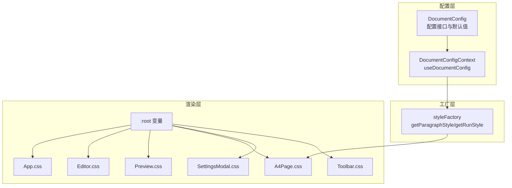
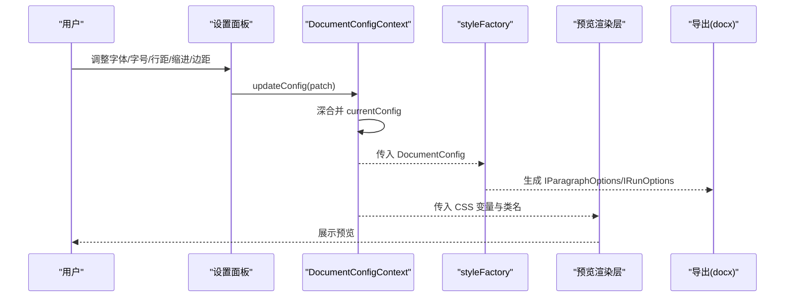
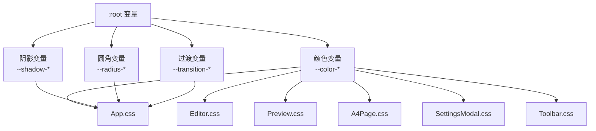
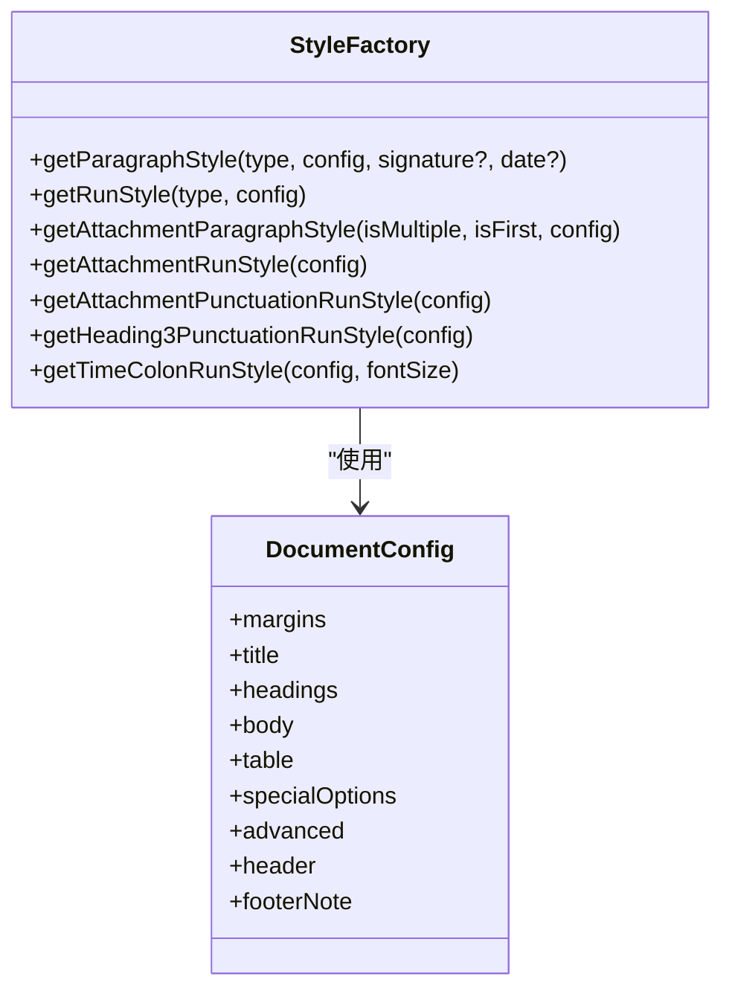
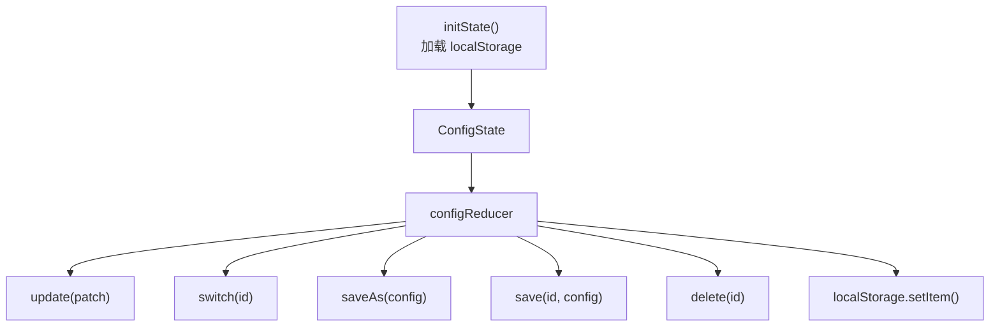
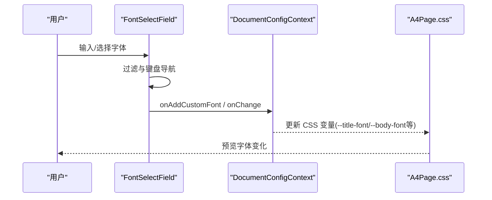
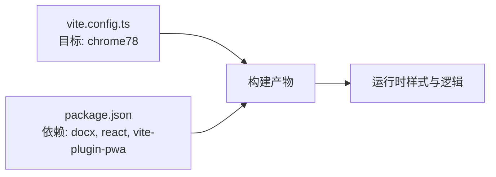

# 样式定制

<cite>
**本文引用的文件**
- [styleFactory.ts](file://src/exporter/styleFactory.ts)
- [documentConfig.ts](file://src/types/documentConfig.ts)
- [DocumentConfigContext.tsx](file://src/contexts/DocumentConfigContext.tsx)
- [index.css](file://src/index.css)
- [App.css](file://src/App.css)
- [Editor.css](file://src/components/Editor/Editor.css)
- [Preview.css](file://src/components/Preview/Preview.css)
- [A4Page.css](file://src/components/Preview/A4Page.css)
- [SettingsModal.css](file://src/components/SettingsModal/SettingsModal.css)
- [Toolbar.css](file://src/components/Toolbar/Toolbar.css)
- [FontSelectField.tsx](file://src/components/SettingsModal/FontSelectField.tsx)
- [vite.config.ts](file://vite.config.ts)
- [package.json](file://package.json)
</cite>

## 目录
1. [简介](#简介)
2. [项目结构](#项目结构)
3. [核心组件](#核心组件)
4. [架构总览](#架构总览)
5. [详细组件分析](#详细组件分析)
6. [依赖关系分析](#依赖关系分析)
7. [性能考量](#性能考量)
8. [故障排查指南](#故障排查指南)
9. [结论](#结论)
10. [附录](#附录)

## 简介
本指南面向需要深度定制公文排版工具视觉风格与排版行为的开发者与运维人员。内容涵盖：
- CSS 变量体系与主题系统扩展
- 主题系统的上下文驱动与持久化
- 样式工厂的设计模式与样式生成器扩展
- 响应式与跨设备适配策略（桌面端、移动端、打印）
- 字体选择、颜色方案、边距与页面布局的定制方法
- 样式模块化、继承与覆盖机制
- 性能优化与浏览器兼容性处理

## 项目结构
样式系统围绕“配置驱动 + 工厂生成 + CSS 变量渲染”的三层架构展开：
- 配置层：定义文档排版参数与默认值，提供深合并与持久化能力
- 工厂层：根据节点类型与配置生成段落与文本样式（docx 导出）
- 渲染层：基于 CSS 变量与类名映射，实现预览与导出的一致性

图表来源
- [documentConfig.ts:95-183](file://src/types/documentConfig.ts#L95-L183)
- [DocumentConfigContext.tsx:218-286](file://src/contexts/DocumentConfigContext.tsx#L218-L286)
- [styleFactory.ts:89-235](file://src/exporter/styleFactory.ts#L89-L235)
- [index.css:36-80](file://src/index.css#L36-L80)
- [App.css:1-143](file://src/App.css#L1-L143)
- [Editor.css:1-235](file://src/components/Editor/Editor.css#L1-L235)
- [Preview.css:1-60](file://src/components/Preview/Preview.css#L1-L60)
- [A4Page.css:1-543](file://src/components/Preview/A4Page.css#L1-L543)
- [SettingsModal.css:1-851](file://src/components/SettingsModal/SettingsModal.css#L1-L851)
- [Toolbar.css:1-176](file://src/components/Toolbar/Toolbar.css#L1-L176)

章节来源
- [documentConfig.ts:95-183](file://src/types/documentConfig.ts#L95-L183)
- [DocumentConfigContext.tsx:218-286](file://src/contexts/DocumentConfigContext.tsx#L218-L286)
- [styleFactory.ts:89-235](file://src/exporter/styleFactory.ts#L89-L235)
- [index.css:36-80](file://src/index.css#L36-L80)

## 核心组件
- 文档配置与默认值：集中定义页面边距、标题、各级标题、正文、表格、特殊选项、高级设置、版头版记等参数与默认值
- 配置上下文与持久化：提供配置更新、切换、保存、删除与 AI 校对配置管理，持久化至 localStorage
- 样式工厂：根据节点类型与配置生成段落与文本样式（docx），并处理字符宽度、缩进、标点字体等细节
- CSS 变量与主题系统：在 :root 定义主题变量，组件样式通过 var(--xxx) 引用，实现主题切换与一致性
- 预览与导出一致性：A4Page.css 通过 CSS 变量与类名映射，确保预览与导出的视觉一致

章节来源
- [documentConfig.ts:95-183](file://src/types/documentConfig.ts#L95-L183)
- [DocumentConfigContext.tsx:218-286](file://src/contexts/DocumentConfigContext.tsx#L218-L286)
- [styleFactory.ts:89-235](file://src/exporter/styleFactory.ts#L89-L235)
- [index.css:36-80](file://src/index.css#L36-L80)
- [A4Page.css:1-543](file://src/components/Preview/A4Page.css#L1-L543)

## 架构总览
样式定制的总体流程：
- 用户在设置面板调整配置（字体、字号、行距、缩进、边距等）
- 配置上下文接收变更并通过深合并更新当前配置
- 样式工厂根据节点类型与配置生成段落/文本样式（docx）
- 预览渲染层通过 CSS 变量与类名映射呈现视觉效果
- 导出阶段（docx）使用样式工厂生成的样式，确保与预览一致

图表来源
- [DocumentConfigContext.tsx:221-223](file://src/contexts/DocumentConfigContext.tsx#L221-L223)
- [styleFactory.ts:89-235](file://src/exporter/styleFactory.ts#L89-L235)
- [A4Page.css:1-543](file://src/components/Preview/A4Page.css#L1-L543)

## 详细组件分析

### CSS 变量与主题系统
- :root 定义主题变量：颜色、阴影、圆角、过渡、字体族等
- 组件样式通过 var(--xxx) 引用，实现主题切换与一致性
- 设置面板与各组件共享同一变量集，确保视觉统一

图表来源
- [index.css:36-80](file://src/index.css#L36-L80)
- [App.css:1-143](file://src/App.css#L1-L143)
- [Editor.css:1-235](file://src/components/Editor/Editor.css#L1-L235)
- [Preview.css:1-60](file://src/components/Preview/Preview.css#L1-L60)
- [A4Page.css:1-543](file://src/components/Preview/A4Page.css#L1-L543)
- [SettingsModal.css:1-851](file://src/components/SettingsModal/SettingsModal.css#L1-L851)
- [Toolbar.css:1-176](file://src/components/Toolbar/Toolbar.css#L1-L176)

章节来源
- [index.css:36-80](file://src/index.css#L36-L80)
- [App.css:1-143](file://src/App.css#L1-L143)
- [Editor.css:1-235](file://src/components/Editor/Editor.css#L1-L235)
- [Preview.css:1-60](file://src/components/Preview/Preview.css#L1-L60)
- [A4Page.css:1-543](file://src/components/Preview/A4Page.css#L1-L543)
- [SettingsModal.css:1-851](file://src/components/SettingsModal/SettingsModal.css#L1-L851)
- [Toolbar.css:1-176](file://src/components/Toolbar/Toolbar.css#L1-L176)

### 样式工厂与样式生成器扩展
- 节点类型到段落样式的映射：标题、主送机关、附件、署名、日期、备注、正文与各级标题
- 节点类型到文本样式的映射：字体、字号、字符间距
- 附件说明与标点样式的专门处理：数字英文与标点的字体分离
- 时间冒号与三级标题标点的字体统一处理
- 计算逻辑：字符宽度、首行缩进、左右缩进、字符间距等

图表来源
- [styleFactory.ts:89-364](file://src/exporter/styleFactory.ts#L89-L364)
- [documentConfig.ts:95-105](file://src/types/documentConfig.ts#L95-L105)

章节来源
- [styleFactory.ts:89-364](file://src/exporter/styleFactory.ts#L89-L364)
- [documentConfig.ts:95-105](file://src/types/documentConfig.ts#L95-L105)

### 配置上下文与持久化
- 深合并工具：支持部分更新与深层嵌套合并
- 持久化：localStorage 存储当前激活配置 ID、保存的配置集合与 AI 校对配置
- 提供切换、保存、删除、更新等动作，保证配置变更即时生效且可恢复

图表来源
- [DocumentConfigContext.tsx:159-196](file://src/contexts/DocumentConfigContext.tsx#L159-L196)
- [DocumentConfigContext.tsx:221-247](file://src/contexts/DocumentConfigContext.tsx#L221-L247)
- [DocumentConfigContext.tsx:258-265](file://src/contexts/DocumentConfigContext.tsx#L258-L265)

章节来源
- [DocumentConfigContext.tsx:218-286](file://src/contexts/DocumentConfigContext.tsx#L218-L286)

### 字体选择与字体组合
- 字体选择字段：支持内置字体与自定义字体，过滤、键盘导航、新增/删除自定义字体
- 字体组合：中文字体与 ASCII 字体分离，确保英文与数字使用合适的西文字体
- 字体加载：通过 @font-face 注册字体资源，提升加载体验

图表来源
- [FontSelectField.tsx:179-260](file://src/components/SettingsModal/FontSelectField.tsx#L179-L260)
- [documentConfig.ts:187-206](file://src/types/documentConfig.ts#L187-L206)
- [A4Page.css:104-152](file://src/components/Preview/A4Page.css#L104-L152)

章节来源
- [FontSelectField.tsx:1-261](file://src/components/SettingsModal/FontSelectField.tsx#L1-L261)
- [documentConfig.ts:187-206](file://src/types/documentConfig.ts#L187-L206)
- [A4Page.css:104-152](file://src/components/Preview/A4Page.css#L104-L152)

### 预览与导出一致性
- 预览容器：A4 纸张模拟、页边距、字符网格、标题/正文/附件/日期/署名等样式类
- 导出样式：样式工厂生成段落与文本样式，确保与预览一致
- 附件说明：单附件与多附件的不同缩进与换行处理
- 表格样式：表头加粗、边框、字号与行高

章节来源
- [A4Page.css:1-543](file://src/components/Preview/A4Page.css#L1-L543)
- [styleFactory.ts:244-301](file://src/exporter/styleFactory.ts#L244-L301)

### 响应式与跨设备适配
- 最小宽度约束：body 设置最小宽度，保证在窄屏下的可读性
- 预览容器：flex 布局与滚动区域，适应不同窗口尺寸
- 移动端优化：设置面板采用网格布局与滚动区域，避免溢出
- 打印样式：通过 CSS 变量与类名映射，确保打印时的字体与间距一致

章节来源
- [index.css:82-88](file://src/index.css#L82-L88)
- [App.css:1-143](file://src/App.css#L1-L143)
- [SettingsModal.css:1-851](file://src/components/SettingsModal/SettingsModal.css#L1-L851)

## 依赖关系分析
- 构建目标：Chrome 78，确保旧版浏览器兼容性
- 依赖字体：docx、file-saver、mammoth、React 生态
- PWA 与单文件构建：支持离线部署与简化分发

图表来源
- [vite.config.ts:54-59](file://vite.config.ts#L54-L59)
- [package.json:13-37](file://package.json#L13-L37)

章节来源
- [vite.config.ts:54-59](file://vite.config.ts#L54-L59)
- [package.json:13-37](file://package.json#L13-L37)

## 性能考量
- CSS 变量复用：减少重复样式声明，降低样式体积
- 深合并与局部更新：避免全量重绘，提高配置切换性能
- 字体加载策略：font-display: swap，提升首屏可读性
- 构建目标：chrome78，避免使用新特性导致的回退与兼容成本
- 预览容器滚动：局部滚动，避免全局重排

章节来源
- [index.css:1-26](file://src/index.css#L1-L26)
- [vite.config.ts:54-59](file://vite.config.ts#L54-L59)
- [DocumentConfigContext.tsx:221-223](file://src/contexts/DocumentConfigContext.tsx#L221-L223)

## 故障排查指南
- 字体未生效
  - 检查 @font-face 资源路径与加载状态
  - 确认 CSS 变量 --title-font/--body-font 等已正确设置
- 缩进与行距异常
  - 检查配置中的 firstLineIndent、lineSpacing、fontSize
  - 确认样式工厂计算逻辑（字符宽度、缩进）是否符合预期
- 预览与导出不一致
  - 对照 A4Page.css 类名与 styleFactory 返回的样式键值
  - 确保 CSS 变量与配置同步更新
- 移动端显示异常
  - 检查最小宽度与容器布局
  - 确认设置面板网格与滚动区域配置

章节来源
- [index.css:1-26](file://src/index.css#L1-L26)
- [A4Page.css:1-543](file://src/components/Preview/A4Page.css#L1-L543)
- [styleFactory.ts:32-44](file://src/exporter/styleFactory.ts#L32-L44)
- [DocumentConfigContext.tsx:221-223](file://src/contexts/DocumentConfigContext.tsx#L221-L223)

## 结论
通过“配置驱动 + 工厂生成 + CSS 变量渲染”的架构，本项目实现了可扩展、可维护、可移植的样式系统。开发者可通过以下方式快速定制：
- 在设置面板调整字体、字号、行距、缩进与边距
- 通过 CSS 变量扩展主题，实现品牌化与多主题支持
- 借助样式工厂扩展节点类型的样式生成逻辑
- 通过响应式与跨设备适配策略，确保在桌面、移动与打印场景下的良好体验

## 附录

### 样式定制步骤示例
- 扩展主题变量
  - 在 :root 中添加新的颜色/阴影/圆角变量
  - 在组件样式中通过 var(--xxx) 引用
- 自定义字体
  - 在 @font-face 中注册新字体
  - 在设置面板中添加字体选项，或允许用户输入自定义字体名称
  - 在 A4Page.css 中将 --title-font/--body-font 等变量指向新字体
- 调整排版参数
  - 在 DocumentConfig 中修改默认值或新增配置项
  - 在样式工厂中扩展对应节点类型的样式生成逻辑
- 适配移动端
  - 调整设置面板的网格列数与滚动区域
  - 确保最小宽度与容器布局在窄屏下仍可读
- 打印样式
  - 通过 CSS 变量与类名映射，确保打印时的字体与间距一致
  - 避免使用不支持打印的 CSS 特性

章节来源
- [index.css:36-80](file://src/index.css#L36-L80)
- [A4Page.css:104-152](file://src/components/Preview/A4Page.css#L104-L152)
- [documentConfig.ts:132-183](file://src/types/documentConfig.ts#L132-L183)
- [styleFactory.ts:89-235](file://src/exporter/styleFactory.ts#L89-L235)
- [SettingsModal.css:100-116](file://src/components/SettingsModal/SettingsModal.css#L100-L116)