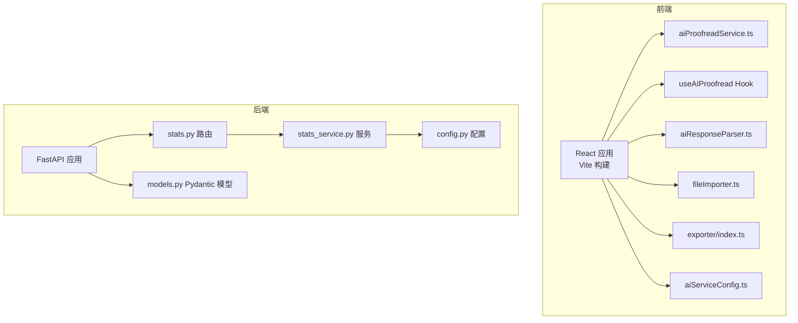
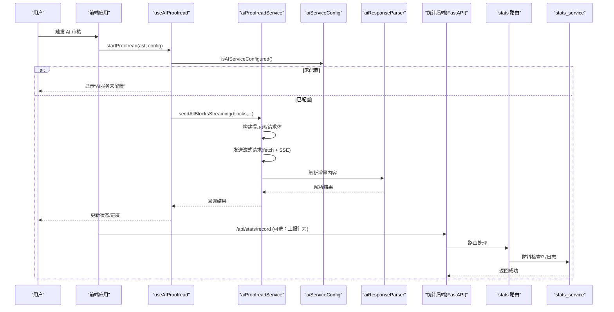
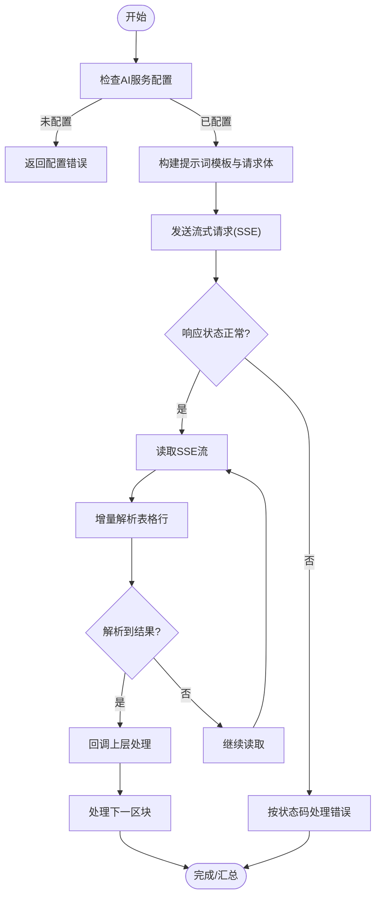
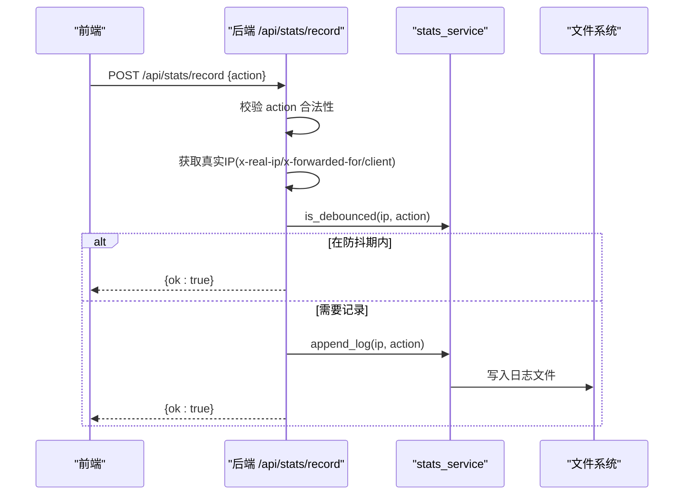
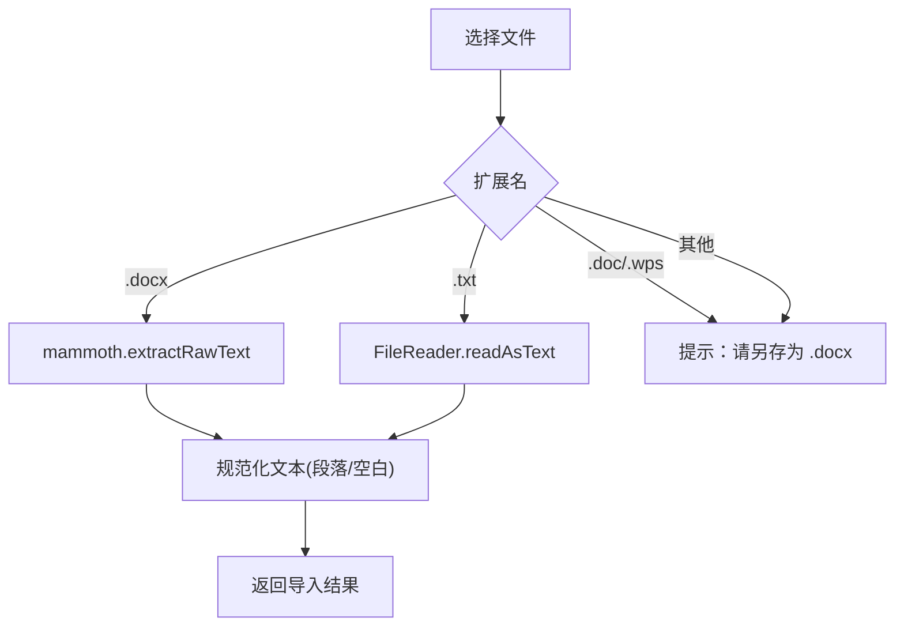
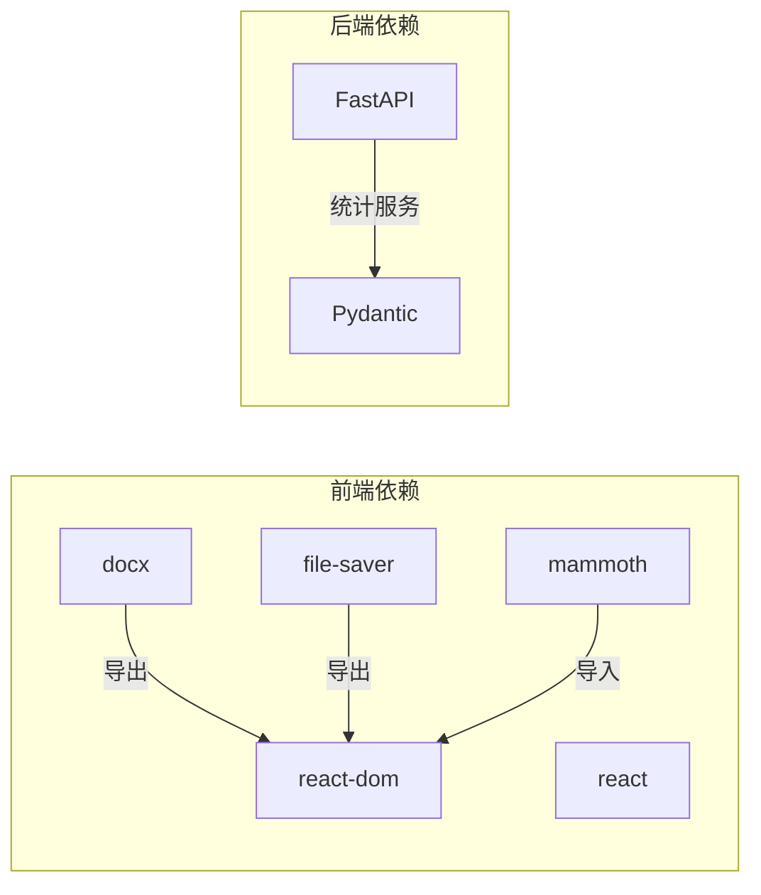

# 第三方集成

<cite>
**本文引用的文件**
- [backend/main.py](file://backend/main.py)
- [backend/routers/stats.py](file://backend/routers/stats.py)
- [backend/services/stats_service.py](file://backend/services/stats_service.py)
- [backend/config.py](file://backend/config.py)
- [backend/models.py](file://backend/models.py)
- [src/services/aiProofreadService.ts](file://src/services/aiProofreadService.ts)
- [src/services/aiServiceConfig.ts](file://src/services/aiServiceConfig.ts)
- [src/utils/aiResponseParser.ts](file://src/utils/aiResponseParser.ts)
- [src/types/aiProofread.ts](file://src/types/aiProofread.ts)
- [src/hooks/useAIProofread.ts](file://src/hooks/useAIProofread.ts)
- [src/components/AIProofreadSettings/AIProofreadSettings.tsx](file://src/components/AIProofreadSettings/AIProofreadSettings.tsx)
- [src/utils/fileImporter.ts](file://src/utils/fileImporter.ts)
- [src/exporter/index.ts](file://src/exporter/index.ts)
- [package.json](file://package.json)
</cite>

## 目录
1. [简介](#简介)
2. [项目结构](#项目结构)
3. [核心组件](#核心组件)
4. [架构总览](#架构总览)
5. [详细组件分析](#详细组件分析)
6. [依赖分析](#依赖分析)
7. [性能考量](#性能考量)
8. [故障排除指南](#故障排除指南)
9. [结论](#结论)
10. [附录](#附录)

## 简介
本指南面向需要为“公文排版工具”集成第三方服务的开发者，涵盖以下主题：
- AI 审核服务的集成：API 适配、认证机制、错误处理与并发控制
- 统计服务的集成：数据上报、隐私保护、性能监控
- 文件导入导出服务：格式转换、数据验证与错误恢复
- OAuth 认证集成：令牌管理、权限控制与会话处理（概念性指导）
- WebSocket 服务集成：实时通信、连接管理与消息处理（概念性指导）
- 安全考虑、性能优化与故障排除

## 项目结构
前端采用 React + Vite，后端采用 FastAPI；AI 审核与统计服务分别位于前后端不同层，文件导入导出在前端实现。

图表来源
- [backend/main.py:1-38](file://backend/main.py#L1-L38)
- [backend/routers/stats.py:1-40](file://backend/routers/stats.py#L1-L40)
- [backend/services/stats_service.py:1-124](file://backend/services/stats_service.py#L1-L124)
- [backend/config.py:1-16](file://backend/config.py#L1-L16)
- [backend/models.py:1-23](file://backend/models.py#L1-L23)
- [src/services/aiProofreadService.ts:1-516](file://src/services/aiProofreadService.ts#L1-L516)
- [src/services/aiServiceConfig.ts:1-154](file://src/services/aiServiceConfig.ts#L1-L154)
- [src/utils/aiResponseParser.ts:1-378](file://src/utils/aiResponseParser.ts#L1-L378)
- [src/utils/fileImporter.ts:1-70](file://src/utils/fileImporter.ts#L1-L70)
- [src/exporter/index.ts:1-4](file://src/exporter/index.ts#L1-L4)

章节来源
- [backend/main.py:1-38](file://backend/main.py#L1-L38)
- [backend/routers/stats.py:1-40](file://backend/routers/stats.py#L1-L40)
- [backend/services/stats_service.py:1-124](file://backend/services/stats_service.py#L1-L124)
- [backend/config.py:1-16](file://backend/config.py#L1-L16)
- [backend/models.py:1-23](file://backend/models.py#L1-L23)
- [src/services/aiProofreadService.ts:1-516](file://src/services/aiProofreadService.ts#L1-L516)
- [src/services/aiServiceConfig.ts:1-154](file://src/services/aiServiceConfig.ts#L1-L154)
- [src/utils/aiResponseParser.ts:1-378](file://src/utils/aiResponseParser.ts#L1-L378)
- [src/utils/fileImporter.ts:1-70](file://src/utils/fileImporter.ts#L1-L70)
- [src/exporter/index.ts:1-4](file://src/exporter/index.ts#L1-L4)

## 核心组件
- AI 审核服务：负责提示词构建、流式请求发送、SSE 响应解析与并发控制
- 统计服务：记录用户行为、防抖去重、日志聚合与统计查询
- 文件导入导出：支持 .docx/.txt 导入与 DOCX 导出
- 配置与类型：统一的 AI 服务配置读取与类型定义

章节来源
- [src/services/aiProofreadService.ts:1-516](file://src/services/aiProofreadService.ts#L1-L516)
- [src/services/aiServiceConfig.ts:1-154](file://src/services/aiServiceConfig.ts#L1-L154)
- [src/utils/aiResponseParser.ts:1-378](file://src/utils/aiResponseParser.ts#L1-L378)
- [src/types/aiProofread.ts:1-201](file://src/types/aiProofread.ts#L1-L201)
- [backend/routers/stats.py:1-40](file://backend/routers/stats.py#L1-L40)
- [backend/services/stats_service.py:1-124](file://backend/services/stats_service.py#L1-L124)
- [src/utils/fileImporter.ts:1-70](file://src/utils/fileImporter.ts#L1-L70)
- [src/exporter/index.ts:1-4](file://src/exporter/index.ts#L1-L4)

## 架构总览
整体采用前后端分离架构：前端负责编辑、AI 审核与导出；后端负责统计服务与日志聚合。

图表来源
- [src/hooks/useAIProofread.ts:1-221](file://src/hooks/useAIProofread.ts#L1-L221)
- [src/services/aiProofreadService.ts:1-516](file://src/services/aiProofreadService.ts#L1-L516)
- [src/services/aiServiceConfig.ts:1-154](file://src/services/aiServiceConfig.ts#L1-L154)
- [src/utils/aiResponseParser.ts:1-378](file://src/utils/aiResponseParser.ts#L1-L378)
- [backend/routers/stats.py:1-40](file://backend/routers/stats.py#L1-L40)
- [backend/services/stats_service.py:1-124](file://backend/services/stats_service.py#L1-L124)

## 详细组件分析

### AI 审核服务集成
- 接口适配
  - 使用 fetch 发送 OpenAI 兼容的聊天请求，启用流式输出（SSE）
  - 请求头包含认证信息（Authorization: Bearer ...）
  - 请求体包含模型、温度、最大 token、采样参数等
- 认证机制
  - 从环境变量读取基础地址、模型、API Key 与参数
  - 自动补全 API 路径，确保兼容不同部署形态
- 错误处理
  - 响应状态码分类处理（401、429、500 等）
  - 流式解析过程中对 JSON 解析异常进行容错
  - 带重试的并发块处理，支持失败块的汇总与日志
- 并发与性能
  - 基于块的并发控制，避免过度并发导致限流
  - 增量解析，边收边解析，降低内存占用
- 类型与配置
  - 统一的请求/响应类型定义，便于扩展与测试

图表来源
- [src/services/aiProofreadService.ts:147-319](file://src/services/aiProofreadService.ts#L147-L319)
- [src/utils/aiResponseParser.ts:127-294](file://src/utils/aiResponseParser.ts#L127-L294)
- [src/services/aiServiceConfig.ts:47-143](file://src/services/aiServiceConfig.ts#L47-L143)

章节来源
- [src/services/aiProofreadService.ts:1-516](file://src/services/aiProofreadService.ts#L1-L516)
- [src/services/aiServiceConfig.ts:1-154](file://src/services/aiServiceConfig.ts#L1-L154)
- [src/utils/aiResponseParser.ts:1-378](file://src/utils/aiResponseParser.ts#L1-L378)
- [src/types/aiProofread.ts:1-201](file://src/types/aiProofread.ts#L1-L201)
- [src/hooks/useAIProofread.ts:1-221](file://src/hooks/useAIProofread.ts#L1-L221)
- [src/components/AIProofreadSettings/AIProofreadSettings.tsx:1-275](file://src/components/AIProofreadSettings/AIProofreadSettings.tsx#L1-L275)

### 统计服务集成
- 数据上报
  - 前端可选上报用户行为（如导出、AI 校对），后端提供 /api/stats/record 接口
  - 后端通过反向代理头获取真实 IP，避免代理带来的 IP 伪造
- 防抖与去重
  - 基于 IP+动作的缓存，短时间内的重复请求会被忽略
  - 定时清理过期缓存，避免内存泄漏
- 日志与聚合
  - 将时间戳、IP、动作写入日志文件
  - 支持按天数范围聚合统计（唯一用户数、总调用数、各功能调用数）
- 隐私保护
  - 仅记录必要字段，不存储明文内容
  - 可通过反向代理头传递真实 IP，避免匿名化导致的统计偏差

图表来源
- [backend/routers/stats.py:12-32](file://backend/routers/stats.py#L12-L32)
- [backend/services/stats_service.py:15-54](file://backend/services/stats_service.py#L15-L54)
- [backend/config.py:1-16](file://backend/config.py#L1-L16)
- [backend/models.py:6-22](file://backend/models.py#L6-L22)

章节来源
- [backend/routers/stats.py:1-40](file://backend/routers/stats.py#L1-L40)
- [backend/services/stats_service.py:1-124](file://backend/services/stats_service.py#L1-L124)
- [backend/config.py:1-16](file://backend/config.py#L1-L16)
- [backend/models.py:1-23](file://backend/models.py#L1-L23)
- [backend/main.py:1-38](file://backend/main.py#L1-L38)

### 文件导入导出服务集成
- 导入
  - .docx：使用 mammoth 提取纯文本，随后进行段落规范化
  - .txt：直接读取文本
  - .doc/.wps：抛出明确的格式转换提示
- 导出
  - DOCX 文档构建与下载入口导出
  - 样式工厂提供段落与字体样式获取
- 数据验证与错误恢复
  - 对扩展名进行严格匹配，不支持的格式直接报错
  - 导入后对文本进行清洗，保证后续处理一致性

图表来源
- [src/utils/fileImporter.ts:23-48](file://src/utils/fileImporter.ts#L23-L48)
- [src/exporter/index.ts:1-4](file://src/exporter/index.ts#L1-L4)
- [package.json:13-18](file://package.json#L13-L18)

章节来源
- [src/utils/fileImporter.ts:1-70](file://src/utils/fileImporter.ts#L1-L70)
- [src/exporter/index.ts:1-4](file://src/exporter/index.ts#L1-L4)
- [package.json:1-39](file://package.json#L1-L39)

### OAuth 认证集成（概念性指导）
- 令牌管理
  - 使用安全存储（如 HttpOnly Cookie 或浏览器安全存储）保存访问令牌
  - 通过刷新令牌轮换，避免长期持有高权限令牌
- 权限控制
  - 基于作用域划分最小权限，仅授予必要的 API 访问
  - 在网关层进行权限校验与审计
- 会话处理
  - 服务端维护会话状态，结合 CSRF 与 SameSite Cookie 防护
  - 会话超时与自动登出策略，保障长时间无操作的安全性

[本节为概念性指导，不直接分析具体源码文件]

### WebSocket 服务集成（概念性指导）
- 实时通信
  - 使用长连接推送实时事件（如审核进度、通知）
  - 前端实现断线重连与消息去重
- 连接管理
  - 服务端维护连接池与心跳检测，清理僵尸连接
  - 限流与订阅管理，防止广播风暴
- 消息处理
  - 消息序列化与版本兼容，支持增量升级
  - 异常消息回退与补偿机制

[本节为概念性指导，不直接分析具体源码文件]

## 依赖分析
- 前端依赖
  - docx、file-saver：DOCX 文档导出
  - mammoth：.docx 文本提取
  - react、react-dom：UI 框架
- 后端依赖
  - FastAPI：统计服务 API
  - Pydantic：请求/响应模型校验

图表来源
- [package.json:13-18](file://package.json#L13-L18)
- [backend/main.py:6-7](file://backend/main.py#L6-L7)

章节来源
- [package.json:1-39](file://package.json#L1-L39)
- [backend/main.py:1-38](file://backend/main.py#L1-L38)

## 性能考量
- AI 审核
  - 增量解析与流式传输，减少内存峰值
  - 并发块控制与指数退避重试，平衡吞吐与稳定性
  - 提示词模板复用与参数化，降低请求构建成本
- 统计服务
  - 防抖缓存与定期清理，避免热点键导致的内存膨胀
  - 日志文件聚合按天过滤，减少 IO 压力
- 导入导出
  - .docx 文本提取后立即规范化，缩短后续处理链路
  - 导出阶段按需构建样式，避免冗余计算

[本节提供通用性能建议，不直接分析具体源码文件]

## 故障排除指南
- AI 审核失败
  - 检查环境变量配置是否完整（基础地址、模型、API Key）
  - 关注响应状态码：401（密钥无效）、429（频率过高）、500（服务内部错误）
  - 查看调试日志：完整响应文本与解析序号对比，定位缺失行
- 统计上报无效
  - 确认反向代理正确注入 x-real-ip 或 x-forwarded-for
  - 检查 action 是否在允许集合内
  - 核对日志文件路径与权限
- 导入失败
  - .doc/.wps 文件需先转换为 .docx
  - .docx 文本提取异常时，检查文件完整性与编码

章节来源
- [src/services/aiServiceConfig.ts:47-70](file://src/services/aiServiceConfig.ts#L47-L70)
- [src/services/aiProofreadService.ts:195-217](file://src/services/aiProofreadService.ts#L195-L217)
- [backend/routers/stats.py:19-24](file://backend/routers/stats.py#L19-L24)
- [backend/services/stats_service.py:57-84](file://backend/services/stats_service.py#L57-L84)
- [src/utils/fileImporter.ts:42-47](file://src/utils/fileImporter.ts#L42-L47)

## 结论
本指南基于现有代码实现了 AI 审核、统计与文件服务的第三方集成要点：统一的配置读取、健壮的错误处理、增量解析与并发控制、隐私友好的统计上报以及严格的格式验证。按照本指南进行扩展，可平滑接入新的 AI 服务、统计平台与文件格式。

[本节为总结性内容，不直接分析具体源码文件]

## 附录
- 环境变量（前端）
  - VITE_AI_BASE_URL：AI 服务基础地址
  - VITE_AI_MODEL：模型名称
  - VITE_AI_API_KEY：API 密钥
  - VITE_AI_TEMPERATURE、VITE_AI_MAX_TOKENS、VITE_AI_TOP_P、VITE_AI_TOP_K、VITE_AI_MIN_P、VITE_AI_PRESENCE_PENALTY、VITE_AI_REPETITION_PENALTY：推理参数
- 后端配置
  - STATS_LOG_PATH：统计日志文件路径
  - DEBOUNCE_SECONDS：防抖间隔
  - DEBOUNCE_CLEANUP_INTERVAL：缓存清理周期
  - VALID_ACTIONS：合法动作集合

章节来源
- [src/services/aiServiceConfig.ts:47-143](file://src/services/aiServiceConfig.ts#L47-L143)
- [backend/config.py:6-15](file://backend/config.py#L6-L15)