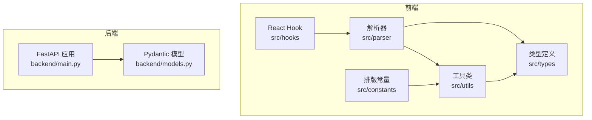
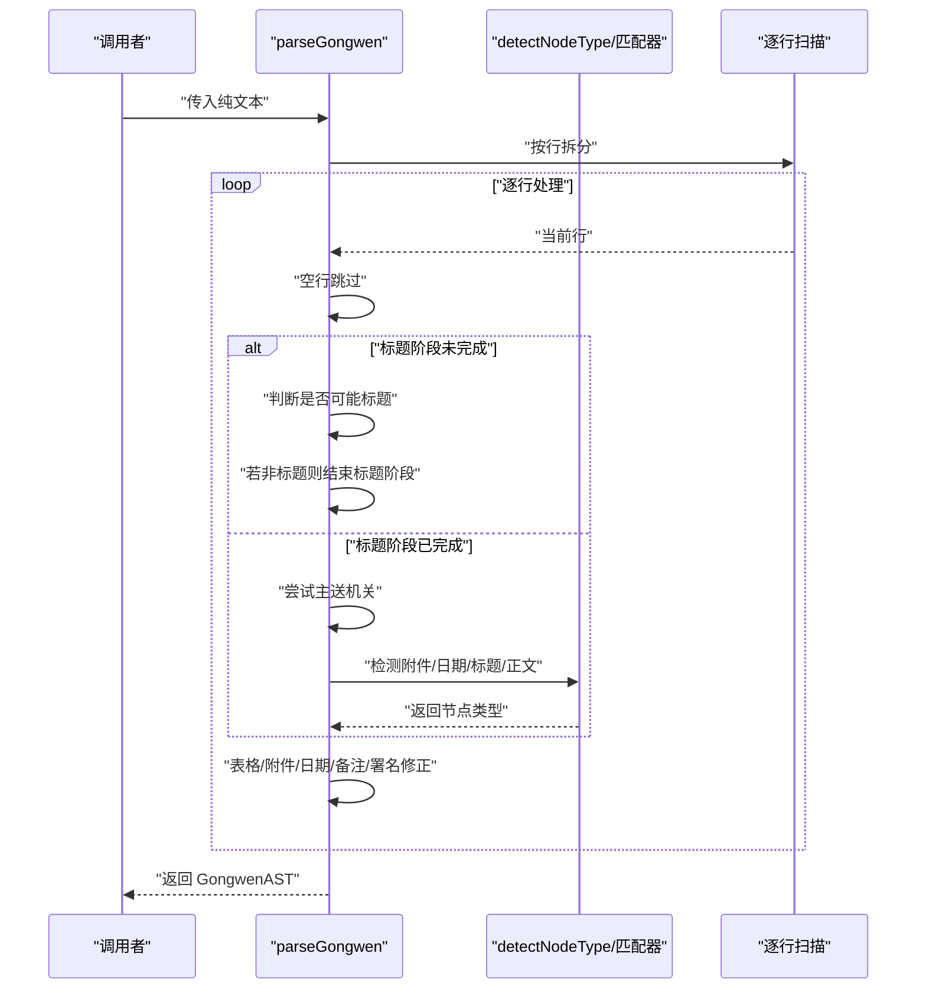
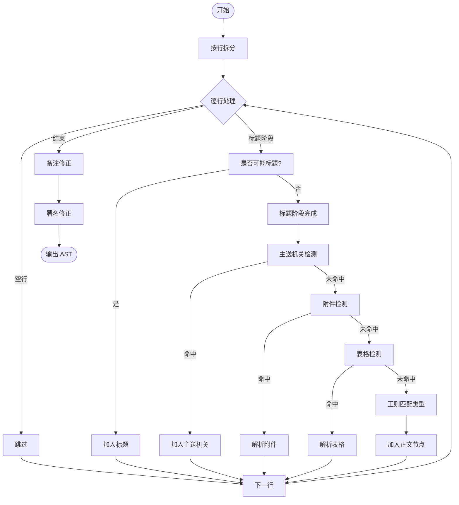
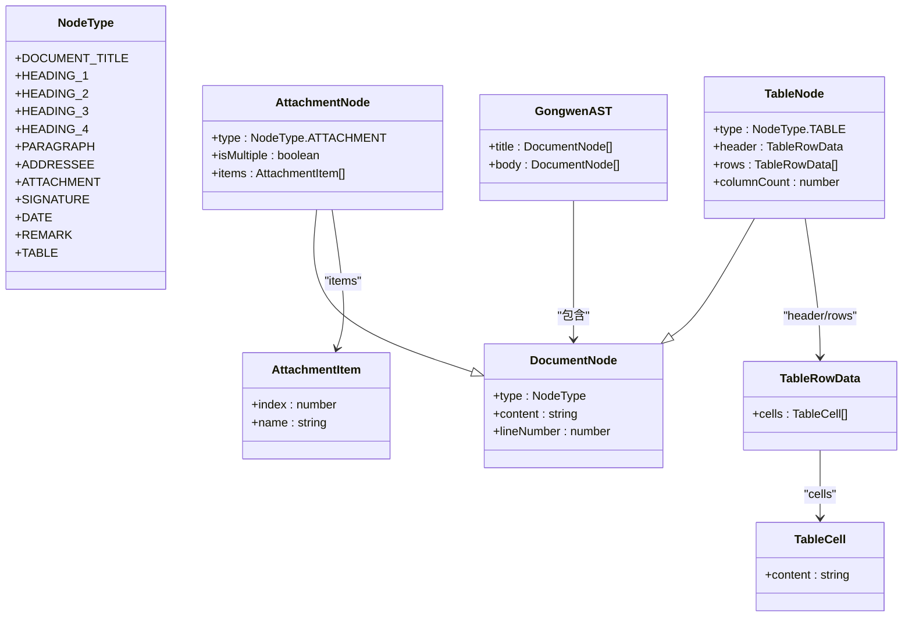
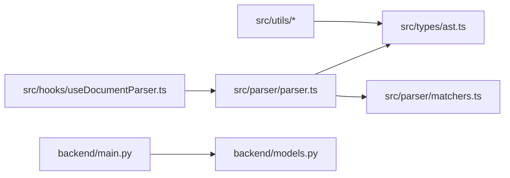

# 解析器扩展

<cite>
**本文引用的文件**
- [src/parser/index.ts](file://src/parser/index.ts)
- [src/parser/parser.ts](file://src/parser/parser.ts)
- [src/parser/matchers.ts](file://src/parser/matchers.ts)
- [src/types/ast.ts](file://src/types/ast.ts)
- [src/hooks/useDocumentParser.ts](file://src/hooks/useDocumentParser.ts)
- [src/parser/__tests__/parser.test.ts](file://src/parser/__tests__/parser.test.ts)
- [src/utils/textBlockSplitter.ts](file://src/utils/textBlockSplitter.ts)
- [src/utils/sentenceSplitter.ts](file://src/utils/sentenceSplitter.ts)
- [src/constants/gongwen.ts](file://src/constants/gongwen.ts)
- [backend/main.py](file://backend/main.py)
- [backend/models.py](file://backend/models.py)
- [package.json](file://package.json)
</cite>

## 目录
1. [简介](#简介)
2. [项目结构](#项目结构)
3. [核心组件](#核心组件)
4. [架构总览](#架构总览)
5. [详细组件分析](#详细组件分析)
6. [依赖关系分析](#依赖关系分析)
7. [性能考虑](#性能考虑)
8. [故障排查指南](#故障排查指南)
9. [结论](#结论)
10. [附录](#附录)

## 简介
本指南面向希望扩展“公文排版工具”解析能力的开发者，围绕以下目标展开：
- 新增公文要素识别规则（如新标题层级、特殊段落）
- 扩展解析器（新增节点类型、解析流程）
- 自定义 AST 节点类型与数据结构
- 正则表达式匹配器的设计、优先级与冲突处理
- 自定义解析逻辑（语法规则、上下文感知、错误恢复）
- 解析器性能优化（缓存、增量解析、并行处理）
- 复杂格式处理（嵌套结构、条件格式、动态内容）
- 测试方法、调试技巧与维护建议

## 项目结构
前端解析器位于 src/parser，配套类型定义在 src/types，React Hook 在 src/hooks，测试在 src/parser/__tests__。工具类如句子切分在 src/utils，排版常量在 src/constants。后端统计服务在 backend。

图表来源
- [src/parser/index.ts:1-3](file://src/parser/index.ts#L1-L3)
- [src/types/ast.ts:1-81](file://src/types/ast.ts#L1-L81)
- [src/hooks/useDocumentParser.ts:1-9](file://src/hooks/useDocumentParser.ts#L1-L9)
- [src/utils/sentenceSplitter.ts:1-324](file://src/utils/sentenceSplitter.ts#L1-L324)
- [src/constants/gongwen.ts:1-33](file://src/constants/gongwen.ts#L1-L33)
- [backend/main.py:1-38](file://backend/main.py#L1-L38)
- [backend/models.py:1-23](file://backend/models.py#L1-L23)

章节来源
- [src/parser/index.ts:1-3](file://src/parser/index.ts#L1-L3)
- [src/types/ast.ts:1-81](file://src/types/ast.ts#L1-L81)
- [src/hooks/useDocumentParser.ts:1-9](file://src/hooks/useDocumentParser.ts#L1-L9)
- [src/utils/sentenceSplitter.ts:1-324](file://src/utils/sentenceSplitter.ts#L1-L324)
- [src/constants/gongwen.ts:1-33](file://src/constants/gongwen.ts#L1-L33)
- [backend/main.py:1-38](file://backend/main.py#L1-L38)
- [backend/models.py:1-23](file://backend/models.py#L1-L23)

## 核心组件
- 解析器入口与导出：导出 parseGongwen 与 detectNodeType，供上层调用。
- 解析器实现：负责逐行扫描、标题阶段、主送机关、附件说明、表格、日期、备注、署名等识别与修正。
- 匹配器模块：提供正则与表格/附件辅助函数，统一节点类型判定。
- 类型系统：定义 NodeType、DocumentNode、AttachmentNode、TableNode、GongwenAST 等。
- React Hook：将文本实时解析为 AST，便于 UI 响应。
- 工具类：文本分块、句子切分等，服务于后续处理（如 AI 校对）。
- 排版常量：提供 GB/T 9704/GB/T 33476 的排版参数，支撑导出样式。

章节来源
- [src/parser/index.ts:1-3](file://src/parser/index.ts#L1-L3)
- [src/parser/parser.ts:226-331](file://src/parser/parser.ts#L226-L331)
- [src/parser/matchers.ts:129-148](file://src/parser/matchers.ts#L129-L148)
- [src/types/ast.ts:1-81](file://src/types/ast.ts#L1-L81)
- [src/hooks/useDocumentParser.ts:1-9](file://src/hooks/useDocumentParser.ts#L1-L9)

## 架构总览
解析器采用“阶段化扫描 + 上下文修正”的策略：
- 阶段一：标题阶段（连续非标点结尾段落）
- 阶段二：主送机关（标题后首个冒号结尾非附件行）
- 阶段三：附件说明（“附件：”开头，支持单/多附件）
- 阶段四：表格（连续表格行 + 分隔行）
- 阶段五：正则匹配（日期、各级标题、正文）
- 修正阶段：备注（日期后括号）、署名（日期前短句+机关关键词）

图表来源
- [src/parser/parser.ts:226-331](file://src/parser/parser.ts#L226-L331)
- [src/parser/matchers.ts:129-148](file://src/parser/matchers.ts#L129-L148)

## 详细组件分析

### 组件一：解析器（parseGongwen）
职责与流程要点：
- 标题阶段：连续不以标点结尾的段落，排除附件与一级标题，形成 DOCUMENT_TITLE。
- 主送机关：标题后首个以冒号结尾且非附件的段落，标记 ADDRESSEE。
- 附件说明：以“附件：”开头，支持单/多附件，多附件支持同行/分行连续编号。
- 表格：连续表格行 + 可选分隔行，构造 TABLE 节点。
- 正则匹配：detectNodeType 返回 DATE、HEADING_1~4、PARAGRAPH。
- 修正：备注（日期后括号）、署名（日期前短句+机关关键词）。

图表来源
- [src/parser/parser.ts:226-331](file://src/parser/parser.ts#L226-L331)
- [src/parser/matchers.ts:129-148](file://src/parser/matchers.ts#L129-L148)

章节来源
- [src/parser/parser.ts:226-331](file://src/parser/parser.ts#L226-L331)

### 组件二：匹配器（detectNodeType 与表格/附件辅助）
- 正则优先级：ATTACHMENT → DATE → HEADING_1~4 → PARAGRAPH。
- 表格：isTableRow/isTableSeparator/parseTableRow/getTableColumnCount。
- 附件：extractAttachmentItemsFromLine 支持不同点号格式与连续编号提取。
- 标题：HEADING_1_RE、HEADING_2_RE、HEADING_3_RE、HEADING_4_RE。

图表来源
- [src/types/ast.ts:1-81](file://src/types/ast.ts#L1-L81)

章节来源
- [src/parser/matchers.ts:1-148](file://src/parser/matchers.ts#L1-L148)
- [src/types/ast.ts:1-81](file://src/types/ast.ts#L1-L81)

### 组件三：React Hook（useDocumentParser）
- 将文本输入转换为 GongwenAST，利用 useMemo 基于文本变化进行缓存，避免重复解析。

章节来源
- [src/hooks/useDocumentParser.ts:1-9](file://src/hooks/useDocumentParser.ts#L1-L9)

### 组件四：工具类（文本分块与句子切分）
- 文本分块：splitIntoBlocks 基于句子长度均衡分配，避免切分句子。
- 句子切分：splitIntoSentences 将 AST 节点切分为句子，支持配对符号内不切分，控制不同节点类型的切分策略。

章节来源
- [src/utils/textBlockSplitter.ts:1-227](file://src/utils/textBlockSplitter.ts#L1-L227)
- [src/utils/sentenceSplitter.ts:1-324](file://src/utils/sentenceSplitter.ts#L1-L324)

### 组件五：排版常量与后端服务
- 排版常量：提供页面尺寸、页边距、行距、字体、字号、缩进等参数，支撑导出样式。
- 后端统计服务：FastAPI 应用，注册路由，提供健康检查与周期清理任务。

章节来源
- [src/constants/gongwen.ts:1-33](file://src/constants/gongwen.ts#L1-L33)
- [backend/main.py:1-38](file://backend/main.py#L1-L38)
- [backend/models.py:1-23](file://backend/models.py#L1-L23)

## 依赖关系分析
- 解析器依赖类型系统与匹配器模块，导出 parseGongwen 与 detectNodeType。
- React Hook 依赖解析器，将文本解析为 AST。
- 工具类依赖类型系统，服务于后续处理。
- 后端服务与前端解析器无直接耦合，但可复用类型定义。

图表来源
- [src/parser/parser.ts:1-3](file://src/parser/parser.ts#L1-L3)
- [src/parser/matchers.ts:1-3](file://src/parser/matchers.ts#L1-L3)
- [src/types/ast.ts:1-3](file://src/types/ast.ts#L1-L3)
- [src/hooks/useDocumentParser.ts:1-3](file://src/hooks/useDocumentParser.ts#L1-L3)
- [backend/main.py:1-9](file://backend/main.py#L1-L9)
- [backend/models.py:1-3](file://backend/models.py#L1-L3)

章节来源
- [src/parser/index.ts:1-3](file://src/parser/index.ts#L1-L3)
- [src/parser/parser.ts:1-3](file://src/parser/parser.ts#L1-L3)
- [src/parser/matchers.ts:1-3](file://src/parser/matchers.ts#L1-L3)
- [src/types/ast.ts:1-3](file://src/types/ast.ts#L1-L3)
- [src/hooks/useDocumentParser.ts:1-3](file://src/hooks/useDocumentParser.ts#L1-L3)
- [backend/main.py:1-9](file://backend/main.py#L1-L9)
- [backend/models.py:1-3](file://backend/models.py#L1-L3)

## 性能考虑
- 缓存策略
  - React Hook 使用 useMemo 基于文本输入缓存解析结果，避免重复解析。
  - 句子切分与文本分块采用一次性遍历，时间复杂度 O(n)，空间复杂度 O(n)。
- 增量解析
  - 当前解析器为纯函数，逐行扫描，适合增量更新时重算整个 AST。
  - 若需更高效，可在上层维护“变更区间”，仅对受影响行重算。
- 并行处理
  - 句子切分与文本分块为纯函数，可考虑分块并行处理（结合后端服务）。
  - 解析器本身为顺序扫描，不适合并行化；可通过分块 + 并行 + 合并的方式提升吞吐。
- 正则与字符串操作
  - 正则优先级固定，减少回溯与误匹配。
  - 表格/附件解析采用预判（连续行）与剩余文本回退，避免误吞字。

章节来源
- [src/hooks/useDocumentParser.ts:1-9](file://src/hooks/useDocumentParser.ts#L1-L9)
- [src/utils/textBlockSplitter.ts:1-227](file://src/utils/textBlockSplitter.ts#L1-L227)
- [src/utils/sentenceSplitter.ts:1-324](file://src/utils/sentenceSplitter.ts#L1-L324)
- [src/parser/parser.ts:226-331](file://src/parser/parser.ts#L226-L331)
- [src/parser/matchers.ts:129-148](file://src/parser/matchers.ts#L129-L148)

## 故障排查指南
- 常见问题
  - 附件说明误识别：确认“附件：”开头与编号连续性，必要时调整正则或回退策略。
  - 标题误识别：确保标题段落不以标点结尾，且非附件/一级标题。
  - 备注未识别：备注需紧接在日期之后，且为括号内容。
  - 署名未识别：日期前需满足“短句 + 机关关键词”。
- 调试技巧
  - 使用测试用例定位边界场景（多附件、不同点号、分行编号、序号不连续）。
  - 在解析器中打印当前行与判定依据，逐步缩小范围。
  - 对正则进行单元测试，覆盖全角/半角、不同标点格式。
- 维护建议
  - 保持 NodeType 与匹配器正则的一致性，新增类型需同步更新匹配器与解析器。
  - 为复杂规则编写回归测试，防止回归。

章节来源
- [src/parser/__tests__/parser.test.ts:1-500](file://src/parser/__tests__/parser.test.ts#L1-L500)
- [src/parser/parser.ts:226-331](file://src/parser/parser.ts#L226-L331)
- [src/parser/matchers.ts:129-148](file://src/parser/matchers.ts#L129-L148)

## 结论
本解析器以“阶段化扫描 + 上下文修正”为核心，具备良好的扩展性与稳定性。通过标准化的类型系统、匹配器与测试用例，开发者可以安全地添加新的要素识别规则、节点类型与解析逻辑，并在保持性能与正确性的前提下，适配复杂的公文格式。

## 附录

### 扩展解析器的步骤清单
- 定义新 NodeType 与 AST 接口（如新增“主题词”节点）
- 在匹配器中新增正则与辅助函数，补充 detectNodeType 的分支
- 在解析器中插入新规则的检测与修正逻辑
- 编写单元测试覆盖边界场景（多附件、不同点号、分行编号、序号不连续）
- 在 React Hook 中验证 UI 行为
- 如需后端集成，参考后端模型与路由结构

章节来源
- [src/types/ast.ts:1-81](file://src/types/ast.ts#L1-L81)
- [src/parser/matchers.ts:129-148](file://src/parser/matchers.ts#L129-L148)
- [src/parser/parser.ts:226-331](file://src/parser/parser.ts#L226-L331)
- [src/parser/__tests__/parser.test.ts:1-500](file://src/parser/__tests__/parser.test.ts#L1-L500)
- [src/hooks/useDocumentParser.ts:1-9](file://src/hooks/useDocumentParser.ts#L1-L9)
- [backend/models.py:1-23](file://backend/models.py#L1-L23)