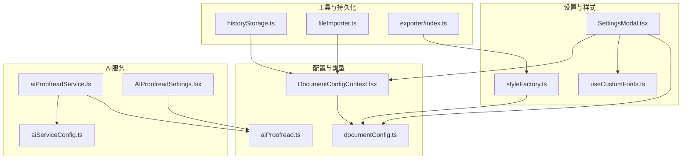
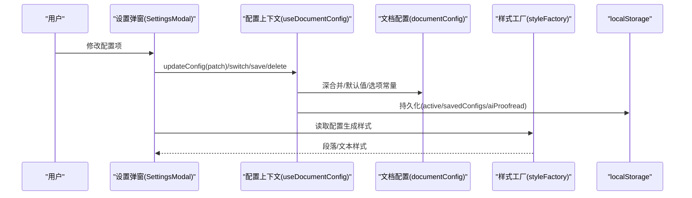
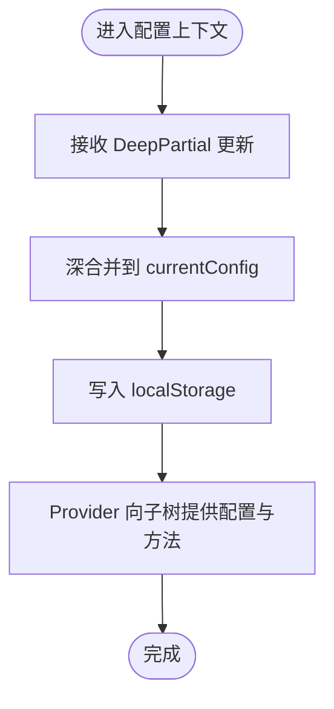
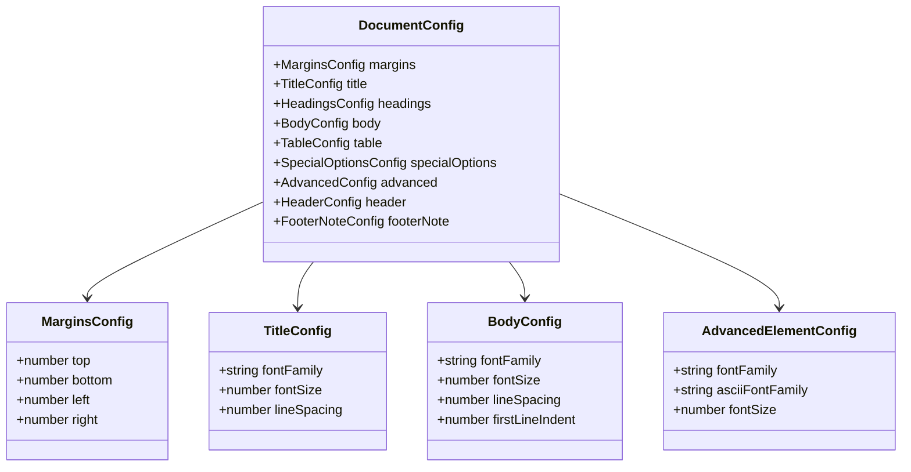
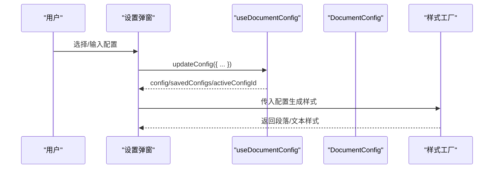
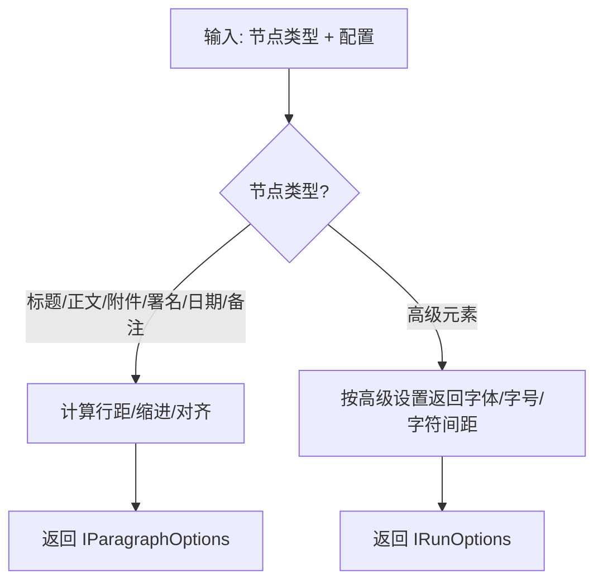
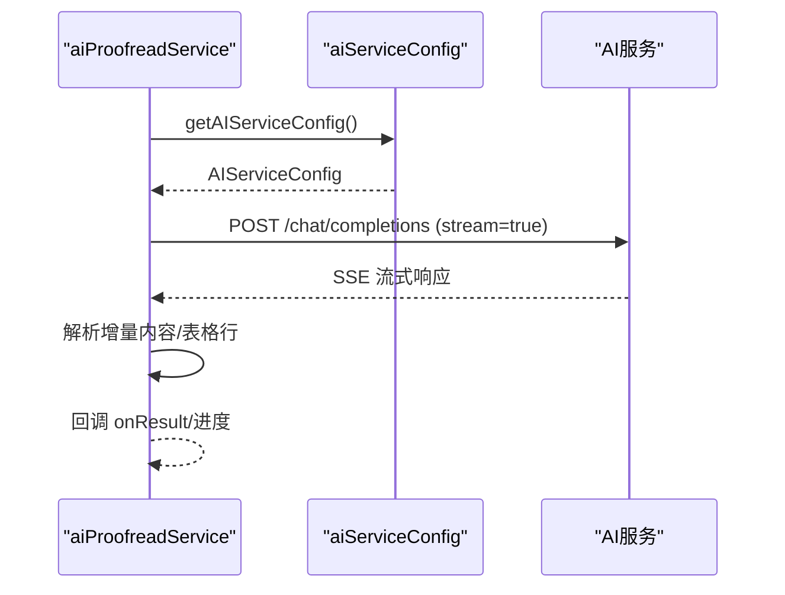
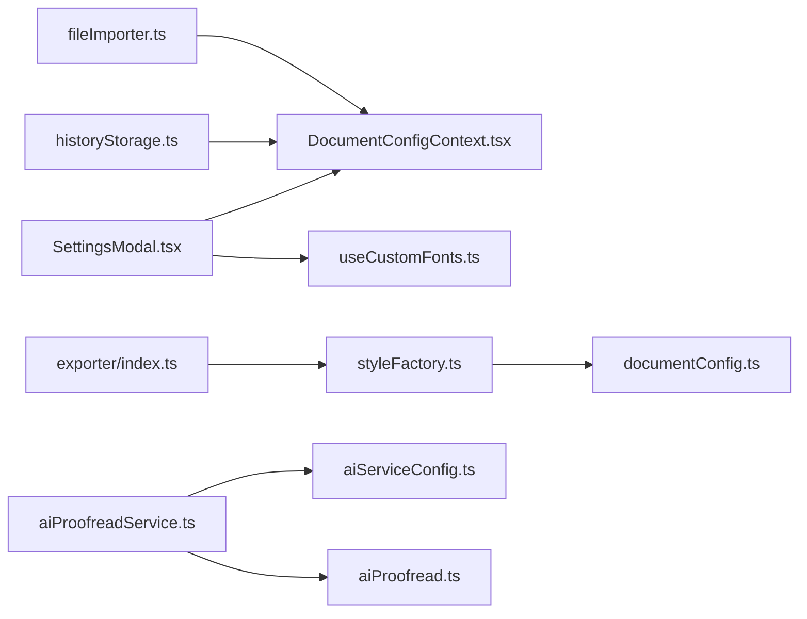

# 配置扩展

<cite>
**本文引用的文件**
- [src/contexts/DocumentConfigContext.tsx](file://src/contexts/DocumentConfigContext.tsx)
- [src/types/documentConfig.ts](file://src/types/documentConfig.ts)
- [src/components/SettingsModal/SettingsModal.tsx](file://src/components/SettingsModal/SettingsModal.tsx)
- [src/hooks/useCustomFonts.ts](file://src/hooks/useCustomFonts.ts)
- [src/services/aiServiceConfig.ts](file://src/services/aiServiceConfig.ts)
- [src/services/aiProofreadService.ts](file://src/services/aiProofreadService.ts)
- [src/components/AIProofreadSettings/AIProofreadSettings.tsx](file://src/components/AIProofreadSettings/AIProofreadSettings.tsx)
- [src/types/aiProofread.ts](file://src/types/aiProofread.ts)
- [src/exporter/styleFactory.ts](file://src/exporter/styleFactory.ts)
- [src/utils/historyStorage.ts](file://src/utils/historyStorage.ts)
- [src/utils/fileImporter.ts](file://src/utils/fileImporter.ts)
- [src/exporter/index.ts](file://src/exporter/index.ts)
- [package.json](file://package.json)
</cite>

## 目录
1. [简介](#简介)
2. [项目结构](#项目结构)
3. [核心组件](#核心组件)
4. [架构总览](#架构总览)
5. [详细组件分析](#详细组件分析)
6. [依赖关系分析](#依赖关系分析)
7. [性能考量](#性能考量)
8. [故障排查指南](#故障排查指南)
9. [结论](#结论)
10. [附录](#附录)

## 简介
本指南面向希望扩展“公文排版工具”配置系统的开发者，涵盖以下主题：
- 如何扩展文档配置系统：新增配置项、配置验证与默认值、配置上下文与状态管理
- 如何添加新的公文样式配置：字体、间距、版式
- 如何扩展AI服务配置：API密钥、请求参数、响应处理
- 如何实现配置持久化：localStorage、导入导出、版本兼容
- 最佳实践与常见问题

## 项目结构
围绕配置扩展的关键目录与文件：
- 配置上下文与状态：contexts/DocumentConfigContext.tsx
- 类型与默认值：types/documentConfig.ts、types/aiProofread.ts
- 设置UI与样式应用：components/SettingsModal、exporter/styleFactory.ts
- AI服务配置与调用：services/aiServiceConfig.ts、services/aiProofreadService.ts
- 辅助工具：hooks/useCustomFonts.ts、utils/historyStorage.ts、utils/fileImporter.ts、exporter/index.ts
- 依赖声明：package.json

图表来源
- [src/contexts/DocumentConfigContext.tsx:1-297](file://src/contexts/DocumentConfigContext.tsx#L1-L297)
- [src/types/documentConfig.ts:1-267](file://src/types/documentConfig.ts#L1-L267)
- [src/types/aiProofread.ts:1-201](file://src/types/aiProofread.ts#L1-L201)
- [src/components/SettingsModal/SettingsModal.tsx:1-662](file://src/components/SettingsModal/SettingsModal.tsx#L1-L662)
- [src/exporter/styleFactory.ts:1-364](file://src/exporter/styleFactory.ts#L1-L364)
- [src/hooks/useCustomFonts.ts:1-67](file://src/hooks/useCustomFonts.ts#L1-L67)
- [src/services/aiServiceConfig.ts:1-154](file://src/services/aiServiceConfig.ts#L1-L154)
- [src/services/aiProofreadService.ts:1-516](file://src/services/aiProofreadService.ts#L1-L516)
- [src/components/AIProofreadSettings/AIProofreadSettings.tsx:1-275](file://src/components/AIProofreadSettings/AIProofreadSettings.tsx#L1-L275)
- [src/utils/historyStorage.ts:1-116](file://src/utils/historyStorage.ts#L1-L116)
- [src/utils/fileImporter.ts:1-70](file://src/utils/fileImporter.ts#L1-L70)
- [src/exporter/index.ts:1-4](file://src/exporter/index.ts#L1-L4)

章节来源
- [src/contexts/DocumentConfigContext.tsx:1-297](file://src/contexts/DocumentConfigContext.tsx#L1-L297)
- [src/types/documentConfig.ts:1-267](file://src/types/documentConfig.ts#L1-L267)
- [src/types/aiProofread.ts:1-201](file://src/types/aiProofread.ts#L1-L201)
- [src/components/SettingsModal/SettingsModal.tsx:1-662](file://src/components/SettingsModal/SettingsModal.tsx#L1-L662)
- [src/exporter/styleFactory.ts:1-364](file://src/exporter/styleFactory.ts#L1-L364)
- [src/hooks/useCustomFonts.ts:1-67](file://src/hooks/useCustomFonts.ts#L1-L67)
- [src/services/aiServiceConfig.ts:1-154](file://src/services/aiServiceConfig.ts#L1-L154)
- [src/services/aiProofreadService.ts:1-516](file://src/services/aiProofreadService.ts#L1-L516)
- [src/components/AIProofreadSettings/AIProofreadSettings.tsx:1-275](file://src/components/AIProofreadSettings/AIProofreadSettings.tsx#L1-L275)
- [src/utils/historyStorage.ts:1-116](file://src/utils/historyStorage.ts#L1-L116)
- [src/utils/fileImporter.ts:1-70](file://src/utils/fileImporter.ts#L1-L70)
- [src/exporter/index.ts:1-4](file://src/exporter/index.ts#L1-L4)

## 核心组件
- 配置上下文与状态管理：提供深合并更新、自定义配置保存/切换/删除、AI校对配置管理、localStorage持久化
- 文档配置类型与默认值：定义完整的排版参数、默认值、选项常量、单位转换工具
- 设置弹窗与样式工厂：将配置映射为段落/文本样式，支持字体、字号、行距、缩进、版式
- AI服务配置与调用：从环境变量读取配置、URL归一化、请求参数、流式响应解析
- 自定义字体与持久化：自定义字体列表的本地存储与订阅
- 历史记录与导入：历史记录的读写、去重、清理；文件导入（.docx/.txt）

章节来源
- [src/contexts/DocumentConfigContext.tsx:1-297](file://src/contexts/DocumentConfigContext.tsx#L1-L297)
- [src/types/documentConfig.ts:1-267](file://src/types/documentConfig.ts#L1-L267)
- [src/components/SettingsModal/SettingsModal.tsx:1-662](file://src/components/SettingsModal/SettingsModal.tsx#L1-L662)
- [src/exporter/styleFactory.ts:1-364](file://src/exporter/styleFactory.ts#L1-L364)
- [src/services/aiServiceConfig.ts:1-154](file://src/services/aiServiceConfig.ts#L1-L154)
- [src/services/aiProofreadService.ts:1-516](file://src/services/aiProofreadService.ts#L1-L516)
- [src/hooks/useCustomFonts.ts:1-67](file://src/hooks/useCustomFonts.ts#L1-L67)
- [src/utils/historyStorage.ts:1-116](file://src/utils/historyStorage.ts#L1-L116)
- [src/utils/fileImporter.ts:1-70](file://src/utils/fileImporter.ts#L1-L70)

## 架构总览
配置扩展涉及“类型定义—上下文—UI—导出—AI服务”的闭环。

图表来源
- [src/components/SettingsModal/SettingsModal.tsx:190-244](file://src/components/SettingsModal/SettingsModal.tsx#L190-L244)
- [src/contexts/DocumentConfigContext.tsx:218-286](file://src/contexts/DocumentConfigContext.tsx#L218-L286)
- [src/types/documentConfig.ts:95-183](file://src/types/documentConfig.ts#L95-L183)
- [src/exporter/styleFactory.ts:90-173](file://src/exporter/styleFactory.ts#L90-L173)

## 详细组件分析

### 配置上下文与useDocumentConfig
- 深合并策略：对嵌套对象进行递归合并，仅覆盖非undefined字段
- 状态结构：当前配置、已保存配置列表、活动配置ID、AI校对配置
- 动作类型：更新、切换、另存为、保存、删除、更新AI配置、重置AI配置
- 持久化：监听状态变化，写入localStorage，键名为固定值
- 上下文暴露：updateConfig、switchConfig、saveAsCustomConfig、saveCurrentConfig、deleteCustomConfig、updateAIProofreadConfig、resetAIProofreadConfig

图表来源
- [src/contexts/DocumentConfigContext.tsx:24-48](file://src/contexts/DocumentConfigContext.tsx#L24-L48)
- [src/contexts/DocumentConfigContext.tsx:90-156](file://src/contexts/DocumentConfigContext.tsx#L90-L156)
- [src/contexts/DocumentConfigContext.tsx:257-265](file://src/contexts/DocumentConfigContext.tsx#L257-L265)

章节来源
- [src/contexts/DocumentConfigContext.tsx:1-297](file://src/contexts/DocumentConfigContext.tsx#L1-L297)

### 文档配置类型与默认值
- 配置分层：页面边距、标题、各级标题、正文、表格、特殊选项、高级设置、版头、版记
- 默认值：遵循国标参数，提供字体、字号、行距、缩进等默认值
- 选项常量：字体、ASCII字体、字号、行距、缩进的下拉选项
- 单位转换：厘米→twip、pt→half-point、pt→twip、厘米→页面百分比

图表来源
- [src/types/documentConfig.ts:8-105](file://src/types/documentConfig.ts#L8-L105)
- [src/types/documentConfig.ts:132-183](file://src/types/documentConfig.ts#L132-L183)

章节来源
- [src/types/documentConfig.ts:1-267](file://src/types/documentConfig.ts#L1-L267)

### 设置弹窗与配置应用
- 设置弹窗：提供版头/版记开关与字段、页面边距、标题/各级标题、正文、表格、特殊选项、高级设置
- 配置应用：通过useDocumentConfig读取配置，使用DeepPartial更新；高级设置支持中英文字体分离
- 字体管理：集成自定义字体列表，支持添加/删除

图表来源
- [src/components/SettingsModal/SettingsModal.tsx:190-244](file://src/components/SettingsModal/SettingsModal.tsx#L190-L244)
- [src/exporter/styleFactory.ts:90-173](file://src/exporter/styleFactory.ts#L90-L173)

章节来源
- [src/components/SettingsModal/SettingsModal.tsx:1-662](file://src/components/SettingsModal/SettingsModal.tsx#L1-L662)
- [src/hooks/useCustomFonts.ts:1-67](file://src/hooks/useCustomFonts.ts#L1-L67)

### 样式工厂与版式定制
- 段落样式：根据节点类型返回对齐、行距、缩进等
- 文本样式：根据节点类型返回字体、字号、字符间距
- 首行缩进与字符宽度：基于页面边距与每行字数计算
- 特殊处理：署名右缩进、附件说明样式、标点样式、时间冒号样式

图表来源
- [src/exporter/styleFactory.ts:90-173](file://src/exporter/styleFactory.ts#L90-L173)
- [src/exporter/styleFactory.ts:176-235](file://src/exporter/styleFactory.ts#L176-L235)

章节来源
- [src/exporter/styleFactory.ts:1-364](file://src/exporter/styleFactory.ts#L1-L364)

### AI服务配置扩展
- 环境变量读取：基础URL、模型、API密钥、温度、最大Token、Top-p、Top-k、Min-p、存在惩罚、重复惩罚
- URL归一化：自动补全/v1或/chat/completions路径
- 配置校验：必填项非空校验，数值解析与默认值
- 请求参数：构建OpenAI兼容请求体，启用流式输出
- 响应处理：SSE流式解析，增量拼接与表格行解析

图表来源
- [src/services/aiServiceConfig.ts:47-143](file://src/services/aiServiceConfig.ts#L47-L143)
- [src/services/aiProofreadService.ts:147-319](file://src/services/aiProofreadService.ts#L147-L319)

章节来源
- [src/services/aiServiceConfig.ts:1-154](file://src/services/aiServiceConfig.ts#L1-L154)
- [src/services/aiProofreadService.ts:1-516](file://src/services/aiProofreadService.ts#L1-L516)
- [src/types/aiProofread.ts:112-192](file://src/types/aiProofread.ts#L112-L192)

### AI校对设置弹窗
- 用户界面：内置检查项展示、自定义检查项文本域、内置/自定义示例行列表
- 预览：实时构建最终提示词模板
- 交互：保存/取消，恢复原始配置

章节来源
- [src/components/AIProofreadSettings/AIProofreadSettings.tsx:1-275](file://src/components/AIProofreadSettings/AIProofreadSettings.tsx#L1-L275)
- [src/types/aiProofread.ts:72-81](file://src/types/aiProofread.ts#L72-L81)

### 配置持久化与版本兼容
- 文档配置：localStorage键名固定，存储activeConfigId、savedConfigs、aiProofreadConfig
- 自定义字体：localStorage键名固定，读写与订阅
- 历史记录：localStorage键名固定，限制条目数量，提供增删清空与去重
- 文件导入：支持.docx（mammoth）与.txt，不支持.doc/.wps并给出提示

章节来源
- [src/contexts/DocumentConfigContext.tsx:20-265](file://src/contexts/DocumentConfigContext.tsx#L20-L265)
- [src/hooks/useCustomFonts.ts:1-67](file://src/hooks/useCustomFonts.ts#L1-L67)
- [src/utils/historyStorage.ts:1-116](file://src/utils/historyStorage.ts#L1-L116)
- [src/utils/fileImporter.ts:1-70](file://src/utils/fileImporter.ts#L1-L70)

## 依赖关系分析
- 组件耦合：SettingsModal依赖DocumentConfigContext与字体钩子；样式工厂依赖配置类型与单位转换
- 外部依赖：docx（生成样式）、mammoth（提取文本）、file-saver（下载）
- 环境变量：VITE_* 由Vite注入，用于AI服务配置

图表来源
- [src/components/SettingsModal/SettingsModal.tsx:1-662](file://src/components/SettingsModal/SettingsModal.tsx#L1-L662)
- [src/contexts/DocumentConfigContext.tsx:1-297](file://src/contexts/DocumentConfigContext.tsx#L1-L297)
- [src/hooks/useCustomFonts.ts:1-67](file://src/hooks/useCustomFonts.ts#L1-L67)
- [src/exporter/styleFactory.ts:1-364](file://src/exporter/styleFactory.ts#L1-L364)
- [src/types/documentConfig.ts:1-267](file://src/types/documentConfig.ts#L1-L267)
- [src/services/aiProofreadService.ts:1-516](file://src/services/aiProofreadService.ts#L1-L516)
- [src/services/aiServiceConfig.ts:1-154](file://src/services/aiServiceConfig.ts#L1-L154)
- [src/types/aiProofread.ts:1-201](file://src/types/aiProofread.ts#L1-L201)
- [src/utils/historyStorage.ts:1-116](file://src/utils/historyStorage.ts#L1-L116)
- [src/utils/fileImporter.ts:1-70](file://src/utils/fileImporter.ts#L1-L70)
- [src/exporter/index.ts:1-4](file://src/exporter/index.ts#L1-L4)
- [package.json:13-18](file://package.json#L13-L18)

章节来源
- [package.json:1-39](file://package.json#L1-L39)

## 性能考量
- 深合并与深拷贝：在频繁更新时注意对象层级深度，避免不必要的大对象复制
- 并发与批处理：AI请求支持并发控制与重试，合理设置最大并发数
- 样式计算：字符宽度与缩进计算基于页面边距，减少重复计算可缓存中间值
- 存储访问：localStorage读写集中于useEffect副作用，避免在渲染阶段频繁写入

## 故障排查指南
- AI服务未配置
  - 现象：请求失败或报错
  - 排查：确认环境变量是否正确设置，URL是否包含/v1与/chat/completions
  - 参考
    - [src/services/aiServiceConfig.ts:47-143](file://src/services/aiServiceConfig.ts#L47-L143)
    - [src/services/aiProofreadService.ts:156-162](file://src/services/aiProofreadService.ts#L156-L162)
- API密钥无效/请求频繁/服务内部错误
  - 现象：HTTP 401/429/500
  - 排查：检查密钥、配额与服务状态
  - 参考
    - [src/services/aiProofreadService.ts:197-208](file://src/services/aiProofreadService.ts#L197-L208)
- localStorage异常
  - 现象：配置丢失或无法保存
  - 排查：浏览器隐私模式/存储限制/跨域问题
  - 参考
    - [src/contexts/DocumentConfigContext.tsx:159-177](file://src/contexts/DocumentConfigContext.tsx#L159-L177)
    - [src/hooks/useCustomFonts.ts:21-28](file://src/hooks/useCustomFonts.ts#L21-L28)
    - [src/utils/historyStorage.ts:38-47](file://src/utils/historyStorage.ts#L38-L47)
- 文件导入失败
  - 现象：提示不支持.doc/.wps或格式错误
  - 排查：转换为.docx后再导入
  - 参考
    - [src/utils/fileImporter.ts:23-48](file://src/utils/fileImporter.ts#L23-L48)

章节来源
- [src/services/aiServiceConfig.ts:1-154](file://src/services/aiServiceConfig.ts#L1-L154)
- [src/services/aiProofreadService.ts:1-516](file://src/services/aiProofreadService.ts#L1-L516)
- [src/contexts/DocumentConfigContext.tsx:159-177](file://src/contexts/DocumentConfigContext.tsx#L159-L177)
- [src/hooks/useCustomFonts.ts:1-67](file://src/hooks/useCustomFonts.ts#L1-L67)
- [src/utils/historyStorage.ts:1-116](file://src/utils/historyStorage.ts#L1-L116)
- [src/utils/fileImporter.ts:1-70](file://src/utils/fileImporter.ts#L1-L70)

## 结论
通过上述组件与流程，系统提供了完善的配置扩展能力：类型与默认值定义清晰、上下文状态管理稳健、UI与样式映射直观、AI服务配置与响应处理完备、持久化与版本兼容可靠。开发者可在此基础上安全地新增配置项、优化样式工厂、增强AI校对能力与导入导出功能。

## 附录

### 新增配置项步骤（示例：新增“页眉/页脚字体”）
- 在类型定义中新增字段
  - 参考：[src/types/documentConfig.ts:95-105](file://src/types/documentConfig.ts#L95-L105)
- 在默认值中设置默认值
  - 参考：[src/types/documentConfig.ts:132-183](file://src/types/documentConfig.ts#L132-L183)
- 在设置弹窗中添加控件并绑定updateConfig
  - 参考：[src/components/SettingsModal/SettingsModal.tsx:190-244](file://src/components/SettingsModal/SettingsModal.tsx#L190-L244)
- 在样式工厂中应用新字段
  - 参考：[src/exporter/styleFactory.ts:176-235](file://src/exporter/styleFactory.ts#L176-L235)
- 在上下文中持久化新字段
  - 参考：[src/contexts/DocumentConfigContext.tsx:257-265](file://src/contexts/DocumentConfigContext.tsx#L257-L265)

### 配置验证与默认值设置最佳实践
- 必填项校验：环境变量与配置对象的非空检查
  - 参考：[src/services/aiServiceConfig.ts:60-71](file://src/services/aiServiceConfig.ts#L60-L71)
- 数值解析与兜底：parseFloat/parseInt并提供默认值
  - 参考：[src/services/aiServiceConfig.ts:72-129](file://src/services/aiServiceConfig.ts#L72-L129)
- 深合并策略：仅覆盖非undefined字段，保留深层默认值
  - 参考：[src/contexts/DocumentConfigContext.tsx:24-48](file://src/contexts/DocumentConfigContext.tsx#L24-L48)

### 配置上下文与useDocumentConfig使用要点
- 使用useDocumentConfig获取配置与方法
  - 参考：[src/components/SettingsModal/SettingsModal.tsx:190-200](file://src/components/SettingsModal/SettingsModal.tsx#L190-L200)
- 通过DeepPartial更新局部配置
  - 参考：[src/contexts/DocumentConfigContext.tsx:221-223](file://src/contexts/DocumentConfigContext.tsx#L221-L223)
- 切换/保存/删除自定义配置
  - 参考：[src/contexts/DocumentConfigContext.tsx:225-247](file://src/contexts/DocumentConfigContext.tsx#L225-L247)

### 公文样式配置扩展要点
- 字体设置：支持中英文字体分离，字符间距微调
  - 参考：[src/exporter/styleFactory.ts:23-25](file://src/exporter/styleFactory.ts#L23-L25)
- 间距调整：行距、首行缩进、左右/上下边距
  - 参考：[src/exporter/styleFactory.ts:90-173](file://src/exporter/styleFactory.ts#L90-L173)
- 版式定制：署名右缩进、附件说明、标点样式
  - 参考：[src/exporter/styleFactory.ts:76-87](file://src/exporter/styleFactory.ts#L76-L87)

### AI服务配置扩展要点
- API密钥管理：从环境变量读取并校验
  - 参考：[src/services/aiServiceConfig.ts:47-70](file://src/services/aiServiceConfig.ts#L47-L70)
- 请求参数配置：温度、最大Token、Top-p/k、惩罚系数
  - 参考：[src/services/aiServiceConfig.ts:72-129](file://src/services/aiServiceConfig.ts#L72-L129)
- 响应处理：SSE流式解析与表格行提取
  - 参考：[src/services/aiProofreadService.ts:215-309](file://src/services/aiProofreadService.ts#L215-L309)

### 配置持久化与版本兼容
- localStorage键名固定，避免硬编码散落
  - 参考：[src/contexts/DocumentConfigContext.tsx](file://src/contexts/DocumentConfigContext.tsx#L20)
- 版本兼容：存储结构包含aiProofreadConfig可选字段
  - 参考：[src/types/documentConfig.ts:122-128](file://src/types/documentConfig.ts#L122-L128)
- 历史记录与导入导出：统一键名与容量限制
  - 参考：[src/utils/historyStorage.ts:3-4](file://src/utils/historyStorage.ts#L3-L4)
  - 参考：[src/utils/fileImporter.ts:23-48](file://src/utils/fileImporter.ts#L23-L48)