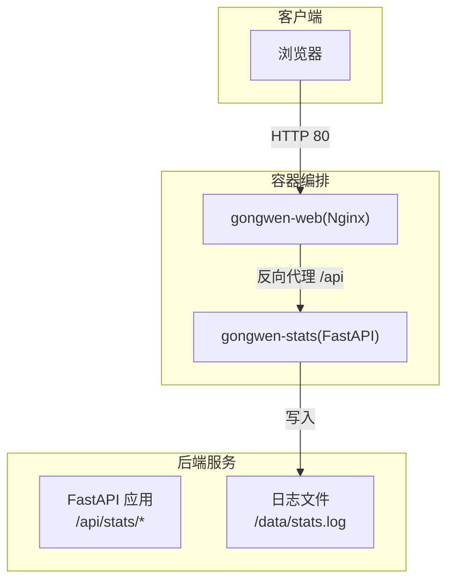
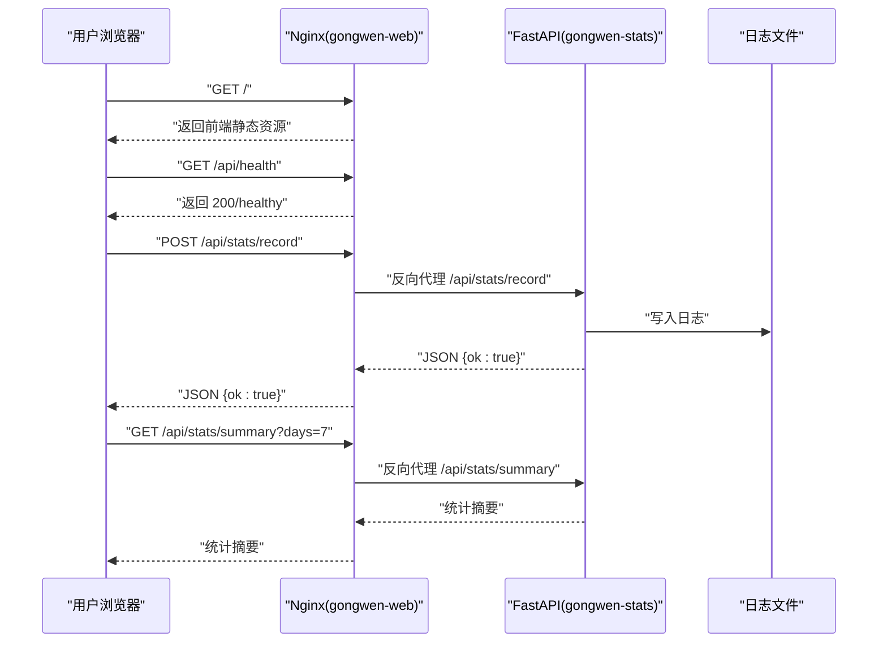
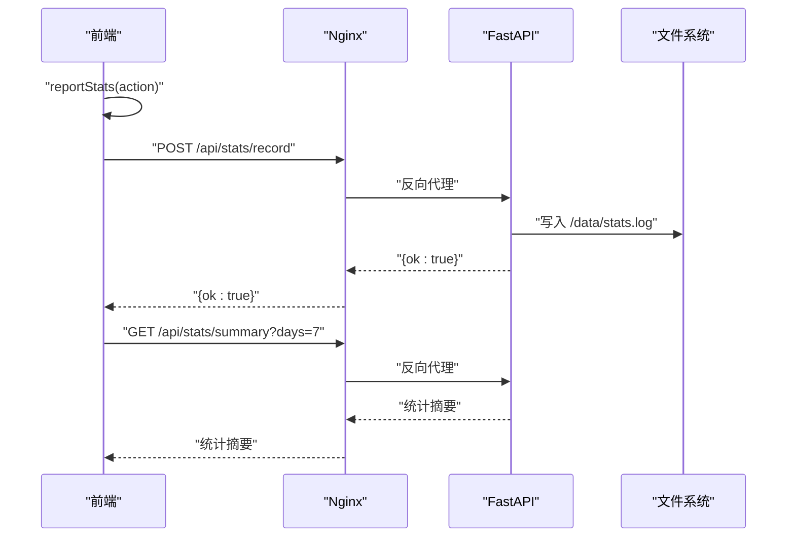
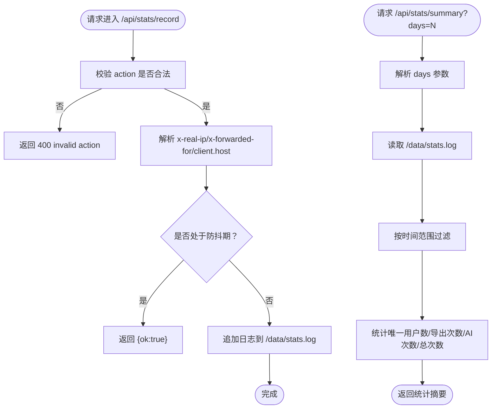
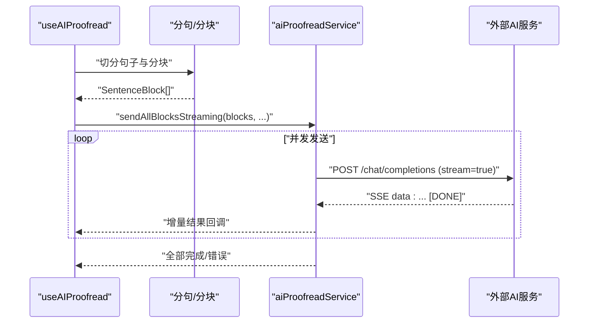
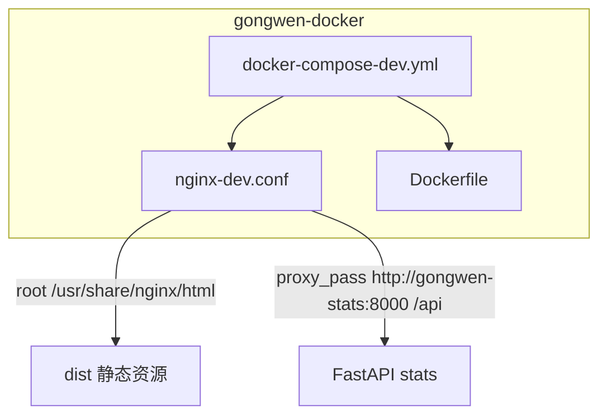
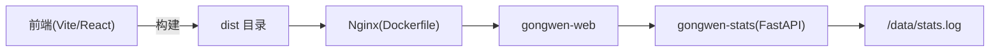

# 故障排除

<cite>
**本文引用的文件**
- [package.json](file://package.json)
- [README.md](file://README.md)
- [gongwen-docker/README.md](file://gongwen-docker/README.md)
- [backend/main.py](file://backend/main.py)
- [backend/config.py](file://backend/config.py)
- [backend/requirements.txt](file://backend/requirements.txt)
- [backend/routers/stats.py](file://backend/routers/stats.py)
- [backend/services/stats_service.py](file://backend/services/stats_service.py)
- [gongwen-docker/docker-compose-dev.yml](file://gongwen-docker/docker-compose-dev.yml)
- [gongwen-docker/nginx-dev.conf](file://gongwen-docker/nginx-dev.conf)
- [gongwen-docker/Dockerfile](file://gongwen-docker/Dockerfile)
- [src/utils/statsReporter.ts](file://src/utils/statsReporter.ts)
- [src/utils/statsPrinter.ts](file://src/utils/statsPrinter.ts)
- [src/services/aiProofreadService.ts](file://src/services/aiProofreadService.ts)
- [src/hooks/useAIProofread.ts](file://src/hooks/useAIProofread.ts)
- [src/utils/historyStorage.ts](file://src/utils/historyStorage.ts)
- [src/utils/sanitize.ts](file://src/utils/sanitize.ts)
</cite>

## 目录
1. [简介](#简介)
2. [项目结构](#项目结构)
3. [核心组件](#核心组件)
4. [架构总览](#架构总览)
5. [详细组件分析](#详细组件分析)
6. [依赖关系分析](#依赖关系分析)
7. [性能考虑](#性能考虑)
8. [故障排除指南](#故障排除指南)
9. [结论](#结论)
10. [附录](#附录)

## 简介
本指南面向运维与使用者，聚焦公文排版工具在安装、运行、性能与兼容性方面的常见问题与解决方案，覆盖本地开发、Docker 容器、Nginx 反向代理、统计上报与后端服务、AI 审核、浏览器兼容性、日志与权限、以及紧急恢复与数据保护等主题。文档同时提供调试步骤、诊断方法、性能优化建议与社区支持渠道。

## 项目结构
该仓库采用前后端分离与容器化部署思路：
- 前端：React + TypeScript，通过 Vite 构建，产物由 Nginx 提供静态服务。
- 后端：FastAPI 统计服务，提供 /api/stats/record 与 /api/stats/summary 接口，支持健康检查。
- 容器：Nginx 镜像承载前端静态资源，反向代理 /api 到后端统计服务；Compose 启动 web 与 stats 两个服务。
- AI 审核：前端通过流式 SSE 请求调用外部 AI 服务，具备并发与重试控制。

图表来源
- [gongwen-docker/docker-compose-dev.yml:6-44](file://gongwen-docker/docker-compose-dev.yml#L6-L44)
- [gongwen-docker/nginx-dev.conf:55-64](file://gongwen-docker/nginx-dev.conf#L55-L64)
- [backend/main.py:24-38](file://backend/main.py#L24-L38)
- [backend/services/stats_service.py:44-55](file://backend/services/stats_service.py#L44-L55)

章节来源
- [README.md:35-81](file://README.md#L35-L81)
- [gongwen-docker/README.md:1-41](file://gongwen-docker/README.md#L1-L41)
- [gongwen-docker/docker-compose-dev.yml:1-44](file://gongwen-docker/docker-compose-dev.yml#L1-L44)
- [gongwen-docker/nginx-dev.conf:1-85](file://gongwen-docker/nginx-dev.conf#L1-L85)
- [backend/main.py:1-38](file://backend/main.py#L1-L38)

## 核心组件
- 前端统计上报与查询
  - 上报：reportStats(action) 通过 /api/stats/record 异步上报，失败静默。
  - 查询：printStatsOverview() 调用 /api/stats/summary 获取多周期统计。
- 后端统计服务
  - 路由：/api/stats/record（POST）与 /api/stats/summary（GET）。
  - 防抖：按 IP+action 维度去抖，降低重复调用。
  - 日志：写入容器挂载的 /data/stats.log。
- 容器与反向代理
  - Nginx 暴露 80 端口，静态资源来自 dist，/api 反代到 stats 服务。
  - 健康检查：Web 与 Stats 均提供 /health。
- AI 审核
  - 前端分句分块并发流式请求，支持重试与调试输出。
  - 配置来源于构建时注入的环境变量（Docker）。

章节来源
- [src/utils/statsReporter.ts:16-28](file://src/utils/statsReporter.ts#L16-L28)
- [src/utils/statsPrinter.ts:18-53](file://src/utils/statsPrinter.ts#L18-L53)
- [backend/routers/stats.py:12-39](file://backend/routers/stats.py#L12-L39)
- [backend/services/stats_service.py:15-55](file://backend/services/stats_service.py#L15-L55)
- [gongwen-docker/nginx-dev.conf:55-64](file://gongwen-docker/nginx-dev.conf#L55-L64)
- [src/services/aiProofreadService.ts:147-319](file://src/services/aiProofreadService.ts#L147-L319)

## 架构总览
下图展示典型请求路径与组件交互，包括健康检查、统计上报与 AI 审核的关键节点。

图表来源
- [gongwen-docker/nginx-dev.conf:55-64](file://gongwen-docker/nginx-dev.conf#L55-L64)
- [backend/main.py:34-37](file://backend/main.py#L34-L37)
- [backend/routers/stats.py:12-39](file://backend/routers/stats.py#L12-L39)
- [backend/services/stats_service.py:44-55](file://backend/services/stats_service.py#L44-L55)

## 详细组件分析

### 组件A：统计上报与查询（前端）
- 上报流程
  - 触发：导出或 AI 校对完成后触发 reportStats(action)。
  - 行为：POST /api/stats/record，失败静默，不影响主流程。
- 查询流程
  - 触发：控制台执行 printStatsOverview()。
  - 行为：GET /api/stats/summary?days={7|30|365|0}，失败时输出警告。

图表来源
- [src/utils/statsReporter.ts:16-28](file://src/utils/statsReporter.ts#L16-L28)
- [src/utils/statsPrinter.ts:18-53](file://src/utils/statsPrinter.ts#L18-L53)
- [gongwen-docker/nginx-dev.conf:55-64](file://gongwen-docker/nginx-dev.conf#L55-L64)
- [backend/routers/stats.py:12-39](file://backend/routers/stats.py#L12-L39)
- [backend/services/stats_service.py:44-55](file://backend/services/stats_service.py#L44-L55)

章节来源
- [src/utils/statsReporter.ts:1-29](file://src/utils/statsReporter.ts#L1-L29)
- [src/utils/statsPrinter.ts:1-54](file://src/utils/statsPrinter.ts#L1-L54)

### 组件B：统计服务（后端）
- 路由与校验
  - /api/stats/record：校验 action 是否在允许集合，获取 x-real-ip/x-forwarded-for，防抖后写日志。
  - /api/stats/summary：按天数聚合唯一用户数、导出次数、AI 校对次数与总调用次数。
- 防抖与清理
  - 内存缓存：(IP, action) -> 上次记录时间戳。
  - 定时清理：每 DEBOUNCE_CLEANUP_INTERVAL 秒清理过期条目。
- 日志与汇总
  - 日志文件路径可通过 STATS_LOG_PATH 环境变量覆盖。
  - 汇总时按时间范围过滤，忽略非法行与非法 action。

图表来源
- [backend/routers/stats.py:12-39](file://backend/routers/stats.py#L12-L39)
- [backend/services/stats_service.py:15-124](file://backend/services/stats_service.py#L15-L124)
- [backend/config.py:6-15](file://backend/config.py#L6-L15)

章节来源
- [backend/routers/stats.py:1-40](file://backend/routers/stats.py#L1-L40)
- [backend/services/stats_service.py:1-124](file://backend/services/stats_service.py#L1-L124)
- [backend/config.py:1-16](file://backend/config.py#L1-L16)

### 组件C：AI 审核（前端）
- 流程要点
  - 分句：将 AST 文本切分为句子序列。
  - 分块：按最大字符限制拆分为块，便于并发与限流。
  - 并发：默认并发数为 3，支持重试（最多 3 次，递增延迟）。
  - 流式解析：按 SSE 行解析 Markdown 表格，增量回调结果。
  - 错误处理：针对 401/429/500 等状态码给出明确提示。
- 调试能力
  - 收集完整响应文本、发送与解析的序号列表，输出到控制台，便于定位缺失行或解析异常。

图表来源
- [src/hooks/useAIProofread.ts:67-205](file://src/hooks/useAIProofread.ts#L67-L205)
- [src/services/aiProofreadService.ts:147-319](file://src/services/aiProofreadService.ts#L147-L319)

章节来源
- [src/hooks/useAIProofread.ts:1-221](file://src/hooks/useAIProofread.ts#L1-L221)
- [src/services/aiProofreadService.ts:1-516](file://src/services/aiProofreadService.ts#L1-L516)

### 组件D：容器与反向代理
- Nginx 配置
  - 监听 80，root 指向 /usr/share/nginx/html，SPA 路由回退到 index.html。
  - /api 反向代理到 gongwen-stats:8000。
  - 健康检查端点 /health 返回 "healthy"。
- Compose 编排
  - gongwen-web 依赖 gongwen-stats，端口 88:80，挂载 nginx 配置。
  - gongwen-stats 挂载 /data，暴露健康检查端口。
- 镜像构建
  - 直接复制本地构建的 dist 目录，适合本地构建后部署。

图表来源
- [gongwen-docker/docker-compose-dev.yml:6-44](file://gongwen-docker/docker-compose-dev.yml#L6-L44)
- [gongwen-docker/nginx-dev.conf:35-76](file://gongwen-docker/nginx-dev.conf#L35-L76)
- [gongwen-docker/Dockerfile:10-12](file://gongwen-docker/Dockerfile#L10-L12)

章节来源
- [gongwen-docker/docker-compose-dev.yml:1-44](file://gongwen-docker/docker-compose-dev.yml#L1-L44)
- [gongwen-docker/nginx-dev.conf:1-85](file://gongwen-docker/nginx-dev.conf#L1-L85)
- [gongwen-docker/Dockerfile:1-19](file://gongwen-docker/Dockerfile#L1-L19)

## 依赖关系分析
- 前端依赖
  - React、TypeScript、Vite、docx、mammoth、file-saver 等。
  - 构建脚本：dev/build/build:single/preview/lint。
- 后端依赖
  - FastAPI、uvicorn。
- 容器与部署
  - Nginx 镜像、docker-compose、环境变量注入（Docker）。

图表来源
- [package.json:6-11](file://package.json#L6-L11)
- [gongwen-docker/Dockerfile:10-12](file://gongwen-docker/Dockerfile#L10-L12)
- [backend/requirements.txt:1-3](file://backend/requirements.txt#L1-L3)

章节来源
- [package.json:1-39](file://package.json#L1-L39)
- [backend/requirements.txt:1-3](file://backend/requirements.txt#L1-L3)

## 性能考虑
- 前端
  - 使用单文件构建（build:single）减少请求数，适合离线场景。
  - PWA 与静态资源缓存策略（长缓存 JS/CSS/字体，禁用缓存 PWA 相关文件）。
- 后端
  - 防抖缓存与定期清理，避免重复统计写盘。
  - 汇总时按天数过滤，避免全量扫描。
- AI 审核
  - 并发默认 3，重试递增延迟，缓解上游限流与瞬时错误。
  - 分块发送，避免单次请求过大导致超时或解析困难。

章节来源
- [README.md:42-48](file://README.md#L42-L48)
- [gongwen-docker/nginx-dev.conf:44-53](file://gongwen-docker/nginx-dev.conf#L44-L53)
- [backend/services/stats_service.py:37-42](file://backend/services/stats_service.py#L37-L42)
- [src/services/aiProofreadService.ts:341-344](file://src/services/aiProofreadService.ts#L341-L344)

## 故障排除指南

### 一、安装与环境准备
- 本地开发
  - 安装依赖后运行 dev，访问 http://localhost:5173。
  - 构建产物输出到 dist，支持单文件离线版。
- Docker 部署
  - 在 gongwen-docker 目录执行 docker-compose up -d --build。
  - 访问 http://localhost:88。
- AI 审核启用
  - 在 gongwen-docker 目录创建 .env，注入 VITE_AI_BASE_URL/VITE_AI_MODEL/VITE_AI_API_KEY。
  - 修改后需重新构建镜像。

章节来源
- [README.md:35-81](file://README.md#L35-L81)
- [gongwen-docker/README.md:1-41](file://gongwen-docker/README.md#L1-L41)

### 二、运行时错误

1) 健康检查失败
- 现象：/health 返回非 200 或容器重启频繁。
- 排查：
  - Web 健康检查：确认 Nginx 正常、端口 80 可用、dist 目录存在。
  - Stats 健康检查：确认 FastAPI 进程正常、端口 8000 可达。
- 处置：查看容器日志，修复 Nginx 配置或后端进程。

章节来源
- [gongwen-docker/docker-compose-dev.yml:21-26](file://gongwen-docker/docker-compose-dev.yml#L21-L26)
- [gongwen-docker/docker-compose-dev.yml:38-43](file://gongwen-docker/docker-compose-dev.yml#L38-L43)
- [backend/main.py:34-37](file://backend/main.py#L34-L37)

2) 统计上报失败或无数据
- 现象：导出/校对后无统计增长或控制台警告。
- 排查：
  - 检查 /api/stats/record 是否可达（Nginx 反代）。
  - 检查 /data/stats.log 是否存在且可写（容器卷挂载）。
  - 检查 action 是否在允许集合（export_docx/ai_proofread）。
- 处置：修复反代、修正日志路径权限、确认上报动作名。

章节来源
- [src/utils/statsReporter.ts:16-28](file://src/utils/statsReporter.ts#L16-L28)
- [backend/routers/stats.py:12-32](file://backend/routers/stats.py#L12-L32)
- [backend/services/stats_service.py:44-55](file://backend/services/stats_service.py#L44-L55)
- [backend/config.py:14-16](file://backend/config.py#L14-L16)

3) AI 审核报错
- 常见错误与提示：
  - 401：API 密钥无效或未配置。
  - 429：请求过于频繁，触发上游限流。
  - 500：AI 服务内部错误。
  - 网络失败：fetch 抛错或响应体为空。
- 排查：
  - 检查 .env 是否正确注入（Docker 构建时注入）。
  - 检查外部 AI 服务连通性与配额。
  - 查看浏览器控制台调试输出（发送/解析序号、缺失项）。
- 处置：修正密钥与模型、降低并发或增加重试间隔、必要时切换上游服务。

章节来源
- [src/services/aiProofreadService.ts:196-213](file://src/services/aiProofreadService.ts#L196-L213)
- [src/services/aiProofreadService.ts:418-434](file://src/services/aiProofreadService.ts#L418-L434)
- [src/hooks/useAIProofread.ts:72-83](file://src/hooks/useAIProofread.ts#L72-L83)

### 三、性能问题

1) 前端加载慢
- 检查静态资源缓存与 gzip 是否生效。
- 使用单文件构建（build:single）减少请求数。
- 关注浏览器网络面板与缓存命中率。

章节来源
- [gongwen-docker/nginx-dev.conf:28-34](file://gongwen-docker/nginx-dev.conf#L28-L34)
- [README.md:42-48](file://README.md#L42-L48)

2) 后端统计写盘压力大
- 检查防抖与清理策略是否生效（DEBOUNCE_SECONDS 与 DEBOUNCE_CLEANUP_INTERVAL）。
- 控制上报频率，避免短时间大量重复调用。

章节来源
- [backend/config.py:8-12](file://backend/config.py#L8-L12)
- [backend/services/stats_service.py:15-42](file://backend/services/stats_service.py#L15-L42)

3) AI 审核吞吐低
- 调整并发数与重试策略，观察上游限流与响应稳定性。
- 分块大小适配模型上下文长度，避免单块过大。

章节来源
- [src/services/aiProofreadService.ts:341-344](file://src/services/aiProofreadService.ts#L341-L344)
- [src/services/aiProofreadService.ts:119-135](file://src/services/aiProofreadService.ts#L119-L135)

### 四、兼容性问题

1) 浏览器兼容性
- 代码避免可选链与空值合并，兼容较老内核。
- 如遇 fetch/ReadableStream 相关问题，优先在现代浏览器验证。

章节来源
- [src/services/aiProofreadService.ts:4-5](file://src/services/aiProofreadService.ts#L4-L5)

2) 字符编码与标点净化
- 标点替换与时间格式处理遵循中文排版规范，注意与英文混排的边界。
- 如出现异常替换，检查输入文本与正则匹配边界。

章节来源
- [src/utils/sanitize.ts:16-25](file://src/utils/sanitize.ts#L16-L25)
- [src/utils/sanitize.ts:156-162](file://src/utils/sanitize.ts#L156-L162)

### 五、日志分析与网络排查

1) 日志位置与权限
- 后端日志默认写入 /data/stats.log，需确保容器卷挂载与写权限。
- 通过容器日志查看 FastAPI 启动与运行状态。

章节来源
- [backend/config.py](file://backend/config.py#L6)
- [backend/services/stats_service.py:44-55](file://backend/services/stats_service.py#L44-L55)

2) 网络连通性
- Web 与 Stats 之间通过 Docker 网络通信，确认容器网络与端口映射。
- Nginx 反代 /api 到 gongwen-stats:8000，检查 upstream 地址与超时配置。

章节来源
- [gongwen-docker/docker-compose-dev.yml:28-44](file://gongwen-docker/docker-compose-dev.yml#L28-L44)
- [gongwen-docker/nginx-dev.conf:55-64](file://gongwen-docker/nginx-dev.conf#L55-L64)

3) 权限问题
- Nginx 以 nobody 运行，需保证 dist 目录可读。
- 容器写日志需 /data 可写，确认宿主机挂载权限。

章节来源
- [gongwen-docker/Dockerfile:10-12](file://gongwen-docker/Dockerfile#L10-L12)
- [gongwen-docker/docker-compose-dev.yml:34-36](file://gongwen-docker/docker-compose-dev.yml#L34-L36)

### 六、Docker 容器特定问题

1) 端口冲突
- 默认 88:80，若宿主 80/88 已被占用，修改 compose 端口映射或释放端口。

章节来源
- [gongwen-docker/docker-compose-dev.yml:13-14](file://gongwen-docker/docker-compose-dev.yml#L13-L14)

2) 静态资源 404
- 确认 dist 已构建，且 Dockerfile 正确复制 /usr/share/nginx/html。
- 检查 Nginx root 与 index 配置。

章节来源
- [gongwen-docker/Dockerfile:10-12](file://gongwen-docker/Dockerfile#L10-L12)
- [gongwen-docker/nginx-dev.conf:40-41](file://gongwen-docker/nginx-dev.conf#L40-L41)

3) 反向代理 /api 404
- 确认 gongwen-stats 容器已启动且健康。
- 检查 Nginx upstream 地址与端口。

章节来源
- [gongwen-docker/docker-compose-dev.yml:19-20](file://gongwen-docker/docker-compose-dev.yml#L19-L20)
- [gongwen-docker/nginx-dev.conf:55-64](file://gongwen-docker/nginx-dev.conf#L55-L64)

### 七、Nginx 配置问题

1) SPA 路由 404
- 确认 try_files $uri $uri/ /index.html 生效。
- 检查 root 与 index 配置。

章节来源
- [gongwen-docker/nginx-dev.conf:66-69](file://gongwen-docker/nginx-dev.conf#L66-L69)

2) 缓存策略异常
- JS/CSS/字体长缓存，PWA 相关文件禁用缓存。
- 如出现更新不生效，检查 Cache-Control 与 expires 设置。

章节来源
- [gongwen-docker/nginx-dev.conf:44-53](file://gongwen-docker/nginx-dev.conf#L44-L53)

### 八、数据库连接问题
- 本项目无数据库依赖，统计日志写入文件系统。如需持久化，确保 /data 目录可写。

章节来源
- [backend/services/stats_service.py:44-55](file://backend/services/stats_service.py#L44-L55)
- [gongwen-docker/docker-compose-dev.yml:34-36](file://gongwen-docker/docker-compose-dev.yml#L34-L36)

### 九、收集诊断信息与提交问题报告

1) 诊断清单
- 前端
  - 浏览器控制台截图（含 AI 审核调试输出）。
  - 网络面板：/api/stats/* 与 /api/health 的请求/响应。
- 后端
  - 容器日志：docker logs gongwen-stats。
  - /data/stats.log 存在性与最后几行。
- 容器
  - docker ps、docker inspect gongwen-web/gongwen-stats。
  - docker-compose logs。

2) 提交问题报告
- 描述：环境、操作步骤、期望与实际结果。
- 证据：日志片段、截图、最小可复现步骤。
- 附加：浏览器版本、Docker 版本、Nginx 配置关键段落。

章节来源
- [src/services/aiProofreadService.ts:418-434](file://src/services/aiProofreadService.ts#L418-L434)
- [backend/main.py:34-37](file://backend/main.py#L34-L37)

### 十、紧急恢复与数据保护

1) 紧急恢复
- 回滚镜像：docker load 导入备份镜像后重启。
- 临时降级：停止 stats 容器，前端仍可离线使用（单文件版）。
- 修复 Nginx：替换 nginx-dev.conf 后 docker-compose up -d。

2) 数据保护
- 统计日志：定期备份 /data/stats.log。
- 历史记录：前端 localStorage 保存编辑历史，注意容量上限与清理策略。
- 配置安全：.env 包含敏感信息，禁止提交到仓库。

章节来源
- [gongwen-docker/README.md:13-26](file://gongwen-docker/README.md#L13-L26)
- [src/utils/historyStorage.ts:54-77](file://src/utils/historyStorage.ts#L54-L77)
- [README.md:77-80](file://README.md#L77-L80)

### 十一、社区支持与获取帮助
- 在线体验与离线版下载地址见 README。
- GitHub Issues：提供最小复现、日志与环境信息以便快速定位。

章节来源
- [README.md:5-8](file://README.md#L5-L8)

## 结论
本指南围绕安装、运行、性能与兼容性问题提供了系统化的排查路径与处置建议。通过健康检查、日志分析、网络连通性与权限检查，结合容器与 Nginx 的配置要点，可快速定位并解决问题。建议在生产环境中开启日志轮转与定期备份，并根据业务流量调整并发与缓存策略。

## 附录

### A. 常用命令速查
- 本地开发：npm install && npm run dev
- 构建：npm run build / build:single / preview
- Docker：cd gongwen-docker && docker-compose up -d --build
- 查看日志：docker logs gongwen-stats
- 重启服务：docker-compose restart gongwen-web gongwen-stats

章节来源
- [README.md:35-48](file://README.md#L35-L48)
- [gongwen-docker/README.md:1-12](file://gongwen-docker/README.md#L1-L12)