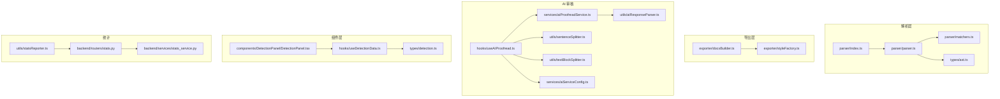
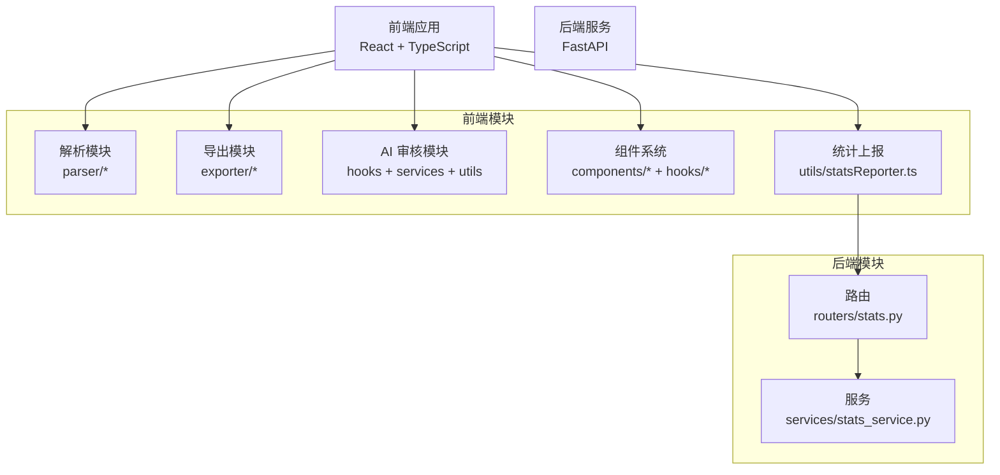
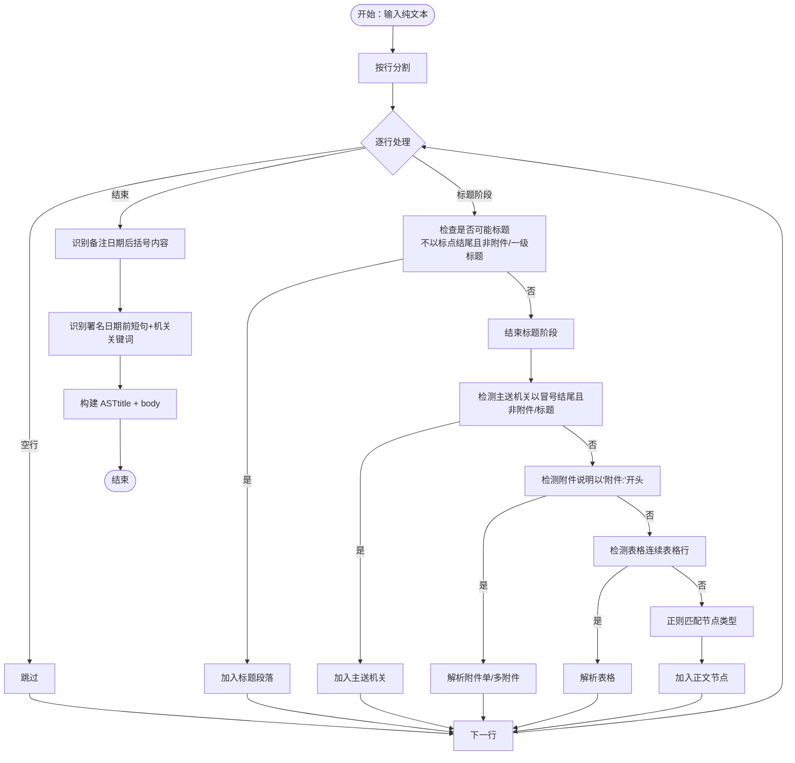
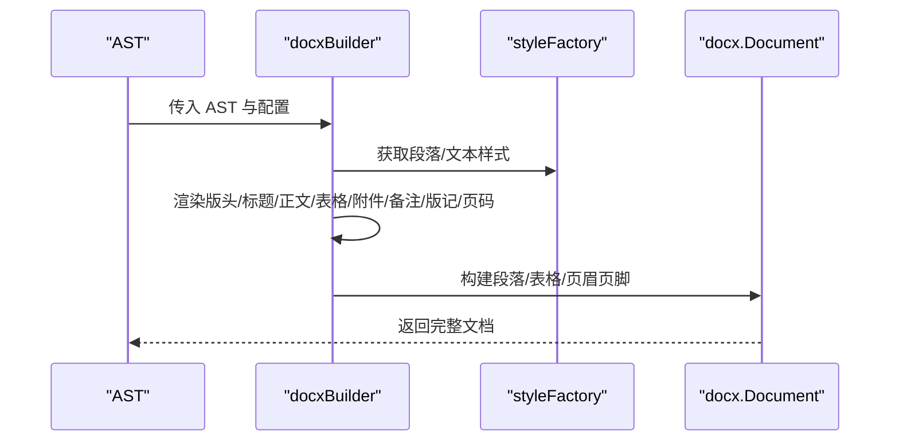
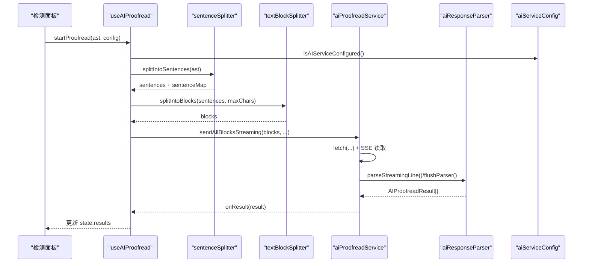
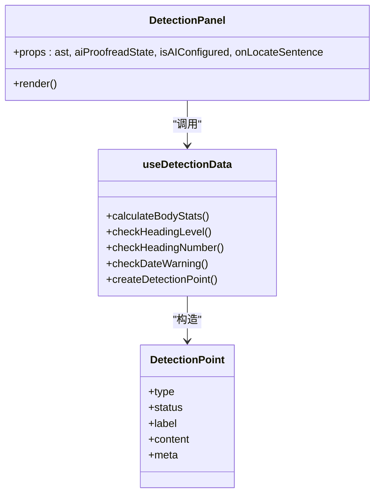
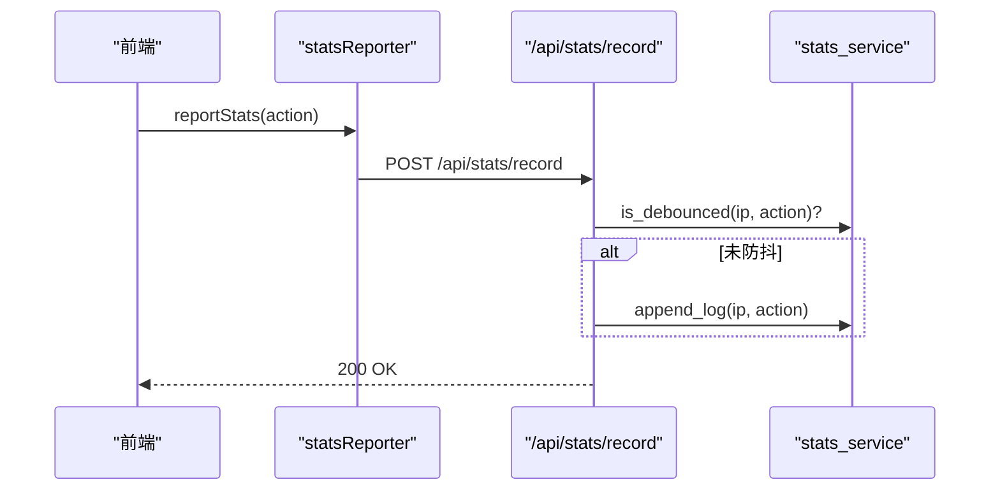
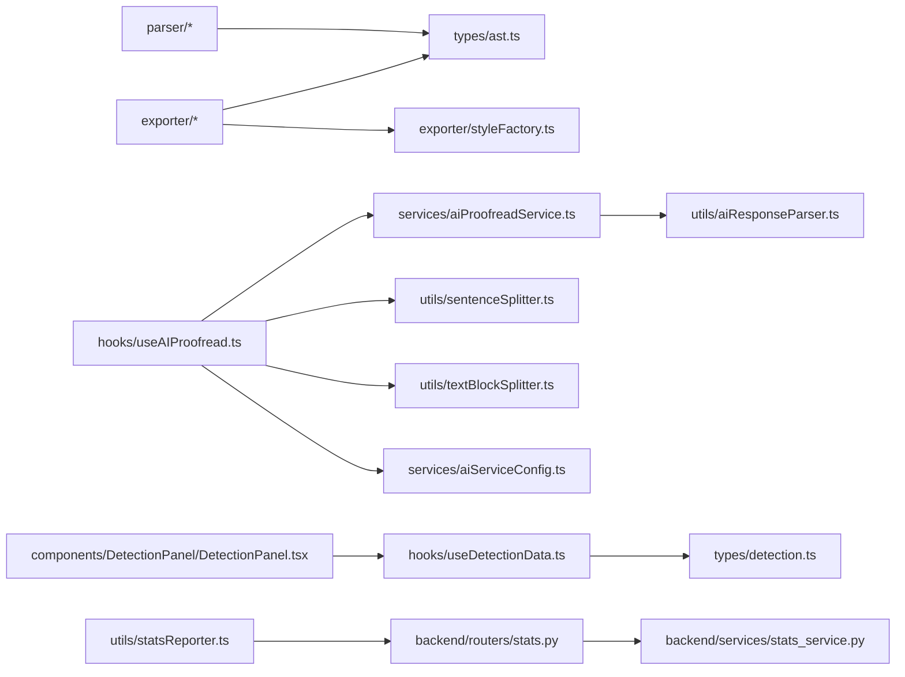

# 核心模块

<cite>
**本文引用的文件**
- [src/parser/index.ts](file://src/parser/index.ts)
- [src/parser/parser.ts](file://src/parser/parser.ts)
- [src/parser/matchers.ts](file://src/parser/matchers.ts)
- [src/types/ast.ts](file://src/types/ast.ts)
- [src/exporter/docxBuilder.ts](file://src/exporter/docxBuilder.ts)
- [src/exporter/styleFactory.ts](file://src/exporter/styleFactory.ts)
- [src/services/aiProofreadService.ts](file://src/services/aiProofreadService.ts)
- [src/hooks/useAIProofread.ts](file://src/hooks/useAIProofread.ts)
- [src/utils/aiResponseParser.ts](file://src/utils/aiResponseParser.ts)
- [src/services/aiServiceConfig.ts](file://src/services/aiServiceConfig.ts)
- [src/utils/sentenceSplitter.ts](file://src/utils/sentenceSplitter.ts)
- [src/utils/textBlockSplitter.ts](file://src/utils/textBlockSplitter.ts)
- [src/components/DetectionPanel/DetectionPanel.tsx](file://src/components/DetectionPanel/DetectionPanel.tsx)
- [src/hooks/useDetectionData.ts](file://src/hooks/useDetectionData.ts)
- [src/types/detection.ts](file://src/types/detection.ts)
- [src/utils/statsReporter.ts](file://src/utils/statsReporter.ts)
- [backend/routers/stats.py](file://backend/routers/stats.py)
- [backend/services/stats_service.py](file://backend/services/stats_service.py)
</cite>

## 目录
1. [简介](#简介)
2. [项目结构](#项目结构)
3. [核心组件](#核心组件)
4. [架构总览](#架构总览)
5. [详细组件分析](#详细组件分析)
6. [依赖分析](#依赖分析)
7. [性能考虑](#性能考虑)
8. [故障排查指南](#故障排查指南)
9. [结论](#结论)
10. [附录](#附录)

## 简介
本技术文档聚焦公文排版工具的核心模块，围绕四大主题展开：
- 文本解析模块：构建公文 AST、匹配规则与解析算法
- DOCX 导出模块：文档生成机制、样式处理与页面布局
- AI 审核模块：集成架构、请求处理与结果展示
- 组件系统：状态管理、事件处理与样式系统
- 统计模块：数据采集、上报机制与隐私保护

文档提供代码级图示、流程图与时序图，帮助开发者快速理解与维护。

## 项目结构
前端采用 React + TypeScript，核心模块分布如下：
- 解析层：parser（AST 构建与节点匹配）
- 导出层：exporter（docx 生成与样式工厂）
- AI 审核：services + hooks + utils（提示词构建、流式请求、响应解析）
- 组件层：components（检测面板、编辑器、预览等）
- 类型定义：types（AST、检测、AI 等）
- 统计上报：utils + backend（前端上报、后端聚合）

图表来源
- [src/parser/index.ts:1-3](file://src/parser/index.ts#L1-L3)
- [src/parser/parser.ts:1-331](file://src/parser/parser.ts#L1-L331)
- [src/parser/matchers.ts:1-148](file://src/parser/matchers.ts#L1-L148)
- [src/types/ast.ts:1-81](file://src/types/ast.ts#L1-L81)
- [src/exporter/docxBuilder.ts:1-806](file://src/exporter/docxBuilder.ts#L1-L806)
- [src/exporter/styleFactory.ts:1-364](file://src/exporter/styleFactory.ts#L1-L364)
- [src/hooks/useAIProofread.ts:1-221](file://src/hooks/useAIProofread.ts#L1-L221)
- [src/services/aiProofreadService.ts:1-516](file://src/services/aiProofreadService.ts#L1-L516)
- [src/utils/aiResponseParser.ts:1-378](file://src/utils/aiResponseParser.ts#L1-L378)
- [src/utils/sentenceSplitter.ts:1-324](file://src/utils/sentenceSplitter.ts#L1-L324)
- [src/utils/textBlockSplitter.ts:1-227](file://src/utils/textBlockSplitter.ts#L1-L227)
- [src/services/aiServiceConfig.ts:1-154](file://src/services/aiServiceConfig.ts#L1-L154)
- [src/components/DetectionPanel/DetectionPanel.tsx:1-464](file://src/components/DetectionPanel/DetectionPanel.tsx#L1-L464)
- [src/hooks/useDetectionData.ts:1-482](file://src/hooks/useDetectionData.ts#L1-L482)
- [src/types/detection.ts:1-151](file://src/types/detection.ts#L1-L151)
- [src/utils/statsReporter.ts:1-29](file://src/utils/statsReporter.ts#L1-L29)
- [backend/routers/stats.py:1-40](file://backend/routers/stats.py#L1-L40)
- [backend/services/stats_service.py:1-124](file://backend/services/stats_service.py#L1-L124)

章节来源
- [src/parser/index.ts:1-3](file://src/parser/index.ts#L1-L3)
- [src/parser/parser.ts:1-331](file://src/parser/parser.ts#L1-L331)
- [src/parser/matchers.ts:1-148](file://src/parser/matchers.ts#L1-L148)
- [src/types/ast.ts:1-81](file://src/types/ast.ts#L1-L81)
- [src/exporter/docxBuilder.ts:1-806](file://src/exporter/docxBuilder.ts#L1-L806)
- [src/exporter/styleFactory.ts:1-364](file://src/exporter/styleFactory.ts#L1-L364)
- [src/services/aiProofreadService.ts:1-516](file://src/services/aiProofreadService.ts#L1-L516)
- [src/hooks/useAIProofread.ts:1-221](file://src/hooks/useAIProofread.ts#L1-L221)
- [src/utils/aiResponseParser.ts:1-378](file://src/utils/aiResponseParser.ts#L1-L378)
- [src/services/aiServiceConfig.ts:1-154](file://src/services/aiServiceConfig.ts#L1-L154)
- [src/utils/sentenceSplitter.ts:1-324](file://src/utils/sentenceSplitter.ts#L1-L324)
- [src/utils/textBlockSplitter.ts:1-227](file://src/utils/textBlockSplitter.ts#L1-L227)
- [src/components/DetectionPanel/DetectionPanel.tsx:1-464](file://src/components/DetectionPanel/DetectionPanel.tsx#L1-L464)
- [src/hooks/useDetectionData.ts:1-482](file://src/hooks/useDetectionData.ts#L1-L482)
- [src/types/detection.ts:1-151](file://src/types/detection.ts#L1-L151)
- [src/utils/statsReporter.ts:1-29](file://src/utils/statsReporter.ts#L1-L29)
- [backend/routers/stats.py:1-40](file://backend/routers/stats.py#L1-L40)
- [backend/services/stats_service.py:1-124](file://backend/services/stats_service.py#L1-L124)

## 核心组件
- 文本解析模块：基于正则与上下文规则，将纯文本解析为公文 AST，支持标题、附件、表格、日期、署名等节点类型。
- DOCX 导出模块：将 AST 转换为 docx 文档，实现版头、正文、表格、版记、页码等布局，并提供样式工厂统一字体、字号、行距与缩进。
- AI 审核模块：将 AST 切分为句子，按字符数分块，通过流式请求发送提示词，解析 SSE 响应，汇总结果并在 UI 中展示。
- 组件系统：检测面板负责展示检测点状态与 AI 审核结果，配合状态钩子与样式系统实现交互与视觉反馈。
- 统计模块：前端静默上报功能使用行为，后端进行防抖与日志聚合，保障隐私与性能。

章节来源
- [src/parser/parser.ts:226-331](file://src/parser/parser.ts#L226-L331)
- [src/exporter/docxBuilder.ts:422-806](file://src/exporter/docxBuilder.ts#L422-L806)
- [src/services/aiProofreadService.ts:137-516](file://src/services/aiProofreadService.ts#L137-L516)
- [src/components/DetectionPanel/DetectionPanel.tsx:433-464](file://src/components/DetectionPanel/DetectionPanel.tsx#L433-L464)
- [src/utils/statsReporter.ts:1-29](file://src/utils/statsReporter.ts#L1-L29)

## 架构总览
前端与后端通过 REST 接口通信，前端负责解析、导出与 AI 审核，后端负责统计聚合与防抖缓存。

图表来源
- [src/parser/parser.ts:1-331](file://src/parser/parser.ts#L1-L331)
- [src/exporter/docxBuilder.ts:1-806](file://src/exporter/docxBuilder.ts#L1-L806)
- [src/services/aiProofreadService.ts:1-516](file://src/services/aiProofreadService.ts#L1-L516)
- [src/hooks/useAIProofread.ts:1-221](file://src/hooks/useAIProofread.ts#L1-L221)
- [src/utils/statsReporter.ts:1-29](file://src/utils/statsReporter.ts#L1-L29)
- [backend/routers/stats.py:1-40](file://backend/routers/stats.py#L1-L40)
- [backend/services/stats_service.py:1-124](file://backend/services/stats_service.py#L1-L124)

## 详细组件分析

### 文本解析模块（AST 构建与匹配）
- AST 节点类型覆盖标题、正文、附件、表格、日期、署名、备注等，支持多段标题与表格解析。
- 解析算法分阶段执行：标题阶段、主送机关检测、附件说明、表格检测、正则匹配与后处理（备注与署名识别）。
- 匹配器提供正则规则与表格解析辅助函数，确保解析鲁棒性与容错。

图表来源
- [src/parser/parser.ts:226-331](file://src/parser/parser.ts#L226-L331)
- [src/parser/matchers.ts:1-148](file://src/parser/matchers.ts#L1-L148)

章节来源
- [src/parser/parser.ts:226-331](file://src/parser/parser.ts#L226-L331)
- [src/parser/matchers.ts:1-148](file://src/parser/matchers.ts#L1-L148)
- [src/types/ast.ts:1-81](file://src/types/ast.ts#L1-L81)

### DOCX 导出模块（文档生成、样式与布局）
- 文档生成：版头（发文机关标志、发文字号/签发人、红线）、正文（标题、正文、附件、表格、署名、备注）、版记（抄送、印发）与页码。
- 样式工厂：统一字体、字号、字符间距、行距与缩进，支持中文标点与英文字体分离，处理时间冒号与附件标点的特殊样式。
- 页面布局：A4 尺寸、页边距、奇偶页不同页脚、页码定位与版心对齐。

图表来源
- [src/exporter/docxBuilder.ts:422-806](file://src/exporter/docxBuilder.ts#L422-L806)
- [src/exporter/styleFactory.ts:89-364](file://src/exporter/styleFactory.ts#L89-L364)

章节来源
- [src/exporter/docxBuilder.ts:1-806](file://src/exporter/docxBuilder.ts#L1-L806)
- [src/exporter/styleFactory.ts:1-364](file://src/exporter/styleFactory.ts#L1-L364)

### AI 审核模块（集成架构、请求与结果展示）
- 输入准备：将 AST 切分为句子，建立全局序号与 sentenceId 映射；按字符数分块，控制请求大小与并发。
- 请求处理：构建提示词模板与完整提示词，发送流式请求（SSE），解析增量响应，刷新缓冲区。
- 结果展示：检测面板按序号排序展示问题，支持定位到对应句子；状态机覆盖 idle/loading/success/error。

图表来源
- [src/hooks/useAIProofread.ts:67-205](file://src/hooks/useAIProofread.ts#L67-L205)
- [src/utils/sentenceSplitter.ts:217-315](file://src/utils/sentenceSplitter.ts#L217-L315)
- [src/utils/textBlockSplitter.ts:17-96](file://src/utils/textBlockSplitter.ts#L17-L96)
- [src/services/aiProofreadService.ts:147-516](file://src/services/aiProofreadService.ts#L147-L516)
- [src/utils/aiResponseParser.ts:127-294](file://src/utils/aiResponseParser.ts#L127-L294)
- [src/services/aiServiceConfig.ts:47-153](file://src/services/aiServiceConfig.ts#L47-L153)

章节来源
- [src/hooks/useAIProofread.ts:1-221](file://src/hooks/useAIProofread.ts#L1-L221)
- [src/utils/sentenceSplitter.ts:1-324](file://src/utils/sentenceSplitter.ts#L1-L324)
- [src/utils/textBlockSplitter.ts:1-227](file://src/utils/textBlockSplitter.ts#L1-L227)
- [src/services/aiProofreadService.ts:1-516](file://src/services/aiProofreadService.ts#L1-L516)
- [src/utils/aiResponseParser.ts:1-378](file://src/utils/aiResponseParser.ts#L1-L378)
- [src/services/aiServiceConfig.ts:1-154](file://src/services/aiServiceConfig.ts#L1-L154)

### 组件系统（状态管理、事件与样式）
- 检测面板：展示标题、主送机关、正文统计、署名、日期与 AI 审核结果；支持点击定位到句子。
- 状态钩子：useDetectionData 计算检测点状态与元数据（正文统计、标题层级/序号警告、日期偏差）。
- 样式系统：CSS 与组件内联样式结合，检测面板采用颜色与图标表达状态，支持键盘交互。

图表来源
- [src/components/DetectionPanel/DetectionPanel.tsx:1-464](file://src/components/DetectionPanel/DetectionPanel.tsx#L1-L464)
- [src/hooks/useDetectionData.ts:343-482](file://src/hooks/useDetectionData.ts#L343-L482)
- [src/types/detection.ts:114-134](file://src/types/detection.ts#L114-L134)

章节来源
- [src/components/DetectionPanel/DetectionPanel.tsx:1-464](file://src/components/DetectionPanel/DetectionPanel.tsx#L1-L464)
- [src/hooks/useDetectionData.ts:1-482](file://src/hooks/useDetectionData.ts#L1-L482)
- [src/types/detection.ts:1-151](file://src/types/detection.ts#L1-L151)

### 统计模块（数据采集、上报与隐私保护）
- 前端上报：reportStats 以 fire-and-forget 方式上报动作（导出、AI 审核），失败静默。
- 后端聚合：防抖缓存（60s 过期）、日志文件写入、按天聚合统计（唯一用户数、调用次数、动作分布）。
- 隐私保护：仅记录动作与 IP，不包含敏感内容；防抖减少重复上报。

图表来源
- [src/utils/statsReporter.ts:16-28](file://src/utils/statsReporter.ts#L16-L28)
- [backend/routers/stats.py:12-32](file://backend/routers/stats.py#L12-L32)
- [backend/services/stats_service.py:15-55](file://backend/services/stats_service.py#L15-L55)

章节来源
- [src/utils/statsReporter.ts:1-29](file://src/utils/statsReporter.ts#L1-L29)
- [backend/routers/stats.py:1-40](file://backend/routers/stats.py#L1-L40)
- [backend/services/stats_service.py:1-124](file://backend/services/stats_service.py#L1-L124)

## 依赖分析
- 模块耦合
  - 解析层与类型层强耦合（AST 类型定义），解析器依赖匹配器。
  - 导出层依赖样式工厂与 AST 类型，docxBuilder 调用 styleFactory。
  - AI 审核链路：hooks 依赖 services 与 utils；services 依赖 utils 与配置。
  - 组件层依赖检测钩子与类型；检测面板依赖 AI 审核状态。
  - 统计链路：前端上报依赖后端路由；后端服务依赖配置与日志路径。
- 外部依赖
  - docx 库用于生成文档对象模型。
  - FastAPI 用于后端路由与服务。

图表来源
- [src/parser/parser.ts:1-331](file://src/parser/parser.ts#L1-L331)
- [src/types/ast.ts:1-81](file://src/types/ast.ts#L1-L81)
- [src/exporter/docxBuilder.ts:1-806](file://src/exporter/docxBuilder.ts#L1-L806)
- [src/exporter/styleFactory.ts:1-364](file://src/exporter/styleFactory.ts#L1-L364)
- [src/hooks/useAIProofread.ts:1-221](file://src/hooks/useAIProofread.ts#L1-L221)
- [src/services/aiProofreadService.ts:1-516](file://src/services/aiProofreadService.ts#L1-L516)
- [src/utils/aiResponseParser.ts:1-378](file://src/utils/aiResponseParser.ts#L1-L378)
- [src/utils/sentenceSplitter.ts:1-324](file://src/utils/sentenceSplitter.ts#L1-L324)
- [src/utils/textBlockSplitter.ts:1-227](file://src/utils/textBlockSplitter.ts#L1-L227)
- [src/services/aiServiceConfig.ts:1-154](file://src/services/aiServiceConfig.ts#L1-L154)
- [src/components/DetectionPanel/DetectionPanel.tsx:1-464](file://src/components/DetectionPanel/DetectionPanel.tsx#L1-L464)
- [src/hooks/useDetectionData.ts:1-482](file://src/hooks/useDetectionData.ts#L1-L482)
- [src/types/detection.ts:1-151](file://src/types/detection.ts#L1-L151)
- [src/utils/statsReporter.ts:1-29](file://src/utils/statsReporter.ts#L1-L29)
- [backend/routers/stats.py:1-40](file://backend/routers/stats.py#L1-L40)
- [backend/services/stats_service.py:1-124](file://backend/services/stats_service.py#L1-L124)

章节来源
- [src/parser/parser.ts:1-331](file://src/parser/parser.ts#L1-L331)
- [src/exporter/docxBuilder.ts:1-806](file://src/exporter/docxBuilder.ts#L1-L806)
- [src/services/aiProofreadService.ts:1-516](file://src/services/aiProofreadService.ts#L1-L516)
- [src/hooks/useAIProofread.ts:1-221](file://src/hooks/useAIProofread.ts#L1-L221)
- [src/utils/aiResponseParser.ts:1-378](file://src/utils/aiResponseParser.ts#L1-L378)
- [src/utils/sentenceSplitter.ts:1-324](file://src/utils/sentenceSplitter.ts#L1-L324)
- [src/utils/textBlockSplitter.ts:1-227](file://src/utils/textBlockSplitter.ts#L1-L227)
- [src/services/aiServiceConfig.ts:1-154](file://src/services/aiServiceConfig.ts#L1-L154)
- [src/components/DetectionPanel/DetectionPanel.tsx:1-464](file://src/components/DetectionPanel/DetectionPanel.tsx#L1-L464)
- [src/hooks/useDetectionData.ts:1-482](file://src/hooks/useDetectionData.ts#L1-L482)
- [src/types/detection.ts:1-151](file://src/types/detection.ts#L1-L151)
- [src/utils/statsReporter.ts:1-29](file://src/utils/statsReporter.ts#L1-L29)
- [backend/routers/stats.py:1-40](file://backend/routers/stats.py#L1-L40)
- [backend/services/stats_service.py:1-124](file://backend/services/stats_service.py#L1-L124)

## 性能考虑
- 解析阶段
  - 标题阶段短路：遇到以标点结尾或附件/一级标题即结束，避免误判。
  - 附件解析支持“部分可识别 + 剩余文本”回退，提升健壮性。
- 导出阶段
  - 字符宽度与字符间距计算确保每行 28 字，避免溢出与重排。
  - 表格统一边框与行距，减少样式差异导致的渲染开销。
- AI 审核
  - 分块均衡分配与并发控制（默认 3），避免单次请求过大。
  - 流式解析增量输出，降低内存占用与首屏延迟。
- 统计
  - 防抖缓存（60s）与后台清理任务，降低重复上报与 IO 压力。

## 故障排查指南
- AI 服务未配置
  - 现象：AI 校对板块提示未配置
  - 排查：检查环境变量是否完整（基础地址、模型、API Key）
  - 参考
    - [src/services/aiServiceConfig.ts:47-153](file://src/services/aiServiceConfig.ts#L47-L153)
    - [src/hooks/useAIProofread.ts:72-83](file://src/hooks/useAIProofread.ts#L72-L83)
- 请求失败与限流
  - 现象：401/429/500 等错误
  - 排查：核对 API Key、频率限制、服务可用性
  - 参考
    - [src/services/aiProofreadService.ts:196-217](file://src/services/aiProofreadService.ts#L196-L217)
- 响应解析异常
  - 现象：表格解析不完整或序号缺失
  - 排查：检查流式响应完整性、缓冲区刷新、映射表一致性
  - 参考
    - [src/utils/aiResponseParser.ts:127-294](file://src/utils/aiResponseParser.ts#L127-L294)
    - [src/services/aiProofreadService.ts:223-308](file://src/services/aiProofreadService.ts#L223-L308)
- 统计上报失败
  - 现象：静默忽略，不影响主流程
  - 排查：确认后端路由可达、日志路径可写
  - 参考
    - [src/utils/statsReporter.ts:16-28](file://src/utils/statsReporter.ts#L16-L28)
    - [backend/routers/stats.py:12-32](file://backend/routers/stats.py#L12-L32)
    - [backend/services/stats_service.py:44-54](file://backend/services/stats_service.py#L44-L54)

章节来源
- [src/services/aiServiceConfig.ts:47-153](file://src/services/aiServiceConfig.ts#L47-L153)
- [src/hooks/useAIProofread.ts:72-83](file://src/hooks/useAIProofread.ts#L72-L83)
- [src/services/aiProofreadService.ts:196-318](file://src/services/aiProofreadService.ts#L196-L318)
- [src/utils/aiResponseParser.ts:127-378](file://src/utils/aiResponseParser.ts#L127-L378)
- [src/utils/statsReporter.ts:16-28](file://src/utils/statsReporter.ts#L16-L28)
- [backend/routers/stats.py:12-32](file://backend/routers/stats.py#L12-L32)
- [backend/services/stats_service.py:44-54](file://backend/services/stats_service.py#L44-L54)

## 结论
本技术文档系统梳理了公文排版工具的核心模块：解析、导出、AI 审核、组件与统计。通过清晰的模块边界、稳健的解析与导出算法、可控的 AI 审核流程以及隐私友好的统计机制，为开发者提供了可维护、可扩展的实现参考。建议在后续迭代中持续优化分块策略、增强解析容错与导出性能，并完善测试覆盖与监控埋点。

## 附录
- 关键流程与算法
  - 解析算法：标题阶段、附件解析、表格解析、备注与署名识别
  - 导出算法：版头/正文/表格/版记/页码的样式与布局
  - AI 审核：句子切分、分块均衡、并发控制、SSE 流式解析
  - 统计：防抖缓存、日志聚合、唯一用户统计
- 使用场景
  - 将纯文本公文转为符合 GB/T 9704 的 DOCX 文档
  - 对公文进行 AI 校对并可视化展示问题
  - 统计功能使用情况，支撑运营与产品决策