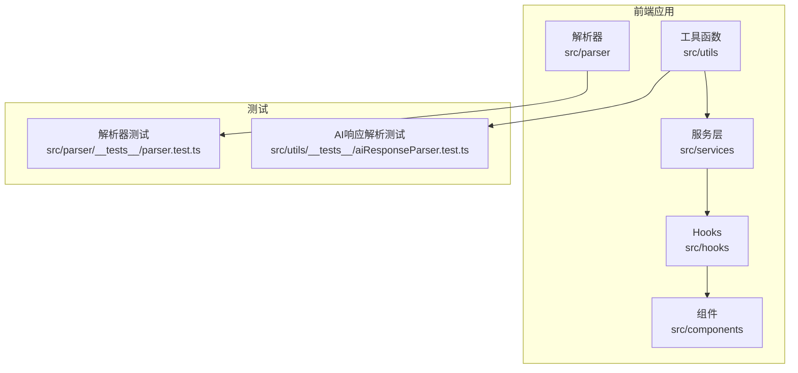
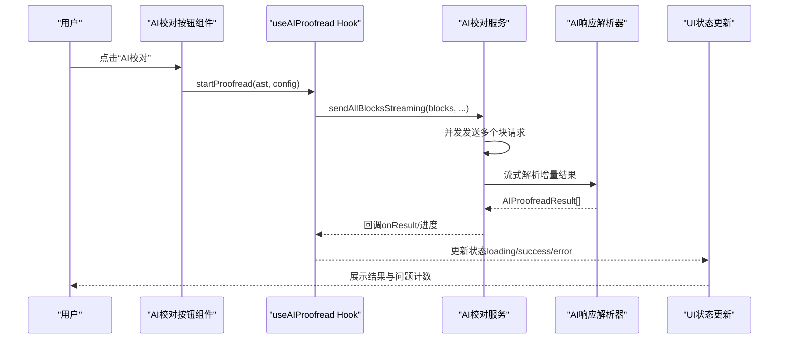
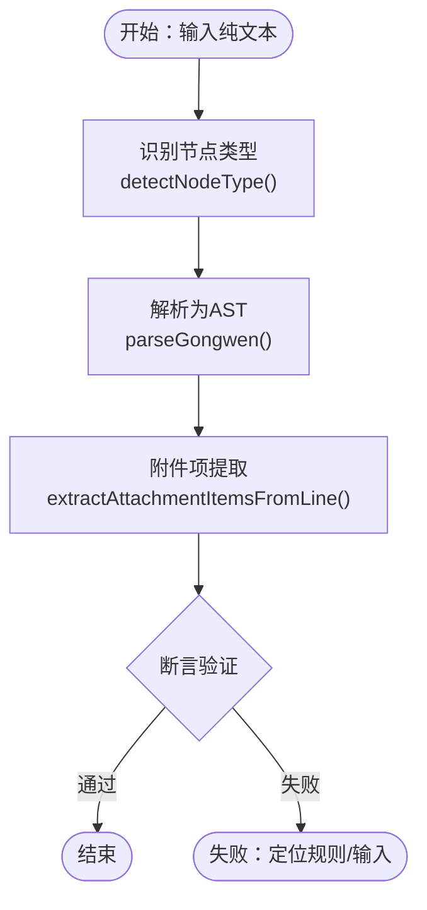
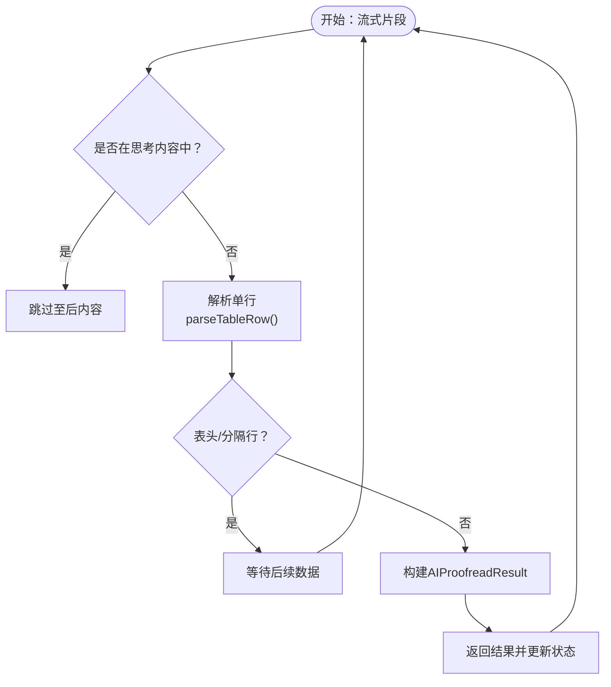
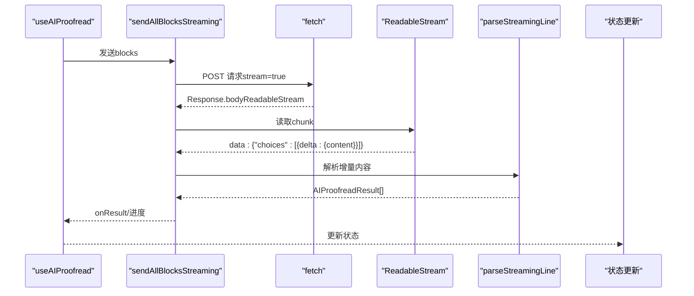
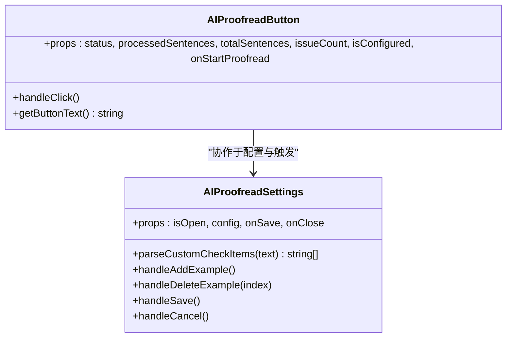
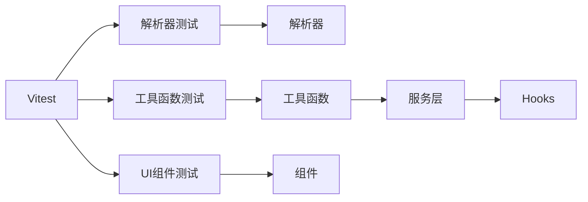

# 测试文档

<cite>
**本文引用的文件**
- [package.json](file://package.json)
- [vite.config.ts](file://vite.config.ts)
- [parser.test.ts](file://src/parser/__tests__/parser.test.ts)
- [aiResponseParser.test.ts](file://src/utils/__tests__/aiResponseParser.test.ts)
- [aiProofreadService.ts](file://src/services/aiProofreadService.ts)
- [useAIProofread.ts](file://src/hooks/useAIProofread.ts)
- [AIProofreadButton.tsx](file://src/components/AIProofreadButton/AIProofreadButton.tsx)
- [AIProofreadSettings.tsx](file://src/components/AIProofreadSettings/AIProofreadSettings.tsx)
- [aiResponseParser.ts](file://src/utils/aiResponseParser.ts)
- [sentenceSplitter.ts](file://src/utils/sentenceSplitter.ts)
- [textBlockSplitter.ts](file://src/utils/textBlockSplitter.ts)
</cite>

## 目录
1. [简介](#简介)
2. [项目结构](#项目结构)
3. [核心组件](#核心组件)
4. [架构总览](#架构总览)
5. [详细组件分析](#详细组件分析)
6. [依赖关系分析](#依赖关系分析)
7. [性能考虑](#性能考虑)
8. [故障排查指南](#故障排查指南)
9. [结论](#结论)
10. [附录](#附录)

## 简介
本测试文档面向“公文排版工具”项目，系统化阐述单元测试、集成测试与端到端测试的策略与实施方法。重点覆盖以下方面：
- 测试框架选择与配置：Vitest、React Testing Library（通过Vitest DOM环境间接使用）、ESLint、TypeScript 类型检查
- 测试用例编写指南：覆盖率要求、Mock策略、断言方法
- 特殊功能测试：AI服务测试（提示词构建、流式响应解析、并发与重试）、文件导入导出测试、性能测试
- 测试数据准备与管理：测试夹具、模拟数据、边界条件
- 测试环境搭建与持续集成：本地与CI配置要点
- 调试技巧与常见问题：错误定位、日志与可视化调试

## 项目结构
项目采用前端单页应用架构，核心逻辑集中在 src 目录，测试集中在各模块的 __tests__ 子目录中。关键测试文件分布如下：
- 解析器：src/parser/__tests__/parser.test.ts
- AI响应解析：src/utils/__tests__/aiResponseParser.test.ts
- AI服务与Hook：src/services/aiProofreadService.ts、src/hooks/useAIProofread.ts
- UI组件：src/components/AIProofreadButton/AIProofreadButton.tsx、src/components/AIProofreadSettings/AIProofreadSettings.tsx
- 工具函数：src/utils/aiResponseParser.ts、src/utils/sentenceSplitter.ts、src/utils/textBlockSplitter.ts

**图表来源**
- [parser.test.ts:1-500](file://src/parser/__tests__/parser.test.ts#L1-L500)
- [aiResponseParser.test.ts:1-319](file://src/utils/__tests__/aiResponseParser.test.ts#L1-L319)

**章节来源**
- [package.json:1-39](file://package.json#L1-L39)
- [vite.config.ts:73-77](file://vite.config.ts#L73-L77)

## 核心组件
- 解析器：将纯文本解析为公文抽象语法树（AST），覆盖标题、主送机关、附件、日期、签名、备注等节点类型识别与行号记录。
- AI响应解析：解析AI流式返回的Markdown表格，兼容思考标签（<think>...</think>）过滤与跨chunk处理。
- AI服务：构建提示词、发送流式请求、并发控制与重试、进度回调。
- Hooks：封装AI校对状态机与流程编排。
- UI组件：AI校对按钮与设置弹窗，驱动AI服务与展示结果。

**章节来源**
- [parser.test.ts:1-500](file://src/parser/__tests__/parser.test.ts#L1-L500)
- [aiResponseParser.test.ts:1-319](file://src/utils/__tests__/aiResponseParser.test.ts#L1-L319)
- [aiProofreadService.ts:1-516](file://src/services/aiProofreadService.ts#L1-L516)
- [useAIProofread.ts:1-221](file://src/hooks/useAIProofread.ts#L1-L221)
- [AIProofreadButton.tsx:1-81](file://src/components/AIProofreadButton/AIProofreadButton.tsx#L1-L81)
- [AIProofreadSettings.tsx:1-275](file://src/components/AIProofreadSettings/AIProofreadSettings.tsx#L1-L275)

## 架构总览
下图展示了从用户触发到AI响应解析与结果呈现的整体流程。

**图表来源**
- [useAIProofread.ts:67-205](file://src/hooks/useAIProofread.ts#L67-L205)
- [aiProofreadService.ts:147-319](file://src/services/aiProofreadService.ts#L147-L319)
- [aiResponseParser.ts:127-294](file://src/utils/aiResponseParser.ts#L127-L294)
- [AIProofreadButton.tsx:21-51](file://src/components/AIProofreadButton/AIProofreadButton.tsx#L21-L51)

## 详细组件分析

### 解析器单元测试策略
- 目标：验证 detectNodeType、parseGongwen、extractAttachmentItemsFromLine 的正确性与鲁棒性。
- 断言方法：expect 断言节点类型、内容、行号、附件项提取、多附件模式与异常回退。
- 覆盖场景：标题识别、主送机关、附件说明（单/多）、日期、签名、备注、异常行处理、不同标点格式。

**图表来源**
- [parser.test.ts:8-56](file://src/parser/__tests__/parser.test.ts#L8-L56)
- [parser.test.ts:59-180](file://src/parser/__tests__/parser.test.ts#L59-L180)
- [parser.test.ts:183-212](file://src/parser/__tests__/parser.test.ts#L183-L212)

**章节来源**
- [parser.test.ts:1-500](file://src/parser/__tests__/parser.test.ts#L1-L500)

### AI响应解析单元测试策略
- 目标：验证 parseTableRow、parseStreamingLine、flushParser 对表格行解析、思考标签过滤、跨chunk处理的正确性。
- 断言方法：expect 断言解析结果数组长度、字段值、hasIssue 判定。
- 覆盖场景：无思考标签、完整思考标签、仅有结束标签、思考内容包含表格格式、结束标签跨chunk、flush缓冲区处理、边界情况（空输入、大小写敏感）。

**图表来源**
- [aiResponseParser.test.ts:22-45](file://src/utils/__tests__/aiResponseParser.test.ts#L22-L45)
- [aiResponseParser.test.ts:49-246](file://src/utils/__tests__/aiResponseParser.test.ts#L49-L246)
- [aiResponseParser.test.ts:249-318](file://src/utils/__tests__/aiResponseParser.test.ts#L249-L318)

**章节来源**
- [aiResponseParser.test.ts:1-319](file://src/utils/__tests__/aiResponseParser.test.ts#L1-L319)
- [aiResponseParser.ts:1-378](file://src/utils/aiResponseParser.ts#L1-L378)

### AI服务与并发控制测试策略
- 目标：验证提示词构建、流式请求发送、并发控制与重试机制、进度回调、错误处理。
- 断言方法：expect 断言状态变化、错误消息、结果数量一致性、缺失序号追踪。
- Mock策略：使用 fetch 与 TextDecoder 的行为模拟，结合 createInitialParserState 与 sentenceMap 构造测试数据。
- 覆盖场景：AI服务未配置、请求失败（401/429/500）、响应体为空、流结束标记、JSON解析异常、重试与进度回调。

**图表来源**
- [useAIProofread.ts:67-205](file://src/hooks/useAIProofread.ts#L67-L205)
- [aiProofreadService.ts:147-319](file://src/services/aiProofreadService.ts#L147-L319)
- [aiResponseParser.ts:127-294](file://src/utils/aiResponseParser.ts#L127-L294)

**章节来源**
- [aiProofreadService.ts:1-516](file://src/services/aiProofreadService.ts#L1-L516)
- [useAIProofread.ts:1-221](file://src/hooks/useAIProofread.ts#L1-L221)

### UI组件测试策略
- 目标：验证按钮状态（禁用/加载/成功/失败）、文案与徽章、点击行为与配置检查。
- 断言方法：通过DOM查询与事件触发，断言className、文本内容、disabled属性。
- 覆盖场景：未配置、加载中、成功且有/无问题、错误状态、进度文案。

**图表来源**
- [AIProofreadButton.tsx:1-81](file://src/components/AIProofreadButton/AIProofreadButton.tsx#L1-L81)
- [AIProofreadSettings.tsx:1-275](file://src/components/AIProofreadSettings/AIProofreadSettings.tsx#L1-L275)

**章节来源**
- [AIProofreadButton.tsx:1-81](file://src/components/AIProofreadButton/AIProofreadButton.tsx#L1-L81)
- [AIProofreadSettings.tsx:1-275](file://src/components/AIProofreadSettings/AIProofreadSettings.tsx#L1-L275)

### 工具函数测试策略
- 句子切分：验证分隔符识别、引号/括号内不切分、标题整体处理、节点类型判定。
- 文本分块：验证均衡分块算法、句子不切割、统计信息计算。

**章节来源**
- [sentenceSplitter.ts:1-324](file://src/utils/sentenceSplitter.ts#L1-L324)
- [textBlockSplitter.ts:1-227](file://src/utils/textBlockSplitter.ts#L1-L227)

## 依赖关系分析
- 测试框架：Vitest 提供测试运行与断言能力，DOM环境用于组件测试。
- 类型系统：TypeScript 类型约束确保服务与工具函数的输入输出安全。
- 工具链：ESLint 与 TypeScript ESLint 规范代码风格与类型安全。

**图表来源**
- [package.json:36-36](file://package.json#L36-L36)
- [vite.config.ts:73-77](file://vite.config.ts#L73-L77)

**章节来源**
- [package.json:1-39](file://package.json#L1-L39)
- [vite.config.ts:1-78](file://vite.config.ts#L1-L78)

## 性能考虑
- 流式解析：通过增量解析减少内存占用，避免一次性解析大块文本。
- 并发控制：合理设置最大并发数，避免AI服务限流与网络拥塞。
- 分块策略：基于字符数的目标值动态调整分割点，平衡各块负载。
- 日志与调试：在开发阶段输出调试信息，便于定位缺失序号与响应长度。

**章节来源**
- [aiProofreadService.ts:332-515](file://src/services/aiProofreadService.ts#L332-L515)
- [textBlockSplitter.ts:107-152](file://src/utils/textBlockSplitter.ts#L107-L152)

## 故障排查指南
- AI服务未配置：检查环境变量与配置读取逻辑，确保 isAIServiceConfigured 返回true。
- 请求失败：根据HTTP状态码抛出明确错误（401/429/500），检查API密钥与配额。
- 响应体为空：确认后端返回了ReadableStream，避免空响应导致解析异常。
- JSON解析异常：流式数据可能不完整，捕获异常并继续读取，必要时在flush阶段处理缓冲区。
- 缺失序号：利用调试信息对比发送与解析序号，定位解析器或映射问题。
- UI状态异常：检查按钮禁用逻辑与状态切换，确保在loading期间阻止重复触发。

**章节来源**
- [useAIProofread.ts:72-114](file://src/hooks/useAIProofread.ts#L72-L114)
- [aiProofreadService.ts:195-318](file://src/services/aiProofreadService.ts#L195-L318)
- [AIProofreadButton.tsx:21-51](file://src/components/AIProofreadButton/AIProofreadButton.tsx#L21-L51)

## 结论
本测试文档提供了从单元测试到集成测试与端到端测试的完整策略，结合Vitest与TypeScript类型系统，覆盖解析器、AI服务、工具函数与UI组件的关键路径。通过Mock与断言策略、边界条件与性能考量，能够有效提升系统的稳定性与可维护性。

## 附录

### 测试框架与配置
- 测试运行器：Vitest（全局启用、Node环境）
- 类型检查：TypeScript 与 TypeScript ESLint
- 代码规范：ESLint 与 globals

**章节来源**
- [vite.config.ts:73-77](file://vite.config.ts#L73-L77)
- [package.json:20-36](file://package.json#L20-L36)

### 测试覆盖率与断言方法
- 覆盖率要求：建议关键模块（解析器、AI响应解析、服务层）达到高覆盖率，UI组件至少覆盖交互路径。
- 断言方法：使用 expect 进行节点类型、内容、行号、结果数量、hasIssue 等断言。
- Mock策略：对 fetch、TextDecoder、解析器状态进行可控模拟，隔离外部依赖。

**章节来源**
- [parser.test.ts:1-500](file://src/parser/__tests__/parser.test.ts#L1-L500)
- [aiResponseParser.test.ts:1-319](file://src/utils/__tests__/aiResponseParser.test.ts#L1-L319)

### 特殊功能测试方法
- AI服务测试：构造提示词模板与示例，模拟流式响应，验证解析器对思考标签的处理与跨chunk兼容性。
- 文件导入导出测试：准备典型公文文本与DOCX样例，断言导出内容与样式一致性。
- 性能测试：测量分块算法与并发控制下的响应时间与内存占用，优化阈值与并发参数。

**章节来源**
- [aiProofreadService.ts:46-135](file://src/services/aiProofreadService.ts#L46-L135)
- [aiResponseParser.ts:127-294](file://src/utils/aiResponseParser.ts#L127-L294)
- [textBlockSplitter.ts:17-96](file://src/utils/textBlockSplitter.ts#L17-L96)

### 测试数据准备与管理
- 测试夹具：为解析器与AI解析器准备多种输入样例（标题、附件、日期、备注、异常行）。
- 模拟数据：使用 sentenceMap 构造序号到ID映射，验证结果一致性。
- 边界条件：空文本、仅空行、不同标点格式、序号不连续、思考标签大小写等。

**章节来源**
- [parser.test.ts:116-180](file://src/parser/__tests__/parser.test.ts#L116-L180)
- [aiResponseParser.test.ts:13-19](file://src/utils/__tests__/aiResponseParser.test.ts#L13-L19)

### 测试环境搭建与持续集成
- 本地开发：安装依赖后使用 npm 脚本启动开发服务器与测试。
- CI配置：在CI中执行测试脚本，收集覆盖率报告，确保关键分支通过。

**章节来源**
- [package.json:6-12](file://package.json#L6-L12)