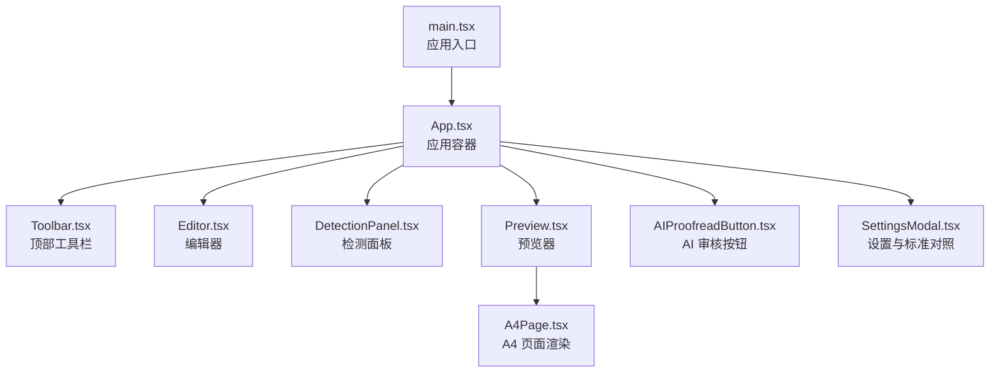
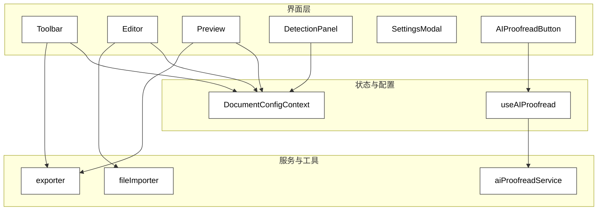
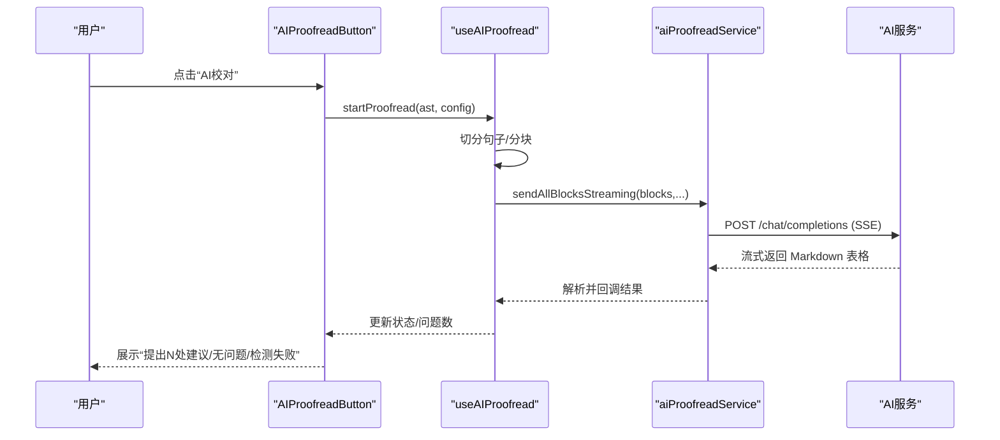

# 用户指南

<cite>
**本文引用的文件**
- [src/App.tsx](file://src/App.tsx)
- [src/main.tsx](file://src/main.tsx)
- [src/components/Editor/Editor.tsx](file://src/components/Editor/Editor.tsx)
- [src/components/Preview/Preview.tsx](file://src/components/Preview/Preview.tsx)
- [src/components/Toolbar/Toolbar.tsx](file://src/components/Toolbar/Toolbar.tsx)
- [src/components/DetectionPanel/DetectionPanel.tsx](file://src/components/DetectionPanel/DetectionPanel.tsx)
- [src/components/AIProofreadButton/AIProofreadButton.tsx](file://src/components/AIProofreadButton/AIProofreadButton.tsx)
- [src/components/SettingsModal/SettingsModal.tsx](file://src/components/SettingsModal/SettingsModal.tsx)
- [src/constants/gongwen.ts](file://src/constants/gongwen.ts)
- [src/types/detection.ts](file://src/types/detection.ts)
- [src/exporter/index.ts](file://src/exporter/index.ts)
- [src/utils/fileImporter.ts](file://src/utils/fileImporter.ts)
- [src/hooks/useAIProofread.ts](file://src/hooks/useAIProofread.ts)
- [src/services/aiProofreadService.ts](file://src/services/aiProofreadService.ts)
- [package.json](file://package.json)
</cite>

## 目录
1. [简介](#简介)
2. [项目结构](#项目结构)
3. [核心组件](#核心组件)
4. [架构总览](#架构总览)
5. [详细组件分析](#详细组件分析)
6. [依赖关系分析](#依赖关系分析)
7. [性能与可用性建议](#性能与可用性建议)
8. [故障排查指南](#故障排查指南)
9. [结论](#结论)
10. [附录：工作流程与操作示例](#附录工作流程与操作示例)

## 简介
本指南面向首次使用“公文排版工具”的用户，帮助您快速掌握界面布局、功能使用与工作流程。工具基于 GB/T 9704 与 GB/T 33476.2 标准，提供从新建/导入公文、实时预览、格式检测、AI辅助审核到导出 Word 的完整能力。同时涵盖文件导入导出格式、AI 审核配置与最佳实践、常见使用场景（如批量处理、模板使用）以及界面操作要点。

## 项目结构
应用采用前端单页应用架构，核心入口在根组件中组合编辑器、预览器、工具栏与检测面板，并通过上下文与钩子管理文档配置与 AI 审核状态。

图表来源
- [src/main.tsx:1-14](file://src/main.tsx#L1-L14)
- [src/App.tsx:232-305](file://src/App.tsx#L232-L305)
- [src/components/Toolbar/Toolbar.tsx:12-63](file://src/components/Toolbar/Toolbar.tsx#L12-L63)
- [src/components/Editor/Editor.tsx:33-252](file://src/components/Editor/Editor.tsx#L33-L252)
- [src/components/DetectionPanel/DetectionPanel.tsx:434-463](file://src/components/DetectionPanel/DetectionPanel.tsx#L434-L463)
- [src/components/Preview/Preview.tsx:43-202](file://src/components/Preview/Preview.tsx#L43-L202)

章节来源
- [src/main.tsx:1-14](file://src/main.tsx#L1-L14)
- [src/App.tsx:54-305](file://src/App.tsx#L54-L305)

## 核心组件
- 工具栏（Toolbar）：提供“设置”“导出 Word”“查看标准”等入口，展示内容统计。
- 编辑器（Editor）：支持拖拽/点击导入 .docx/.txt/.doc/.wps；提供清空、保存、历史记录等操作。
- 预览器（Preview）：根据文档配置与 AST 渲染 A4 页面，支持分页与 AI 审核结果高亮。
- 检测面板（DetectionPanel）：展示标题层级/序号、正文统计、日期异常等检测结果，集成 AI 审核板块。
- AI 审核（AIProofreadButton + useAIProofread + aiProofreadService）：将公文切分为句子与块，流式请求 AI 并解析结果。
- 设置（SettingsModal）：配置页面边距、标题/正文/各级标题字体字号行距、首行缩进、表格格式、特殊选项（页码、印章）等，并支持保存自定义配置。

章节来源
- [src/components/Toolbar/Toolbar.tsx:12-63](file://src/components/Toolbar/Toolbar.tsx#L12-L63)
- [src/components/Editor/Editor.tsx:33-252](file://src/components/Editor/Editor.tsx#L33-L252)
- [src/components/Preview/Preview.tsx:43-202](file://src/components/Preview/Preview.tsx#L43-L202)
- [src/components/DetectionPanel/DetectionPanel.tsx:434-463](file://src/components/DetectionPanel/DetectionPanel.tsx#L434-L463)
- [src/components/AIProofreadButton/AIProofreadButton.tsx:13-81](file://src/components/AIProofreadButton/AIProofreadButton.tsx#L13-L81)
- [src/components/SettingsModal/SettingsModal.tsx:190-662](file://src/components/SettingsModal/SettingsModal.tsx#L190-L662)

## 架构总览
应用采用“组件-上下文-钩子-服务-工具”的分层设计：
- 组件负责 UI 与交互；
- 上下文提供文档配置；
- 钩子封装业务逻辑（如 AI 审核状态管理）；
- 服务负责与外部接口通信（AI 审核服务）；
- 工具负责解析、拆分、导出等通用能力。

图表来源
- [src/App.tsx:54-305](file://src/App.tsx#L54-L305)
- [src/hooks/useAIProofread.ts:56-221](file://src/hooks/useAIProofread.ts#L56-L221)
- [src/services/aiProofreadService.ts:147-516](file://src/services/aiProofreadService.ts#L147-L516)
- [src/utils/fileImporter.ts:23-70](file://src/utils/fileImporter.ts#L23-L70)
- [src/exporter/index.ts:1-4](file://src/exporter/index.ts#L1-L4)

## 详细组件分析

### 工具栏（Toolbar）
- 功能：打开“设置”“查看标准”对话框；导出 Word；显示内容统计。
- 与导出：调用 App 层导出流程，触发下载。

章节来源
- [src/components/Toolbar/Toolbar.tsx:12-63](file://src/components/Toolbar/Toolbar.tsx#L12-L63)
- [src/App.tsx:120-131](file://src/App.tsx#L120-L131)

### 编辑器（Editor）
- 功能：文本输入、拖拽/点击导入、清空、保存到历史、查看历史。
- 支持格式：.docx、.txt；.doc/.wps 提示转换为 .docx。
- 快捷键：Ctrl+S 保存（去重与内容校验）。

章节来源
- [src/components/Editor/Editor.tsx:33-252](file://src/components/Editor/Editor.tsx#L33-L252)
- [src/utils/fileImporter.ts:23-70](file://src/utils/fileImporter.ts#L23-L70)

### 预览器（Preview）
- 功能：根据 AST 与配置渲染 A4 页面，支持分页、版记、页码、印章等。
- 渲染策略：通过 CSS 变量与度量容器计算字符间距与首行缩进，保证与标准一致。

章节来源
- [src/components/Preview/Preview.tsx:43-202](file://src/components/Preview/Preview.tsx#L43-L202)
- [src/constants/gongwen.ts:7-33](file://src/constants/gongwen.ts#L7-L33)

### 检测面板（DetectionPanel）
- 功能：展示标题层级/序号问题、正文统计、日期异常等；集成 AI 审核结果列表。
- 交互：点击 AI 问题项可定位到对应句子（通过回调实现）。

章节来源
- [src/components/DetectionPanel/DetectionPanel.tsx:434-463](file://src/components/DetectionPanel/DetectionPanel.tsx#L434-L463)
- [src/types/detection.ts:14-151](file://src/types/detection.ts#L14-L151)

### AI 审核（AIProofreadButton + useAIProofread + aiProofreadService）
- 流程：切分句子→分块→并发流式请求→解析结果→更新状态。
- 配置：支持自定义检查项与示例，内部限制并发与每块最大字符数。
- 结果：按序号排序的问题列表，支持定位到原文句。

图表来源
- [src/components/AIProofreadButton/AIProofreadButton.tsx:13-81](file://src/components/AIProofreadButton/AIProofreadButton.tsx#L13-L81)
- [src/hooks/useAIProofread.ts:67-205](file://src/hooks/useAIProofread.ts#L67-L205)
- [src/services/aiProofreadService.ts:332-516](file://src/services/aiProofreadService.ts#L332-L516)

章节来源
- [src/components/AIProofreadButton/AIProofreadButton.tsx:13-81](file://src/components/AIProofreadButton/AIProofreadButton.tsx#L13-L81)
- [src/hooks/useAIProofread.ts:56-221](file://src/hooks/useAIProofread.ts#L56-L221)
- [src/services/aiProofreadService.ts:147-516](file://src/services/aiProofreadService.ts#L147-L516)

### 设置（SettingsModal）
- 功能：配置版头/版记、页面边距、标题/正文/各级标题字体字号行距、首行缩进、表格格式、特殊选项（页码、印章）。
- 规范提示：针对 GB/T 33476.2 的边距设置说明与依据。
- 配置管理：支持另存为自定义配置、保存当前修改、切换与删除配置。

章节来源
- [src/components/SettingsModal/SettingsModal.tsx:190-662](file://src/components/SettingsModal/SettingsModal.tsx#L190-L662)

## 依赖关系分析
- 运行时依赖：React、React DOM、docx、file-saver、mammoth。
- 构建与开发：Vite、TypeScript、ESLint、React Hooks/Refresh 插件等。

章节来源
- [package.json:13-38](file://package.json#L13-L38)

## 性能与可用性建议
- 导入大文档时建议先清理无关空白，减少解析与渲染压力。
- AI 审核建议分段处理，避免单次请求过大；可结合“另存为自定义配置”保存常用设置。
- 预览渲染依赖分页计算，长文档滚动时可适当降低复杂表格与版记内容以提升流畅度。
- 使用 Ctrl+S 快速保存当前内容到历史记录，便于回溯。

[本节为通用建议，不直接分析具体文件]

## 故障排查指南
- AI 服务未配置
  - 现象：AI 按钮显示“未配置”，点击无响应。
  - 排查：确认环境变量与服务配置是否正确；查看控制台日志。
  - 参考：[src/App.tsx:69-92](file://src/App.tsx#L69-L92)、[src/hooks/useAIProofread.ts:72-83](file://src/hooks/useAIProofread.ts#L72-L83)
- 导出失败
  - 现象：导出报错或弹出提示。
  - 排查：检查控制台错误信息；确认内容非空且 AST 有效。
  - 参考：[src/App.tsx:120-131](file://src/App.tsx#L120-L131)、[src/exporter/index.ts:1-4](file://src/exporter/index.ts#L1-L4)
- 导入格式不支持
  - 现象：.doc/.wps 导入时报错。
  - 处理：先用 WPS/Word 另存为 .docx 后再导入。
  - 参考：[src/utils/fileImporter.ts:42-47](file://src/utils/fileImporter.ts#L42-L47)
- 预览与 Word 差异
  - 说明：浏览器预览为样式参考，最终以导出 Word 为准。
  - 参考：[src/components/Preview/Preview.tsx:264-266](file://src/components/Preview/Preview.tsx#L264-L266)

章节来源
- [src/App.tsx:69-92](file://src/App.tsx#L69-L92)
- [src/hooks/useAIProofread.ts:72-83](file://src/hooks/useAIProofread.ts#L72-L83)
- [src/App.tsx:120-131](file://src/App.tsx#L120-L131)
- [src/exporter/index.ts:1-4](file://src/exporter/index.ts#L1-L4)
- [src/utils/fileImporter.ts:42-47](file://src/utils/fileImporter.ts#L42-L47)
- [src/components/Preview/Preview.tsx:264-266](file://src/components/Preview/Preview.tsx#L264-L266)

## 结论
本工具围绕 GB/T 9704 与 GB/T 33476.2 标准，提供从“导入/编辑—预览—检测—AI 审核—导出”的闭环体验。通过设置面板可灵活适配不同单位与机构规范；AI 审核支持自定义检查项与示例，满足多样化审校需求。建议结合“另存为自定义配置”形成团队模板，提升批量处理效率。

[本节为总结，不直接分析具体文件]

## 附录：工作流程与操作示例

### 从新建到导出的完整工作流程
- 新建/导入
  - 在编辑器中直接输入或拖拽/点击导入 .docx/.txt 文件。
  - 参考：[src/components/Editor/Editor.tsx:54-91](file://src/components/Editor/Editor.tsx#L54-L91)、[src/utils/fileImporter.ts:23-70](file://src/utils/fileImporter.ts#L23-L70)
- 实时预览与检测
  - 预览器根据 AST 与配置渲染 A4 页面；检测面板显示标题层级/序号、正文统计、日期异常等。
  - 参考：[src/components/Preview/Preview.tsx:43-202](file://src/components/Preview/Preview.tsx#L43-L202)、[src/components/DetectionPanel/DetectionPanel.tsx:434-463](file://src/components/DetectionPanel/DetectionPanel.tsx#L434-L463)
- AI 辅助审核
  - 点击“AI校对”按钮启动审核；根据提示配置检查项与示例；查看问题列表并定位到原文句。
  - 参考：[src/components/AIProofreadButton/AIProofreadButton.tsx:13-81](file://src/components/AIProofreadButton/AIProofreadButton.tsx#L13-L81)、[src/hooks/useAIProofread.ts:67-205](file://src/hooks/useAIProofread.ts#L67-L205)、[src/services/aiProofreadService.ts:332-516](file://src/services/aiProofreadService.ts#L332-L516)
- 导出 Word
  - 点击工具栏“导出 Word”，完成后在下载目录查看文件。
  - 参考：[src/components/Toolbar/Toolbar.tsx:52-57](file://src/components/Toolbar/Toolbar.tsx#L52-L57)、[src/App.tsx:120-131](file://src/App.tsx#L120-L131)、[src/exporter/index.ts:1-4](file://src/exporter/index.ts#L1-L4)

### 文件导入导出与格式说明
- 支持格式
  - 导入：.docx、.txt；.doc/.wps 需先转换为 .docx。
  - 导出：Word（.docx）。
- 注意事项
  - .doc/.wps 不支持直接导入，请先转换。
  - 导入会覆盖当前内容，导入前可确认。
  - 预览为样式参考，最终以导出 Word 为准。
- 参考
  - [src/utils/fileImporter.ts:23-70](file://src/utils/fileImporter.ts#L23-L70)
  - [src/components/Editor/Editor.tsx:186-200](file://src/components/Editor/Editor.tsx#L186-L200)
  - [src/components/Preview/Preview.tsx:264-266](file://src/components/Preview/Preview.tsx#L264-L266)

### 常见使用场景与最佳实践
- 批量处理
  - 使用“另存为自定义配置”保存常用版面与格式；对多份公文统一套用模板。
  - 参考：[src/components/SettingsModal/SettingsModal.tsx:226-244](file://src/components/SettingsModal/SettingsModal.tsx#L226-L244)
- 模板使用
  - 在“设置”中配置版头/版记、边距、标题/正文格式；启用页码与印章选项。
  - 参考：[src/components/SettingsModal/SettingsModal.tsx:287-561](file://src/components/SettingsModal/SettingsModal.tsx#L287-L561)
- AI 审核最佳实践
  - 在“AI校对设置”中添加针对性检查项与示例，提升命中率。
  - 控制并发与每块大小，避免超时或限流。
  - 参考：[src/services/aiProofreadService.ts:332-516](file://src/services/aiProofreadService.ts#L332-L516)

### 公文格式规范与标准对照
- 工具依据
  - 《党政机关公文格式》（GB/T 9704-2012）
  - 《党政机关电子公文格式规范 第2部分：显现》（GB/T 33476.2-2016）
- 设置中的规范提示
  - 页面边距设置依据 GB/T 33476.2；印章与成文日期空格规则自动适配。
- 参考
  - [src/components/Toolbar/Toolbar.tsx:27-32](file://src/components/Toolbar/Toolbar.tsx#L27-L32)
  - [src/components/SettingsModal/SettingsModal.tsx:394-404](file://src/components/SettingsModal/SettingsModal.tsx#L394-L404)
  - [src/components/SettingsModal/SettingsModal.tsx:547-560](file://src/components/SettingsModal/SettingsModal.tsx#L547-L560)