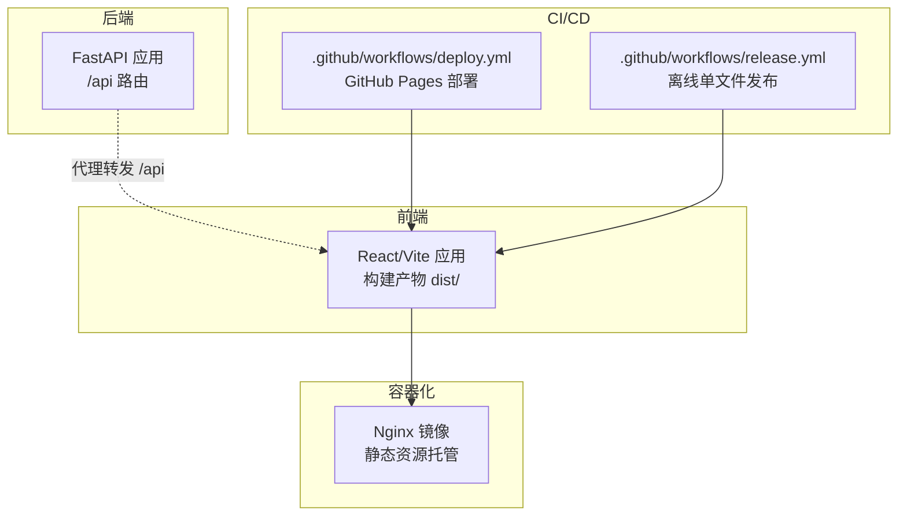
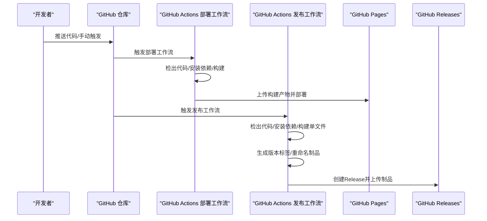
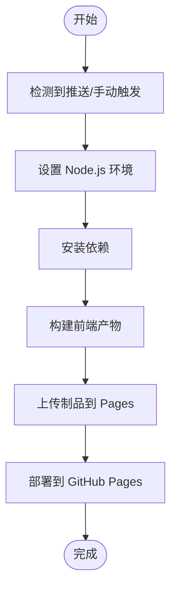
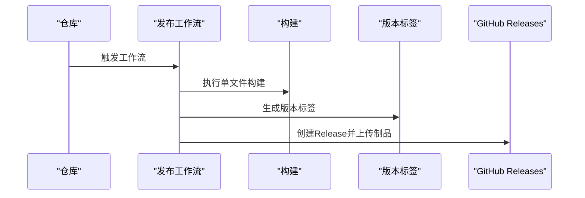
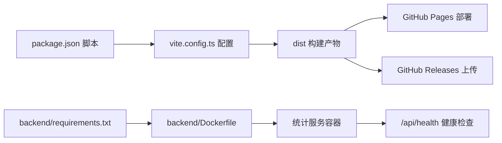

# CI/CD流水线配置

<cite>
**本文档引用的文件**
- [.github/workflows/deploy.yml](file://.github/workflows/deploy.yml)
- [.github/workflows/release.yml](file://.github/workflows/release.yml)
- [package.json](file://package.json)
- [vite.config.ts](file://vite.config.ts)
- [eslint.config.js](file://eslint.config.js)
- [backend/main.py](file://backend/main.py)
- [backend/Dockerfile](file://backend/Dockerfile)
- [backend/requirements.txt](file://backend/requirements.txt)
- [gongwen-docker/Dockerfile](file://gongwen-docker/Dockerfile)
- [gongwen-docker/docker-compose-dev.yml](file://gongwen-docker/docker-compose-dev.yml)
- [gongwen-docker/docker-compose-prod.yml](file://gongwen-docker/docker-compose-prod.yml)
- [backend/config.py](file://backend/config.py)
- [src/utils/statsReporter.ts](file://src/utils/statsReporter.ts)
- [src/parser/__tests__/parser.test.ts](file://src/parser/__tests__/parser.test.ts)
- [src/utils/__tests__/aiResponseParser.test.ts](file://src/utils/__tests__/aiResponseParser.test.ts)
- [.gitignore](file://.gitignore)
</cite>

## 目录
1. [简介](#简介)
2. [项目结构](#项目结构)
3. [核心组件](#核心组件)
4. [架构总览](#架构总览)
5. [详细组件分析](#详细组件分析)
6. [依赖关系分析](#依赖关系分析)
7. [性能考虑](#性能考虑)
8. [故障排查指南](#故障排查指南)
9. [结论](#结论)
10. [附录](#附录)

## 简介
本指南面向“公文排版工具”项目的CI/CD流水线配置，系统讲解基于GitHub Actions的工作流设计与实施要点，覆盖自动构建、测试、打包、发布与部署的完整流程。文档同时提供多环境部署策略、版本管理与标签规范、制品上传、代码质量与安全扫描、性能测试、回滚与蓝绿部署建议，以及监控、通知与故障处理的最佳实践。

## 项目结构
该项目采用前后端分离架构：前端为React/Vite应用，后端为Python/FastAPI服务，配合Nginx容器化部署。CI/CD流水线通过GitHub Actions实现，分别负责静态站点部署与离线单文件HTML发布。

图表来源
- [.github/workflows/deploy.yml:1-41](file://.github/workflows/deploy.yml#L1-L41)
- [.github/workflows/release.yml:1-48](file://.github/workflows/release.yml#L1-L48)
- [vite.config.ts:1-78](file://vite.config.ts#L1-L78)
- [backend/main.py:1-38](file://backend/main.py#L1-L38)
- [gongwen-docker/Dockerfile:1-19](file://gongwen-docker/Dockerfile#L1-L19)

章节来源
- [.github/workflows/deploy.yml:1-41](file://.github/workflows/deploy.yml#L1-L41)
- [.github/workflows/release.yml:1-48](file://.github/workflows/release.yml#L1-L48)
- [vite.config.ts:1-78](file://vite.config.ts#L1-L78)
- [backend/main.py:1-38](file://backend/main.py#L1-L38)
- [gongwen-docker/Dockerfile:1-19](file://gongwen-docker/Dockerfile#L1-L19)

## 核心组件
- GitHub Pages部署工作流：在主分支推送或手动触发时，构建前端并上传至GitHub Pages。
- 离线单文件发布工作流：在主分支推送或手动触发时，构建单文件HTML并生成版本标签，创建GitHub Release并上传制品。
- 前端构建配置：Vite配置支持PWA与单文件模式，适配不同部署场景。
- 后端服务：FastAPI提供统计接口与健康检查，容器化部署。
- Docker编排：提供开发与生产环境的Compose配置，统一健康检查与端口映射。

章节来源
- [.github/workflows/deploy.yml:1-41](file://.github/workflows/deploy.yml#L1-L41)
- [.github/workflows/release.yml:1-48](file://.github/workflows/release.yml#L1-L48)
- [package.json:1-39](file://package.json#L1-L39)
- [vite.config.ts:1-78](file://vite.config.ts#L1-L78)
- [backend/main.py:1-38](file://backend/main.py#L1-L38)
- [gongwen-docker/docker-compose-dev.yml:1-44](file://gongwen-docker/docker-compose-dev.yml#L1-L44)
- [gongwen-docker/docker-compose-prod.yml:1-36](file://gongwen-docker/docker-compose-prod.yml#L1-L36)

## 架构总览
下图展示CI/CD流水线与部署架构的交互关系，包括触发条件、构建步骤、制品产出与部署目标。

图表来源
- [.github/workflows/deploy.yml:1-41](file://.github/workflows/deploy.yml#L1-L41)
- [.github/workflows/release.yml:1-48](file://.github/workflows/release.yml#L1-L48)

## 详细组件分析

### 部署工作流（GitHub Pages）
- 触发条件：主分支推送或手动触发；权限授予pages、id-token写入。
- 并发控制：使用页面组并发策略，避免冲突。
- 构建步骤：检出代码、设置Node.js、安装依赖、构建、上传制品。
- 部署步骤：依赖构建作业，使用GitHub Pages进行部署，输出访问URL。

图表来源
- [.github/workflows/deploy.yml:1-41](file://.github/workflows/deploy.yml#L1-L41)

章节来源
- [.github/workflows/deploy.yml:1-41](file://.github/workflows/deploy.yml#L1-L41)

### 发布工作流（离线单文件HTML）
- 触发条件：主分支推送或手动触发；需要写入权限。
- 构建步骤：检出代码、设置Node.js、安装依赖、构建单文件HTML。
- 版本管理：生成形如“年.月.日-短提交号”的标签与发布名称。
- 制品上传：重命名产物为固定文件名并上传至Release。

图表来源
- [.github/workflows/release.yml:1-48](file://.github/workflows/release.yml#L1-L48)

章节来源
- [.github/workflows/release.yml:1-48](file://.github/workflows/release.yml#L1-L48)

### 前端构建与基路径配置
- 单文件模式：通过环境变量启用单文件插件，强制相对路径以支持离线双击打开。
- PWA配置：在非单文件模式下启用PWA，定义manifest与workbox规则。
- 基础路径：根据运行环境动态设置base，确保Pages与本地开发路径一致。

章节来源
- [package.json:1-39](file://package.json#L1-L39)
- [vite.config.ts:1-78](file://vite.config.ts#L1-L78)

### 后端服务与容器化
- 应用入口：FastAPI应用，注册路由并提供健康检查端点。
- 容器镜像：基于Python Slim镜像，安装依赖后暴露8000端口。
- 配置常量：日志路径、防抖参数等通过环境变量与常量文件管理。

章节来源
- [backend/main.py:1-38](file://backend/main.py#L1-L38)
- [backend/Dockerfile:1-18](file://backend/Dockerfile#L1-L18)
- [backend/requirements.txt:1-3](file://backend/requirements.txt#L1-L3)
- [backend/config.py:1-16](file://backend/config.py#L1-L16)

### 容器编排（开发/生产）
- 开发环境：映射88端口，挂载Nginx配置，包含健康检查与数据卷。
- 生产环境：映射50088端口，挂载生产Nginx配置，健康检查与开发一致。
- 服务依赖：Web容器依赖统计服务容器，共享数据目录。

章节来源
- [gongwen-docker/docker-compose-dev.yml:1-44](file://gongwen-docker/docker-compose-dev.yml#L1-L44)
- [gongwen-docker/docker-compose-prod.yml:1-36](file://gongwen-docker/docker-compose-prod.yml#L1-L36)
- [gongwen-docker/Dockerfile:1-19](file://gongwen-docker/Dockerfile#L1-L19)

### 统计上报与健康检查
- 前端统计上报：通过fetch向后端统计接口上报动作，采用fire-and-forget模式。
- 后端健康检查：提供/health端点，供容器健康检查使用。

章节来源
- [src/utils/statsReporter.ts:1-29](file://src/utils/statsReporter.ts#L1-L29)
- [backend/main.py:34-38](file://backend/main.py#L34-L38)

## 依赖关系分析
- 工作流依赖：部署工作流依赖构建步骤；发布工作流依赖构建步骤并生成版本标签。
- 构建依赖：前端构建依赖Node.js与包管理器；后端容器依赖requirements.txt。
- 运行依赖：前端运行时依赖浏览器兼容性目标；后端运行时依赖Uvicorn。

图表来源
- [package.json:1-39](file://package.json#L1-L39)
- [vite.config.ts:1-78](file://vite.config.ts#L1-L78)
- [.github/workflows/deploy.yml:1-41](file://.github/workflows/deploy.yml#L1-L41)
- [.github/workflows/release.yml:1-48](file://.github/workflows/release.yml#L1-L48)
- [backend/requirements.txt:1-3](file://backend/requirements.txt#L1-L3)
- [backend/Dockerfile:1-18](file://backend/Dockerfile#L1-L18)
- [backend/main.py:34-38](file://backend/main.py#L34-L38)

章节来源
- [package.json:1-39](file://package.json#L1-L39)
- [vite.config.ts:1-78](file://vite.config.ts#L1-L78)
- [.github/workflows/deploy.yml:1-41](file://.github/workflows/deploy.yml#L1-L41)
- [.github/workflows/release.yml:1-48](file://.github/workflows/release.yml#L1-L48)
- [backend/requirements.txt:1-3](file://backend/requirements.txt#L1-L3)
- [backend/Dockerfile:1-18](file://backend/Dockerfile#L1-L18)
- [backend/main.py:34-38](file://backend/main.py#L34-L38)

## 性能考虑
- 构建优化：使用Node.js缓存与并行安装，减少重复下载依赖时间。
- 前端兼容：目标浏览器与CSS目标版本限制，确保兼容性与体积平衡。
- 容器层优化：后端镜像使用Slim基础镜像，减少体积；Nginx直接托管静态资源，降低后端压力。
- 健康检查：容器健康检查间隔与超时合理设置，避免频繁重启。

## 故障排查指南
- 构建失败
  - 检查Node.js版本与依赖安装是否成功。
  - 确认构建脚本与环境变量（如单文件模式）正确。
- 部署失败
  - 查看GitHub Pages部署日志与访问URL输出。
  - 确认制品路径与权限设置。
- 发布失败
  - 检查版本标签生成逻辑与Release权限。
  - 确认制品重命名与上传路径。
- 健康检查失败
  - 检查后端/容器健康检查端点与容器日志。
  - 核对Compose文件中的端口与健康检查配置。

章节来源
- [.github/workflows/deploy.yml:1-41](file://.github/workflows/deploy.yml#L1-L41)
- [.github/workflows/release.yml:1-48](file://.github/workflows/release.yml#L1-L48)
- [backend/main.py:34-38](file://backend/main.py#L34-L38)
- [gongwen-docker/docker-compose-dev.yml:1-44](file://gongwen-docker/docker-compose-dev.yml#L1-L44)
- [gongwen-docker/docker-compose-prod.yml:1-36](file://gongwen-docker/docker-compose-prod.yml#L1-L36)

## 结论
本指南提供了“公文排版工具”项目在GitHub Actions上的完整CI/CD配置思路：以工作流为中心，结合前端构建、后端容器化与容器编排，形成可复用的自动化流水线。通过版本标签与Release机制实现可控发布，结合健康检查与多环境配置确保稳定性。建议在此基础上扩展代码质量检查、安全扫描与性能测试，完善监控与告警体系，逐步引入蓝绿/金丝雀发布策略以提升交付可靠性。

## 附录

### 多环境部署策略
- 开发环境
  - 使用开发Compose文件，映射低端口便于本地联调。
  - Nginx配置指向开发站点，便于快速验证。
- 测试环境
  - 使用独立的Release版本与容器镜像标签，隔离测试流量。
- 生产环境
  - 使用生产Compose文件，严格端口与健康检查配置。
  - 通过Release管理版本回滚与灰度发布。

章节来源
- [gongwen-docker/docker-compose-dev.yml:1-44](file://gongwen-docker/docker-compose-dev.yml#L1-L44)
- [gongwen-docker/docker-compose-prod.yml:1-36](file://gongwen-docker/docker-compose-prod.yml#L1-L36)

### 版本管理与标签创建
- 标签格式：基于日期与短提交号生成版本标签，便于追溯。
- 发布说明：包含构建日期、提交信息与使用说明。

章节来源
- [.github/workflows/release.yml:25-47](file://.github/workflows/release.yml#L25-L47)

### 制品上传与分发
- GitHub Pages：上传dist目录至Pages并获取访问URL。
- GitHub Releases：上传单文件HTML至Release，便于离线分发。

章节来源
- [.github/workflows/deploy.yml:28-30](file://.github/workflows/deploy.yml#L28-L30)
- [.github/workflows/release.yml:35-47](file://.github/workflows/release.yml#L35-L47)

### 代码质量与安全扫描
- ESLint配置：推荐在CI中增加lint步骤，确保类型与风格一致性。
- 测试覆盖率：建议在构建后运行单元测试，覆盖关键模块（解析器、AI响应解析器等）。
- 安全扫描：可在构建前加入依赖扫描与漏洞扫描步骤（例如使用GitHub Security功能）。

章节来源
- [eslint.config.js:1-24](file://eslint.config.js#L1-L24)
- [src/parser/__tests__/parser.test.ts:1-500](file://src/parser/__tests__/parser.test.ts#L1-L500)
- [src/utils/__tests__/aiResponseParser.test.ts:1-319](file://src/utils/__tests__/aiResponseParser.test.ts#L1-L319)

### 性能测试集成
- 前端性能：在构建后增加性能基准测试（如Lighthouse或自定义脚本）。
- 后端性能：对统计接口进行压力测试，结合健康检查评估稳定性。

### 回滚与蓝绿部署
- 回滚机制：通过Release版本标签与容器镜像版本实现快速回滚。
- 蓝绿部署：在生产环境准备两套实例，切换流量实现零停机更新。

### 监控、通知与故障处理
- 监控：在容器中启用健康检查与日志采集，结合外部监控平台。
- 通知：在工作流中集成邮件或IM通知，异常时及时告警。
- 故障处理：建立标准化的故障响应流程与演练机制。