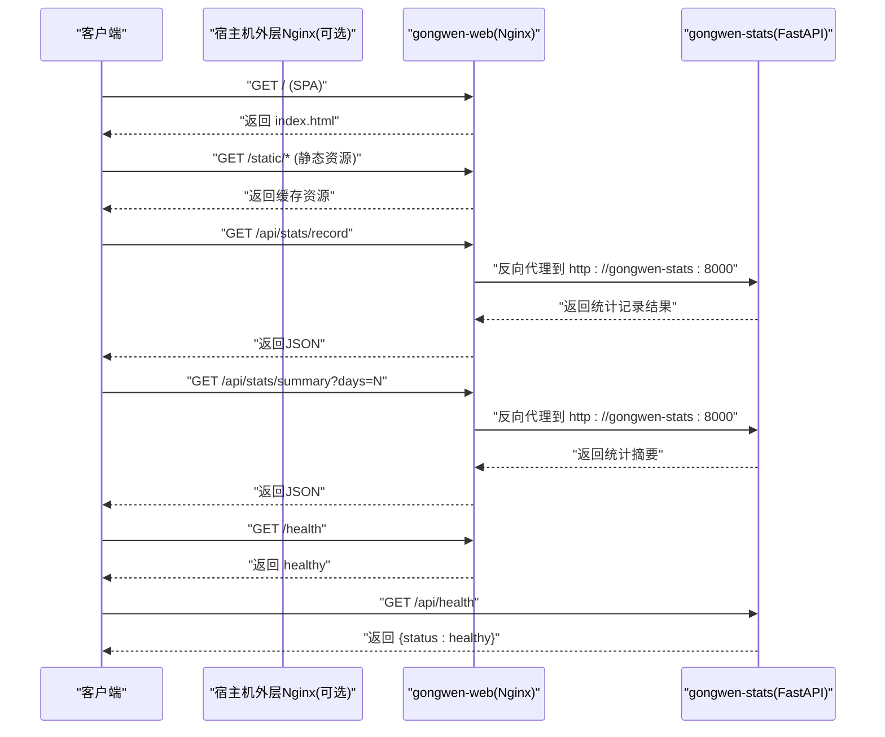
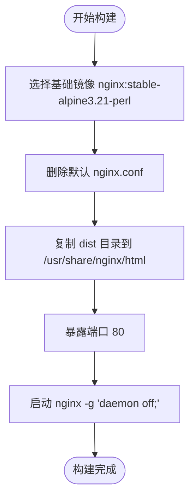
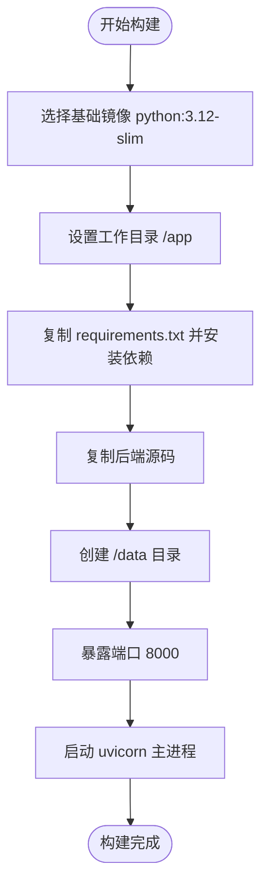
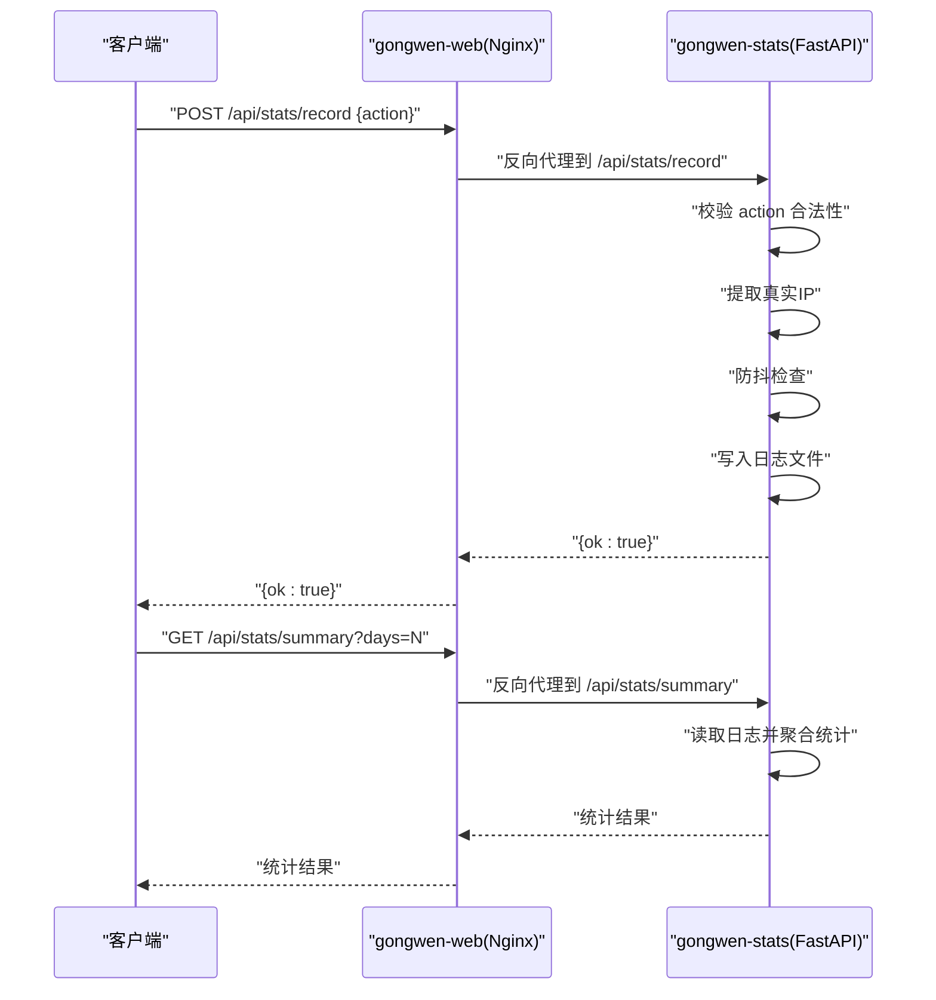
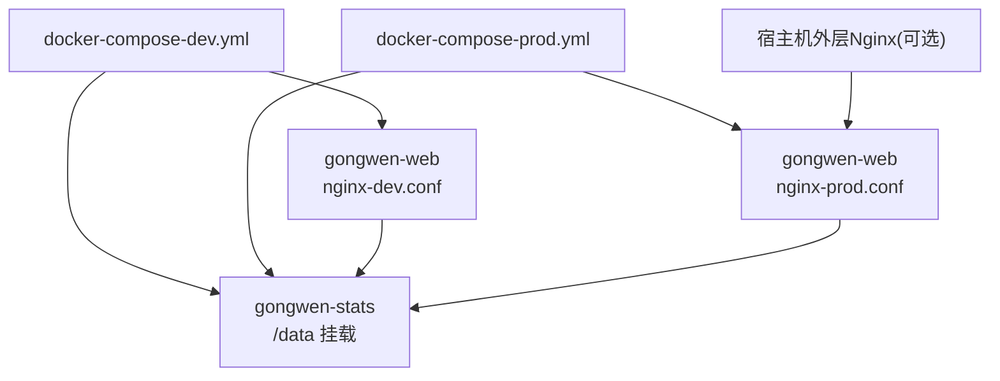

# Docker容器化部署

<cite>
**本文档引用的文件**
- [backend/Dockerfile](file://backend/Dockerfile)
- [gongwen-docker/Dockerfile](file://gongwen-docker/Dockerfile)
- [gongwen-docker/docker-compose-dev.yml](file://gongwen-docker/docker-compose-dev.yml)
- [gongwen-docker/docker-compose-prod.yml](file://gongwen-docker/docker-compose-prod.yml)
- [gongwen-docker/nginx-dev.conf](file://gongwen-docker/nginx-dev.conf)
- [gongwen-docker/nginx-prod.conf](file://gongwen-docker/nginx-prod.conf)
- [gongwen-docker/host_nginx.conf](file://gongwen-docker/host_nginx.conf)
- [.dockerignore](file://.dockerignore)
- [backend/main.py](file://backend/main.py)
- [backend/config.py](file://backend/config.py)
- [backend/models.py](file://backend/models.py)
- [backend/routers/stats.py](file://backend/routers/stats.py)
- [backend/services/stats_service.py](file://backend/services/stats_service.py)
- [backend/requirements.txt](file://backend/requirements.txt)
- [package.json](file://package.json)
- [gongwen-docker/README.md](file://gongwen-docker/README.md)
</cite>

## 目录
1. [简介](#简介)
2. [项目结构](#项目结构)
3. [核心组件](#核心组件)
4. [架构总览](#架构总览)
5. [详细组件分析](#详细组件分析)
6. [依赖关系分析](#依赖关系分析)
7. [性能考虑](#性能考虑)
8. [故障排除指南](#故障排除指南)
9. [结论](#结论)
10. [附录](#附录)

## 简介
本指南面向公文排版工具的Docker容器化部署，涵盖前端静态资源服务与后端统计服务的镜像构建流程、docker-compose编排配置、开发与生产环境差异、容器网络与数据持久化最佳实践，以及常见部署问题的排查与解决。读者无需深入技术背景即可按步骤完成部署。

## 项目结构
该仓库采用前后端分离的容器化架构：
- 前端静态资源通过Nginx提供服务，镜像直接复制构建产物dist目录
- 后端统计服务基于Python/FastAPI，提供统计记录与查询接口
- docker-compose同时编排前端与后端服务，实现反向代理、健康检查与数据持久化

```mermaid
graph TB
subgraph "宿主机"
HostNginx["外层 Nginx(可选)<br/>监听端口 88"]
Browser["浏览器/客户端"]
end
subgraph "Docker 容器"
Web["gongwen-web<br/>Nginx 静态资源服务"]
Stats["gongwen-stats<br/>FastAPI 统计服务"]
end
Browser --> |HTTP/HTTPS| HostNginx
HostNginx --> |转发至| Web
Web <- --> |反向代理 /api| Stats
Web -.->|健康检查 /health| Web
Stats -.->|健康检查 /api/health| Stats
```

**图表来源**
- [gongwen-docker/docker-compose-dev.yml:6-44](file://gongwen-docker/docker-compose-dev.yml#L6-L44)
- [gongwen-docker/docker-compose-prod.yml:4-36](file://gongwen-docker/docker-compose-prod.yml#L4-L36)
- [gongwen-docker/nginx-dev.conf:55-64](file://gongwen-docker/nginx-dev.conf#L55-L64)
- [gongwen-docker/nginx-prod.conf:56-65](file://gongwen-docker/nginx-prod.conf#L56-L65)

**章节来源**
- [gongwen-docker/docker-compose-dev.yml:1-44](file://gongwen-docker/docker-compose-dev.yml#L1-L44)
- [gongwen-docker/docker-compose-prod.yml:1-36](file://gongwen-docker/docker-compose-prod.yml#L1-L36)

## 核心组件
- 前端Web镜像（gongwen-web）
  - 基于nginx:stable-alpine3.21-perl，删除默认配置，复制dist目录为静态资源根目录
  - 暴露80端口，提供SPA路由回退、静态资源缓存、Gzip压缩与健康检查端点
  - 开发模式下通过反向代理将/api转发至gongwen-stats:8000
- 后端统计服务镜像（gongwen-stats）
  - 基于python:3.12-slim，安装requirements.txt依赖，复制后端源码
  - 暴露8000端口，提供统计记录与查询接口，内置健康检查端点
  - 使用/data目录持久化日志文件，默认日志路径可通过环境变量覆盖
- docker-compose编排
  - 支持开发（docker-compose-dev.yml）与生产（docker-compose-prod.yml）两种配置
  - 通过depends_on定义服务启动顺序，通过volumes实现数据持久化
  - 通过healthcheck进行容器健康状态监控

**章节来源**
- [gongwen-docker/Dockerfile:1-19](file://gongwen-docker/Dockerfile#L1-L19)
- [backend/Dockerfile:1-18](file://backend/Dockerfile#L1-L18)
- [backend/main.py:34-38](file://backend/main.py#L34-L38)
- [backend/config.py:6](file://backend/config.py#L6)

## 架构总览
下图展示容器间通信与外部访问路径：



**图表来源**
- [gongwen-docker/nginx-dev.conf:55-64](file://gongwen-docker/nginx-dev.conf#L55-L64)
- [gongwen-docker/nginx-prod.conf:56-65](file://gongwen-docker/nginx-prod.conf#L56-L65)
- [backend/main.py:34-38](file://backend/main.py#L34-L38)

## 详细组件分析

### 前端Web镜像构建（gongwen-web）
- 基础镜像与工作目录
  - 使用nginx:stable-alpine3.21-perl作为基础镜像，删除默认nginx.conf以应用自定义配置
- 构建上下文与产物复制
  - 通过复制dist目录提供静态资源，要求先在项目根目录执行构建脚本生成dist
- 端口暴露与启动
  - 暴露80端口，使用daemon off方式启动nginx
- 自定义Nginx配置
  - 提供静态资源缓存策略、Gzip压缩、PWA相关文件不缓存
  - SPA路由回退至index.html，/api路径反向代理到gongwen-stats:8000
  - /health端点用于容器健康检查



**图表来源**
- [gongwen-docker/Dockerfile:5-18](file://gongwen-docker/Dockerfile#L5-L18)

**章节来源**
- [gongwen-docker/Dockerfile:1-19](file://gongwen-docker/Dockerfile#L1-L19)
- [gongwen-docker/nginx-dev.conf:35-83](file://gongwen-docker/nginx-dev.conf#L35-L83)
- [gongwen-docker/nginx-prod.conf:35-85](file://gongwen-docker/nginx-prod.conf#L35-L85)

### 后端统计服务镜像构建（gongwen-stats）
- 基础镜像与依赖安装
  - 使用python:3.12-slim，复制requirements.txt并安装依赖
- 应用代码与数据目录
  - 复制后端源码，创建/data目录用于日志持久化
- 端口暴露与启动
  - 暴露8000端口，使用uvicorn启动FastAPI应用
- 健康检查端点
  - 提供/api/health用于容器健康检查



**图表来源**
- [backend/Dockerfile:1-18](file://backend/Dockerfile#L1-L18)

**章节来源**
- [backend/Dockerfile:1-18](file://backend/Dockerfile#L1-L18)
- [backend/main.py:34-38](file://backend/main.py#L34-L38)

### docker-compose编排配置

#### 开发环境（docker-compose-dev.yml）
- 服务定义
  - gongwen-web：映射宿主机88:80，挂载nginx-dev.conf，依赖gongwen-stats
  - gongwen-stats：挂载./data到容器内/data，持久化日志
- 健康检查
  - gongwen-web：/health
  - gongwen-stats：/api/health
- 网络与反向代理
  - gongwen-web通过反向代理将/api转发至gongwen-stats:8000

**章节来源**
- [gongwen-docker/docker-compose-dev.yml:6-44](file://gongwen-docker/docker-compose-dev.yml#L6-L44)
- [gongwen-docker/nginx-dev.conf:55-64](file://gongwen-docker/nginx-dev.conf#L55-L64)

#### 生产环境（docker-compose-prod.yml）
- 服务定义
  - gongwen-web：映射宿主机50088:80，挂载nginx-prod.conf，依赖gongwen-stats
  - gongwen-stats：挂载./data到容器内/data，持久化日志
- 健康检查
  - gongwen-web：/health
  - gongwen-stats：/api/health
- 外层Nginx集成
  - 可选使用宿主机外层Nginx监听88端口并将请求转发至容器内Nginx的50088端口

**章节来源**
- [gongwen-docker/docker-compose-prod.yml:4-36](file://gongwen-docker/docker-compose-prod.yml#L4-L36)
- [gongwen-docker/host_nginx.conf:1-16](file://gongwen-docker/host_nginx.conf#L1-L16)
- [gongwen-docker/nginx-prod.conf:56-65](file://gongwen-docker/nginx-prod.conf#L56-L65)

### Nginx配置详解

#### 开发模式nginx-dev.conf
- 监听80端口，根目录/usr/share/nginx/html
- 静态资源缓存策略与Gzip压缩
- /api反向代理至gongwen-stats:8000
- SPA路由回退至index.html
- /health健康检查端点

**章节来源**
- [gongwen-docker/nginx-dev.conf:35-83](file://gongwen-docker/nginx-dev.conf#L35-L83)

#### 生产模式nginx-prod.conf
- 监听80端口，根目录/usr/share/nginx/html
- 静态资源缓存策略与Gzip压缩
- /api反向代理至gongwen-stats:8000
- SPA路由回退至index.html
- /health健康检查端点

**章节来源**
- [gongwen-docker/nginx-prod.conf:35-85](file://gongwen-docker/nginx-prod.conf#L35-L85)

### 后端统计服务API与数据流

#### API路由与处理流程
- /api/stats/record：接收action参数，校验合法性，提取真实IP，防抖检查，写入日志
- /api/stats/summary：按天数范围聚合统计，返回唯一用户数、总调用次数等



**图表来源**
- [backend/routers/stats.py:12-39](file://backend/routers/stats.py#L12-L39)
- [backend/services/stats_service.py:44-123](file://backend/services/stats_service.py#L44-L123)

**章节来源**
- [backend/routers/stats.py:1-40](file://backend/routers/stats.py#L1-L40)
- [backend/services/stats_service.py:1-124](file://backend/services/stats_service.py#L1-L124)
- [backend/models.py:6-23](file://backend/models.py#L6-L23)

## 依赖关系分析



**图表来源**
- [gongwen-docker/docker-compose-dev.yml:6-44](file://gongwen-docker/docker-compose-dev.yml#L6-L44)
- [gongwen-docker/docker-compose-prod.yml:4-36](file://gongwen-docker/docker-compose-prod.yml#L4-L36)
- [gongwen-docker/host_nginx.conf:1-16](file://gongwen-docker/host_nginx.conf#L1-L16)

**章节来源**
- [gongwen-docker/docker-compose-dev.yml:19-20](file://gongwen-docker/docker-compose-dev.yml#L19-L20)
- [gongwen-docker/docker-compose-prod.yml:14-15](file://gongwen-docker/docker-compose-prod.yml#L14-L15)

## 性能考虑
- 静态资源优化
  - 启用Gzip压缩与长期缓存策略，减少带宽与提升加载速度
  - PWA相关文件不缓存，确保更新及时生效
- 反向代理超时设置
  - proxy_connect_timeout与proxy_read_timeout合理配置，避免长时间连接占用
- 健康检查频率
  - 建议根据实际负载调整interval与timeout，避免过于频繁导致额外开销
- 数据持久化
  - 将日志目录挂载到宿主机，避免容器重建丢失数据

[本节为通用指导，无需特定文件引用]

## 故障排除指南

### 端口冲突
- 症状：容器启动失败或端口占用
- 排查：确认宿主机端口未被占用，开发环境默认88，生产环境默认50088
- 解决：修改docker-compose映射端口或释放占用端口

**章节来源**
- [gongwen-docker/docker-compose-dev.yml:13-14](file://gongwen-docker/docker-compose-dev.yml#L13-L14)
- [gongwen-docker/docker-compose-prod.yml:8-9](file://gongwen-docker/docker-compose-prod.yml#L8-L9)

### 权限问题
- 症状：容器无法写入日志或挂载目录无权限
- 排查：检查/data目录权限与SELinux/AppArmor策略
- 解决：确保宿主机/data目录对容器用户可写，必要时调整文件权限或安全策略

**章节来源**
- [backend/config.py:6](file://backend/config.py#L6)
- [backend/services/stats_service.py:44-54](file://backend/services/stats_service.py#L44-L54)

### 资源限制
- 症状：容器内存/CPU不足导致性能下降或崩溃
- 排查：监控容器资源使用情况
- 解决：在docker-compose中添加资源限制或提高宿主机资源

[本节为通用指导，无需特定文件引用]

### 健康检查失败
- 症状：容器反复重启
- 排查：检查/health与/api/health端点返回值
- 解决：确认Nginx与FastAPI均正常启动，反向代理配置正确

**章节来源**
- [gongwen-docker/docker-compose-dev.yml:21-26](file://gongwen-docker/docker-compose-dev.yml#L21-L26)
- [gongwen-docker/docker-compose-prod.yml:16-21](file://gongwen-docker/docker-compose-prod.yml#L16-L21)
- [backend/main.py:34-38](file://backend/main.py#L34-L38)

### 外层Nginx集成
- 步骤：复制host_nginx.conf到系统Nginx站点配置目录，创建软链接启用站点，测试并重载配置
- 注意：确保系统Nginx未监听冲突端口

**章节来源**
- [gongwen-docker/README.md:27-41](file://gongwen-docker/README.md#L27-L41)
- [gongwen-docker/host_nginx.conf:1-16](file://gongwen-docker/host_nginx.conf#L1-L16)

## 结论
通过本指南，您可以完成公文排版工具的Docker容器化部署，包括前端静态资源服务与后端统计服务的镜像构建、docker-compose编排、开发与生产环境配置差异、容器网络与数据持久化最佳实践，以及常见部署问题的排查。建议在生产环境中结合外层Nginx实现更完善的流量控制与安全防护。

[本节为总结性内容，无需特定文件引用]

## 附录

### 容器操作命令
- 启动：进入gongwen-docker目录后执行docker-compose up -d --build
- 停止：docker-compose down
- 重启：docker-compose restart
- 查看日志：docker-compose logs -f

**章节来源**
- [gongwen-docker/README.md:5-11](file://gongwen-docker/README.md#L5-L11)

### 镜像导出/导入
- 导出：docker save gongwen-web:1.1.1 -o gongwen-web-1-1-1.tar
- 导入：docker load -i gongwen-web-1-1-1.tar
- 启动：docker-compose up -d

**章节来源**
- [gongwen-docker/README.md:13-26](file://gongwen-docker/README.md#L13-L26)

### 构建前置条件
- 前端构建：在项目根目录执行npm run build生成dist目录
- 后端依赖：requirements.txt包含fastapi与uvicorn

**章节来源**
- [package.json:8](file://package.json#L8)
- [backend/requirements.txt:1-3](file://backend/requirements.txt#L1-L3)