# Nginx反向代理配置

<cite>
**本文档引用的文件**
- [nginx-prod.conf](file://gongwen-docker/nginx-prod.conf)
- [nginx-dev.conf](file://gongwen-docker/nginx-dev.conf)
- [docker-compose-prod.yml](file://gongwen-docker/docker-compose-prod.yml)
- [docker-compose-dev.yml](file://gongwen-docker/docker-compose-dev.yml)
- [host_nginx.conf](file://gongwen-docker/host_nginx.conf)
- [Dockerfile](file://gongwen-docker/Dockerfile)
- [main.py](file://backend/main.py)
- [stats.py](file://backend/routers/stats.py)
- [config.py](file://backend/config.py)
- [vite.config.ts](file://vite.config.ts)
- [package.json](file://package.json)
</cite>

## 目录
1. [简介](#简介)
2. [项目结构](#项目结构)
3. [核心组件](#核心组件)
4. [架构概览](#架构概览)
5. [详细组件分析](#详细组件分析)
6. [生产环境配置](#生产环境配置)
7. [开发环境配置](#开发环境配置)
8. [反向代理配置详解](#反向代理配置详解)
9. [SSL/TLS证书配置](#ssltls证书配置)
10. [性能优化配置](#性能优化配置)
11. [安全防护配置](#安全防护配置)
12. [常见问题排查](#常见问题排查)
13. [结论](#结论)

## 简介

本指南详细介绍了公文排版工具的Nginx反向代理配置方案，涵盖生产环境和开发环境的完整配置差异。该系统采用前后端分离架构，前端为React单页应用，后端为FastAPI统计服务，通过Docker容器化部署。

系统的核心特点：
- 前端应用通过Nginx提供静态资源服务
- 后端API服务通过反向代理统一对外提供接口
- 支持PWA离线缓存和静态资源优化
- 提供健康检查和错误处理机制

## 项目结构

公文排版工具采用模块化设计，主要包含以下关键组件：

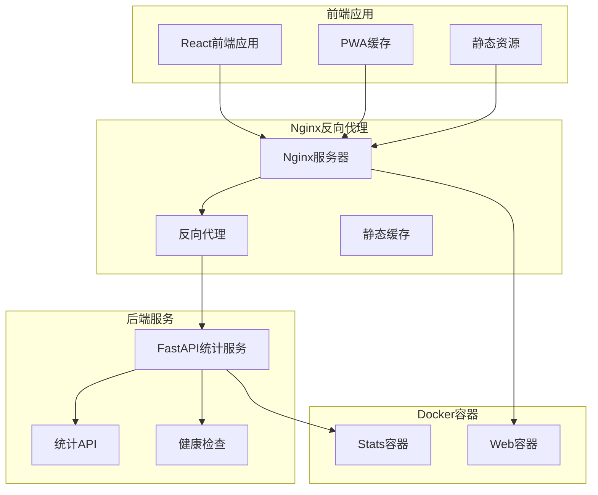

**图表来源**
- [nginx-prod.conf:35-84](file://gongwen-docker/nginx-prod.conf#L35-L84)
- [docker-compose-prod.yml:4-36](file://gongwen-docker/docker-compose-prod.yml#L4-L36)

**章节来源**
- [nginx-prod.conf:1-86](file://gongwen-docker/nginx-prod.conf#L1-L86)
- [docker-compose-prod.yml:1-36](file://gongwen-docker/docker-compose-prod.yml#L1-L36)

## 核心组件

### 前端应用架构

前端采用React技术栈，结合Vite构建工具和PWA特性：

- **React组件系统**：模块化的UI组件设计
- **Vite构建工具**：快速的开发服务器和优化的生产构建
- **PWA支持**：离线缓存和渐进式应用特性
- **单文件部署**：支持打包为单个HTML文件便于分发

### Nginx反向代理服务

Nginx作为核心的反向代理服务器，负责：
- 静态资源的高效分发
- API请求的路由转发
- 请求头的正确传递
- 缓存策略的实施

### 后端统计服务

基于FastAPI的统计服务，提供：
- 用户行为记录API
- 数据统计查询接口
- 健康检查端点
- 防抖机制防止重复提交

**章节来源**
- [vite.config.ts:15-78](file://vite.config.ts#L15-L78)
- [nginx-prod.conf:55-65](file://gongwen-docker/nginx-prod.conf#L55-L65)
- [main.py:24-38](file://backend/main.py#L24-L38)

## 架构概览

系统采用三层架构设计，通过Nginx实现前后端分离：

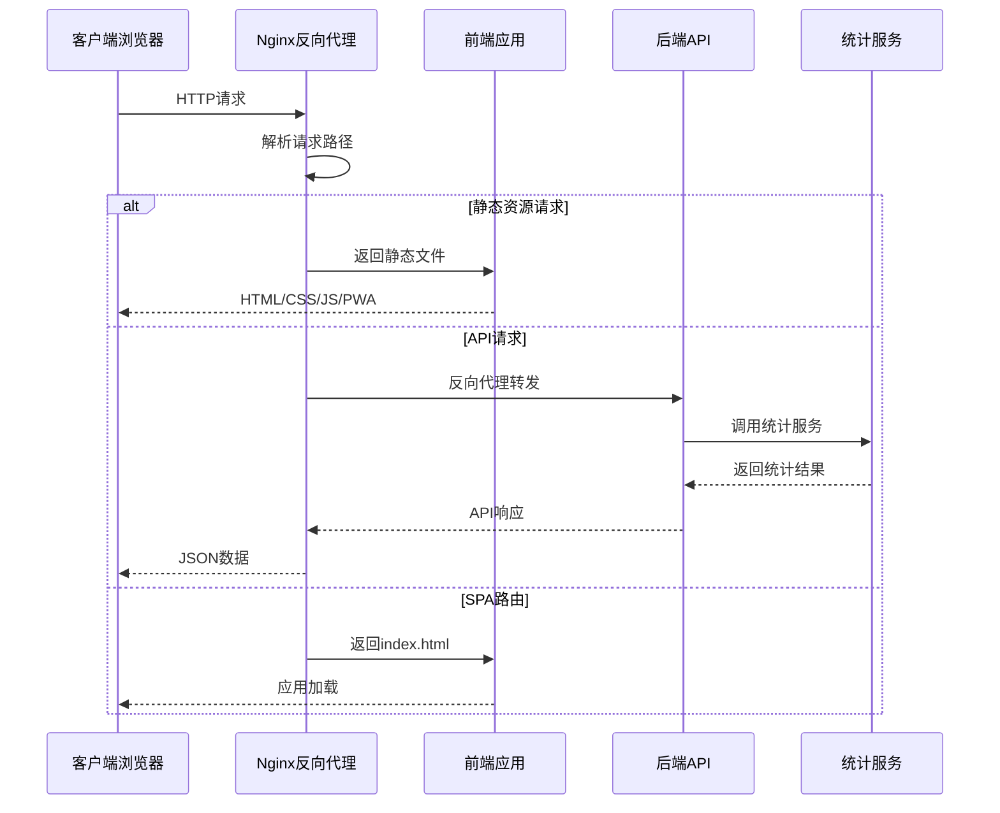

**图表来源**
- [nginx-prod.conf:44-70](file://gongwen-docker/nginx-prod.conf#L44-L70)
- [stats.py:12-40](file://backend/routers/stats.py#L12-L40)

## 详细组件分析

### Nginx配置文件分析

#### 生产环境配置

生产环境的Nginx配置专注于性能和稳定性：

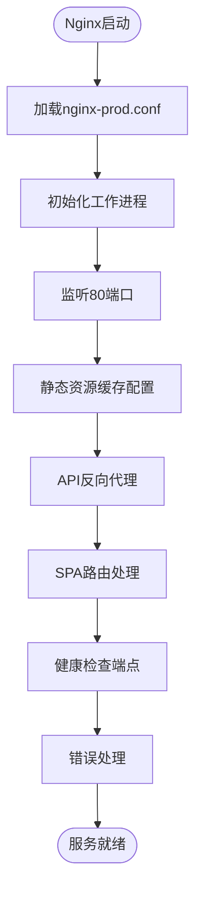

**图表来源**
- [nginx-prod.conf:35-84](file://gongwen-docker/nginx-prod.conf#L35-L84)

#### 开发环境配置

开发环境配置简化了调试和热重载功能：

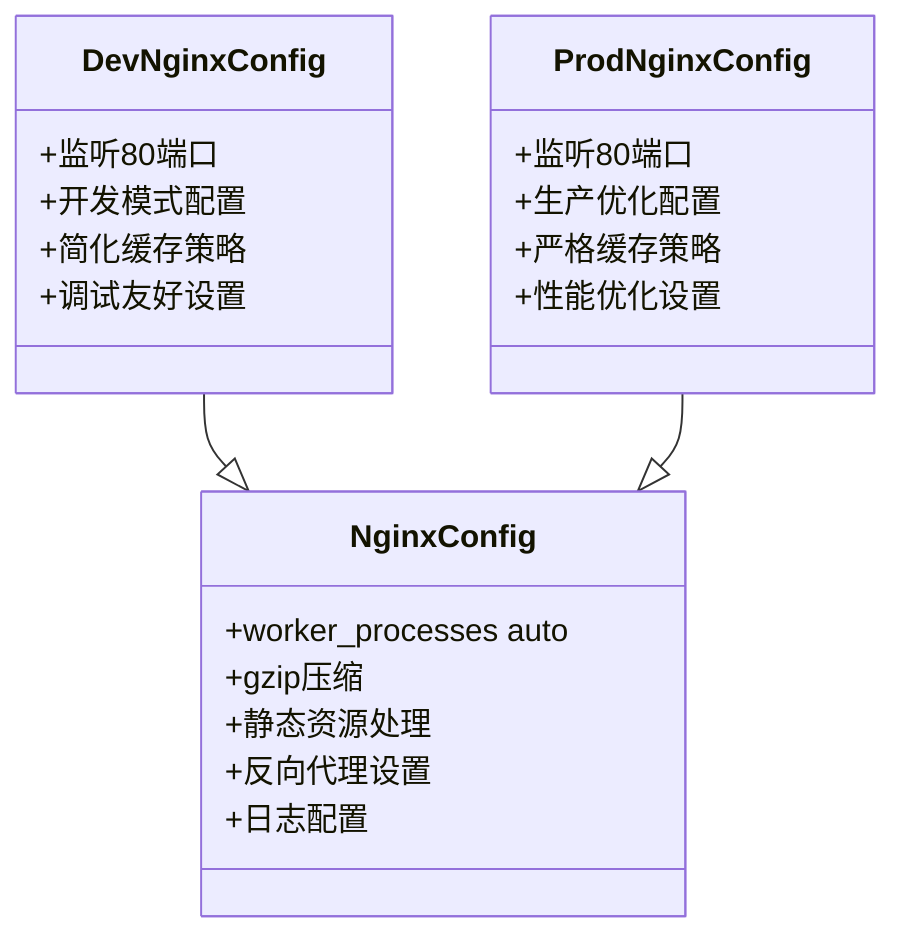

**图表来源**
- [nginx-dev.conf:35-84](file://gongwen-docker/nginx-dev.conf#L35-L84)
- [nginx-prod.conf:35-84](file://gongwen-docker/nginx-prod.conf#L35-L84)

**章节来源**
- [nginx-dev.conf:1-85](file://gongwen-docker/nginx-dev.conf#L1-L85)
- [nginx-prod.conf:1-86](file://gongwen-docker/nginx-prod.conf#L1-L86)

### Docker容器编排

#### 生产环境容器配置

生产环境使用独立的Docker Compose文件，提供完整的部署配置：

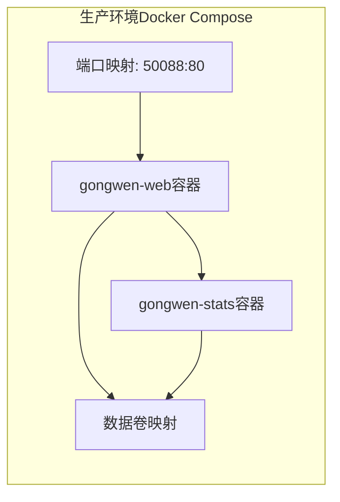

**图表来源**
- [docker-compose-prod.yml:4-36](file://gongwen-docker/docker-compose-prod.yml#L4-L36)

#### 开发环境容器配置

开发环境支持热重载和快速迭代：

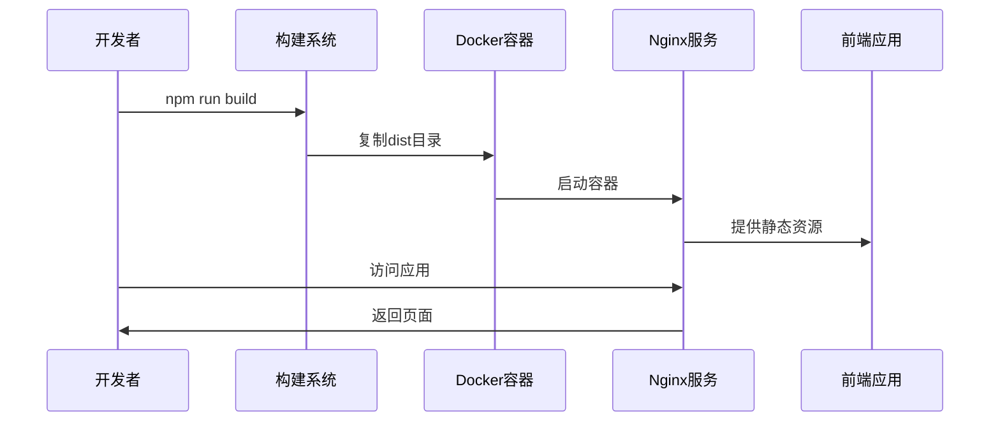

**图表来源**
- [docker-compose-dev.yml:6-26](file://gongwen-docker/docker-compose-dev.yml#L6-L26)

**章节来源**
- [docker-compose-prod.yml:1-36](file://gongwen-docker/docker-compose-prod.yml#L1-L36)
- [docker-compose-dev.yml:1-44](file://gongwen-docker/docker-compose-dev.yml#L1-L44)

### 后端API服务

#### 统计服务架构

后端统计服务提供用户行为追踪和数据分析功能：

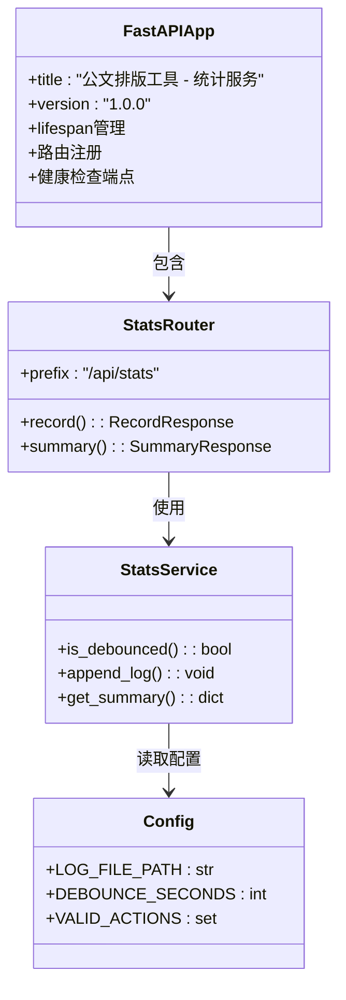

**图表来源**
- [main.py:24-38](file://backend/main.py#L24-L38)
- [stats.py:9-40](file://backend/routers/stats.py#L9-L40)
- [config.py:1-16](file://backend/config.py#L1-L16)

**章节来源**
- [main.py:1-38](file://backend/main.py#L1-L38)
- [stats.py:1-40](file://backend/routers/stats.py#L1-L40)
- [config.py:1-16](file://backend/config.py#L1-L16)

## 生产环境配置

### 端口配置

生产环境使用宿主机端口映射到容器内部的80端口：

- **宿主机端口**: 50088
- **容器内部端口**: 80
- **映射关系**: `- "50088:80"`

这种配置允许在同一台服务器上运行多个应用，避免端口冲突。

### 虚拟主机设置

生产环境的虚拟主机配置简洁明确：

```nginx
server {
    listen       80;
    server_name  localhost;
    root   /usr/share/nginx/html;
    index  index.html index.htm;
}
```

### 静态资源处理

生产环境采用严格的缓存策略：

```nginx
location ~* \.(js|css|png|jpg|jpeg|gif|ico|svg|woff|woff2|ttf|eot)$ {
    expires 30d;
    add_header Cache-Control "public, immutable";
}
```

PWA相关文件采用无缓存策略：
```nginx
location ~* (sw\.js|manifest\.json|workbox.*\.js)$ {
    add_header Cache-Control "no-cache, no-store, must-revalidate";
    expires 0;
}
```

**章节来源**
- [nginx-prod.conf:35-54](file://gongwen-docker/nginx-prod.conf#L35-L54)
- [docker-compose-prod.yml:8-13](file://gongwen-docker/docker-compose-prod.yml#L8-L13)

## 开发环境配置

### 端口配置差异

开发环境使用更直观的端口映射：

- **宿主机端口**: 88
- **容器内部端口**: 80
- **映射关系**: `- "88:80"`

### 开发专用配置

开发环境的Nginx配置针对调试进行了优化：

```nginx
location / {
    try_files $uri $uri/ /index.html;
}
```

开发环境的健康检查端点：
```nginx
location /health {
    access_log off;
    return 200 "healthy\n";
    add_header Content-Type text/plain;
}
```

**章节来源**
- [nginx-dev.conf:35-69](file://gongwen-docker/nginx-dev.conf#L35-L69)
- [docker-compose-dev.yml:13-26](file://gongwen-docker/docker-compose-dev.yml#L13-L26)

## 反向代理配置详解

### 前端应用路由规则

Nginx作为前端应用的反向代理，需要处理SPA路由：

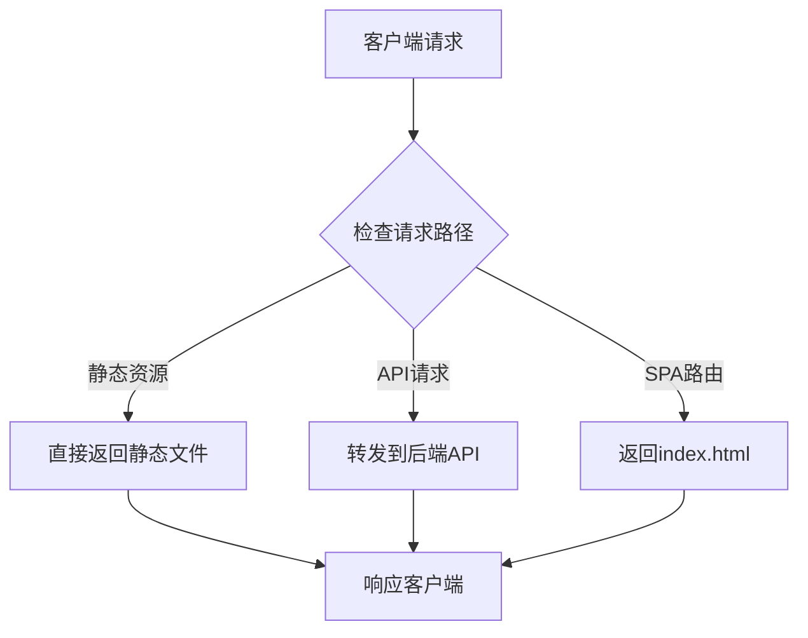

**图表来源**
- [nginx-prod.conf:67-70](file://gongwen-docker/nginx-prod.conf#L67-L70)

### 后端API路由规则

API请求通过反向代理转发到统计服务：

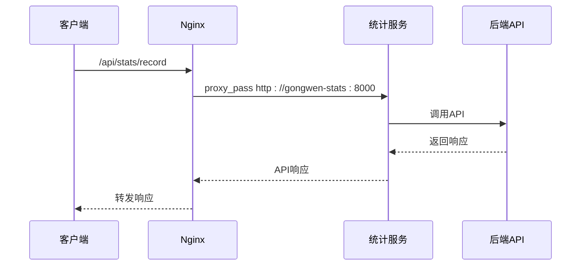

**图表来源**
- [nginx-prod.conf:57-65](file://gongwen-docker/nginx-prod.conf#L57-L65)
- [stats.py:12-32](file://backend/routers/stats.py#L12-L32)

### 请求头传递配置

正确的请求头传递对于后端服务获取真实IP至关重要：

```nginx
proxy_set_header Host $host;
proxy_set_header X-Real-IP $http_x_real_ip;
proxy_set_header X-Forwarded-For $proxy_add_x_forwarded_for;
proxy_set_header X-Forwarded-Proto $scheme;
```

**章节来源**
- [nginx-prod.conf:59-62](file://gongwen-docker/nginx-prod.conf#L59-L62)
- [stats.py:19-24](file://backend/routers/stats.py#L19-L24)

## SSL/TLS证书配置

### Let's Encrypt自动化配置

虽然当前配置未包含SSL证书，但可以轻松集成Let's Encrypt：

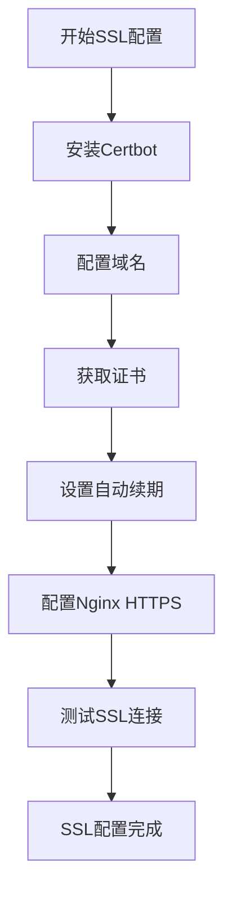

### HTTPS配置步骤

1. **安装Certbot**：
   ```bash
   sudo apt-get install certbot python3-certbot-nginx
   ```

2. **获取SSL证书**：
   ```bash
   sudo certbot --nginx -d your-domain.com
   ```

3. **配置HTTPS重定向**：
   ```nginx
   server {
       listen 80;
       server_name your-domain.com;
       return 301 https://$server_name$request_uri;
   }
   ```

4. **配置HTTPS服务器块**：
   ```nginx
   server {
       listen 443 ssl http2;
       server_name your-domain.com;
       
       ssl_certificate /etc/letsencrypt/live/your-domain.com/fullchain.pem;
       ssl_certificate_key /etc/letsencrypt/live/your-domain.com/privkey.pem;
       
       # SSL安全配置
       ssl_protocols TLSv1.2 TLSv1.3;
       ssl_ciphers ECDHE-RSA-AES256-GCM-SHA512:DHE-RSA-AES256-GCM-SHA512:ECDHE-RSA-AES256-GCM-SHA128:DHE-RSA-AES256-GCM-SHA128;
       ssl_prefer_server_ciphers off;
       ssl_session_cache shared:SSL:10m;
       ssl_session_timeout 10m;
   }
   ```

## 性能优化配置

### Gzip压缩配置

系统已内置Gzip压缩，可进一步优化：

```nginx
gzip on;
gzip_vary on;
gzip_proxied any;
gzip_comp_level 6;
gzip_types 
    text/plain
    text/css
    text/xml
    text/javascript
    application/json
    application/javascript
    application/rss+xml
    application/atom+xml
    image/svg+xml;
```

### 缓存策略优化

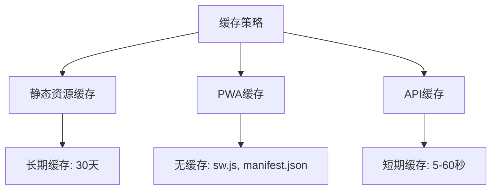

### 连接优化

```nginx
keepalive_timeout 65;
tcp_nopush on;
tcp_nodelay on;
sendfile on;
```

**章节来源**
- [nginx-prod.conf:28-33](file://gongwen-docker/nginx-prod.conf#L28-L33)
- [nginx-prod.conf:22-26](file://gongwen-docker/nginx-prod.conf#L22-L26)

## 安全防护配置

### CORS跨域处理

```nginx
add_header Access-Control-Allow-Origin *;
add_header Access-Control-Allow-Methods "GET, POST, PUT, DELETE, OPTIONS";
add_header Access-Control-Allow-Headers "Content-Type, Authorization";
```

### 文件上传限制

```nginx
client_max_body_size 10M;
client_body_buffer_size 128k;
```

### DDoS防护

```nginx
limit_req_zone $binary_remote_addr zone=api:10m rate=10r/s;
limit_req zone=api burst=20 nodelay;

limit_conn_zone $binary_remote_addr zone=conn_limit_per_ip:10m;
limit_conn conn_limit_per_ip 10;
```

### 安全头设置

```nginx
add_header X-Frame-Options "SAMEORIGIN" always;
add_header X-XSS-Protection "1; mode=block" always;
add_header X-Content-Type-Options "nosniff" always;
add_header Referrer-Policy "no-referrer-when-downgrade" always;
```

## 常见问题排查

### 502错误解决方案

502错误通常由上游服务器不可达引起：

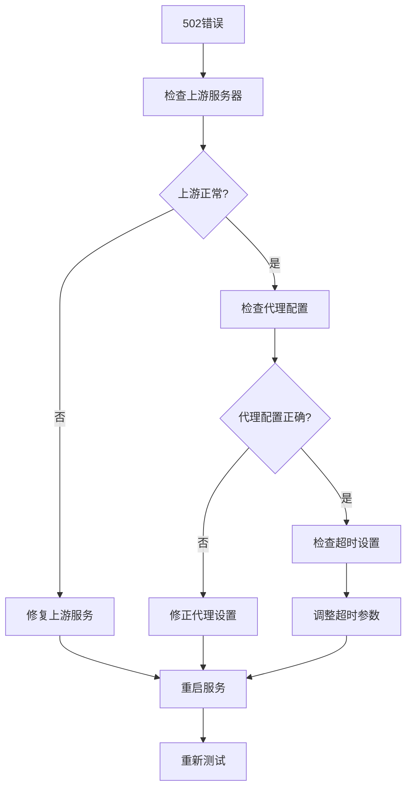

### 超时问题诊断

```nginx
# 连接超时
proxy_connect_timeout 5s;

# 读取超时
proxy_read_timeout 10s;

# 发送超时
proxy_send_timeout 10s;
```

### 文件上传限制

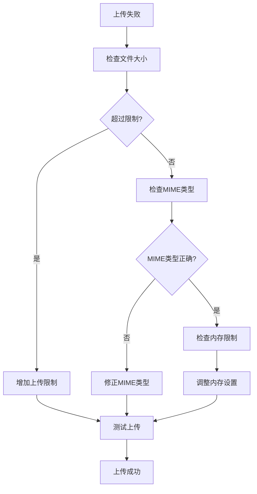

### 健康检查配置

```nginx
location /health {
    access_log off;
    return 200 "healthy\n";
    add_header Content-Type text/plain;
}
```

**章节来源**
- [nginx-prod.conf:72-77](file://gongwen-docker/nginx-prod.conf#L72-L77)
- [docker-compose-prod.yml:16-21](file://gongwen-docker/docker-compose-prod.yml#L16-L21)

## 结论

本Nginx反向代理配置方案提供了完整的公文排版工具部署解决方案。通过生产环境和开发环境的差异化配置，既保证了生产环境的稳定性和性能，又满足了开发环境的灵活性和调试需求。

关键优势包括：
- **模块化设计**：清晰的前后端分离架构
- **容器化部署**：Docker Compose简化了部署流程
- **性能优化**：内置的缓存和压缩策略
- **监控完善**：健康检查和错误处理机制
- **扩展性强**：易于添加SSL证书和安全防护

建议在生产环境中进一步完善：
- 集成Let's Encrypt SSL证书
- 添加详细的访问日志和监控
- 实施更严格的CORS和安全头配置
- 配置负载均衡和高可用架构