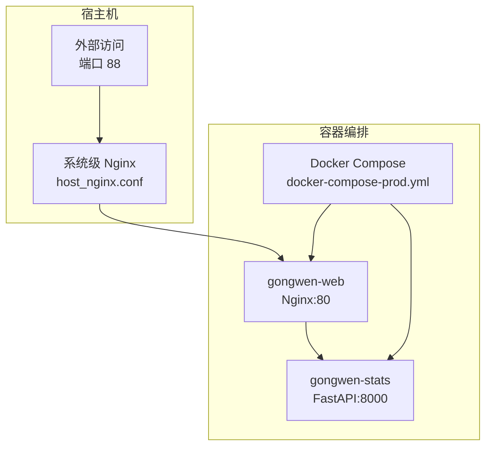
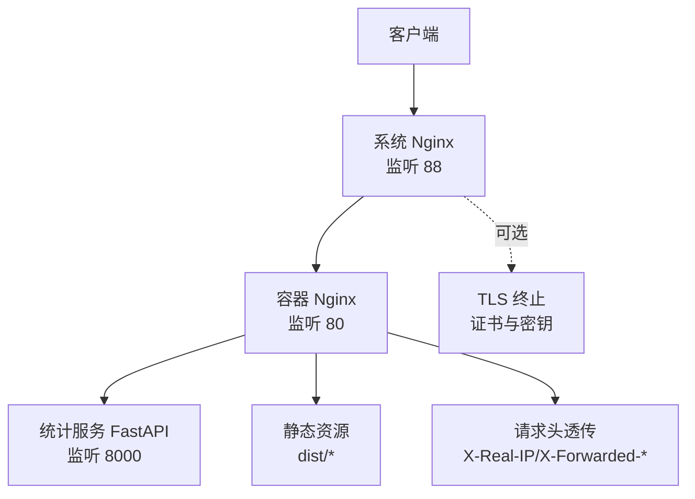
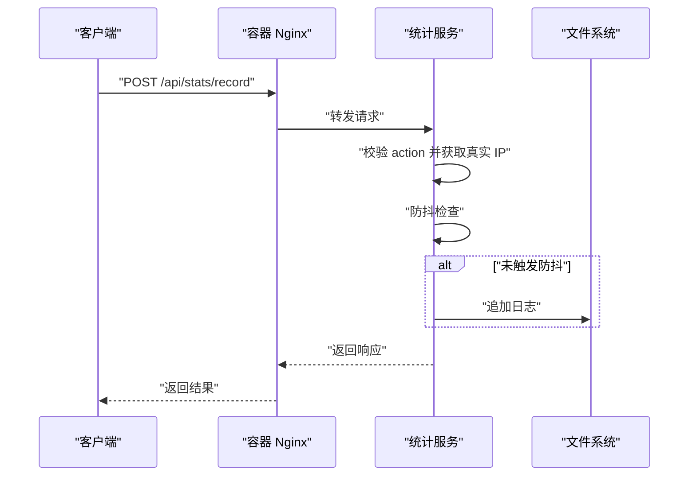
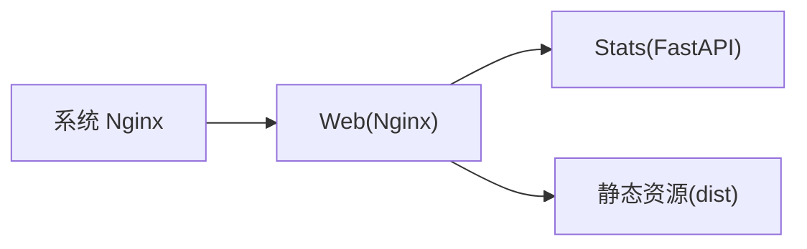

# 生产环境部署

<cite>
**本文引用的文件**
- [README.md](file://README.md)
- [gongwen-docker/README.md](file://gongwen-docker/README.md)
- [docker-compose-prod.yml](file://gongwen-docker/docker-compose-prod.yml)
- [nginx-prod.conf](file://gongwen-docker/nginx-prod.conf)
- [host_nginx.conf](file://gongwen-docker/host_nginx.conf)
- [backend/main.py](file://backend/main.py)
- [backend/Dockerfile](file://backend/Dockerfile)
- [backend/config.py](file://backend/config.py)
- [backend/models.py](file://backend/models.py)
- [backend/routers/stats.py](file://backend/routers/stats.py)
- [backend/services/stats_service.py](file://backend/services/stats_service.py)
- [backend/requirements.txt](file://backend/requirements.txt)
- [deploy.yml](file://.github/workflows/deploy.yml)
- [release.yml](file://.github/workflows/release.yml)
</cite>

## 目录
1. [简介](#简介)
2. [项目结构](#项目结构)
3. [核心组件](#核心组件)
4. [架构总览](#架构总览)
5. [详细组件分析](#详细组件分析)
6. [依赖分析](#依赖分析)
7. [性能考虑](#性能考虑)
8. [故障排查指南](#故障排查指南)
9. [结论](#结论)
10. [附录](#附录)

## 简介
本指南面向生产环境部署“公文排版工具”，围绕系统要求、硬件配置、网络规划、高可用架构、性能优化、安全加固、监控告警、日志与审计、备份恢复与容量规划等方面，结合仓库中的实际配置与实现，给出可落地的部署建议与最佳实践。

## 项目结构
该工程采用前后端分离与容器化部署方案：
- 前端为 React + Vite 构建的静态站点，支持 PWA 与单文件离线版本。
- 后端为 Python FastAPI 应用，提供统计与行为记录接口。
- 通过 Nginx 作为反向代理与静态资源服务，Docker Compose 编排 Web 与统计服务。
- 提供 GitHub Actions 工作流用于前端静态资源发布与离线包发布。

图表来源
- [docker-compose-prod.yml:1-36](file://gongwen-docker/docker-compose-prod.yml#L1-L36)
- [nginx-prod.conf:1-86](file://gongwen-docker/nginx-prod.conf#L1-L86)
- [host_nginx.conf:1-16](file://gongwen-docker/host_nginx.conf#L1-L16)

章节来源
- [README.md:1-103](file://README.md#L1-L103)
- [gongwen-docker/README.md:1-41](file://gongwen-docker/README.md#L1-L41)
- [docker-compose-prod.yml:1-36](file://gongwen-docker/docker-compose-prod.yml#L1-L36)

## 核心组件
- Web 前端服务（gongwen-web）
  - 基于 Nginx 提供静态资源服务与反向代理，监听容器内 80 端口；通过卷挂载生产配置。
  - 对外暴露端口映射至宿主机 50088。
- 统计服务（gongwen-stats）
  - 基于 FastAPI，提供 /api/stats/record 与 /api/stats/summary 接口。
  - 通过异步生命周期启动周期性清理任务，维护防抖缓存。
  - 日志写入持久化目录 /data，支持按天统计。
- Nginx 反向代理
  - 生产配置将 /api 路由转发至 gongwen-stats:8000。
  - 提供静态资源缓存、Gzip 压缩、健康检查端点等。
- 系统级 Nginx（可选）
  - 将宿主机 88 端口请求转发至容器内 Nginx 的 50088 端口，便于统一入口与证书管理。

章节来源
- [backend/main.py:1-38](file://backend/main.py#L1-L38)
- [backend/routers/stats.py:1-40](file://backend/routers/stats.py#L1-L40)
- [backend/services/stats_service.py:1-124](file://backend/services/stats_service.py#L1-L124)
- [backend/Dockerfile:1-18](file://backend/Dockerfile#L1-L18)
- [docker-compose-prod.yml:1-36](file://gongwen-docker/docker-compose-prod.yml#L1-L36)
- [nginx-prod.conf:1-86](file://gongwen-docker/nginx-prod.conf#L1-L86)
- [host_nginx.conf:1-16](file://gongwen-docker/host_nginx.conf#L1-L16)

## 架构总览
生产环境推荐采用“系统 Nginx + 容器 Nginx + 后端服务”的三层代理架构，实现统一入口、TLS 终止、静态资源加速与 API 转发。

图表来源
- [host_nginx.conf:1-16](file://gongwen-docker/host_nginx.conf#L1-L16)
- [nginx-prod.conf:1-86](file://gongwen-docker/nginx-prod.conf#L1-L86)
- [docker-compose-prod.yml:1-36](file://gongwen-docker/docker-compose-prod.yml#L1-L36)

## 详细组件分析

### Web 前端服务（gongwen-web）
- 配置要点
  - 监听 80 端口，根目录指向静态资源。
  - /api 路由反代至 gongwen-stats:8000。
  - 静态资源缓存与 PWA 相关文件不缓存策略。
  - 健康检查端点 /health 返回固定字符串。
- 卷挂载
  - 挂载生产 Nginx 配置文件至 /etc/nginx/nginx.conf。
- 健康检查
  - 通过 curl 访问 http://localhost:80/health 进行探测。

章节来源
- [docker-compose-prod.yml:4-22](file://gongwen-docker/docker-compose-prod.yml#L4-L22)
- [nginx-prod.conf:35-84](file://gongwen-docker/nginx-prod.conf#L35-L84)

### 统计服务（gongwen-stats）
- 应用生命周期
  - 启动时创建后台任务，周期性清理防抖缓存。
  - 关闭时取消任务，避免资源泄漏。
- 路由与接口
  - POST /api/stats/record：记录用户行为，支持防抖与日志落盘。
  - GET /api/stats/summary：按天统计唯一用户数与调用次数。
- 配置项
  - 日志文件路径、防抖间隔、缓存清理间隔、有效动作集合。
- 数据持久化
  - 日志写入 /data 目录，需通过卷挂载实现持久化。

图表来源
- [nginx-prod.conf:56-65](file://gongwen-docker/nginx-prod.conf#L56-L65)
- [backend/routers/stats.py:12-32](file://backend/routers/stats.py#L12-L32)
- [backend/services/stats_service.py:44-54](file://backend/services/stats_service.py#L44-L54)

章节来源
- [backend/main.py:12-28](file://backend/main.py#L12-L28)
- [backend/routers/stats.py:1-40](file://backend/routers/stats.py#L1-L40)
- [backend/services/stats_service.py:1-124](file://backend/services/stats_service.py#L1-L124)
- [backend/config.py:1-16](file://backend/config.py#L1-L16)
- [backend/models.py:1-23](file://backend/models.py#L1-L23)

### Nginx 反向代理（容器与系统级）
- 容器 Nginx（nginx-prod.conf）
  - 监听 80，root 指向静态资源，SPA 路由回退至 index.html。
  - /api 路由转发至 gongwen-stats:8000。
  - 静态资源缓存与 PWA 不缓存策略。
  - 健康检查端点 /health。
- 系统 Nginx（host_nginx.conf）
  - 监听宿主机 88，将请求转发至容器 Nginx 的 50088。
  - 透传真实客户端 IP 与协议头。

章节来源
- [nginx-prod.conf:1-86](file://gongwen-docker/nginx-prod.conf#L1-L86)
- [host_nginx.conf:1-16](file://gongwen-docker/host_nginx.conf#L1-L16)

### Docker 编排与健康检查
- gongwen-web
  - 映射宿主机 50088:80，挂载生产 Nginx 配置。
  - 依赖 gongwen-stats，健康检查访问 /health。
- gongwen-stats
  - 挂载 /data 实现日志持久化。
  - 健康检查访问 /api/health。

章节来源
- [docker-compose-prod.yml:1-36](file://gongwen-docker/docker-compose-prod.yml#L1-L36)

## 依赖分析
- 组件耦合
  - Web 服务依赖统计服务的 /api 路由。
  - 系统 Nginx 仅作为入口代理，不直接耦合业务。
- 外部依赖
  - 前端静态资源与第三方 CDN。
  - 后端 Python 运行时与 Uvicorn。
- 可能的循环依赖
  - 当前结构为单向依赖（Web -> Stats），无循环。

图表来源
- [docker-compose-prod.yml:4-35](file://gongwen-docker/docker-compose-prod.yml#L4-L35)
- [nginx-prod.conf:56-70](file://gongwen-docker/nginx-prod.conf#L56-L70)

章节来源
- [backend/requirements.txt:1-3](file://backend/requirements.txt#L1-L3)
- [backend/Dockerfile:1-18](file://backend/Dockerfile#L1-L18)

## 性能考虑
- 静态资源与缓存
  - 启用 Gzip 压缩与长缓存策略，减少带宽与延迟。
  - PWA 相关文件不缓存，确保更新及时生效。
- 反向代理超时
  - proxy_connect_timeout 与 proxy_read_timeout 控制上游连接与读取超时，避免慢请求堆积。
- 后端并发与资源
  - 使用标准 Uvicorn 启动，结合容器 CPU/内存限制与副本数扩展。
- 防抖与日志
  - 防抖降低重复请求写入频率；定期清理缓存避免内存膨胀。
  - 日志写入磁盘需关注 I/O 压力，建议使用高性能存储与异步写入策略（当前为同步追加，可评估优化）。

章节来源
- [nginx-prod.conf:28-65](file://gongwen-docker/nginx-prod.conf#L28-L65)
- [backend/services/stats_service.py:37-42](file://backend/services/stats_service.py#L37-L42)
- [backend/Dockerfile:15-18](file://backend/Dockerfile#L15-L18)

## 故障排查指南
- 健康检查失败
  - Web 服务：确认 /health 返回 200；检查 Nginx 配置与容器端口映射。
  - 统计服务：确认 /api/health 返回 200；检查 FastAPI 生命周期与后台任务。
- API 无法访问
  - 检查 /api 路由是否正确转发至 gongwen-stats:8000。
  - 校验 X-Real-IP 与 X-Forwarded-* 头是否透传。
- 日志缺失或统计异常
  - 确认 /data 卷已挂载且具备写权限。
  - 检查日志文件格式与时区，确保解析逻辑正常。
- 静态资源加载失败
  - 检查 root 与 index 配置，确认 SPA 回退规则生效。

章节来源
- [docker-compose-prod.yml:16-35](file://gongwen-docker/docker-compose-prod.yml#L16-L35)
- [nginx-prod.conf:72-77](file://gongwen-docker/nginx-prod.conf#L72-L77)
- [backend/main.py:34-37](file://backend/main.py#L34-L37)

## 结论
本指南基于仓库现有配置，给出了生产环境部署的系统要求、网络规划、高可用建议、性能优化与安全加固思路。建议在生产中进一步完善数据库与缓存集群、监控告警体系、日志与审计、备份与灾备以及容量规划，以满足更高可用与可运维性需求。

## 附录

### A. 系统要求与硬件配置
- CPU/内存
  - Web/Nginx：根据并发与静态资源规模评估；建议预留 20% 缓冲。
  - 统计服务：CPU 与内存随日志写入与统计计算波动；建议开启容器资源限制。
- 存储
  - /data 持久化目录需具备足够容量与高 IOPS，建议使用 SSD。
- 网络
  - 外网访问端口：系统 Nginx 88 或容器 Nginx 50088:80。
  - 内部通信：容器网络，Web 与 Stats 之间仅通过 /api 路由交互。

章节来源
- [docker-compose-prod.yml:8-13](file://gongwen-docker/docker-compose-prod.yml#L8-L13)
- [backend/Dockerfile:13-15](file://backend/Dockerfile#L13-L15)

### B. 高可用部署架构
- 负载均衡
  - 使用系统 Nginx 或外部负载均衡器（如 HAProxy/LBaaS）对多副本 Web/Nginx 进行分发。
- 数据库与缓存
  - 当前统计服务为单实例；建议引入 Redis 作为防抖缓存共享层，或迁移到数据库持久化。
- 健康检查
  - 统一使用 /health 与 /api/health，结合探针与自动重启策略。

章节来源
- [docker-compose-prod.yml:16-35](file://gongwen-docker/docker-compose-prod.yml#L16-L35)
- [backend/main.py:34-37](file://backend/main.py#L34-L37)

### C. 安全加固
- 防火墙与访问控制
  - 仅开放系统 Nginx 88（或容器 Nginx 50088:80）对外端口；内部服务仅对容器网络开放。
- TLS 终止
  - 在系统 Nginx 层启用 HTTPS，统一证书管理与会话复用。
- 访问控制
  - 限制 /api 路由来源；必要时增加鉴权与速率限制。
- 数据加密
  - 日志与数据传输建议启用加密；生产配置中注意敏感信息保护。

章节来源
- [host_nginx.conf:1-16](file://gongwen-docker/host_nginx.conf#L1-L16)
- [nginx-prod.conf:1-86](file://gongwen-docker/nginx-prod.conf#L1-L86)

### D. 监控告警
- 应用监控
  - Web 与统计服务健康检查、响应时间、错误率。
- 系统监控
  - CPU、内存、磁盘 I/O、网络吞吐。
- 业务监控
  - 统计接口调用量、唯一用户数、导出与 AI 审核调用趋势。
- 告警策略
  - 健康检查连续失败、错误率阈值、资源使用率阈值、日志写入异常。

章节来源
- [docker-compose-prod.yml:16-35](file://gongwen-docker/docker-compose-prod.yml#L16-L35)
- [backend/routers/stats.py:35-39](file://backend/routers/stats.py#L35-L39)

### E. 日志管理与审计
- 日志位置
  - 统计服务日志写入 /data/stats.log；建议挂载到独立卷并开启轮转。
- 审计字段
  - 时间戳、客户端 IP、动作类型、响应状态；保留至少 90 天以便追溯。
- 审计策略
  - 限制日志读取权限；对关键操作进行二次审计与告警。

章节来源
- [backend/config.py:6-15](file://backend/config.py#L6-L15)
- [backend/services/stats_service.py:44-54](file://backend/services/stats_service.py#L44-L54)

### F. 备份恢复与容量规划
- 备份
  - /data 卷与 Nginx 配置文件定期快照；离线归档历史日志。
- 恢复
  - 快照回滚与最小化停机窗口；验证 /health 与 /api/health 正常。
- 容量规划
  - 依据日志增长速率与静态资源规模估算月度增长；提前扩容存储与带宽。

章节来源
- [docker-compose-prod.yml:26-28](file://gongwen-docker/docker-compose-prod.yml#L26-L28)
- [nginx-prod.conf:14-20](file://gongwen-docker/nginx-prod.conf#L14-L20)

### G. CI/CD 与发布
- 前端静态资源发布至 GitHub Pages，适合前端产物托管。
- 离线单文件版本通过工作流生成并发布到 Releases。

章节来源
- [deploy.yml:1-41](file://.github/workflows/deploy.yml#L1-L41)
- [release.yml:1-48](file://.github/workflows/release.yml#L1-L48)