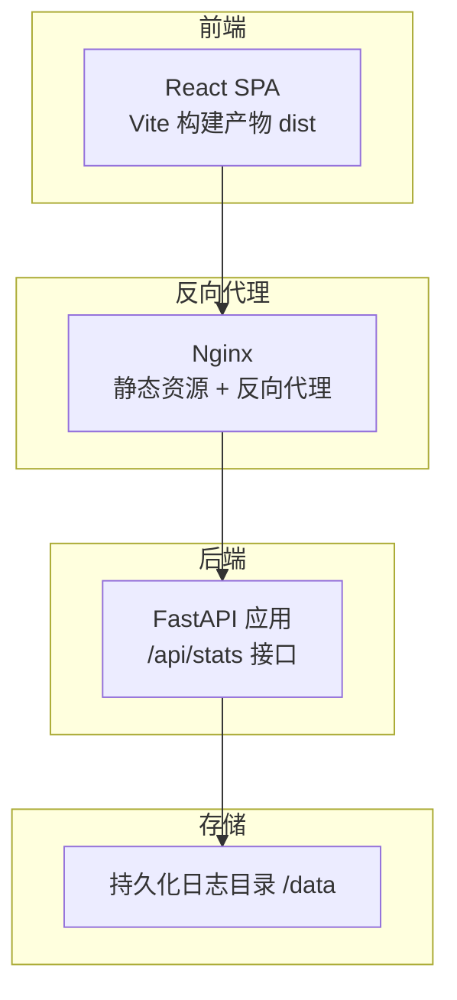
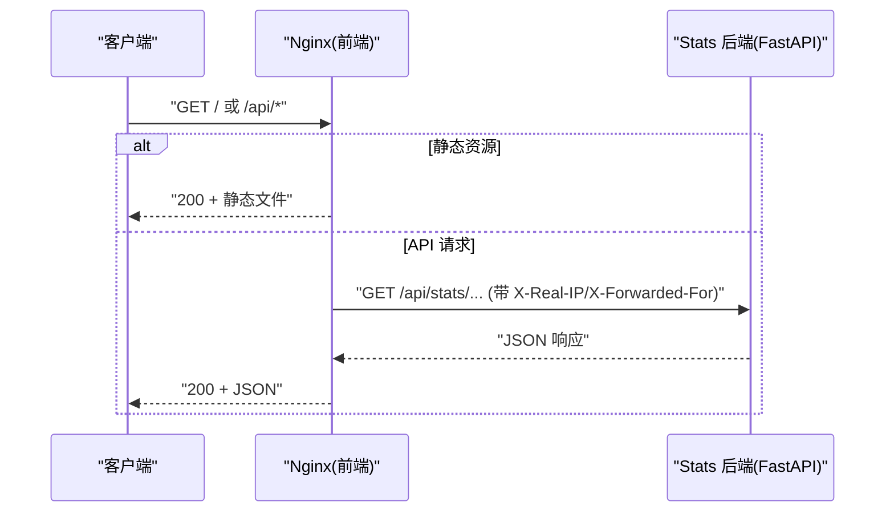
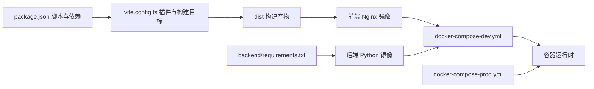

# 部署指南

<cite>
**本文引用的文件**
- [backend/Dockerfile](file://backend/Dockerfile)
- [gongwen-docker/Dockerfile](file://gongwen-docker/Dockerfile)
- [gongwen-docker/docker-compose-dev.yml](file://gongwen-docker/docker-compose-dev.yml)
- [gongwen-docker/docker-compose-prod.yml](file://gongwen-docker/docker-compose-prod.yml)
- [gongwen-docker/nginx-dev.conf](file://gongwen-docker/nginx-dev.conf)
- [gongwen-docker/nginx-prod.conf](file://gongwen-docker/nginx-prod.conf)
- [backend/main.py](file://backend/main.py)
- [backend/config.py](file://backend/config.py)
- [backend/routers/stats.py](file://backend/routers/stats.py)
- [backend/services/stats_service.py](file://backend/services/stats_service.py)
- [backend/models.py](file://backend/models.py)
- [backend/requirements.txt](file://backend/requirements.txt)
- [.github/workflows/deploy.yml](file://.github/workflows/deploy.yml)
- [.github/workflows/release.yml](file://.github/workflows/release.yml)
- [package.json](file://package.json)
- [vite.config.ts](file://vite.config.ts)
</cite>

## 目录
1. [简介](#简介)
2. [项目结构](#项目结构)
3. [核心组件](#核心组件)
4. [架构总览](#架构总览)
5. [详细组件分析](#详细组件分析)
6. [依赖分析](#依赖分析)
7. [性能考虑](#性能考虑)
8. [故障排除指南](#故障排除指南)
9. [结论](#结论)
10. [附录](#附录)

## 简介
本指南面向运维与开发团队，提供“公文排版工具”的完整部署方案，覆盖以下主题：
- Docker 容器化与镜像构建
- Docker Compose 编排与环境配置（开发与生产）
- Nginx 反向代理、静态资源与健康检查
- SSL 证书与负载均衡建议
- 生产环境系统要求、硬件配置与性能优化
- CI/CD 流水线（GitHub Actions）与自动化部署
- 不同部署场景（单机、集群、云平台）配置差异
- 监控告警、日志管理与备份恢复最佳实践
- 故障排除与性能调优建议

## 项目结构
该仓库采用前后端分离架构：
- 前端为基于 React 的单页应用（SPA），通过 Vite 构建；可生成单文件离线版本或 PWA 版本。
- 后端为 Python FastAPI 应用，提供统计与健康检查接口。
- 部署侧通过 Nginx 作为反向代理与静态资源服务器，Docker 与 Docker Compose 进行容器编排。

图表来源
- [gongwen-docker/nginx-dev.conf:35-69](file://gongwen-docker/nginx-dev.conf#L35-L69)
- [gongwen-docker/nginx-prod.conf:35-69](file://gongwen-docker/nginx-prod.conf#L35-L69)
- [backend/main.py:24-38](file://backend/main.py#L24-L38)
- [backend/services/stats_service.py:44-54](file://backend/services/stats_service.py#L44-L54)

章节来源
- [gongwen-docker/docker-compose-dev.yml:6-44](file://gongwen-docker/docker-compose-dev.yml#L6-L44)
- [gongwen-docker/docker-compose-prod.yml:4-36](file://gongwen-docker/docker-compose-prod.yml#L4-L36)
- [vite.config.ts:1-78](file://vite.config.ts#L1-L78)
- [package.json:1-39](file://package.json#L1-L39)

## 核心组件
- 前端镜像（Nginx）：直接复制构建产物 dist，暴露 80 端口，内置静态资源缓存与 SPA 路由回退。
- 后端镜像（Python/uvicorn）：基于 slim 镜像，安装依赖，暴露 8000 端口，提供 /api/health 与 /api/stats 接口。
- Nginx 配置：开发与生产两套配置，统一处理静态资源缓存、PWA 文件不缓存、/api 反代至后端、健康检查端点与错误页面。
- Docker Compose：定义两个服务（gongwen-web 与 gongwen-stats），挂载数据目录，健康检查与重启策略。
- CI/CD：GitHub Actions 工作流负责构建前端产物并发布到 GitHub Pages，或生成离线单文件版本发布到 Release。

章节来源
- [gongwen-docker/Dockerfile:1-19](file://gongwen-docker/Dockerfile#L1-L19)
- [backend/Dockerfile:1-18](file://backend/Dockerfile#L1-L18)
- [gongwen-docker/nginx-dev.conf:1-85](file://gongwen-docker/nginx-dev.conf#L1-L85)
- [gongwen-docker/nginx-prod.conf:1-86](file://gongwen-docker/nginx-prod.conf#L1-L86)
- [gongwen-docker/docker-compose-dev.yml:1-44](file://gongwen-docker/docker-compose-dev.yml#L1-L44)
- [gongwen-docker/docker-compose-prod.yml:1-36](file://gongwen-docker/docker-compose-prod.yml#L1-L36)
- [.github/workflows/deploy.yml:1-41](file://.github/workflows/deploy.yml#L1-L41)
- [.github/workflows/release.yml:1-48](file://.github/workflows/release.yml#L1-L48)

## 架构总览
下图展示容器化部署的整体交互：客户端请求经 Nginx 反向代理，静态资源由 Nginx 直接提供，API 请求转发至后端 FastAPI；后端将统计日志写入挂载的 /data 目录。

图表来源
- [gongwen-docker/nginx-dev.conf:55-64](file://gongwen-docker/nginx-dev.conf#L55-L64)
- [gongwen-docker/nginx-prod.conf:56-65](file://gongwen-docker/nginx-prod.conf#L56-L65)
- [backend/routers/stats.py:12-32](file://backend/routers/stats.py#L12-L32)
- [backend/main.py:34-37](file://backend/main.py#L34-L37)

## 详细组件分析

### 前端镜像与 Nginx 配置
- 镜像构建：直接复制 dist 目录，Nginx 作为静态站点服务器，暴露 80 端口。
- 静态资源缓存：对 JS/CSS/字体/图标等设置长期缓存；PWA 相关文件禁用缓存。
- SPA 路由：所有未匹配路径回退到 index.html。
- 反向代理：/api 路由转发至后端 gongwen-stats:8000。
- 健康检查：/health 返回 200 文本，便于容器健康检查。
- 开发与生产配置差异：主要体现在宿主端口映射与上游代理头字段。

章节来源
- [gongwen-docker/Dockerfile:1-19](file://gongwen-docker/Dockerfile#L1-L19)
- [gongwen-docker/nginx-dev.conf:44-69](file://gongwen-docker/nginx-dev.conf#L44-L69)
- [gongwen-docker/nginx-prod.conf:44-69](file://gongwen-docker/nginx-prod.conf#L44-L69)

### 后端镜像与 FastAPI 应用
- 基础镜像：python:3.12-slim，安装 requirements.txt 中的依赖。
- 运行命令：uvicorn 启动应用，绑定 0.0.0.0:8000。
- 生命周期：启动时创建后台任务定期清理防抖缓存，应用退出时取消任务。
- 健康检查：/api/health 返回健康状态。
- 统计接口：/api/stats/record（POST）与 /api/stats/summary（GET）。

章节来源
- [backend/Dockerfile:1-18](file://backend/Dockerfile#L1-L18)
- [backend/main.py:12-38](file://backend/main.py#L12-L38)
- [backend/requirements.txt:1-3](file://backend/requirements.txt#L1-L3)

### 统计服务与数据持久化
- 防抖机制：按 (IP, action) 维度记录最近一次写入时间，短时间重复请求会被去抖。
- 日志写入：将记录追加到容器内的日志文件（默认 /data/stats.log），目录可通过环境变量覆盖。
- 统计聚合：按天数范围过滤日志，统计唯一用户数、总调用次数及各动作调用次数。
- 数据持久化：通过卷挂载将 /data 映射到宿主机目录，实现日志持久化。

章节来源
- [backend/config.py:1-16](file://backend/config.py#L1-L16)
- [backend/services/stats_service.py:15-54](file://backend/services/stats_service.py#L15-L54)
- [backend/services/stats_service.py:57-123](file://backend/services/stats_service.py#L57-L123)
- [backend/routers/stats.py:12-39](file://backend/routers/stats.py#L12-L39)
- [backend/models.py:6-23](file://backend/models.py#L6-L23)

### Docker Compose 编排
- 开发环境：前端映射宿主 88:80，挂载开发版 Nginx 配置；后端挂载 /data 实现日志持久化；互相依赖与健康检查。
- 生产环境：前端映射宿主 50088:80，挂载生产版 Nginx 配置；后端同样挂载 /data；健康检查端点与开发一致。

章节来源
- [gongwen-docker/docker-compose-dev.yml:1-44](file://gongwen-docker/docker-compose-dev.yml#L1-L44)
- [gongwen-docker/docker-compose-prod.yml:1-36](file://gongwen-docker/docker-compose-prod.yml#L1-L36)

### CI/CD 流水线
- GitHub Pages 发布：在推送 main 分支或手动触发时，安装 Node、构建前端、上传 dist 并部署到 GitHub Pages。
- 离线单文件发布：构建单文件版本，生成带日期与提交号的版本标签，发布为 Release 的附件。

章节来源
- [.github/workflows/deploy.yml:1-41](file://.github/workflows/deploy.yml#L1-L41)
- [.github/workflows/release.yml:1-48](file://.github/workflows/release.yml#L1-L48)
- [package.json:6-11](file://package.json#L6-L11)
- [vite.config.ts:7-12](file://vite.config.ts#L7-L12)

## 依赖分析
- 前端依赖：React、docx、file-saver、mammoth 等，构建脚本支持单文件与 PWA。
- 后端依赖：FastAPI 与 uvicorn，轻量级 WSGI 服务器。
- 部署依赖：Nginx 镜像、Python slim 镜像、Docker 与 Docker Compose。

图表来源
- [package.json:6-11](file://package.json#L6-L11)
- [vite.config.ts:15-53](file://vite.config.ts#L15-L53)
- [gongwen-docker/Dockerfile:10-12](file://gongwen-docker/Dockerfile#L10-L12)
- [backend/requirements.txt:1-3](file://backend/requirements.txt#L1-L3)
- [gongwen-docker/docker-compose-dev.yml:6-44](file://gongwen-docker/docker-compose-dev.yml#L6-L44)
- [gongwen-docker/docker-compose-prod.yml:4-36](file://gongwen-docker/docker-compose-prod.yml#L4-L36)

章节来源
- [package.json:1-39](file://package.json#L1-L39)
- [vite.config.ts:1-78](file://vite.config.ts#L1-L78)
- [backend/requirements.txt:1-3](file://backend/requirements.txt#L1-L3)

## 性能考虑
- Nginx 层面
  - 启用 gzip 压缩与静态资源长期缓存，降低带宽与服务器压力。
  - 合理设置 worker_processes 与 worker_connections，结合宿主机 CPU 与并发连接数调整。
  - 将 /api 请求超时与连接超时参数与后端处理能力匹配，避免上游等待。
- 后端层面
  - 防抖与周期清理减少重复写入与内存占用，适合高并发场景。
  - 日志写入为顺序追加，建议将 /data 挂载到高性能磁盘或网络存储。
- 前端层面
  - 构建目标与 CSSTarget 设为 chrome78，保证兼容性与体积控制。
  - PWA 缓存策略与单文件模式按需选择，离线场景优先单文件模式。

章节来源
- [gongwen-docker/nginx-dev.conf:28-33](file://gongwen-docker/nginx-dev.conf#L28-L33)
- [gongwen-docker/nginx-prod.conf:28-33](file://gongwen-docker/nginx-prod.conf#L28-L33)
- [backend/services/stats_service.py:37-41](file://backend/services/stats_service.py#L37-L41)
- [vite.config.ts:54-59](file://vite.config.ts#L54-L59)

## 故障排除指南
- 健康检查失败
  - 检查 Nginx 是否正确映射端口与挂载配置文件。
  - 确认后端容器已启动且 /api/health 可访问。
- API 404 或 502
  - 核对 Nginx 反向代理配置，确认上游地址与端口正确。
  - 检查后端容器日志与健康检查端点。
- 日志未落盘
  - 确认 /data 卷已正确挂载，容器权限允许写入。
- 静态资源缓存问题
  - 检查 Nginx 缓存规则与 PWA 文件例外规则。
- CI/CD 构建失败
  - 确认 Node 版本与缓存命中；检查 dist 产物是否上传成功。

章节来源
- [gongwen-docker/docker-compose-dev.yml:21-26](file://gongwen-docker/docker-compose-dev.yml#L21-L26)
- [gongwen-docker/docker-compose-prod.yml:16-21](file://gongwen-docker/docker-compose-prod.yml#L16-L21)
- [gongwen-docker/nginx-dev.conf:71-76](file://gongwen-docker/nginx-dev.conf#L71-L76)
- [gongwen-docker/nginx-prod.conf:72-77](file://gongwen-docker/nginx-prod.conf#L72-L77)

## 结论
本部署指南提供了从镜像构建、容器编排到反向代理、CI/CD 的完整方案。通过 Nginx 的静态资源与反代能力，结合 FastAPI 的轻量特性与防抖统计机制，可在多种部署场景中稳定运行。建议在生产环境中配合 SSL、负载均衡与监控告警体系，持续优化性能与可靠性。

## 附录

### A. Docker 镜像构建步骤
- 前端镜像
  - 在项目根目录执行构建，产出 dist。
  - 使用 gongwen-docker/Dockerfile 构建前端镜像。
- 后端镜像
  - 在 backend 目录使用 backend/Dockerfile 构建后端镜像。
- 运行
  - 开发：使用 gongwen-docker/docker-compose-dev.yml。
  - 生产：使用 gongwen-docker/docker-compose-prod.yml。

章节来源
- [gongwen-docker/Dockerfile:1-19](file://gongwen-docker/Dockerfile#L1-L19)
- [backend/Dockerfile:1-18](file://backend/Dockerfile#L1-L18)
- [gongwen-docker/docker-compose-dev.yml:1-44](file://gongwen-docker/docker-compose-dev.yml#L1-L44)
- [gongwen-docker/docker-compose-prod.yml:1-36](file://gongwen-docker/docker-compose-prod.yml#L1-L36)

### B. Nginx 反向代理与 SSL 配置建议
- 反向代理
  - 将 /api 路由转发至后端 gongwen-stats:8000。
  - 设置 X-Real-IP 与 X-Forwarded-For 头，确保后端能获取真实 IP。
- SSL 证书
  - 在生产环境使用 Let’s Encrypt 或商业证书，启用 TLS 1.3。
  - 建议前置 HAProxy/Envoy/Cloud Load Balancer 终止 TLS，Nginx 使用 80 端口转发至后端。
- 负载均衡
  - 多实例部署时，使用 Nginx upstream 或云 LB，结合健康检查与权重调度。

章节来源
- [gongwen-docker/nginx-dev.conf:55-64](file://gongwen-docker/nginx-dev.conf#L55-L64)
- [gongwen-docker/nginx-prod.conf:56-65](file://gongwen-docker/nginx-prod.conf#L56-L65)

### C. 生产环境系统要求与硬件配置
- CPU 与内存
  - 前端 Nginx：低资源占用，建议 1 核 1GB 起步。
  - 后端 FastAPI：根据并发与日志写入频率评估，建议 2 核 2GB 起步。
- 存储
  - /data 挂载持久化卷，容量按日志保留天数估算。
- 网络
  - 开放 80（与 443，若启用 SSL）与后端 8000 端口。
- 操作系统
  - Linux（推荐 Ubuntu/CentOS），Docker 版本满足 Compose v2。

### D. CI/CD 流水线配置要点
- GitHub Pages
  - 自动构建并发布到 Pages，适合在线演示与快速迭代。
- 离线单文件
  - 生成单文件 HTML，适合分发与离线使用。
- 自动化部署
  - 可扩展：在流水线中加入 Docker 镜像构建、推送与远程部署步骤。

章节来源
- [.github/workflows/deploy.yml:17-41](file://.github/workflows/deploy.yml#L17-L41)
- [.github/workflows/release.yml:11-48](file://.github/workflows/release.yml#L11-L48)

### E. 不同部署场景配置差异
- 单机部署
  - 使用 docker-compose 单机编排，映射宿主端口，挂载 /data。
- 集群部署
  - 使用 Swarm/Kubernetes，多副本 Nginx 与后端，结合外部 LB 与共享存储。
- 云平台部署
  - 使用云厂商容器服务（ECS/GKE/AKS），结合托管 LB、证书与对象存储。

章节来源
- [gongwen-docker/docker-compose-dev.yml:1-44](file://gongwen-docker/docker-compose-dev.yml#L1-L44)
- [gongwen-docker/docker-compose-prod.yml:1-36](file://gongwen-docker/docker-compose-prod.yml#L1-L36)

### F. 监控告警、日志管理与备份恢复
- 监控
  - Nginx 访问/错误日志采集，结合健康检查指标。
  - 后端暴露 /api/health，容器健康检查失败即告警。
- 日志
  - 前端 Nginx 日志：/var/log/nginx/access.log 与 error.log。
  - 后端日志：/data/stats.log，建议集中收集与轮转。
- 备份
  - 定期备份 /data 目录；对 Nginx 配置与构建产物进行版本化管理。

章节来源
- [gongwen-docker/nginx-dev.conf:14-20](file://gongwen-docker/nginx-dev.conf#L14-L20)
- [gongwen-docker/nginx-prod.conf:14-20](file://gongwen-docker/nginx-prod.conf#L14-L20)
- [backend/config.py](file://backend/config.py#L6)

### G. 性能调优建议
- Nginx
  - 合理设置 gzip 类型与压缩级别；开启 keepalive 与 tcp_nodelay。
  - 对静态资源设置长缓存，PWA 文件除外。
- 后端
  - 控制防抖与清理间隔，平衡准确性与内存占用。
  - 将日志写入 SSD 或高性能网络盘，避免 I/O 抖动。
- 前端
  - 构建目标与 CSSTarget 保持兼容性；按需启用 PWA 或单文件模式。

章节来源
- [gongwen-docker/nginx-dev.conf:28-33](file://gongwen-docker/nginx-dev.conf#L28-L33)
- [gongwen-docker/nginx-prod.conf:28-33](file://gongwen-docker/nginx-prod.conf#L28-L33)
- [backend/services/stats_service.py:15-41](file://backend/services/stats_service.py#L15-L41)
- [vite.config.ts:54-59](file://vite.config.ts#L54-L59)