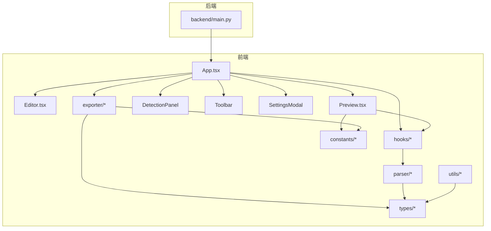
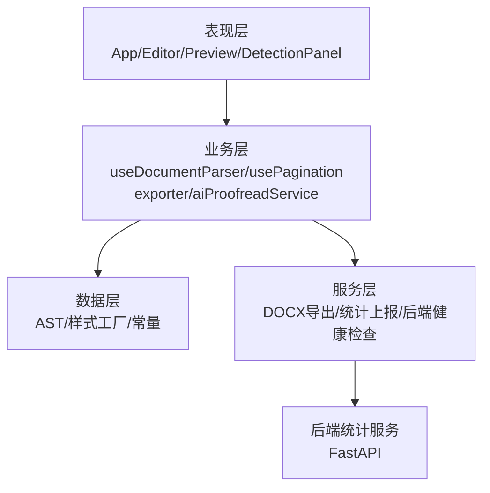
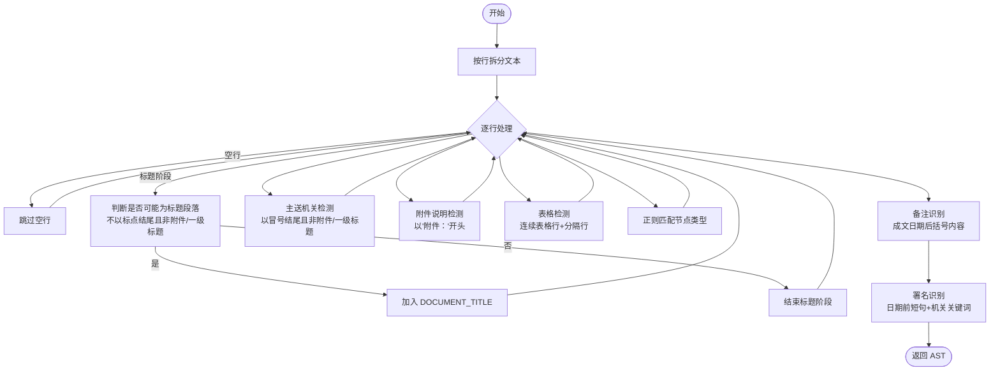
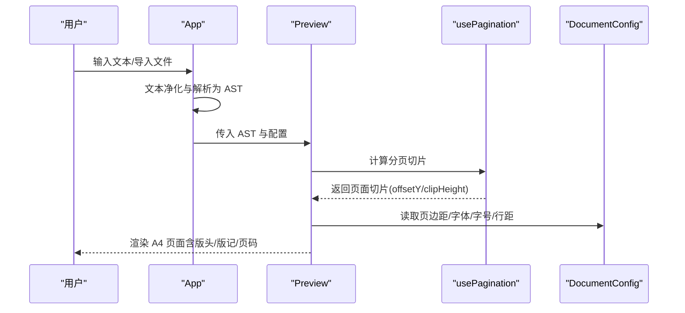
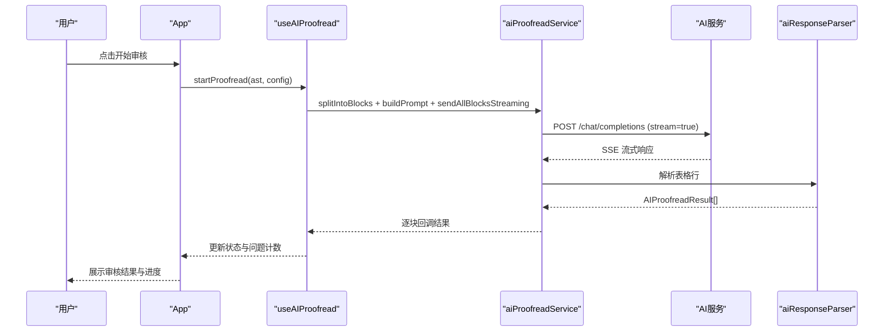
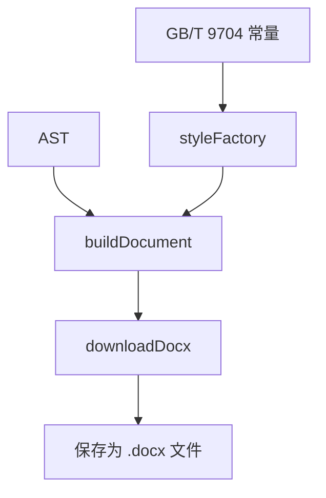
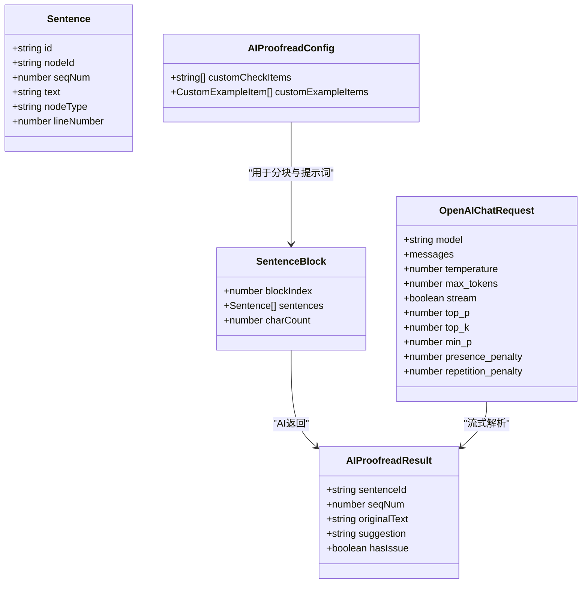
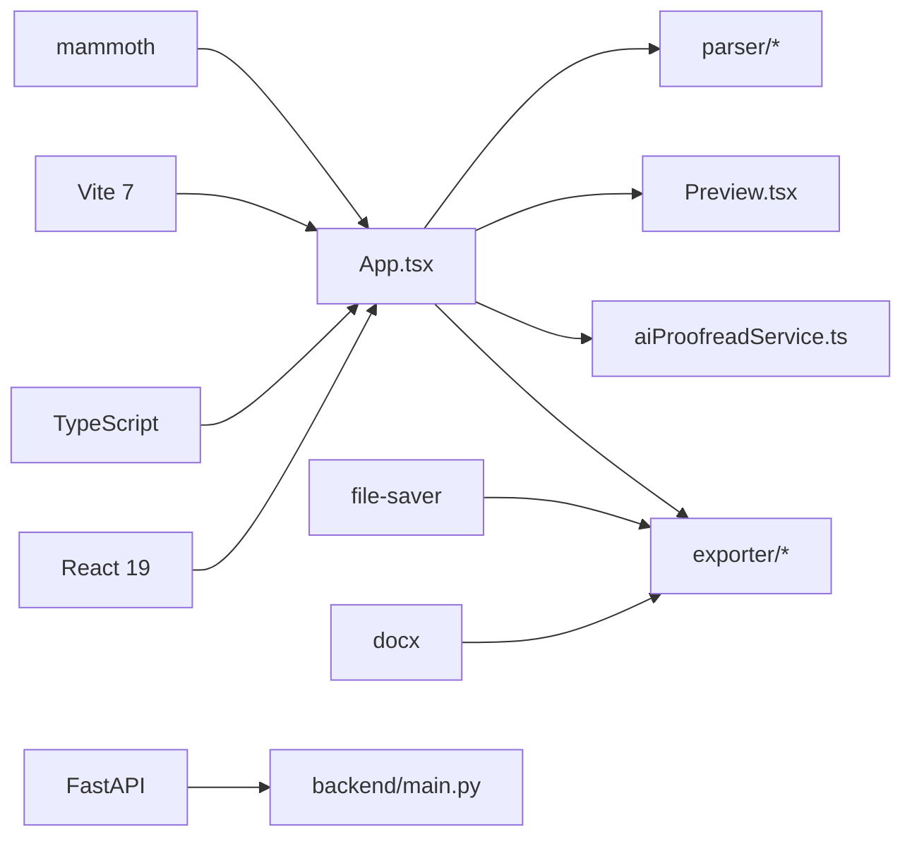

# 项目概述

<cite>
**本文引用的文件**
- [README.md](file://README.md)
- [package.json](file://package.json)
- [src/App.tsx](file://src/App.tsx)
- [src/components/Editor/Editor.tsx](file://src/components/Editor/Editor.tsx)
- [src/components/Preview/Preview.tsx](file://src/components/Preview/Preview.tsx)
- [src/hooks/useDocumentParser.ts](file://src/hooks/useDocumentParser.ts)
- [src/parser/index.ts](file://src/parser/index.ts)
- [src/parser/parser.ts](file://src/parser/parser.ts)
- [src/services/aiProofreadService.ts](file://src/services/aiProofreadService.ts)
- [src/tokens/aiProofread.ts](file://src/types/aiProofread.ts)
- [src/data/gb33476.ts](file://src/data/gb33476.ts)
- [src/constants/gongwen.ts](file://src/constants/gongwen.ts)
- [src/utils/textBlockSplitter.ts](file://src/utils/textBlockSplitter.ts)
- [backend/main.py](file://backend/main.py)
</cite>

## 目录
1. [简介](#简介)
2. [项目结构](#项目结构)
3. [核心组件](#核心组件)
4. [架构总览](#架构总览)
5. [详细组件分析](#详细组件分析)
6. [依赖关系分析](#依赖关系分析)
7. [性能考量](#性能考量)
8. [故障排查指南](#故障排查指南)
9. [结论](#结论)
10. [附录](#附录)

## 简介
本项目是一个基于 GB/T 9704 国标的党政机关公文在线排版工具，提供实时预览、智能解析、AI 辅助审核、智能分页与 DOCX 导出能力。项目强调“所见即所得”的排版体验，结合浏览器端解析与渲染，确保公文格式符合国家标准；同时支持通过外部 AI 服务进行语法与表达方面的辅助审核，并提供统计上报与调试能力。

- 在线体验与离线版本：支持在线演示与单文件离线版本，便于快速上手与无服务器部署。
- 实时预览与智能分页：左侧编辑、右侧 A4 分页预览，自动计算版心与行高，模拟真实打印效果。
- 智能解析：自动识别标题、主送机关、附件说明、成文日期、备注、表格等要素，构建 AST 并驱动排版。
- AI 审核：可选的 AI 审核功能，支持自定义检查项与示例，流式解析响应，逐步呈现问题与建议。
- 导出与配置：一键导出符合国标的 DOCX 文档，支持页边距、字体、字号、行距、首行缩进等可配置项。
- 统计与调试：内置统计上报与控制台调试信息，便于追踪使用情况与问题定位。

**章节来源**
- [README.md:1-103](file://README.md#L1-L103)

## 项目结构
前端采用 React 19 + TypeScript + Vite 7，核心目录与职责如下：
- src/components：UI 组件层，包含编辑器、预览、工具栏、设置、检测面板等。
- src/hooks：自定义 Hook，封装解析、分页、AI 审核等业务逻辑。
- src/parser：公文文本解析器，将纯文本转换为 AST。
- src/exporter：DOCX 导出模块，负责构建文档与样式。
- src/services：AI 审核服务与配置。
- src/types：类型定义，涵盖 AST、AI 审核、文档配置等。
- src/utils：通用工具，如文本分块、标点净化、历史记录、统计上报等。
- src/constants：GB/T 9704 排版常量与默认配置。
- backend：统计服务（FastAPI），提供健康检查与周期性清理任务。
- gongwen-docker：Docker 部署配置与 Nginx 示例。

**图表来源**
- [src/App.tsx:1-308](file://src/App.tsx#L1-L308)
- [src/components/Editor/Editor.tsx:1-253](file://src/components/Editor/Editor.tsx#L1-L253)
- [src/components/Preview/Preview.tsx:1-202](file://src/components/Preview/Preview.tsx#L1-L202)
- [backend/main.py:1-38](file://backend/main.py#L1-L38)

**章节来源**
- [README.md:82-98](file://README.md#L82-L98)
- [package.json:1-39](file://package.json#L1-L39)

## 核心组件
- 应用入口与状态管理
  - App.tsx 负责全局状态（文本、历史记录、AI 配置）、调用解析器与导出器、触发 AI 审核、统计上报与调试信息打印。
- 编辑器组件
  - 支持拖拽/点击导入 .docx/.txt，自动提取纯文本；提供清空、保存、历史记录查看与恢复；键盘快捷键支持。
- 预览组件
  - 基于 AST 与分页 Hook 计算 A4 页面，动态计算字符间距与首行缩进，渲染版头、主体、版记与页码。
- 解析器
  - 将纯文本解析为 AST，识别标题、主送机关、附件说明、备注、表格、表格行等节点类型。
- 导出器
  - 基于 docx 库构建 DOCX 文档，应用样式工厂生成段落与文字样式，支持下载。
- AI 审核服务
  - 构建提示词模板与请求体，发送流式请求，解析 SSE 响应，聚合结果并反馈到 UI。
- 工具与类型
  - 文本分块、标点净化、历史记录、统计上报、AI 配置与类型定义等。

**章节来源**
- [src/App.tsx:54-308](file://src/App.tsx#L54-L308)
- [src/components/Editor/Editor.tsx:33-253](file://src/components/Editor/Editor.tsx#L33-L253)
- [src/components/Preview/Preview.tsx:43-202](file://src/components/Preview/Preview.tsx#L43-L202)
- [src/hooks/useDocumentParser.ts:1-9](file://src/hooks/useDocumentParser.ts#L1-L9)
- [src/parser/parser.ts:236-331](file://src/parser/parser.ts#L236-L331)
- [src/services/aiProofreadService.ts:1-516](file://src/services/aiProofreadService.ts#L1-L516)

## 架构总览
整体架构分为三层：
- 表现层：React 组件树，负责交互与展示。
- 业务层：解析器、分页、导出、AI 审核等业务逻辑，通过 Hook 与上下文解耦。
- 数据与服务层：docx 样式工厂、GB/T 9704 常量、统计上报与后端健康检查。

**图表来源**
- [src/App.tsx:1-308](file://src/App.tsx#L1-L308)
- [src/services/aiProofreadService.ts:1-516](file://src/services/aiProofreadService.ts#L1-L516)
- [backend/main.py:1-38](file://backend/main.py#L1-L38)

## 详细组件分析

### 解析器与 AST
解析器将纯文本转换为公文 AST，识别多种节点类型，并在解析完成后进行二次修正（如备注与发文机关署名）。

**图表来源**
- [src/parser/parser.ts:236-331](file://src/parser/parser.ts#L236-L331)

**章节来源**
- [src/parser/parser.ts:1-331](file://src/parser/parser.ts#L1-L331)
- [src/parser/index.ts:1-3](file://src/parser/index.ts#L1-L3)

### 预览与分页
预览组件基于 AST 与分页 Hook 计算 A4 页面，动态计算字符间距与首行缩进，渲染版头、主体、版记与页码，并支持 AI 审核结果标注。

**图表来源**
- [src/components/Preview/Preview.tsx:43-202](file://src/components/Preview/Preview.tsx#L43-L202)
- [src/hooks/useDocumentParser.ts:1-9](file://src/hooks/useDocumentParser.ts#L1-L9)

**章节来源**
- [src/components/Preview/Preview.tsx:1-202](file://src/components/Preview/Preview.tsx#L1-L202)

### AI 审核流程
AI 审核服务将句子按字符数限制分块，构建提示词模板与请求体，发送流式请求，解析 SSE 响应，聚合结果并反馈到 UI。

**图表来源**
- [src/services/aiProofreadService.ts:1-516](file://src/services/aiProofreadService.ts#L1-L516)
- [src/utils/textBlockSplitter.ts:1-227](file://src/utils/textBlockSplitter.ts#L1-L227)

**章节来源**
- [src/services/aiProofreadService.ts:1-516](file://src/services/aiProofreadService.ts#L1-L516)
- [src/utils/textBlockSplitter.ts:1-227](file://src/utils/textBlockSplitter.ts#L1-L227)

### 导出为 DOCX
导出器基于 docx 库与样式工厂，将 AST 转换为段落与文字样式，生成符合国标的 DOCX 文档并下载。

**图表来源**
- [src/exporter/index.ts:1-4](file://src/exporter/index.ts#L1-L4)
- [src/constants/gongwen.ts:1-33](file://src/constants/gongwen.ts#L1-L33)

**章节来源**
- [src/exporter/index.ts:1-4](file://src/exporter/index.ts#L1-L4)
- [src/constants/gongwen.ts:1-33](file://src/constants/gongwen.ts#L1-L33)

### 数据模型与类型
- AI 审核相关类型：Sentence、SentenceBlock、AIProofreadResult、AIProofreadConfig、OpenAIChatRequest 等。
- AST 节点类型：标题、正文、主送机关、附件、表格、备注、署名、日期等。
- 文档配置类型：页边距、字体、字号、行距、首行缩进、表格样式、特殊选项等。

**图表来源**
- [src/types/aiProofread.ts:1-201](file://src/types/aiProofread.ts#L1-L201)

**章节来源**
- [src/types/aiProofread.ts:1-201](file://src/types/aiProofread.ts#L1-L201)

## 依赖关系分析
- 前端依赖
  - React 19、TypeScript、Vite 7、docx、mammoth、file-saver。
  - PWA 插件与单文件构建插件，支持离线与单文件发布。
- 后端依赖
  - FastAPI、异步上下文管理器、定时清理任务。
- 关键耦合点
  - App.tsx 作为协调者，连接编辑器、解析器、预览、导出与 AI 审核。
  - 预览与导出均依赖 GB/T 9704 常量与样式工厂。
  - AI 审核依赖文本分块工具与响应解析器。

**图表来源**
- [package.json:1-39](file://package.json#L1-L39)
- [backend/main.py:1-38](file://backend/main.py#L1-L38)

**章节来源**
- [package.json:1-39](file://package.json#L1-L39)
- [backend/main.py:1-38](file://backend/main.py#L1-L38)

## 性能考量
- 解析与渲染
  - 解析器为纯函数，避免副作用；预览组件通过度量容器一次性渲染全部内容，再通过分页裁剪，减少重复计算。
  - 字符间距与首行缩进按页宽与页边距动态计算，确保预览与实际打印一致。
- 文本分块与并发
  - 文本分块采用均衡分配算法，尽量保证每块字符数接近目标；并发控制默认 3，避免请求过载。
- 导出性能
  - 样式工厂统一生成段落与文字样式，减少样式重复计算；导出前进行必要的 AST 校验与规范化。
- 存储与缓存
  - 编辑内容与 AI 配置本地持久化，自动去抖写入 localStorage，避免频繁 IO。

[本节为通用性能讨论，不直接分析具体文件]

## 故障排查指南
- AI 审核未配置或配置不完整
  - 控制台会打印配置信息与必填项提示；确认 .env.production 中的必要变量已正确设置。
- 导出失败
  - 检查控制台错误信息；确认 AST 与配置有效；尝试重新导出。
- 预览与打印不一致
  - 确认页边距、字体、字号、行距等配置与 GB/T 9704 标准一致；预览为浏览器样式，最终以导出的 Word 文档为准。
- 文件导入异常
  - 确认文件格式为 .docx/.txt/.doc/.wps；检查浏览器控制台是否有解析错误。

**章节来源**
- [src/App.tsx:69-92](file://src/App.tsx#L69-L92)
- [src/App.tsx:123-131](file://src/App.tsx#L123-L131)

## 结论
本项目以 GB/T 9704 为设计基石，结合浏览器端解析与渲染，提供从文本输入到 A4 分页预览再到 DOCX 导出的完整闭环。通过可选的 AI 审核增强语言质量，配合统计上报与调试能力，既适合初学者快速上手，也为有经验的开发者提供了清晰的扩展点与优化空间。未来可在 AI 审核规则库、更多公文文种支持、批量处理与云端协作等方面持续演进。

[本节为总结性内容，不直接分析具体文件]

## 附录
- 技术栈与工具
  - 前端：React 19、TypeScript、Vite 7、docx、mammoth、file-saver。
  - 后端：FastAPI、异步任务与健康检查。
- 部署与运行
  - 本地开发与构建脚本；Docker 快速部署与 Nginx 配置；单文件离线版本支持。
- 设计理念与差异化
  - 强调“国标即默认”，开箱即用；强调“所见即所得”与“导出为准”；强调“可配置”与“可扩展”。

**章节来源**
- [README.md:26-81](file://README.md#L26-L81)
- [README.md:50-81](file://README.md#L50-L81)